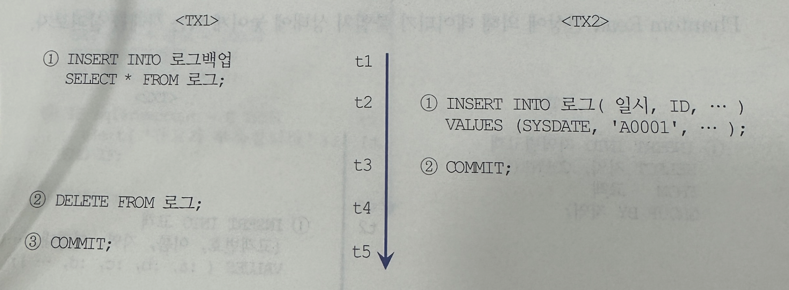
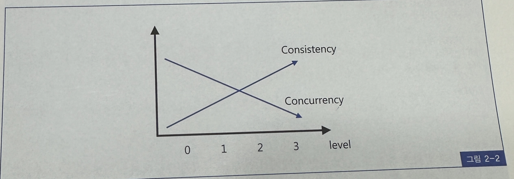

## 트랜잭션 수준 읽기 일관성

### 1. 트랜잭션 수준 읽기 일관성이란?
- 문장수준 읽기 일관성(Statement-level Read Consistency)은 쿼리가 시작된 시점을 기준으로 데이터를 일관성있게 읽어들이는 것을 말함
- 트랜잭션 수준 일관성(Transaction-level Read Consistency)은 트랜잭션이 시작된 시점을 기준으로 일관성 있게 데이터를 읽어들이는 것을 말함
- 트랜잭션이 진행되는 동안 다른 트랜잭션에 의해 변경사항이 발생하더라도 이를 무시하고 계속해서 일관성 있는 데이터를 보고자 하는 업무 요건이 있을 수 있음
- 트랜잭션이 진행되는 동안 자신이 발생시킨 변경사항은 ㅇ릭을 수 있어야 함
- 오라클은 완벽한 문장 수준의 읽기 일관성을 보장
- 트랜잭션에 대해서는 기본적으로 보장하지 않음
- 다른 DBMS도 트랜잭션 수준의 읽기 일관성은 보장하지 않음
- 트랜잭션 수준으로 읽기 일관성을 강화하려면 트랜잭션 고립화 수준을 높여줘야 함

### 2. 트랜잭션 고립화 수준
- 트랜잭션 고립화 수준은 다분히 학술적인 내용인데다 DBMS마다 구현방식이 달라 본서에서 자세히 다루는 것은 적절치 안다고 생각
- 따라서 ANSI/ISO SQL standard(SQL92)에서 정의하고 있는 아래 네가지 트랜잭션 고립화 수준을 간단히 요약하는 것으로 설명을 대신한다.

#### 레벨 0
- 트랜잭션에서 처리 중인, 아직 커밋되지 않은 데이터를 트랜잭션이 읽는것을 허용
- Dirty Read, Non-Repeatable Read, Phantom Read 현상 발생
- oracle은 이 레벨을 지원하지 않는다

#### 레벨 1(=Read Committed)
- Dirty Read 방지 : 트랜잭션이 커밋되어 확정된 데이터만 읽는 것을 허용
- 대부분의 DBMS가 기본모드로 채택하고 있는 일관성 모드
- Non-Repeatable Read, Phantom Read 현상은 여전히 발생
- DB2, SQL Server, Sybase의 경우 읽기 공유 Lock을 이용해 구현, 하나의 레코드로 읽을 때 Lock을 설정하고 해당 레코드를 빠져 나가는 순간 Lock 해제
- Oracle은 Lock을 사용하지 않고 쿼리 시작 시점의 Undo데이터를 제공하는 방식으로 구현

#### 레벨 2(=Repeatable Read)
- 선행 트랜잭션이 읽은 데이터는 트랜잭션이 종료될 때까지 후행 트랜잭션이 갱신하거나 삭제하는 것을 불허함으로써 같은 데이터를 두번 쿼리했을 때 일관성 있느 결과를 리턴
- Phantom Read 현상은 여전히 발생
- DB2, SQL Server의 경우 트랜잭션 고립화 수준을 Repeatable Read로 변경하면 읽은 데이터에 걸린 공유 Lock을 커밋할 때 까지 유지하는 방식으로 구현
- Oracle은 이 레벨을 명시적으로 지원하지 않지만 for Update 절을 이용해 구현 가능
- SQL Server 등에서도 for update 절을 사용할 수 있지만 커서가 명시적으로 선언할 때만 사용 가능

#### 레벨 3(=Serializable)
- 선행 트랜잭션이 읽은 데이터를 후행 트랜잭션이 갱신하거나 삭제하지 못할 뿐만 아니라 중간에 새로운 레코드를 삽입하는 것도 막아줌
- 완벽한 읽기 일관성 모드 제공
- DBMS에서 제공하는 트랜잭션 고립화 수준 조정기능을 이용해 트랜잭션 레벨 읽기 일관성을 확보하려면 아래 문장 하나만 수행하면 된다
```
set transaction isolation level serializable
```
- 낮은 단계의 트랜잭션 고립화 수준을 사용할 때 발생하는 아래 세 가지 현상에 대해 살펴본다
  - Dirty Read(=Uncommitted Dependency)
  - Non-Repeatable Read(=Inconsistent analysis)
  - Phantom Read

### 3 Dirty Read(Uncommitted Dependency)
- 아직 커밋되지 않은 수정 중인 데이터를 다른 트랜잭션에서 읽을 수 있도록 허용할 때 발생
- 만약 Dirty Read를 허용하는 상황에서 아래 문장이 수행되는 도중에 다른 트랜잭션에 의해 특정 계좌의 잔고가 변경된다면 쿼리의 최종 결과 값이 비일관성 상태에 놓이게 됨
- 왜냐면 그 트랜잭션이 어떤 이유에서건 롤백될 수 있기 때문
```
select sum(잔고) from 계좌;
```
- 대부분 DBMS가 기본 트랜잭션 고립화 수준을 레벨 1(=Read Committed)로 설정하고 있기 떄문에 Dirty Read 현상은 발생하지 않음
- 즉, 커밋된 데이터만 읽을 수 있도록 허용함
- SQL Server, Sybase 등은 이를 구현하기 위해 데이터를 읽을 때 공유 Lock을 사용함
- 갱신 중인 레코드에는 배타적 Lock이 걸리는데, 이는 공유 Lock과 호환되지 않으므로 갱신중인 레코드를 읽지 못함
- 그런 DBMS에서는 Lock에 의한 동시성 저하가 자주 문제시 되므로 쿼리에 옵션을 사용해서 Dirty Read를 허용하도록 프로그래밍 하는 경우를 종종 보게 된다.
- 즉 트랜잭션 고립화 수준을 레벨로 낮추는 것
- 오라클은 다중 버전 읽기 일관성 모델을 채택함으로 Lock을 사용하지 않고도 Dirty Read를 피해 일관성 있는 데이터 읽기가 가능하고, 따라서 레벨 0 수준으로 트랜잭션 고립화 수준을 낮추는 방법을 아예 제공하지 않고 있음

### 4. Non-Repeatable Read(= Inconcsistent Analysis)
- 한 트랜잭션 내에서 같은 쿼리를 두 번 수행할 때, 그 사이에 다른 트랜잭션 값을 수정 또는 삭제함으로써 두 쿼리의 결과가 상이하게 나타나는 비일관성(inconsistency)이 발생하는 것을 말함
- Non-Repeatable Read 때문에 데이터가 불일치 상태에 놓이게 되는 사례를 살펴본다


- t1 시점에 123번 고개의 당월주문금액은 40,000원이었다고 가정한다.
- 즉 1번 쿼리를통해 :amt 변수에 40000이 저장됨
- 두 트랜잭션이 수행을 종료하고 나면 TX2 트랜잭션에 의해 이 고객의 당월 주문금액이 60,000원으로 변경되었음에도 T4시점에 고객 등급이 B로 하향 조정되는 결과를 가져옴
- Non-Repeatable Read 현상 때문에 TX2 트랜잭션의 등급 조정이 상실되는 Lost Update가 발생한 것
- Non-Repeatable Read 현상을 방지하려면 TX1이 1번 문장을 수행할 때 for update절을 추가해 주어야 함
- 그러면 123번 고객 레코드에 Lock이 걸리므로 TX2 트랜잭션은 블록킹 됐다 TX1이 커밋하는 t5 시점 이후에 진행을 계속 함
- Non-Repeatable Read 사례를 하나 더 살펴본다


- t1시점에 123번 계좌번호의 잔고는 55000원 이었다고 가정함
- 1번 쿼리를 통해 자신으 계좌에 55000원이 남아 있음을 확인하고 t4 시점에 10000원을 인출하려고 시도헀으나, TX2 트랜잭션에 의해 이 계좌의 잔고가 5000원으로 변경되었음
- 따라서 잔고가 충분한 것을 확인하고 인출을 시도했음에도 불구하고 잔고가 부족하다는 메시지를 받게 됨
- TX1트랜잭션이 1번 쿼리에서 읽은 값을 이용해 2번에서 값을 갱신하는 데 사용하지는 않았으므로 데이터가 잘못 갱신되는 문제는 발생하지 않았지만, 예금 인출을 시도한 고객은 영문도 모르고 순간 당황하게 됨
- 만약 TX1의 2번 update가 1번 쿼리에서 읽은 값을 이용하도록 아래와 같이 구현했다면 TX2의 갱신이 사라지는 결과를 가져올 수 있음
```
UPDATE 계좌 SET 잔고 = :balance - 10000
WHERE 계좌번호 = 123
AND :balance >= 10000
```

### 5. Phantom Read
- 한 트랜잭션 안에서 일정 범위 레코드들을 두 번 이상 읽을 때, 첫번째 쿼리에서 없던 유령 레코드가 두번쨰 쿼리에서 나타나는 현상
- 트랜잭션 도중에 새로운 레코드가 삽입되는 것을 허용하기 때문에 나타나는 현상임
- 초등학교 야외수업을 나가서 선생님이 도시락을 나눠주는 상황에 비유하자면 학생 수를 정확히 세고 정확한 개수의 도시락을 가져왔는데 도시락 개수가 부족한 경우가 발생할 수 있음
- 알고 보니 선생님이 도시락을 가지러 간 사이에 늦게 도착한 학생이 있었던 것
- phantom Read 현상에 의해 데이터가 불일치 상태에 놓이게 되는 사례를 살펴본다


- TX1 트랜잭션이 지역별 고객과 연령대별 고객을 연속해서 집계하는 도중 새로운고객이 TX2 트랜잭션에 의해 등록됨
- 그 결과 지역별 고객과 연령대별 고객 두 집계 테이블을 통해 총 고객수를 조회하면 서로 결과 값이 다른 불일치 상태에 놓이게 됨
- 이런 Phantom Read 현상을 방지하려면 TX1이 1번 문장을 수행하기 전에 아래 문장을 통해 트랜잭션 고립화 수준을 레벨 3으로 올려줘야 함

```
set transaction isolation level serializable;
```

- 고립화 수준을 레벨 3으로 높이면 SQL Server에서는 Lock을 통해 t2시점에 새로운 고객이 추가되는 것을 막아버림
- 따라서 고립화 수준을 높이면 데이터 일관성은 확보되지만 동시성이 현격히 저하되는 결과를 초래함
- 반면 오라클은 Lock을 전혀 사용하지 않은 상태에서 1번과 2번 쿼리 모두 SCN 확인 과정을 통해 t1시점에 존재했던 고객만을 대상으로 집계를 수행하므로 동시성을 저하시키지 않으면서 일관성을 유지
- Phantom Read에 의해 데이터 일관성이 훼손되는 사례를 하나 더 살펴본다



- TX1 트랜잭션이 로그 테이블을 로그 백업 테이블로 백업하고, 전체 로그 데이터를 지운 후에 커밋을 수행
- TX1의 1~3 세개 명령을 하나의 트랜잭션으로 일관성있게 처리하려면, t1 시점에 존재헀던 로그 데이터만 백업하고 지워야 함
- 하지만 기본 트랜잭션 고립화 수준에서는 TX2 트랜잭션에 의해 t2~t3 시점에 추가된 로그 데이터까지 트랜잭션에 의해 지워짐
- TX1이 1번 문장을 수행하기 전에 트랜잭션 고립화 수준을 레벨 3으로 올려주면 이를 방지할 수 있음
- 그러면 SQL Server 에서는 Lock을 통해 t2 시점에 새로운 로그가 추가 되는 것을 막아버림
- 오라클은 TX1 트랜잭션이 t4 시점에 delete 문장을 수행하더라도 t1 시점에 존재했던 레코드만 찾아서 지우기 때문에 Lock을 사용하지 않고도 TX2 트랜잭션에 의해 새로 추가된 로그 데이터를 안전하게 보호함
- 물론 트랜잭션 고립화 수준을 상향 조정하지 않더라도 TX1의 1번과 2번 문장에 일시 조건을 추가해줌으로 일관성 있게 트랜잭션을 처리할 수 있음
- 지금까지 낮은 단계의 트랜잭션 고립화 수준에서 어떤 문제들이 발생할 수 있는지 그리고 트랜잭션 내에서 일관성 있게 데이터를 조회, 추가, 수정, 삭제하기 위해 트랜잭션 고립화 수준을 조정하는 방법에 대해 살펴봄



- 트랜잭션 고립화 수준을 높이면 일관성은 향상되지만, 더 넓은 범위의 Lock을 더 오랫동안 유지하는 방식을 사용하므로 동시성은 저하됨
- 그림 2-2는 그것을 표현하고 있음
- 하지만 오라클은 트랜잭션 고립화 수준을 높이더라도 Lock을 사용하지 않으므로 동시성이 저하되지는 않음