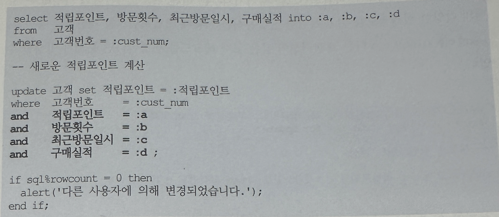

## 3. 비관적 vs. 낙관적 동시성 제어
- 동시성 제어를 위해 앞에서 설명한 트랜잭션 고립화 수준을 변경하는 DBMS기능을 사용할 수 없는 경우가 있음
- 특히 n-Tier 구조가 지배적인 요즘 같은 개발환경에서 더욱 그렇고, 그럴 때는 트랜잭션의 동시성 제어를 개발자가 직접 구현해야 함
- 동시성 제어는 비관적인 동시성 제어와 낙관적 동시성 제어로 나뉨

### 비관적 동시성 제어
- 사용자들이 같은 데이터를 동시에 수정할 것이라 가정, 따라서 한 사용자가 데이터를 읽는 시점에 Lock을 걸고 조회 또는 갱신처리가 완료될 때 까지 이를 유지
- Locking은 첫번째 사용자 트랜잭션을 완료하기 전까지 다른 사용자들이 그 데이터를 수정할 수 없게 만들기 대문에 비관적 동시성 제어를 잘못 사용하면 동시성을 저해받게 됨
- "잘못 사용하면"이라고 한데에 주목하자, 잘 사용하면 약이 될 수도 있다는 뜻이며 글을 계속 읽다보면 이해하게 될 것

### 낙관적 동시성 제어
- 사용자들이 같은 데이터를 동시에 수정하지 않을 것이라고 가정
- 따라서 데이터를 읽을 때는 Lock을 설정하지 않음
- 그런데 낙관적 입장에 섰다고 해서 동시 트랜잭션에 의한 데이터의 잘못된 갱신을 신경쓰지 않아도 된다는 것은 절대 아님
- 읽는 시점에 Lock을 사용하지 않았지만 데이터를 수정하고자 하는 시점에 앞서 읽은 데이터가 다른 사용자에 의해 변경되었는지를 반드시 검사해야함
- 낙관적 동시성 제어를 사용하면 Lock이 유지되는 시간이 매우 짧아져 동시성을 높이는데는 유리함.
- 하지만 다른 사용자가 같은 데이터를 변경했는지 검사하고 그에 따라 분기해 나가야 하는 귀찮은 처리 절차가 뒤따름
- 정말 귀찮아서인지, 아니면 동시성 제어의 필요성을 몰라서인지 튜닝을 다니면서 개발팀에서 작성한 SQL들을 많이 분석하게 되는데 낙관적 동시성 제어를 해야 하는 상황에서 동시성 제어 없는 낙관적 프로그래밍을 하게 됨

### 낙관적 동시성 조회의 예시
- 예를 들어 온라인 쇼핑몰에서 특정 상품을 조회해서 주문을 시작하고 결제를 완료하는 순간까지 하나의 트랜잭션으로 정의했다고 가정
- 상품 조회시에는 1000원이었던 상품이 주문을 진행하는 동안 가격이 수정돼서 결제를 완료하는 순간 1200원일 수 있음
- 따라서 최종 결제 버튼을 클릭하는 순간 상품 가격의 변경 여부를 체크하고, 변경되었다면 해당 주문을 취소시키거나 사용자에게 변경 사실을 알리고 처리 방향을 확인받는 프로세스를 거쳐야 함
- 물론 업무적으로 주문을 시작하는 시점의 가격을 기준으로 주문을 처리하는 것이 옳다면 그에 맞는 단계에서 일관성 체크를 해서 처리하면 됨
```
insert into 주문
select :상품코드, :고객ID, :주문일시, :상점번호, ...
from 상품
where 상품코드 =:상품코드
and 가격 = :가격; -- 주문을 시작한 시점의 가격

if sql%rowcount = 0 then
    alert('상품가격이 변경되었습니다.');
end if;
```

### 비관적 동시성 제어
- 구체적으로 동시성을 제어하기 위해 어떻게 코딩해야하는지 구현 예시를 본다
- 먼저 비관적 동시성 제어를 위한 기본적인 구현 패턴이다
- 우수 고객을 대상으로 적립포인트를 추가시켜주는 이벤트를 실시한다고 가정
- 고객의 다양한 실적 정보를 읽고 복잡한 산출 공식을 이용해 적립 포인트를 계산하는 동안(아래 select문 이후, update문 이전) 다른 트랜잭션이 같은 고객 레코드를 변경했다면 문제가 발생할 수 있음
```
select 적립포인트, 방문횟수, 최근방문일시, 구매실적 from 고객
where 고객번호 = :cust_num for updatel

-- 새로운 적립포이늩 계산
update 고객 set 적립포인트 = :적립포인트 where 고객번호 = :cust_num
```
- 하지만 위에서와 같이 select문에 for update를 사용해서 해당 고객 레코드에 lock을 걸어둔다면 데이터가 잘못 갱신되는 문제를 방지할 수 있음
- select 시점에 lock을 거는 비과넉 동시성 제어는 자칫 시스템 동시성을 심각하게 떨어뜨릴 우려가 있음
- 그러느로 wait또는 nowait 옵션을 함께 사용하면 lock을 얻기 위해 무한정 기다리지 않아도 됨

```
for update nowait --> 대기 없이 Exception(ORA-00054)를 던짐
for update wait   --> 3초 대기 후 Exception(ORA-30006)을 던짐
```
- wait 또는 nowait 옵션을 사용하면, 다른 트랜잭션에 의해 Lock이 걸렸을 때 Exception을 만나게 되므로 "다른 사용자에 의해 변경 중이므로 다시 시도하십시오"라는 메시지를 출력하면서 트랜잭션을 종료할 수 있음
- 따라서 오히려 동시성을 증가시키게 됨
- 금융권에서 개발하는 프로그래머들은 for Update문을 자주 사용한다
- 금전을 다루는 업무가 어니더라도 면밀하게 분석해보면 이런 식으로 동시성 제어를 해야만 하는 경우가 부지기수임
- 독자가 맡은 업무에 이를 적용할 부분이 있는지 꼼꼼히 따져보기 바란다.

### 낙관적 동시성 제어
- 이제 낙관적 동시성 제어 패턴을 살펴 볼 차례임
- 아래는 고객번호를 제외하고 4개 컬럼을 참조했을 때 예시이다.



- 앞선 select 문에서 읽은 컬럼들이 매우 많다면 update문에 조건절을 일일히 기술하는 것이 여간 귀찮은 일이 아닐 것
- 만약 update대상 테이블에 최종 변경 일시를 관리하는 컬럼이 있다면 이를 조건절에 넣어 간단히 해당 레코드의 갱신 여부를 판단할 수 있음


- 낙관적 동시성 제어에서도 update전에 아래 Select문(nowait 옵션을 사용한 것에 주목)을 한번 더 수행한다면 다른 트랜잭션에 의해 설정된 lock때문에 동시성이 저하되는 것을 예방할 수 있음

```
select 고객번호
from 고객
where 고객번호 = :cust_num
and 변경일시 = :mod_dt
for update nowait;
```

- 오라클 10g부터 낙관적 동시성 제어를 위해 활용할 수 있는 기능을 한가지 소개하려고 함
- 위처럼 별도의 Timestamp 컬럼을 두고 동시성 제어를 하려면 테이블 레코드를 insert/update/delete할 때 마다 변경일시 컬럼을 변경하도록 빠짐없이 구현해야만 함
- 그런데 애플리케이션을 통하지 않고 사용자가 직접 값을 바꾸는 일이 생긴다면, 변경일시 컬럼까지 변경하는 규칙을 지키지 않았을 떄 Lost Update문제가 다시 재발하게 됨
- 오라클 10g부터 제공되는 Pseudo 컬럼 ora_rowscn 을 활용하면 Timestamp를 오라클이 직접 관리해주므로 쉽고 완벽하게 동시성을 제어할 수 있음
