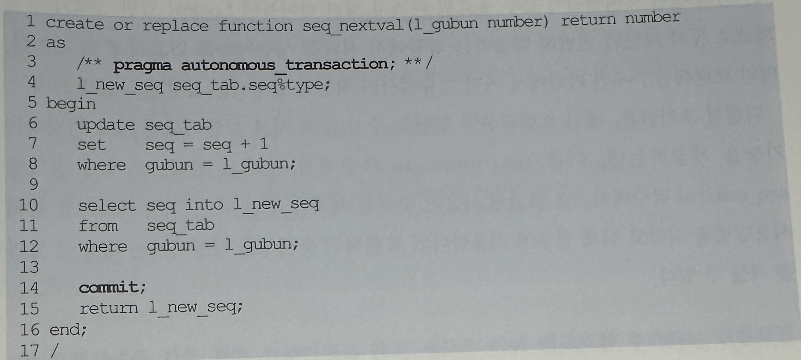

## 4. 동시성 구현 사례
- 지금까지 동시성 제어의 개념과 기본적인 구현 패턴을 살펴보았고, 이들 개념을 실제 프로젝트에 적용해서 효과적으로 동시성 문제를 해결했던 사례를 2가지만 소개하고자 함

### 1. 일련번호 채번 동시성 높이기
- 첫번쨰는 Locking을 최소화하면서 채번 테이블로부터 일련번호를 채번하고자 할 때 사용할 수 있는 사례
- 일련번호를 채번하고자 할 때 가장 좋은 선택은 DBMS가 제공하는 Sequence 기능을 이용하는 것
- 하지만 어던 상황에서는 이런 기능을 사용할 수 없는 경우가 존재하고 그럴 때 주로 사용하는 방법이 1)데이터가 삽입되는 시점에 실시간으로 현재의 MAX값을 취해 1만큼 증가시킨 값을 이용하거나 2)MAX 값을 관리하는 별도의 채번 테이블에서 값을 가져오는 방식
- *1) 실시간으로 MAX값을 얻어 처리할 때는 두개의 트랜잭션이 동시에 같은 갑승ㄹ 읽었을 경우 insert 하려는 순간 PK제약에 위배되므로 예외 처리를 통해 그다지 어렵지 않게 동시성을 제어할 수 있음
- 하지만 2채번 테이블을 사용할 대는 채번 후 다음 처리로 진행하기 전 채번 테이블 값을 1만큼 증가시키는 갱신을 수행해야 하는 어려움이 있음
- 예를들어 아래와 같은 채번 테이블이 있음
```
create table seq_tab (
    gubun varchar2(1)
  , seq number
  , constraint pk_seq_tab primary key(gubun, seq)
)
organization index;
```
- 그리고 이 테이블에서 현재 값을 1만큼 증가시키고 그 값을 읽어 리턴하는 사용자 정의 함수를 아래와 같이 정의하였음



- 아래는 위에서 정의한 함수를 사용하는 트랜잭션


- 문제는 커밋 시점인데, 만약 앞서 정의한 seq_nextval 함수처럼 라인 14에서 커밋을 한다면 어떤 이유에서 메인 트랜잭션(바로 위 소스 코드)이 라인 4 insert 이후에 롤백될 경우 문제가 생김
- 라인 2에서의 update는 이미 커밋 된 상태가 되어 데이터의 일관성이 깨지기 때문
- 그렇다고 seq_nextval 함수 14에서 커밋을 안하고 함수를 빠져나오면 어떻게 될까?
- 아래 메인 트랜잭션이 모두 종료될 때 까지 채번 테이블에 Lock이 걸린 상태가 유지 되므로 동시 채번이 빈번히 발생하는 상황에서 심각한 성능 저하를 일으키게 될 것
- 메인 트랜잭션 7~9번 라인에서 어떤 이유에서건 지연이 발생하는 상황을 상상해보라
- 다행히 오라클은, 메인 트랜잭션에 영향을 주지 않고 서브 트랜잭션만 따로 커밋하는 기능을 제공하는데, 이를 'autonomous' 트랜잭션이라고 함
- 위에서 정의한 seq_nextval  함수에서 3번 라인에 사용된 주석을 제거해 주면 됨
- 직접 테스트를 통해 사용방법을 익히고 실제 업무에 적용한다면 트랜잭션 동시성을 향상시키는데 큰 효과를 거둘 수 있음