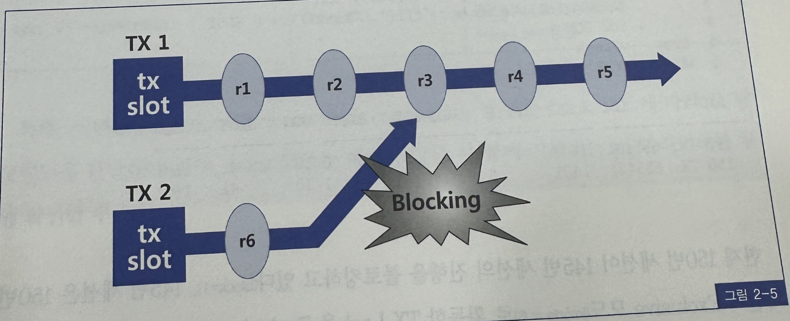

## 5. 오라클 Lock
- 오라클은 공유 리소스와 사용자 데이터를 보호할 목적으로 DML Lock, DDL Lock, 래치, 버퍼 Lock, 라이브러리 캐시 Lock/Pin 등 다양한 종류의 Lock을 사용함
- 미처 다 열거하지 못했지만, 이 외에도 내부적으로 더 많은 종류의 Lock이 존재함
- 이 중 래치와 버퍼 Lock에 대해서는 1장에서 다룸
- 래치
  - SGA에 공유돼 있는 갖가지 자료구조를 보호할 목적으로 사용하는 가벼운 Lock
- 버퍼 Lock
  - 버퍼 블록에 대한 액세스를 직렬화
- 라이브러리 캐시 Lock과 라이브러리 캐시 Pin에 대해서는 4장과 부록에서 자세히 다루지만 간단히 설명하면 라이브러리 캐시에 공유된 오브젝츠 정의, 커서 PL/SQL프로그램같은 실행 가능 오브젝트에 대한 정의 및 실행계획을 보호하는 Lock임
- 라이브러리 캐시 Lock
  - 라이브러리 캐시 오브젝트에 대한 핸들을 보호
- 라이브러리 캐시 Pin
  - 라이브러리 캐시 오브젝트의 실제 내용이 담긴 힙을 보호
- 애플리케이션 개발 측면에서 가장 중요하게 다루어야 할 Lock은 무엇보다 DML Lock임
- 본 절에서 집중적으로 설명하려고 하는 DML Lock은 다중 사용자에 의해 동시에 액세스 되는 사용자 데이터의 무결성을 보호해준다
- DML LocK에는 테이블 Lock
  - Enqueue Lock으로 구현함
- DML 로우 Lock
  - 로우 단위 Lock과 트랜잭션 Lock을 조합해서 구현함
  - 트랜잭션 Lock은 Enqueue Lock으로 구현
- DML Lock을 이해하려면 Enqueue Lock구조와 트랜잭션 Lcok개념을 먼저 이해해야 함

### 1. Enqueue Lock
- Enqueue 는 공유 리소스에 대한 액세스를 관리하는 Lock매커니즘
- Enqueue에 의해 보호되는 공유 리소스로는 테이블, 트랜잭션, 테이블스페이스, 시퀸스, Temp 세그먼트 같은 것들이 있음
- Enqueue Lock은 래치와 달리 순서가 보장되는 큐 구조를 사용함
- 따라서 대기자 큐에 가장 먼저 Lock요청을 등록한 세션이 가장 먼저 Lock을 획득함
- Enqueue Lock으로 관리되는 공유 리소스에 대해 Lock을 획득하려면 먼저 Enqueue 리소스를 할당 받아야 함
- Enqueue 리소스에는 고유한 식별자가 부여되며, 식별자는 <Type-ID1-ID2>로 구성됨
- Type은 'TX','TM','TS'처럼 2개 문자열로 이루어지며, ID1, ID2 에는 Lock종류에 따라 다른 정보를 가짐
- 예를 들어 TM Lock 식별자에는 다음과 같은 정보를 포함
  - Type : TM
  - ID1 : 오브젝트 ID
  - ID2 : 0
- TX식별자에는 다음과 같은 정보를 포함함
  - Type : TX
  - ID1 : Undo 세그먼트 번호 + 트랜잭션 슬롯 번호
  - ID2 : 트랜잭션 슬롯 Sequence 번호
- 오라클은 Enqueue 리소스 구조체를 통합 관리하는 리소스 테이블을 갖고 있으며, 리소스 테이블에서 관리되는 각 리소스를 찾을 때는 해싱 알고리즘을 사용함
- 물론 해싱을 위한 키로는 리소스 식별자가 사용됨
- 각 해시 버킷에는 연결 리스트로 연결된 해시 체인을 가지며, 여기에 리소스 구조체가 연결됨

- Enqueue 방식으로 관리되는 특정 리소스에 대해 Lock을 획득하려면, 먼저 리소스 테이블에서 해당 리소스 구조체를 찾음
- 리소스 구조체를 찾지 못하면, 새로운 리소스 구조체를 할당 받아 해시 체인 연결 리스트에 연결됨
- 그런 후 리소스 구조체의 소유자 목록에 자신을 등록하면 됨
- 호환되지 않은 모드로 먼저 Lock을 획득한 세션이 있다면 Lock 요청을 대기자 목록에 등록하고 대기해야 함(또는 작업을 포기하는 선택을 할 수도 있음)
- 소유자가 Exclusive모드일 때는 한순간에 하나의 세션만 Lock을 획득할 수 있지만, Shared모드 일때는 여러 세션이 동시에 Lock을 획득할 수 있음
- 즉 여러 세션이 동시에 소유자 목록에 등록될 수 있음
- 소유자 목록에 Shared 또는 Exclusive 모드 Lock이 등록된 상태에서 Exclusive 모드로 Lock을 획득하려는 세션은 대기자 목록에서 대기해야하며, 하나의 리소스 구조체 대기자 목록에 동시에 여러 세션이 등록된 상태로 대기할 수 있음
- Enqueue Lock작동 매커니즘은 아래와 같음
  1. A세션이 Shared 모드로 Lock을 획득함
  2. B세션이 Shared 모드로 Lock을 획득하려고 함, 먼저 Lock을 소유한 A세션과 호환되므로 정상적으로 Lock을 획득함 이제 소유자 목록에는 두개 세션이 달려있음 
  3. C세션이 Exclusive모드로 Lock을 획득하려고 함. Shared 모드와 Exclusive 모드 간에 호환성이 없으므로 대기자 목록에 자신을 등록하고 대기함
  4. 소유자 목록에 Shared모드로 달려있던 A, B 두 세션이 모두 Lock을 해제하면 C세션이 Exclusive 모드로 소유자 목록에 등록함
  5. A세션이 Exclusive모드로 다시 Lock을 획득하려고 하면, Exclusive 모드와 호환되지 않으므로 대기자 목록에 자신을 등록하려고 대기함
  6. B세션이 다시 Shared모드로 Lock을 획득하려고 할 때도 Exclusive모드와 호환되지 않으므로 대기자 목록에 자신을 등록하고 대기함
  7. Enqueue Lock은 순서가 보장되므로 C세션이 Lock을 해제하면 A세션이 가장 먼저 Exclusive 모드로 Lock을 획득함

### 2. TX Lock (=트랜잭션 Lock)
- 트랜잭션을 시작하려면 Undo 세그먼트 헤더에 위치한 트랜잭션 테이블로부터 슬롯을 하나 할당받아야 한다고 1장에서 설명함
- 이 트랜잭션이 변경을 가한 블록에 대한 Consistent 버전을 얻으려는 다른 트랜잭션은, 트랜잭션 슬록에 기록된 상태 정보를 확인하고, 필요하다면 CR블록을 생성해서 읽음
- 그렇게 함으로 오라클은, 레코드가 갱신중이더라도 직접 읽기에 대해서는 블로킹 없이 작업을 진행할 수 있도록 구현함
- 하지만 변경 중인 레코드를 동시에 변경하려는 트랜잭션에 대해서는 액세스를 직렬화해야하며, 그 목적으로 사용되는 Lock 메커니즘이 트랜잭션 Lock임
- TX Lock은 트랜잭션이 첫 번째 변경을 시작할 때 얻고, 커밋 또는 롤백할 때 해제함
- TX Lockeh Enqueue Lock으로 구현됨
- 앞에서 설명했듯 TX Lock을 위한 Enqueue 리소스 구조체의 식별자는 다음과 같은 정보를 포함함
  - TYPE : TX
  - ID1 : Undo 세그먼트 + 트랜잭션 슬롯번호
  - ID2 : 트랜잭션 슬롯 Sequence 번호
- 이 식별자로 갖는 리소스 구조체를 Enqueue 리소스 테이블 해시 체인에 연결하고, 소유자 목록에 트랜잭션을 등록함으로써 Lock을 획득함
- 이제 TX Lock을 획득했으므로 트랜잭션을 위한 일련의 작업들을 수행
- TX Lock 메커니즘은 그림 2-5를 보면서 이해해본다.

  1. TX1 트랜잭션은 Undo 세그먼트에서 트랜잭션 슬롯을 할당 받고, Enqueue 리소스를 통해 TX Lock을 설정함. 이 상태에서 R1부터 R5까지 5개 레코드를 변경하고 아직 커밋은 하지 않았다
  2. TX2 트랜잭션도 트랜잭션 테이블에서 하나의 슬롯을 할당받고, Enqueue리소스를 통해 TX Lock을 설정한 후 
  3. 이제 TX2가 R3레코드를 액세스하려는 순간 호환되지 않은 모드로 Lock이 걸려있음을 인지하고 TX1의 트랜잭션 슬롯 상태를 확인함
  4. TX1이 아직 커밋되지 않은 Action이므로  