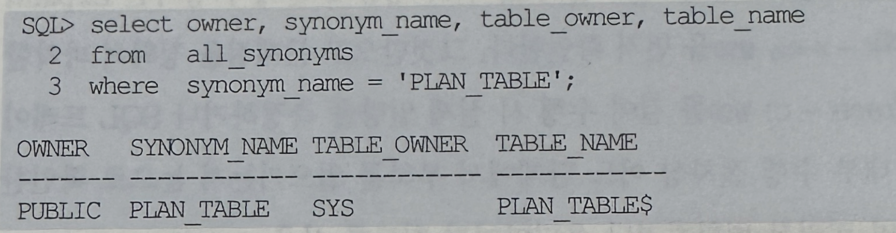
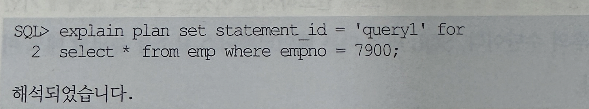
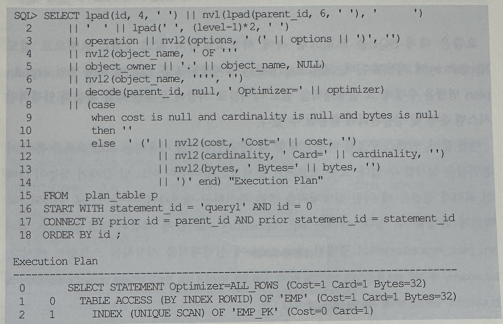
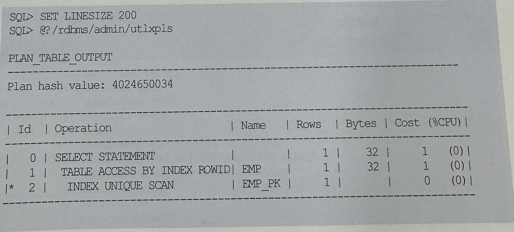
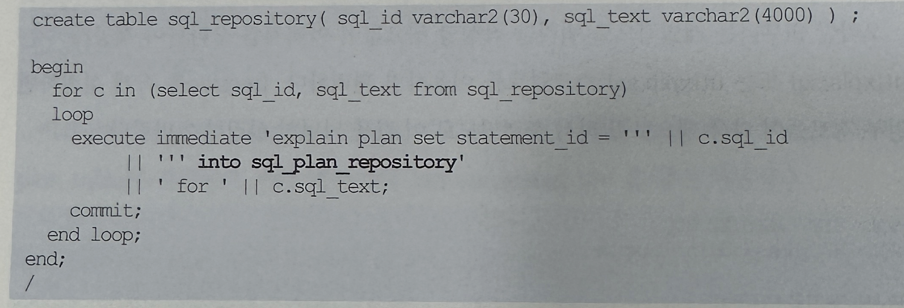

## 1. Explain plan(실행 계획)
- SQL을 수행하기 전에 실행계획을 확인하고자 할 때, explain plan 명령을 사용함
- 이 명령어를 사용하려면 먼저 plan_table을 생성해야하는데 아래 스크립트를 실행하면 됨
- 참고로 
- '?'는 $ORACLE_HOME 디렉토리를 대체하는 기호임
```
SQL> @?/rdbms/admin/utlxplan.sql
```
- 오라클 10g부터는 설치 시 기본적으로 sys.plan_table$ 테이블이 만들어짐.
- 그리고 이를 가리키는 public synonym을 기본적으로 생성해 두기 때문에 사용자가 별도로 plan_table을 만드는 수고를 하지 않아도 됨



- 이제부터 explain plan for 명령을 수행하고 나면 해당 SQL에 대한 실행계획이 plan_table에 저장됨
- 아래 예시에서 'set statement_id='은 생략 가능함



- 예전에는 Plan_table에 저장된 정보를 포맷팅하려면 아래처럼 별도의 SQL을 작성해 그것을 이용해야만 했음
- 물론 스크립트로 저장해 두고 간단히 호출하면 되므로 어려운 일은 아님
- 다음 절에서 설명할 AutoTrace 또는 TOAD 같은 쿼리 툴에서 실행계획을 보여줄 때도 내부적으로 지금 설명한 절차대로 명령을 수행하고 plan_table에 읽은 데이터를 포맷팅해서 출력해 주는 것뿐



- 오라클 9i부터 개별적으로 쿼리를 작성할 필요 없이 아래처럼 오라클이 제공해주는 utlxpls.sql 또는 utlxplp.sql 스크립트를 이용하면 편리함
- linesize를 작게 설정하면 일부 정보들이 다음 행으로 밀려서 출력되므로 이 값을 넉넉히 설정하기를 바람




- 요즘은 대개 SQL을 프로그램 속에 하드코딩하지 않고 XML 포맷으로 별도 Repository에 저장해둠
- SQL Repository에 저장된 모든 SQL에 대해 매일 explain plan 명령을 수행해 그 실행계획을 별도 테이블로 저장해 둔다면 이를 활용해 안정적인 시스템 운영 및 성능관리에 활용할 수 있음
- 예를들어 인덱스 구조를 바꾸고자 할 때 해당 인덱스를 사용하는 쿼리 목록을 뽑아 사전 점검을 실시할 수 있음
- 또는 오브젝터 통계 정보가 바뀌어 어느 날 갑자기 성능이 나빠진 쿼리가 생겼을 때 이전 실행계획을 빨리 확인하고 예전과 같은 방식으로 수행되도록 빠르게 튜닝할 수 있음
- 아래는 sql_repository 테이블에 저장된 SQL을 모두 읽어 sql_plan_repository 라고 명명된 plan table에 실행계획을 저장하는 스크립트 예시임(sql_repository 테이블은 쉽게 예시하려고 만든 것일 뿐이며, 실제 운영환경에서 SQL 문장을 테이블에 담아두고 수행할 때마다 "매번 실시간으로" 읽어오는 방식을 사용하는 것은 금물)



- 
