## 3. SQL 트레이스
- SQL을 튜닝할 때 가장 많이 사용되는 도구
- 사전 실행계획과 AutoTrace 결과만으로 부하 원인을 찾을 수 없을 때 SQL 트레이스를 통해 쉽게 찾아낼 수 있음
- SQL 트레이스를 설정하는 여러가지 방법이 있고, 각각 요도가 다르므로 잘 숙지했다가 적시적지에 활용

### 1. 자기 세션에 트레이스 걸기
- 현재 자신이 접속해 있는 세션에만 트레이스를 설정하는 방법

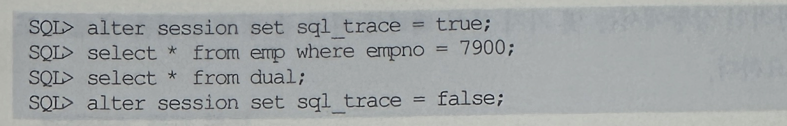

- 위와 같이 트레이스를 설정하고 SQL을 수행한 후에는 user_dump_dest 파라미터로 지정된 서버 디렉토리 밑에 트레이스 파일이 생성됨(.trc)
- 가장 최근에 생성되거나 수정된 파일을 찾아 분석하면 되는데, 파일 찾기에 어려움을 느끼는 사람은 아래 쿼리를 활용하길 바람

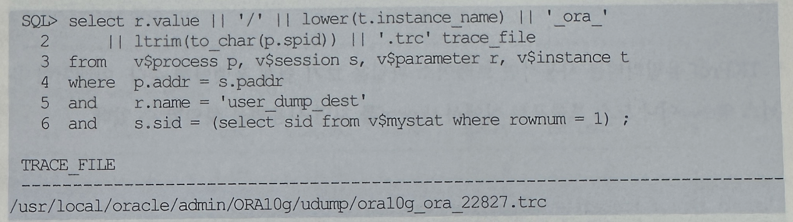

- 위 스크립트에 사용된 뷰에 대한 읽기 권한이 없다면 아래 명령을 먼저 수행한다.

```
SQL>alter session set tracefile_identifier = 'oracking';
```

- 그럼 뒤쪽에 식별자라 붙게 되므로 아래처럼 자신의 트레이스 파일을 쉽게 찾을 수 있음

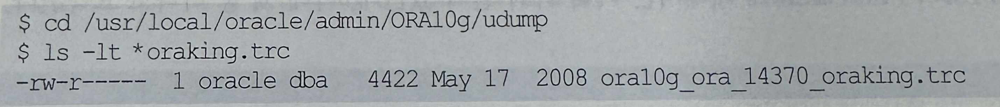

#### TKProf 유틸리티
- 트레이스 파일을 직접 열어 본 독자라면 이 파일을 그대로 분석하기는 쉽지 않음
- 물론 숙련된 전무나갈면 아래 내용을 직접 확인하면서 더 많은 정보들을 얻어낼 수 있음
- 하지만 일반적인 상황에서는 몇가지 분석 팩터에 따라 좀 더 보기 쉬운 형태로 포맷팅하는 것이 필요

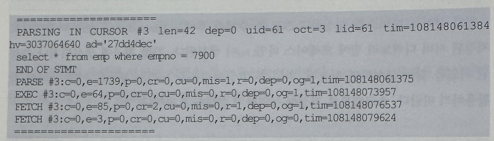

- TKProf 유틸리티를 사용하면 트레이스 파일을 보기 쉽게 포맷팅해 줌
- 아래처럼 유닉스 쉘(Shell)이나 도스 프롬프트 상에서 tkprof를 치면 사용법을 확인할 수 있음

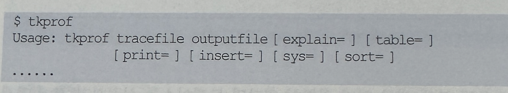

- 아래는 TKProf 유틸리티의 가장 일반적인 사용법
- sys=no 옵션은 SQL을 파싱하는 과정에서 내부적으로 수행되는 SQL 문장을 제외시켜줌

```
tkprof ora10g_ora_14370_oraking.trc report.prf sys=no
```
- TKProf의 Full Name에 대해서는 여러가지 설이 있는데, 아래 셋 중 하나로 요약됨
  - Trace Kernel PROFile
  - Transient Kernel PROFile
  - ToolKit PROFiler
- 이제 TKProf를 통해 생성된 report.prf 파일을 vi 에디터나 윈도우 노트패드로 열고 결과를 확인하면 됨

#### 트레이스 결과 분석
- 지금까지 설명한 내용은 자주 반복하다 보면 누구나 쉽게 할 수 있지만, 이제부터 분석작업은 쉽지가 않음
- 아마 제대로 분석할 만큼 숙련하려면 본서 1권은 물론 2권까지이핮 모두 독파한 후에 가능한 일
- 하지만 차큰차큰 따라오다 보면 뜻밖에 쉽고 재미있다고 느낄 것이므로 부담을 가질 필요는 없음


- SQL문 바로 밑에 있는 Call 통계(Statistics) 컬럼들의 의미부터 살펴본다
- Call
  - 커서 상태에 따라 Parse, Execute, Fetch 세 개의 Call로 나누어 각각에 대한 통계 정보를 보여줌
  - Parse : 커서를 파싱하고 실행 계획을 생성하는데 대한 통계
  - Execute : 커서의 실행 단계에 대한 통계
  - Fetch : 레코드를 실제로 Fetch 하는 데 대한 통계
- count
  - Parse, Execute, Fetch 각 단계가 수행된 횟수
- cpu
  - 현재 커서가 각 단계에서 사용한 cpu time
- elapsed
  - 현재 커서가 각 단계를 수행하는데 소요된 시간
- disk
  - 디스크로부터 읽은 블록 수
- query
  - Consistent 모드에서 읽은 블록 수
- current
  - Current 모드에서 읽은 블록 수
- Rows
  - 각 단계에서 읽거나 갱신한 처리 건수
- 좀 더 자세한 설명은 각 장에서 자연스럽게 이루어질 것이며, 2절에서 보았던 AutoTrace 결과와 일치하는 항목과 비교해보면 다음과 같음

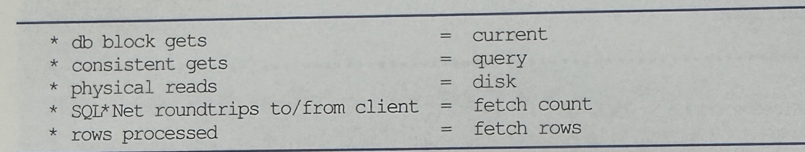

- Call 통계 아래쪽에 보이는 Row Source Operation에 대해서도 각 장에서 더욱 상세한 분석 방법이 설명될 것
- 여기서는 각 항목의 의미만을 간단히 살펴본다.

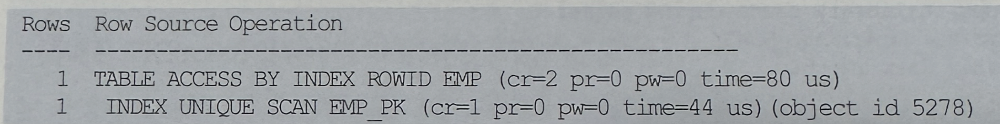

- 왼쪽에 보이는 Rows는 각 수행 단계에서 출력(Flow-Out)된 로우 수를 의미함
- 오라클 버전 7까지는 각 단계에서 Processing Count를 보여주다가 8i부터 출력 건수로 바뀌기 시작해 9i부터는 확실히 그렇게 바뀜
- 오라클은 Flow-Out방식으로 바뀌면서 생긴 단점을 보완하려고 9.2.0.2버전부터 각 수행 단계별로 cr, pr, pw, time등을 표시하기 시작
- 각각 Consistent 모드 블록 읽기, 디스크 블록 읽기, 디스크 블록 쓰기, 소요시간을 의미
- 9i에서는 pr, pw대신 r, w로 표시했었음
- 그리고 꼭 기억해야 할 중요한 사실은, 부모는 자식 노드의 값을 누적한 값을 갖는다는 점
- 예를 들어 위에서 EMP 테이블 액세스 단계는 cr=2이고 그 자식 노드인 EMP_PK인덱스 액세스 단계는 cr=1이므로 인덱스를 읽고 난 후 테이블을 액세스 하는 단계에서 순수하게 일어난 cr 개수는 1개임

#### 이벤트 트레이스
- 오라클은 오래 전부터 다양한 종류의 이벤트 트레이스를 제공해 왔고. 이를 통해서도 SQL 트레이스를 걸 수 있는데 방법은 다음과 같음

```
alter session set events '10046 trace name context forever, level 1';
alter session set events '10046 trace name context off';
```
- 특히 이 방식을 사용하면 레벨 설정을 통해 바인드 변수와 대기 이벤트 발생 현황까지 수집할 수 있음
- 설정할 수 있는 레벨 값은 1, 4, 8, 12이며, 레벨 1은 지금까지 살펴본 일반적인 SQL 트레이스와 같음
- 레벨을 4또는 12로 설정했을 때 트레이스 파일을 열어보면 아래처럼 바인드 변수에 대한 정보를 확인할 수 있음

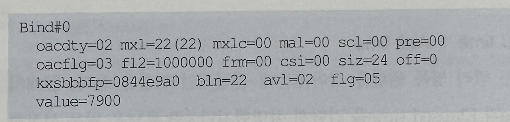

- 레벨을 8또는 12로 설정하면 SQL수행 도중 대기 이벤트가 발생할 때 마다 트레이스 파일에 아래와 같은 정보들이 로그처럼 계속 기록됨


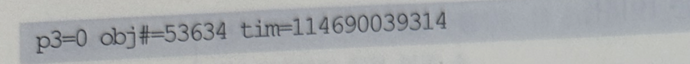

- 그리고 이를 TKProf로 포맷팅하면 아래처럼 각 이벤트별로 집계된 정보를 볼 수 있음
- 이벤트 분석을 통해 SQL이 빨리 수행되지 못하게 한 병목 요인을 쉽게 파악할 수 있음
- 대기 이벤트가 무엇인지에 대해서는 1장에서 자세히 설명함

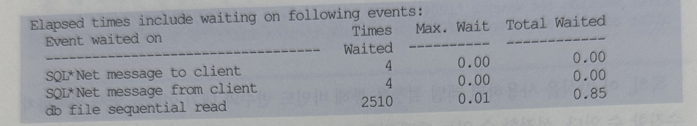

- 10046 트레이스를 걸 때 레벨을 4 이상으로 설정하면 트레이스 파일이 매우 급격하게 커지므로 주의가 필요하다
- 계속 모니터링 하다가 적정 시점에 정지시키는 것을 잊지 말아야 함

#### Elased time = CPU time + Wait time
- 위 대기 이벤트 정보는 쿼리 병목 원인을 찾아내는데 결정적인 역할을 함
- 앞에서 Call 통계에서 CPU time과 Elapsed time을 간단히 설명했지만 DB 튜닝을 처음 시작하는 독자에게는 이 두 값의 의미가 혼란스러울 것
- 대기 이벤트 개념을 이용해 그 의미를 좀 더 자세히 살펴본다
- 오라클이 내부적으로 사용하는 측정 단위와 방법 때문에 생기는 오차가 있긴 하지만 Elapsed time은 CPU time과 Wait time의 합으로 정의할 수 있음
  - Elapsed time = CPU time + Wait time = Response시점 - Call 시점
- Elapsed time은 Call 단위로 측정이 이루어 짐
- 사용자로부터 데이터베이스 Call을 받은 순간부터 Response 를 보내는 순간까지의 소요시간을 말하며, Response 시점에서 Call 시점을 차감해서 구함
- 예를 들어 13초에 Call을 보냈는데 25초에 Response를 받았다면 Call Elapsed time은 12초가 됨
- 또 한가지 알아야 할 것은, 애플리케이션 커서 캐싱 기법을 사용하지 않는 한 하나의 SELECT문을 수행하는 동안 최소 3번의 Call이 발생하고, DML문은 단 2번의 Call이 발생한다는 사실
  - SELECT문 = Pare Call + Execute Call + Fetch Call( -> 1회 이상)
  - DML문 = Parse Call + Execute Call
- 특히 SELECT 문에서 다량의 데이터를 사용자에게 전송할 때는 Fetch Call이 전송 레코드 건수 / ArraySize만큼 여러 번 발생함
- 따라서 하나의 SQL을 수행할 때의 Total Elapsed time은, 수행 시 발생하는 모든 Call의 Elapsed time을 더해서 구함
- 예제

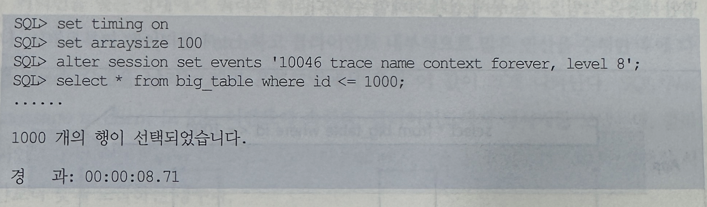

- 위에서 경과 시간을 보면 사용자가 느끼는 쿼리 총 소요시간은 8.71
- 하지만 아래 SQL 트레이스에서 Call통계를 보면 DB구간에서의 총 소요시간은 0.07초에 불과함