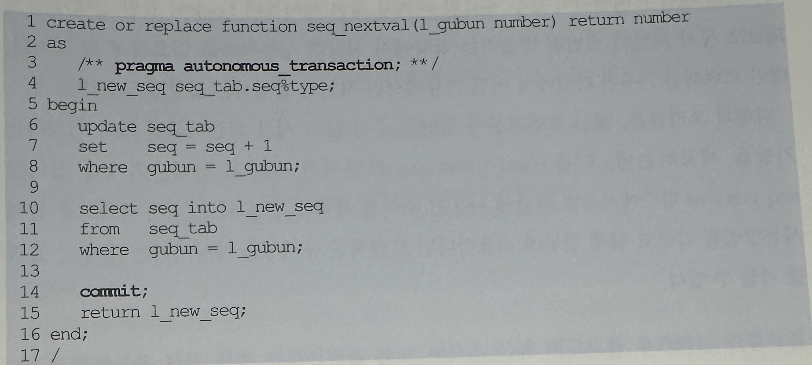
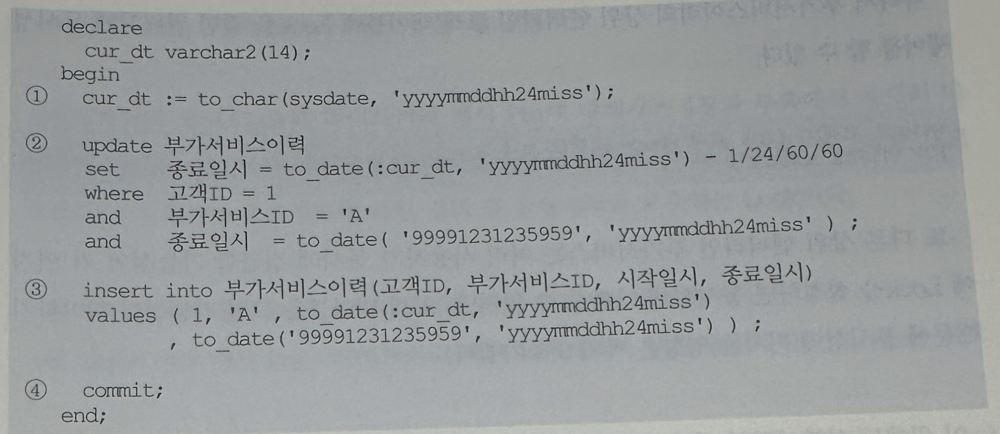

## 4. 동시성 구현 사례
- 지금까지 동시성 제어의 개념과 기본적인 구현 패턴을 살펴보았고, 이들 개념을 실제 프로젝트에 적용해서 효과적으로 동시성 문제를 해결했던 사례를 2가지만 소개하고자 함

### 1. 일련번호 채번 동시성 높이기
- 첫번쨰는 Locking을 최소화하면서 채번 테이블로부터 일련번호를 채번하고자 할 때 사용할 수 있는 사례
- 일련번호를 채번하고자 할 때 가장 좋은 선택은 DBMS가 제공하는 Sequence 기능을 이용하는 것
- 하지만 어던 상황에서는 이런 기능을 사용할 수 없는 경우가 존재하고 그럴 때 주로 사용하는 방법이 1)데이터가 삽입되는 시점에 실시간으로 현재의 MAX값을 취해 1만큼 증가시킨 값을 이용하거나 2)MAX 값을 관리하는 별도의 채번 테이블에서 값을 가져오는 방식
- *1) 실시간으로 MAX값을 얻어 처리할 때는 두개의 트랜잭션이 동시에 같은 갑승ㄹ 읽었을 경우 insert 하려는 순간 PK제약에 위배되므로 예외 처리를 통해 그다지 어렵지 않게 동시성을 제어할 수 있음
- 하지만 2채번 테이블을 사용할 대는 채번 후 다음 처리로 진행하기 전 채번 테이블 값을 1만큼 증가시키는 갱신을 수행해야 하는 어려움이 있음
- 예를들어 아래와 같은 채번 테이블이 있음
```
create table seq_tab (
    gubun varchar2(1)
  , seq number
  , constraint pk_seq_tab primary key(gubun, seq)
)
organization index;
```
- 그리고 이 테이블에서 현재 값을 1만큼 증가시키고 그 값을 읽어 리턴하는 사용자 정의 함수를 아래와 같이 정의하였음



- 아래는 위에서 정의한 함수를 사용하는 트랜잭션


- 문제는 커밋 시점인데, 만약 앞서 정의한 seq_nextval 함수처럼 라인 14에서 커밋을 한다면 어떤 이유에서 메인 트랜잭션(바로 위 소스 코드)이 라인 4 insert 이후에 롤백될 경우 문제가 생김
- 라인 2에서의 update는 이미 커밋 된 상태가 되어 데이터의 일관성이 깨지기 때문
- 그렇다고 seq_nextval 함수 14에서 커밋을 안하고 함수를 빠져나오면 어떻게 될까?
- 아래 메인 트랜잭션이 모두 종료될 때 까지 채번 테이블에 Lock이 걸린 상태가 유지 되므로 동시 채번이 빈번히 발생하는 상황에서 심각한 성능 저하를 일으키게 될 것
- 메인 트랜잭션 7~9번 라인에서 어떤 이유에서건 지연이 발생하는 상황을 상상해보라
- 다행히 오라클은, 메인 트랜잭션에 영향을 주지 않고 서브 트랜잭션만 따로 커밋하는 기능을 제공하는데, 이를 'autonomous' 트랜잭션이라고 함
- 위에서 정의한 seq_nextval  함수에서 3번 라인에 사용된 주석을 제거해 주면 됨
- 직접 테스트를 통해 사용방법을 익히고 실제 업무에 적용한다면 트랜잭션 동시성을 향상시키는데 큰 효과를 거둘 수 있음

### 2. 선분이력 정합성 유지
- 두번째는 선분이력을 추가하고 갱신할 때 발생할 수 있는 동시성 이슈를 해결한 사례임
- 선분이력모델은 여러 측면에서 장점이 있지만 잘못하면 데이터 정합성이 쉽게 깨질 수 있다는 단점이 있음
- 선분이력을 모델로 채택하면서 이를 정확히 핸들링하는 방법들을 개발 초기에 미리 교육하지 않아 문제가 발생하는 프로젝트를 자주 봄
- 아래 모델을 예로 들면서, 선분이력이 동시성과 관련해 어떤 문제를 일으킬 수 있고 어떻게 해결할 수 있는지 살펴본다




- 위 트랜잭션은 기존 최종 선분이력을 끊고 새로운 이력 레코드를 추가하는 전형적인 처리 루틴이며, 신규 등록 건이면 2번 update문에서 실패하고 3번에서 한 건이 Insert 될 것임
- 만일 첫 번째 트랜잭션이 1을 수행하고 2로 진입하기 직전에 어떤 이유에서건 두번 째 트랜잭션이 동일 이력에 대해 1~4를 먼저 진행해 버린다면 선분이력이 깨지게 됨
- 따라서 트랜잭션 순차적으로 진행할 수 있도록 직렬화 장치를 마련해야 함
- 1번 문장을 수행하기 전 select for Update 문을 이용해 해당 레코드에 Lock을 설정하면 됨
- 그런데 아래처럼 부가서비스 이력에 Lock을 걸어 동시성을 관리하려 한다면 기존에 부가서비스이력이 전혀 없던 고객일 경우 Lock이 걸리지 않음
- 그러면 동시에 두개 트랜잭션이 3번 insert문으로 진입할 수 있고, 결과적으로 시작일시는 다르면서 종료일시가 같은 두 개의 이력 레코드가 생김
```
select 고객ID from 부가서비스이력
where 고객ID = 1
and 부가서비스ID = 'A'
and 종료일시 to_date('99991231235959','yyyymmddhh24miss')
FOR UPDATE NOWAIT ;
```
- 따라서 부가서비스 이력의 상위 엔티티인 고객 테이블에 Lock을 걸면 완벽하게 동시성 제어를 할 수 있음
```
select 고객ID from 고객 where 고객ID = 1
FOR UPDATE NOWAIT ;
```
- 또 다른 상위 엔티티인 부가서비스는 여러 사용자가 동시에 접근할 가능성이 커 여기에 Lock을 설정하면 동시성에 나빠질 수 있지만, 고객 테이블은 그럴 가능성이 희박하기 때문에 동시성에 미치는 영향은 거의 0에 가까움
- 이 외에도 선분 이력의 정합성을 유지하기 위해 사용할 수 있는 몇 가지 솔루션이 더 있지만, 지면을 통해 설명하기에는 다소 복잡한데다 본서는 성능 문제를 다루는 책이므로 데이터 정합성을 위해 너무 많은 지면을 할애할 수 없는 한계가 잇음
- 다 소개 하지 못하는게 아쉽지만 다른 저서나 강좌를 통해 소개할 것을 약속함