## 5. 오라클 Lock
- 오라클은 공유 리소스와 사용자 데이터를 보호할 목적으로 DML Lock, DDL Lock, 래치, 버퍼 Lock, 라이브러리 캐시 Lock/Pin 등 다양한 종류의 Lock을 사용함
- 미처 다 열거하지 못했지만, 이 외에도 내부적으로 더 많은 종류의 Lock이 존재함
- 이 중 래치와 버퍼 Lock에 대해서는 1장에서 다룸
- 래치
  - SGA에 공유돼 있는 갖가지 자료구조를 보호할 목적으로 사용하는 가벼운 Lock
- 버퍼 Lock
  - 버퍼 블록에 대한 액세스를 직렬화
- 라이브러리 캐시 Lock과 라이브러리 캐시 Pin에 대해서는 4장과 부록에서 자세히 다루지만 간단히 설명하면 라이브러리 캐시에 공유된 오브젝츠 정의, 커서 PL/SQL프로그램같은 실행 가능 오브젝트에 대한 정의 및 실행계획을 보호하는 Lock임
- 라이브러리 캐시 Lock
  - 라이브러리 캐시 오브젝트에 대한 핸들을 보호
- 라이브러리 캐시 Pin
  - 라이브러리 캐시 오브젝트의 실제 내용이 담긴 힙을 보호
- 애플리케이션 개발 측면에서 가장 중요하게 다루어야 할 Lock은 무엇보다 DML Lock임
- 본 절에서 집중적으로 설명하려고 하는 DML Lock은 다중 사용자에 의해 동시에 액세스 되는 사용자 데이터의 무결성을 보호해준다
- DML LocK에는 테이블 Lock
  - Enqueue Lock으로 구현함
- DML 로우 Lock
  - 로우 단위 Lock과 트랜잭션 Lock을 조합해서 구현함
  - 트랜잭션 Lock은 Enqueue Lock으로 구현
- DML Lock을 이해하려면 Enqueue Lock구조와 트랜잭션 Lcok개념을 먼저 이해해야 함

### 1. Enqueue Lock
- Enqueue 는 공유 리소스에 대한 액세스를 관리하는 Lock매커니즘
- Enqueue에 의해 보호되는 공유 리소스로는 테이블, 트랜잭션, 테이블스페이스, 시퀸스, Temp 세그먼트 같은 것들이 있음
- Enqueue Lock은 래치와 달리 순서가 보장되는 큐 구조를 사용함
- 따라서 대기자 큐에 가장 먼저 Lock요청을 등록한 세션이 가장 먼저 Lock을 획득함
- Enqueue Lock으로 관리되는 공유 리소스에 대해 Lock을 획득하려면 먼저 Enqueue 리소스를 할당 받아야 함
- Enqueue 리소스에는 고유한 식별자가 부여되며, 식별자는 <Type-ID1-ID2>로 구성됨
- Type은 'TX','TM','TS'처럼 2개 문자열로 이루어지며, ID1, ID2 에는 Lock종류에 따라 다른 정보를 가짐
- 예를 들어 TM Lock 식별자에는 다음과 같은 정보를 포함
  - Type : TM
  - ID1 : 오브젝트 ID
  - ID2 : 0
- TX식별자에는 다음과 같은 정보를 포함함
  - Type : TX
  - ID1 : Undo 세그먼트 번호 + 트랜잭션 슬롯 번호
  - ID2 : 트랜잭션 슬롯 Sequence 번호
- 오라클은 Enqueue 리소스 구조체를 통합 관리하는 리소스 테이블을 갖고 있으며, 리소스 테이블에서 관리되는 각 리소스를 찾을 때는 해싱 알고리즘을 사용함
- 물론 해싱을 위한 키로는 리소스 식별자가 사용됨
- 각 해시 버킷에는 연결 리스트로 연결된 해시 체인을 가지며, 여기에 리소스 구조체가 연결됨


- Enqueue 방식으로 관리되는 특정 리소스에 대해 Lock을 획득하려면, 먼저 리소스 테이블에서 해당 리소스 구조체를 찾음
- 리소스 구조체를 찾지 못하면, 새로운 리소스 구조체를 할당 받아 해시 체인 연결 리스트에 연결됨
- 그런 후 리소스 구조체의 소유자 목록에 자신을 등록하면 됨
- 호환되지 않은 모드로 먼저 Lock을 획득한 세션이 있다면 Lock 요청을 대기자 목록에 등록하고 대기해야 함(또는 작업을 포기하는 선택을 할 수도 있음)
- 소유자가 Exclusive모드일 때는 한순간에 하나의 세션만 Lock을 획득할 수 있지만, Shared모드 일때는 여러 세션이 동시에 Lock을 획득할 수 있음
- 즉 여러 세션이 동시에 소유자 목록에 등록될 수 있음
- 소유자 목록에 Shared 또는 Exclusive 모드 Lock이 등록된 상태에서 Exclusive 모드로 Lock을 획득하려는 세션은 대기자 목록에서 대기해야하며, 하나의 리소스 구조체 대기자 목록에 동시에 여러 세션이 등록된 상태로 대기할 수 있음
- Enqueue Lock작동 매커니즘은 아래와 같음
  1. A세션이 Shared 모드로 Lock을 획득함
  2. B세션이 Shared 모드로 Lock을 획득하려고 함, 먼저 Lock을 소유한 A세션과 호환되므로 정상적으로 Lock을 획득함 이제 소유자 목록에는 두개 세션이 달려있음 
  3. C세션이 Exclusive모드로 Lock을 획득하려고 함. Shared 모드와 Exclusive 모드 간에 호환성이 없으므로 대기자 목록에 자신을 등록하고 대기함
  4. 소유자 목록에 Shared모드로 달려있던 A, B 두 세션이 모두 Lock을 해제하면 C세션이 Exclusive 모드로 소유자 목록에 등록함
  5. A세션이 Exclusive모드로 다시 Lock을 획득하려고 하면, Exclusive 모드와 호환되지 않으므로 대기자 목록에 자신을 등록하려고 대기함
  6. B세션이 다시 Shared모드로 Lock을 획득하려고 할 때도 Exclusive모드와 호환되지 않으므로 대기자 목록에 자신을 등록하고 대기함
  7. Enqueue Lock은 순서가 보장되므로 C세션이 Lock을 해제하면 A세션이 가장 먼저 Exclusive 모드로 Lock을 획득함

### 2. TX Lock (=트랜잭션 Lock)
- 트랜잭션을 시작하려면 Undo 세그먼트 헤더에 위치한 트랜잭션 테이블로부터 슬롯을 하나 할당받아야 한다고 1장에서 설명함
- 이 트랜잭션이 변경을 가한 블록에 대한 Consistent 버전을 얻으려는 다른 트랜잭션은, 트랜잭션 슬록에 기록된 상태 정보를 확인하고, 필요하다면 CR블록을 생성해서 읽음
- 그렇게 함으로 오라클은, 레코드가 갱신중이더라도 직접 읽기에 대해서는 블로킹 없이 작업을 진행할 수 있도록 구현함
- 하지만 변경 중인 레코드를 동시에 변경하려는 트랜잭션에 대해서는 액세스를 직렬화해야하며, 그 목적으로 사용되는 Lock 메커니즘이 트랜잭션 Lock임
- TX Lock은 트랜잭션이 첫 번째 변경을 시작할 때 얻고, 커밋 또는 롤백할 때 해제함
- TX Lockeh Enqueue Lock으로 구현됨
- 앞에서 설명했듯 TX Lock을 위한 Enqueue 리소스 구조체의 식별자는 다음과 같은 정보를 포함함
  - TYPE : TX
  - ID1 : Undo 세그먼트 + 트랜잭션 슬롯번호
  - ID2 : 트랜잭션 슬롯 Sequence 번호
- 이 식별자로 갖는 리소스 구조체를 Enqueue 리소스 테이블 해시 체인에 연결하고, 소유자 목록에 트랜잭션을 등록함으로써 Lock을 획득함
- 이제 TX Lock을 획득했으므로 트랜잭션을 위한 일련의 작업들을 수행
- TX Lock 메커니즘은 그림 2-5를 보면서 이해해본다.

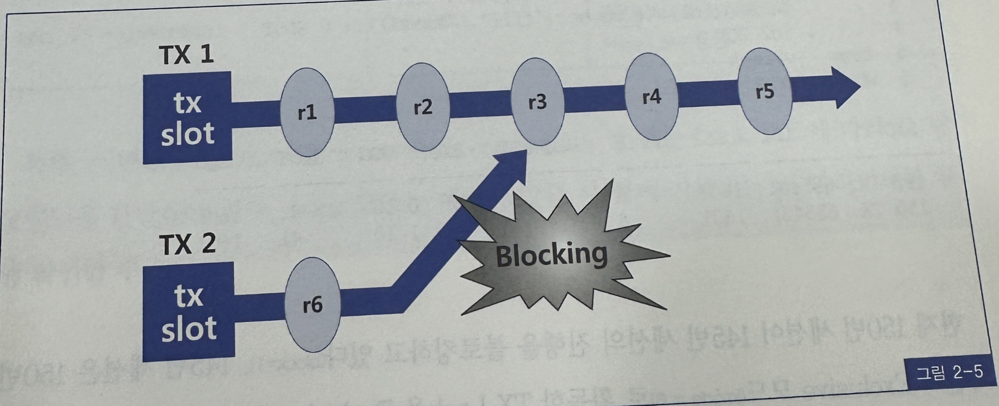

  1. TX1 트랜잭션은 Undo 세그먼트에서 트랜잭션 슬롯을 할당 받고, Enqueue 리소스를 통해 TX Lock을 설정함. 이 상태에서 R1부터 R5까지 5개 레코드를 변경하고 아직 커밋은 하지 않았다
  2. TX2 트랜잭션도 트랜잭션 테이블에서 하나의 슬롯을 할당받고, Enqueue리소스를 통해 TX Lock을 설정한 후 
  3. 이제 TX2가 R3레코드를 액세스하려는 순간 호환되지 않은 모드로 Lock이 걸려있음을 인지하고 TX1의 트랜잭션 슬롯 상태를 확인함
  4. TX1이 아직 커밋되지 않은 Action 상태이므로 TX2는, TX1이 Lock을 설정한 Enqueue 리소스 구조체 대기자 목록에 자신을 등록하고, 대기 상태로 들어감
     1. TX2는 대기하면서 3초마다 한번씩 TX1이 설정한 TX Lock의 상태를 확인함, 교착상태발생 여부를 확인하기 위함
  5. TX1이 커밋 또는 롤백하면, TX1이 설정한 TX Lock의 대기자 목록에서 가장 우선순위가 높은 TX2 트랜잭션을 깨워 트랜잭션을 재개하도록 함
  6. TX2는 r3 레코드를 변경
- v$lock을 통해 TX Lock을 조회할 수 있음

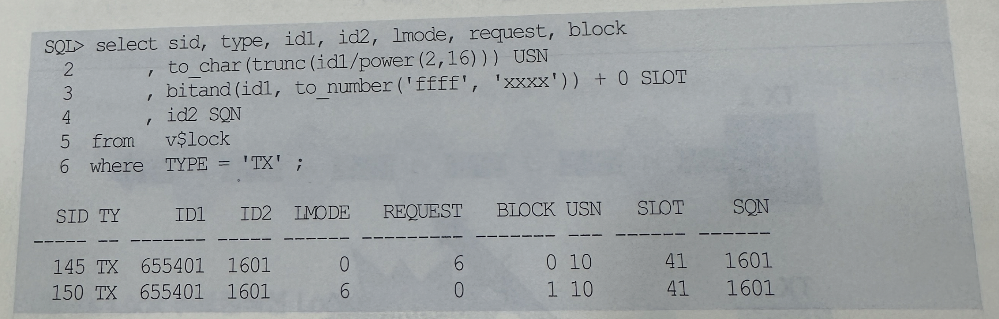

- 현재 150번 세션이 145번 세션의 진행을 블로킹하고 있음
- 145번 세션은 150번 세션이 Exclusive모드로 획득한 TX Lock을 Exclusive 모드로 요청한 채 대기하고 있음
- 현재 경합이 발생한 TX Lock 식별자는 <TX-655401-1601>이고, id1과 id2값을 이용해 TX Lock을 소유한 트랜잭션의 Undo 세그먼트와 트랜잭션 슬롯 번호, 시퀸스 번호까지 식별해 낼 수 있음
- v$lock 뷰를 이용헤 TX Lock 경합 상황을 모니터링 할 수 있지만, 발생 원인까지 알 수는 없음
- 원인을 파악하려면 v$session_wait 또는 이벤트 트레이스를 통해 대기 이벤트 발생 현황을 관찰해야 함

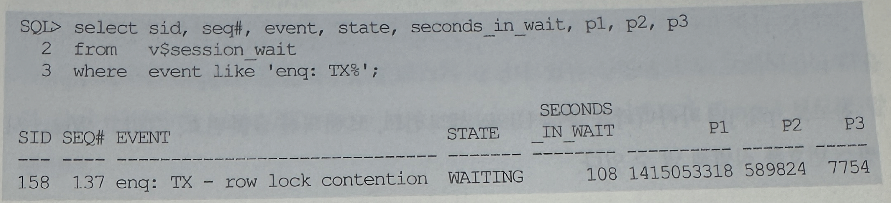

- 관찰 대기 이벤트 명에 따라 TX LocK을 아래와 같이 구분할 수 있음


- 특히 이벤트명이 enq:TX - row lock contention일 때는 Lock모드에 따라 그 발생 원인을 판단해야 함
- Lock모드는 이벤트 발생 시 함께 기록되는 p1 파라미터를 통해 확인할 수 있음

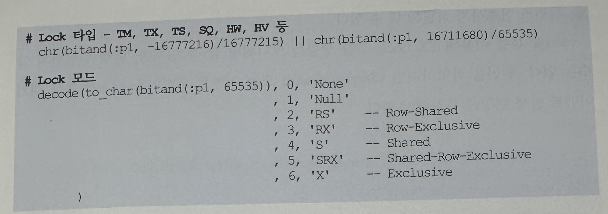

- 참고로 p2, p3 파라미터를 통해 Undo 세그먼트, 트랜잭션 슬롯번호, 그리고 Wrap 시퀸스 번호를 식별해 낼 수 있음
```
# Undo 세그먼트 번호
trunc (:p2/power(2,16))

# 트랜잭션 테이블 슬롯 번호
bitand(:p2, to_number('ffff','xxxx')) + 0

# 트랜잭션 슬롯 Wrap 시퀸스
:p3
```

- 지금부터 아래 6가지 TX Lock 발생 원인에 대해 자세히 살펴본다
  - DML 로우 Lock
  - 무결성 제약 위배 가능성
  - 비트맵 인덱스 엔트리 개신
  - ITL 슬롯 부족
  - 인덱스 분할
  - 기타
- 이중 가장 중요한 DML 로우 Lock은 맨 뒤에서 테이블 Lock과 함께 셜명함

### 3. TX Lock -> 무결성 제약 위배 가능성 또는 비트맵 인덱스 엔트리 갱신
- 로우 Lock 경합은 일반적으로 update나 delete 시에만 발생함
- insert는 새로운 레코드를 삽입하는 것이므로 로우 Lock 경합이 발생하지 않음
- 하지만 테이블에 Unique인덱스가 정의되어 있을 때는 insert에 의한 로우 Lock 경합이 생길 수 있음
- 두개 이상 트랜잭션이 같은 값을 입력하려 할 때 선행 트랜잭션이 아직 진행중이라면 값의 주복 여부가 확정되지 않았으므로 후행 트랜잭션은 진행을 멈추고 대기해야만 하는 것
- dept 테이블 deptno 컬럼에 PK 인덱스가 생성돼 있는 상황에서 두 트랜잭션이 다음과 같이 진행하면 enq: TX - Row lock contention 대기 이벤트가 Shared 모드로 발생함
  - 트랜잭션 TX1이 dept 테이블에 deptno = 40인 레코드를 입력
  - 트랜잭션 TX2도 dept 테이블에 deptno = 40인 레코드를 입력하면, TX1이 커밋 또는 롤백할 때 까지 Shared 모드로 enq: TX - row Lock contention 대기 이벤트가 발생
  - TX1이 커밋하면 TX2는 ORA-00001에러를 만나게 됨
    - ORA-00001 : 무결성 제약 조건에 위배
  - TX1이 롤백하면 TX2는 정상적으로 입력이 완료됨
- 이번에는 dept와 emp 테이블이 1:M관계고, deptno 컬럼으로 dept.deptno를 참조하도록 emp 테이블에 FK 제약이 설정돼 있다고 가정
- 이런 상황에서 두 트랜잭션이 아래와 같이 진행하면, 마찬가지로 enq: TX- row lock contention 대기 이벤트가 Shared 모드로 발생함
  - 트랜잭션 TX1이 dept 테이블에 deptno = 40인 레코드를 지움
  - 트랜잭션 TX2가 emp 테이블에 deptno = 40인 레코드를 입력하면 TX1이 커밋 또는 롤백할 떄 까지 Shared 모드로 enq: TX - Row lock contention대기 이벤트가 발생
  - TX1이 커밋하면 TX2는 ORA-02291에러를 만나게 됨
    - ORA-02291 : 무결성 제약 조건이 위배되었음 - 부모 키가 없습니다
  - TX1이 롤백하면 TX2는 정상적으로 입력이 완료됨
- 비트맵 인덱스 엔트리에 대한 갱신을 수행할 때도 Shared 모드로 enq: TX - row lock contention 이벤트가 발생할 수 있음
- 비트맵 인덱스는 그 구조상 하나의 엔트리가 여러개 레코드와 매핑됨
- 하나의 엔트리에 Lock을 설정하면 매핑되는 레코드 전체에 Lock이 설정되므로 비트맵 인덱스 엔트리를 두개 이상 트랜잭션이 동시에 갱신할 떄 이 이벤트가 자주 발생함
- 예를 들어 TX1이 트랜잭션이 1번 레코드를 갱신하는 동안 TX2트랜잭션이 2번 레코드를 갱신하려고 할 수 있는데, 이때 Shared 모드로 enq: TX - row lock contention 대기 이벤트가 발생함

### 4. TX Lock -> ITL 슬롯 부족
- 블록 레코드에 추가, 갱신, 삭제 하려면, ITL 슬롯을 먼저 할당 받고 그 곳에 트랜잭션 ID를 먼저 기록해야 함
- 비어 있는 ITL 슬롯이 없다면 ITL 슬롯을 사용 중인 트랜잭션 중 하나가 커밋 또는 롤백할 때 까지 기다려야 하며, 이때 Shared 모드 enq: TX - allocate ITL entry 대기 이벤트가 발생함
- 결국 한 블록을 동시에 갱신하 수 이쓴 트랜잭션 개수는 ITL 슬롯에 의해 결정됨
- 참고로 ITL 슬롯 당 24 바이트 공간을 차지함
- 블록에 기본저긍로 할당할 ITL 슬롯 개수는 INITRANS 파라미터로 설정함
```
create table t (...) INITRANS 5 MAXTRANS 2455 PCTFREE 30;
```
- PCTFREE는 원래 컬럼 update를 위해 예약된 공간임. 하지만 INITRANS에 의해 미리 할당된 ITL 슬롯이 모두 사용 중일 때, 새로운 트랜잭션이 ITL 슬롯을 요청하면 PCTFREE 설정에 의해 비워둔 공간을 활용하게 됨
- 이 공간까지 활용해 최대한 생성할 수 있는 ITL 슬롯 개수는 MAXTRANS에 의해 결정됨
- ITL 슬롯 부족에 의한 대기 현상이 발생했다면, 아래 둘 중 하나에 해당됨
  - 동시에 블록을 갱신하려는 트랜잭션 개수가 MAXTRANS 값을 초과
  - PCTFREE를 0으로 지정했거나 PCTFREE 예약 공간을 모두 사용한 상태에서, 새로운 트랜잭션을 위한 ITL슬롯이 부족
- 테이블에 insert할 때는, ITL 슬롯이 부족 하더라도 굳이 그 블록에 insert 하려고 대기할 필요가 없음
- 새 블록을 할당해 그 곳에 Insert 하면 되기 때문이며, 오라클 9i부터 그렇게 동작하기 시작했음
- 따라서 9i부터는 insert시 테이블불록에 대한 ITL 경합이 발생하지 않음
- 하지만 인덱스에 값을 삽입할 대는 정렬 상태를 유지해야 하므로, 여전히 ITL 경합이 발생함
- update, delete일 때는 테이블, 인덱스를 불문하고 ITL 경합이 나타날 수 있음
- INITRANS, MAXTRANS 설정과 관련해, 오라클 버전이 올라가면서 조금씩 변화가 있었음 9i부터는 테이블에 INITRANS를 3보다 작게 설정하더라도 오라클이 기존적으로 3개의 ITL 슬롯을 할당함
- 10G에서는 MAXTRANS를 위해 사용자가 지정한 값은 무시되며 항상 255개로 고정됨
- 이 값이 255이므로 ITL 경합을 더는 염려하지 않아도 된다고 생각하면 오산
- PCTFREE에 의해 예약된 공간이 Update에 의해 모두 사용되고 나면 여전히 ITL경합이 발생할 수 있음
- ITL경합에 의한 대기 현상이 자주 발생하는 세그먼트에 대해서는 ITITRANS를 늘려주어야 하며, 그런 세그먼트 목록들은 v$segstat(10g이상)을 통해 확인할 수 있음

```
select ts#, obj#, dataobj#, sum(value) itl_waits
from v$segstat
where statistic_name = 'ITL waits'
group by ts#, obj#, dataobj#
having sum(value) >0
order by sum(value) desc
```
- INITRANS 값을 변경하더라도 기존에 할당된 블록의 ITL 슬롯 개수에는 변함 없고, 새로 할당되는 블록에만 적용됨
- 따라서 기존 블록에서 ITL 경합이 빈번하게 발생한다면, 테이블 또는 인덱스 전체를 재생성해줘야만 함

```
alter table t_move INITRANS 5;
alter index t_idx rebuild INITRANS 5;
```

### TX Lock -> 인덱스 분할
- 테이블은 레코드간 정렬 상태를 유지하기 않기 때문에 입력할 공간이 부족할 때 새로운 블록을 할당 받아 입력하면 됨
- 하지만 인덱스는 정렬된 상태를 유지해야 하므로 아무 브롥에나 값을 입력할 수 없음.
- 따라서 값을 입력할 위치에 빈 공간이 없으면 인덱스 분할을 실시해 새 값을 입력할 공간을 확보하게 되며 이 과정에서 Lock경합이 발생할 수 있음


- 그림 2-6에서 현재 5번과 9번 리프 블록이 꽉 찬 모습을 볼 수 있음
- 이때 5번 블록에 새로운 값을 입력하려는 트랜잭션은 번저 인덱스 분할을 실시해야 함


- 그림 2-7은 인덱스 분할이 완료된 후 모습임
- 5번과 6번 블록 사이에 10번 블록이 삽입되었고, 5번 블록에 있던 레코드 절반이 10번 블록으로 이동함
- 이제 값을 입력하고 트랜잭션을 진행할 수 있음
- 이번에는 9번 블록에 새로운 값을 추가하려는 트랜잭션이 생김
- 9번 블록도 꽉찬 상태이므로 먼저 입력할 공간을 확보해야 함
- 맨 우측에 값을 추가하려는 것이므로 레코드가 이동할 필요는 없으며, 새 블록을 추가해 주기만 하면 됨


- 그림 2-8은 인덱스 분할이 완료된 후 모습이며, 9번 블록 뒤족에 11번 블록이 추가된 것을 볼 수 있음
- 문제는 인덱스 분할이 진행되는 동안 그 블록이 새로운 값을 입력하려는 또 다른 트랜잭션이 생길 수 있다는 점
- 그러면 두번째 트랜잭션은 선행 트랜잭션이 인덱스 분할을 완료할 때 까지 대기해야 하며, Shared 모드에서 enq: TX- index contention 이벤트를 만나게 됨
- 여기서 의문이생기는데 TX Lock은 선행 트랜잭션이 커밋 또는 롤백 할 때 비로소 해제되는데 만약 인덱스 분할을 진행한 트랜잭션이 커밋하지 않은 채 계속 다른 갱신 작업을 진행한다면 TX Lock을 대기하던 트랜잭션은 어떻게 되나?
- 오라클은 이 문제를 해결하려고 autonomous트랜잭션을 사용하며, 이에 대한 개념은 4절 동시성 구현 사례에서 이미 살펴봄
  - TX1 트랜잭션이 인덱스에 로우를 삽입하려는 순간 빈 공간을 찾지 못함, 인덱스 분할이 필요
  - TX2 트랜잭션은 autonomous 트랜잭션 TX2를 생성해 인덱스 분할을 진행토록 함
  - 인덱스 분할이 진행중인 블록에 TX3 트랜잭션이 로우를 삽입하려고 함. 이 트랜잭션은 enq: TX-index contention 이벤트를 만나게 되고, TX2 트랜잭션이 커밋할 떄 까지 대기함
  - 인덱스 분할이 완료되면 TX2트랜잭션은 커밋함. autonomous 트랜잭션이므로 TX1은 커밋되지 않은 상태로 계속 트랜잭션을 진행할 수 있음
  - TX3 트랜잭션도 작업을 재개함
- 인덱스 분할을 최소화하는 방안으로, PCTFREE를 증가시키면 된다고 흔히 알려짐
- 그런데 이 방법은 대개 효과가 없거나 일시적
- 인덱스에서의 PCTFREE 설정은 인덱스를 처음 생성하거나 재생성하는 시점에만 적용되기 떄문
- 인덱스를 생성하는 시점에, 나중에 발생할 insert를 위해 공간을 남겨두는 것이므로 인덱스 분할을 최소화할 목적으로 제공되는 기능임은 틀림없음
- 하지만 공간을 남겨두더라도 언젠가 다시 채워지므로, 인덱스를 주기적으로 재생성하지 않는 한 근본적인 해결책이 되지 못함
- 테이블에서 PCTFREE 공간이 나중에 발생할 update를 위해 남겨두는 공간인데 반해, 인덱스에서의 PCTFREE는 insert를 위해 남겨두는 공간임을 기억할 필요가 있음
- 인덱스에는 update 개념이 없기 때문에 테이블처럼 update를 위해 공간을 남겨두면 영영 사용되지 않은 죽은 공간이 될 것
- 참고로, 우측 맨 끝으로만 값이 입력되는 Right Growing 인덱스라면 PCTFREE를 0으로 설정하는 것이 인덱스 크기를 줄이는 데에 도움이 됨

### 6. TX Lock -> 기타 트랜잭션 Lock
- Shared 모드 enq : TX - contention 대기 이벤트에대해 오라클 메뉴얼을 찾아보면, 분산 트랜잭션에서 2-Phase 커밋을 위한 PREPARED TX Lock을 대기할 떄 발생한다고 설명 돼 있을 뿐 더 자세한 설명을 얻을 수 없음
- 앞에서 열거한 중요한 TX Lock이외의 트랜잭션 대기 상황을 모두 여기에 포함한 것
- 매뉴얼에는 없지만 필자의 경험에 의하면 읽기 전용 테이블 스페이스로 전환할 때도, 이 TX Lock경합이 발견
- 예를들어, USERS 테이블 스페이스에 DML을 수행하는 트랜잭션이 아직 남아있는 상태에서 아래 명령을 수행하면 Shared Mode로 TX Lock을 대기함

```
alter tablespace USERS read only;
```

### 7. TX Lock -> DML 로우 LOCK
- DML Lock은 다중 사용자에 의해 동시에 액세스 되는 사용자 데이터의 무결성을 보호해줌
- DML 수행 중에 호환되지 않는 다른 DML 또는 DDL 오퍼레이션의 수행을 방지시켜 주는 것
- 그 중 로우 Lock은 두 개의 동시 트랜잭션이 같은 로우를 변경하는 것을 방지함
- 하나의 로우를 변경하려면 로우 Lock을 먼저 획득해야 함
  - 오라클은 로우 Lock을 로우 단위 Lock과 TX Lock을 조합해서 구현
- 즉 로우를 갱신하려면 Undo 세그먼트에서 트랜잭션 슬롯을 먼저 할당받고, Enqueue 리소스를 통해 TX Lock을 획득함
- 그런 후 insert, update, delete, merge 문장을 통해 갱신하는 각 로우마다 Exclusive 모드로 로우 단위 Lock을 획득함
- TX Lock은 트랜잭션을 시작할 때 한번만 획득
- 로우 단위 Lock에 대해서는 1장에서 아주 자세히 설명. 간단히 요약하면 TX1 트랜잭션이 로우 정보를 갱신할 때는, 블록 헤더 ITL슬롯에 트랜잭션 ID를 기록하고, 로우 헤더에 이를 가리키는 Lock Byte를 설정
- 이 레코드를 액세스 하려는 다른 트랜잭션은 로우 헤더에 설정한 Lock Byte를 통해 ITL 슬롯을 찾고, ITL 슬롯이 가리키는 Undo 세그먼트 헤더의 트랜잭션 슬롯에서 트랜잭션 상태 정보를 확인함으로써 해당 레코드에 대한 액세스 가능 여부를 결정함
- 로우 단위 Lock
  - 블록 헤더 ITL과 로우 헤더 Lock Byte 설정을 의미함
  - 이를 통해 로우를 갱신 중인 트랜잭션 상태를 확인하고 액세스 가능 여부를 결정
- TX Lock
  - Enqueue 리소스를 통해 TX Lock을 설정하는 것을 의미
  - Lock이 설정된 레코드를 갱신하고자 할 때 Enqueue 리소스에서 대기
- DML 로우 Lock에 의한 TX Lock 때문에 블로킹된 세션을 관찰해 보면, Exclusive 모드의 enq: TX- row Lock contention 대기 이벤트가 지속적으로 나타남
  
### 8. TM Lock -> DML 테이블 Lock
- 오라클은 로우 Lock 획득 시 해당 테이블에 대한 테이블 Lock도 동시에 획득함
- 그럼으로써 현재 트랜잭션이 갱신 중인 테이블에 대한 호환되지 않는 DDL 오퍼레이션을 방지함
- 테이블 구조를 변경하지 못하도록 막는 것
- 테이블 Lock은 주로 DDL과 관련 있지만 DML문 간에도 테이블 Lock을 이용해 동시성을 제어할 떄가 있으며, 뒤에서 살펴볼 것
- 테이블 Lock을 걸려면 아래처럼 명시적으로 Lock Table 명령어를 이용할 수도 있음
  - lock table emp in row share mode
  - lock table emp in row exclusive mode
  - lock table emp in share mode
  - lock table emp in share row exclusive mode
  - lock table emp in exclusive mode
- 그러나 DML 테이블 Lock은 DML 문장 수행 시 자동으로 테이블 Lock까지 함께 획득하는 매커니즘을 말함
- 오라클은 변경 작업에만 로우 Lock을 사용하므로, 로우 Lock은 항상 Exclusive 모드
- 하지만 테이블 Lock은 DML문장 수행 시 자동으로 테이블 Lock까지 함께 획득하는 메커니즘을 말함
- 오라클은 변경 작업에만 로우 Lock을 사용하므로 로우 Lock은 항상 Exclusive 모드임
- 하지만 테이블 Lock에는 여러가지 Lock모드가 사용되며, Lock모드간 호환성을 정리하면 아래 표와 같음

||Null|RS|RX|S|SRX|X|
|--|--|--|--|--|--|--|
|NS|O|O|O|O|O|O|
|RS|O|O|O|O|O|O|
|RX|O|O|O|O|O||
|S|O|O|O||||
|SRX|O|O|||||
|X|O||||||

  - RS : row share(또는 SS : sub share)
  - RX : row exclusive(또는 SX : sub exclusive)
  - S : Share
  - SRX : share row exclusive(SSX : share/sub exclusive)
  - X : exclusive

- 선행 트랜잭션과 호환되지 않은 모드로 테이블 Lock을 설정하려는 후행 트랜잭션은 대기하거나 작업을 포기해야 한다
- insert, update, delete, merge 문을 위해 로우 lock을 설정하려면 해당 테이블에 RX(=SX) 모드 테이블을 Lock을 먼저 획득해야 한다.
- SELECT FOR UPDATE문을 위해 로우 Lock을 설정하려면 RS(=SS) 모드 테이블 Lock을 먼저 획득해야 한다
- RS, RX 간이는 어떤 조합으로도 호환이 되므로 select for update나 DML문 수행 시 이들 간에 테이블 Lock에 의한 경합은 절대 발생하지 않음
- 다만 같은 로우를 갱신하려 할 떄 로우 Lock에 의한 경합은 발생함
- 오라클 테이블 Lock도 Enqueue로 구현하였으며, 'TM Enqueue'라고 부름
- TM Enqueue를 이용하기 때문에 테이블 Lock을 TM Lock이라고 부르기도함
- 앞에서 설명했듯 TM Enqueue 리소스 구조체의 식별자는 아래와 같은 정보를 포함함
  - TYPE : TM
  - ID1 : 오브젝트 ID
  - ID2 : 0
- 선행 트랜잭션이 TM Lock을 해제하기를 기다리는 트랜잭션에서 발생하는 대기 이벤트를 모니터링해보면 enq: TM-contention이벤트가 지속적으로 나타남
- 테이블 Lock이라고 하면, 테이블 전체에 Lock이 걸린다고 생각하기 쉬움
- 그래서 다른 트랜잭션이 더는 레코드를 추가하거나 갱신하지 못하도록 막는다고 생각하는 사람들이 많음
- 하지만 앞서 설명했듯 DML 수행 시 항상 테이블 Lock이 함께 설정되므로 그렇게 이해하는것은 맞지 않는 개념
- 오라클에서 흔히 말하는 테이블 lock은 lock을 획득한 선행 트랜잭션이 해당 테이블에서 현재 어떤 작업을 수행 중인지를 알리는 일종의 푯말
- 그리고 위에서 본 것처럼 테이블 Lock에는 여러가지 모드가 있고, 각 모드에 따라 후행 트랜잭션이 현재 하려는 작업 내용에 따라 진행 여부가 결정됨
- 진행할 수 없다면 기다릴지, 아니면 작업을 포기할지 진로를 결정해야 함
- 기다려야 한다면 TM Enqueue 리소스 대기자 목록에 Lock요청을 등록하고 대기함

### 대상 리소스가 사용 중일 때, 진로 선택
- Lock을 얻고자 하는 리소스가 사용 중일 때, 프로세스는 아래 3가지 방법 중 하나를 택함
- 보통은 내부적으로 진로가 결정돼 있지만, 사용자가 선택할 수 있는 경우도 있음
- 사용자가 이 3가지 옵션을 모두 선택할 수 있는 문장이 select for update문
  - lock이 해제될 때 까지 기다림(예 : select * from t for update)
  - 일정시간만 기다리다 포기함(예 : select * from t for update wait 3)
  - 기다리지 않고 작업을 포기함(예 : select * from t for update nowait)
- DML문을 수행할 때 묵시적으로 테이블 Lock을 얻게 되는데 이때는 1번, 기다리는 방법을 선택함
- Lock Table 명령을 이용해 명시적으로 테이블 Lock을 얻을 때도 기본적으로 기다리는 방법을 택하지만, NOWAIT 옵션을 이용해 명시적으로 테이블 Lock을 얻을 때도 기본적으로 기다리는 방법을 택하지만, NOWAIT옵션을 이용해 곧바로 작업을 포기하도록 사용자가 지정해 줄 수 있음

```
lock table emp in exclusive mode NOWAIT;
```

- DDL문을 수행할 때도 내부적으로 테이블 Lock을 얻는데, 이때는 NOWAIT옵션이 자동으로 지정됨
- 오라클은 2번 옵션에 의해 작업을 포기할 때, 아래 메시지를 던짐
```
ORA-30006: resource busy: acquire with WAIT timeout expired
```
- 3번 옵션에 의해 작업을 포기할 때는 아래 메시지를 던짐

```
ORA-00054 : resource busy and acuire with NOWAIT specified
```
- 예를 들어 DDL문을 이용해 테이블 구조를 변경하려는 세션은 해당 테이블에 TM Lock이 설정돼 있는지를 먼저 확인함
- TM Lock을 Row Exclusive(SX)모드로 설정한 트랜잭션이 하나라도 있으면, 현재 테이블을 갱신 중인 트랜잭션이 있다는 신호임
- 따라서 ORA-00054 메시지를 던지고 작업을 멈춤
- DDL문이 먼저 수행 중일 때는 ,DML문을 수행하려는 세션이 TX Lock을 얻으려고 대기할 것
- 이때, enq : TM - contention이벤트가 발생
- 테이블 Lock은 DDL과 동시 진행을 막으려고 사용될 뿐만 아니라 DML 강 동시성을 제어하려고 사용되기도 함
- 병렬 DML또는 Direct Path Insert방식으로 작업을 수행할 때가 그렇다
- 직접 테스트하기에 앞서 아래 스크립트 내용을 먼저 확인하기 바람
- 필자가 Lock을 모니터링할 때 주로 사용하는 스크립트임


- 이 상황에서 Lock을 모니터링 해 보면 아래와 같은 내용을 볼 수 있음

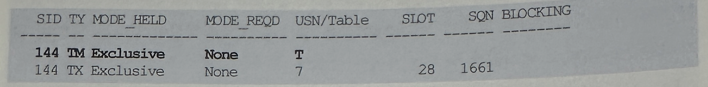

- 앞에서 설명했다시피 DML문을 수행하니까 TX Lock과 TM Lock을 동시에 획득했다.
- 일반적인 DML문에서는 테이블 Lock을 Row Exclusive(=SX)모드로 설정하지만 여기서는 Append모드 Insert를 수행했기 때문에 Exclusive 모드인 것을 볼 수 있음
- 이제 2번 세션에서 T테이블에 있는 레코드 하나를 갱신하는 update문을 수행해본다

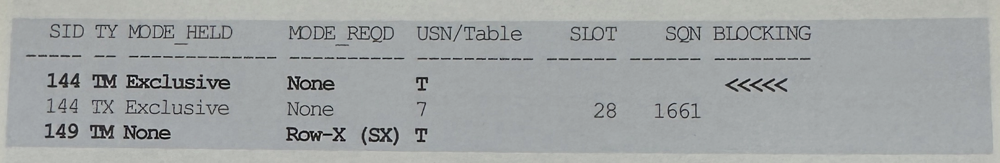

- 일반 DML문을 사용했으므로 Row Exclusive(=SX)모드로 테이블 Lock을 요청했음을 알 수 있음
- Row Exclusive 모드 Lock은 Exclusive 모드와 호환성이 없으므로 2번 세션은 블로킹 됨
- 로우 Lock이 아니라 테이블 Lock때문에 블로킹된 점을 주목해야함
- 로우 Lock 호환성을 확인하기 전에 테이블 Lock호환성을 먼저 확인한다는 사실을 알 수 있다
- 이 상황에서, v$session_wait 뷰를 통해 149번 세션의 이벤트 발생 상황을 조회해 보면, 아래와 같이 enq: TM-contention 대기 이벤트가 발생중인 것을 관찰할 수 있음

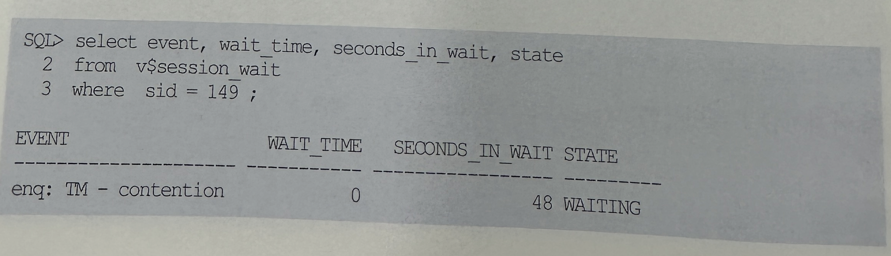

- 이제, Exclusive 모드 테이블 Lock을 먼저 획득한 144번 세션을 커밋하고, 다시 Lock을 모니터링해본다

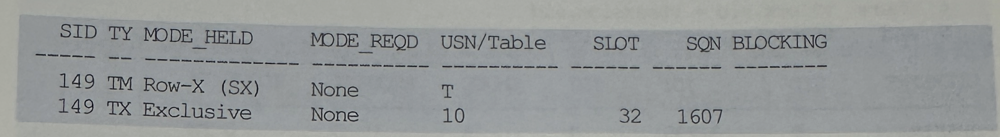

- 144번 세션은 Lock을 모두 해제했으므로 쿼리 결과에서 사라짐
- 대신 149번 세션이 TX Lock과 TM Lock을 동시에 획득한 것을 볼 수 있음
- 이번에는 149번 세션이 현재 Lock을 거록 있는 레코드를 다른 세션에서 변경하도록 한다.

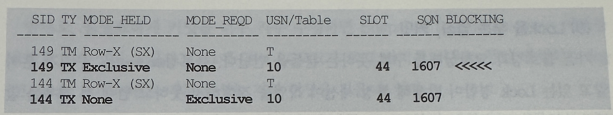

- 이번에는 테이블 Lock에 의한 블로킹이 아니라 로우 Lock 때문에 블로킹이 발생했음을 알 수 있음
- Exclusive 모드 로우 Lock간에는 호환성이 없기 때문
- Row-Exclusive모드 테이블 Lock간에는 호환성이 있으므로 Lock 경합이 발생하지 않음
- 마지막으로 한가지 기억할 것은 TX Lock은 트랜잭션마다 오직 한개씩 획득하는 반면, TM Lock은 트랜잭션에 의해 변경이 가해진 오브젝트 수만큼 획득
- 톰 카이트가 오래전에 저술한 'Expert One-on-One Oracle'에 나오는 아래 예시를 통해 위 사실을 쉽게 확인해볼 수 있음

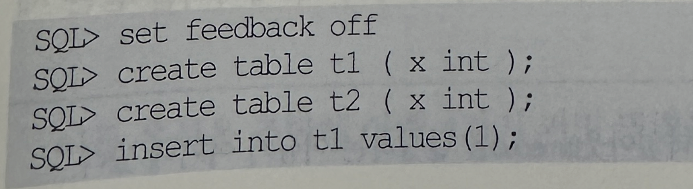

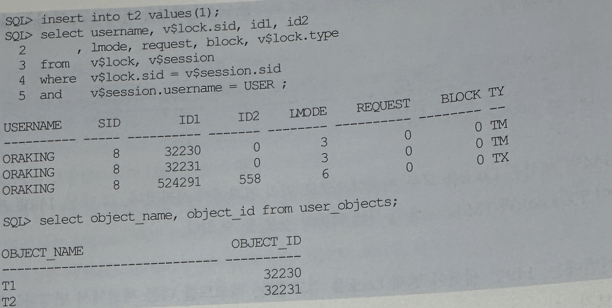

### 9 Lock을 푸는 열쇠, 커밋
- 가끔 블로킹과 교착을 구분 못하는 사람들이 있다
- 블로킹
  - Lock 경합이 발생해 특정 세션이 작업을 진행하지 못하고 멈춰 선 경우
- 교착상태
  - 두 세션이 각각 Lock을 설정한 리소스를, 서로 액세스하려고 마주보고 진행하는 상황
  - 둘 중 하나가 뒤로 물러나지 않으면 영영 풀릴 수 없음
  - 흔히 좁은 골목길에 두 대의 차량이 마주 선 것에 비유하곤 함
- 오라클에서 교착상태가 발생하면, 이를 먼저 인지한 세션이 문장 수준 롤백을 진행한 후 아래 메시지를 던짐
- 교착상태를 발생시킨 문장 하나만 롤백하는 것
```
ORA-00060: deadlock detected while waition for resource
```
- 이제 교착상태는 해소됐지만 블로킹 상태에 놓이게 됨
- 따라서 이 메시지를 받은 세션은 커밋 또는 롤백을 결정해야만 함
- 프로그램 내에서 이 에러에 대한 예외 처리를 하지 않는다면 대기 상태를 지속하게 되므로 주의가 필요함
- 오라클은 데이터를 읽을 때 Lock을 사용하지 않으므로 다른 DBMS에 비해 상대적으로 Lock경합이 적게 발생
- 읽는 세션의 진행을 막는 부담감이 없으므로 필요한 만큼 트랜잭션을 충분히 길게 가져갈 수 있음
- 그렇더라도 '불필요하게' 트랜잭션을 길게 정의하지 않도록 주의해야 함
- 트랜잭션이 너무 길면 트랜잭션을 롤백해야 할 때 너무 많은 시간이 걸려 고생할 수 있음
- undo 세그먼트가 고갈되거나 undo 세그먼트 경합을 유발할 수도 있음
- 같은 데이터를 갱신하는 트랜잭션이 동시에 수행되지 않도록 설계해야 하고, DML Lock 때문에 동시성이 저하되지 않도록 적절한 시점에 커밋해야 함
- 반대로 불필요하게 커밋을 너무 자주 수행하면 Snapshot too old(ORA-01555) 에러를 유발할 가능성이 높아지고, 그에 앞서 LGWR가 로그 버퍼를 비우는 동안 발생하는 log file sync 대기 이벤트 때문에 성능 저하 현상을 겪을 수 있음
- 잦은 커밋 때문에 성능이 매우 느리다면, 오라클 10gR2부터 제공되는 비동기식 커밋 기능을 활용하는 방안을 검토할 수 있음
  - WAIT : LGWR가 로그 버퍼를 파일에 기록했다는 완료 메시지를 받을 떄까지 대기하며, 그동안 log file sync대기 이벤트가 발생함
  - NOWAIT : LGWR의 완료 메시지를 기다리지 않고 바로 다음 트랜잭션을 진행하므로 log file sync 대기 이벤트가 발생하지 않음
  - IMMEDIATE(Default) : 커밋 명령을 받을 때 마다 LGWR가 로그 버퍼를 파일에 기록함
  - BATCH : 세션 내부에 트랜잭션 데이터를 일졍량 버퍼링 했다가 일괄처리함
- 이들 옵션을 조합해 아래 4가지 커밋 명령을 사용할 수 있게 됨

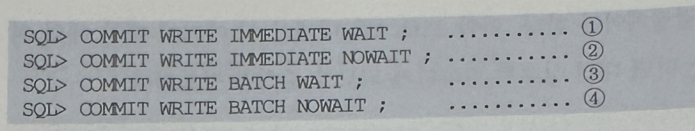

- 아래 스크립트를 가지고 1에서 4까지 테스트해 본 결과, 각각 68초, 9초, 66초, 6초의 수행 속도를 보임

```
create table t(a number);

begin
  for item in 1..100000
  loop
    insert into t values(item)
    commit write [immediate | batch] [wait | nowait];
  end loop;
end
```

- Nowait 옵션에 의한 성능 개선 효과는 크게 두드러지지만, Batch 옵션의 영향력은 미미해 보임
- 현재 이 옵션에 대한 정확한 설명을 찾을 수 없는데, 아래 표를 통해 1장에서 설명한 IMU기능과 관련 있음을 추정해 볼 수 있음
- 아래 표는 위 테스트를 수행하는 도중에 v$sesstat 각 항목의 변화량을 측정한 후, 그 중 가장 큰 차이를 보인 항목만 선별한 것


- IMU commit에 대한 설명을 찾을 수 없지만, Batch 옵션을 사용했을 때 PGA 메모리 할당량을 늘어나는 것을 통해 PGA 영역에 트랜잭션 데이터를 일정량 버퍼링했다가 일괄 처리한다는 것을 추정해볼 수 있음
- 지금까지 사용해 오던 커밋(immediate wait)은, 트랜잭션 데이터가 데이터베이스에 안전하게 저장됨을 보장.
- 하지만 비동기식 커밋 옵션을 사용하면, 트랜잭션 커밋 직후 인스턴스에 문제가 생기거나, Redo로그가 위치한 파일 시스템에 문제가 생겨 쓰기 작업을 진행할 수 없게 되면 커밋이 정상적으로 완료되지 못할 수도 있음
- 트랜잭션에 의해 생성되는 데이터 중요도에 따라 이 신기능의 활용 여부를 결정해야 함
- 참고로 commit_write 파라미터를 이용해 시스템 또는 세션 레벨에서 기본 설정을 변경할 수 있음