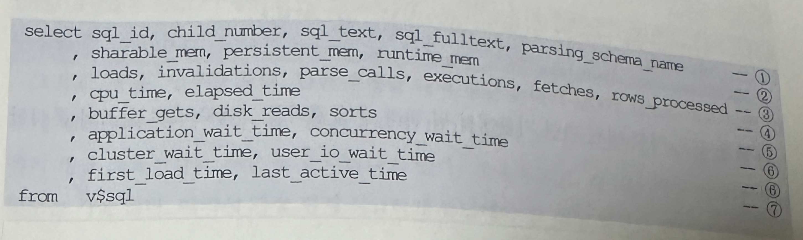
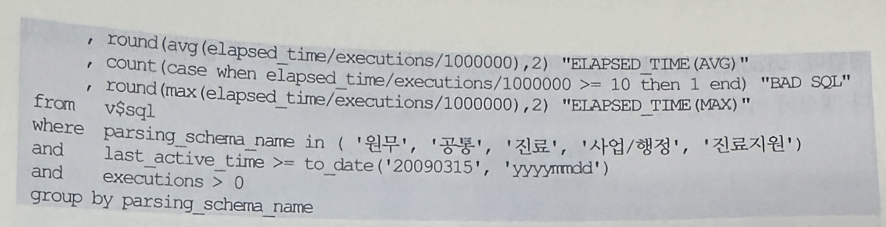
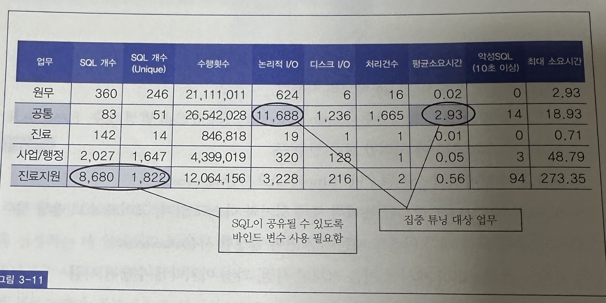
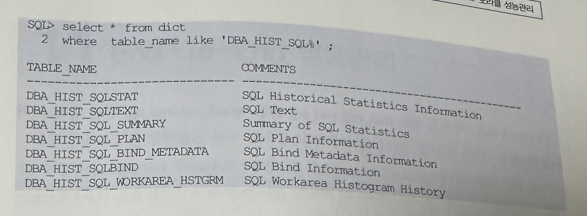
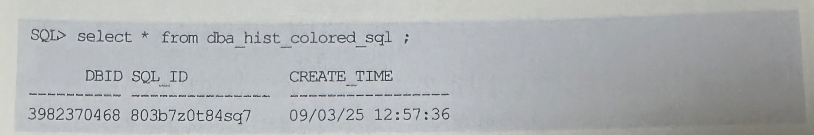

## V$SQL

### 배경
- 정해진 시간 내에 가장 효율적인 방법으로 효과성을 높이려면 전략적 접근 방법이 필요함
- 튜닝 프로젝트에 나갈 때마다 시스템에서 사용중인 SQL 개수를 세어보면 최소한 수천개가 넘고 가장 많을 때 20000여개에 이르는 것을 본 적도 있음
- 아무리 뛰어난 튜닝 팀이라 하더라도 그 많은 SQL을 모두 튜닝할 수는 없음
- 이런 상황에서 최소 인력으로 튜닝의 효과성을 극대화 해야한다
- 아래 사진은 모 통신회사에서 조사한 자료이다
- 다른 시스템도 이와 크게 다르지 않을 텐데, 조사 결과에 의하면 전체 애프리케이션 물량 중 상위 2%에 해당하는 프로그램이 전체 시슽메 부하의 70%를 차지함
- 그리고 상위 14%가 전체 부하량 90%를 차지하는 것을 볼 수 있음


- 잘 알려잔 파레토 최적의 법칙 또는 리처드 코치의 80/20 법칙은 튜닝 대상을 선정하는데 있어서도 똑같이 적용할 수 있음
- 수천 수만개의 SQL이 있더라도 그 중 대부분은 사용되지 않거나 가끔 사용 되는 것들임
- 주기적으로 사용되는 상위 10% 이내의 프로그램만 집중적으로 튜닝하더라도 시스템 안정화 및 고도화를 이룰 수 있는 이유

### 사용
- 본 절에서 설명하려는 v$sql은 개별 SQL 커서의 수행 통계를 분석할 목적으로도 많이 활용되나, 집중 튜닝이 필요한 대상 SQL을 선정하는 데 활용할 수 있는 매우 유용한 도구임
- 그 뿐만 아니라 튜닝 전 후 성능 향상도를 비교할 목저으로 통계를 내는 데도 활용할 수 있음

### 정의
- v$sql은 라이브러리 캐시에 캐싱돼 있는 각 Child 커서에 대한 수행 통계를 보여줌
- 그리고 v$sqlarea는 Parent 커서에 대한 수행 통계를 나타내며, 많은 컬럼이 v$sql을 group by 해 구한 값임
- Parent 커서와 Child 커서에 대한 개념은 4장에서
- v$sql은 쿼리가 수행을 마칠 때마다 갱신되며, 오랫동안 수행되는 쿼리는 5초마다 갱신이 이루어짐




- 그림 3-11은 어떤 병원 관련 기관에서 위 쿼리 수행 결과를 그대로 표로 옮겨서 분석한 내용임
니으


- 세 번쨰 컬럼 SQL 개수(Unique)는 SQL 문자열 중 선행 100개 문자가 같으면 SQL 인 것으로 가조하고 집계한 것
- 같은 SQL 인데도 바인드 변수를 사용하지 않으면 Literal 상수값 별로 오라클이 다른 sql_id를 부여해 SQL 개수가 무수히 많은 것으로 집계되는 오류를 보완하려는 것
- 프로젝트마다 대개 SQL을 식별할 목적으로 select, insert, update, delete 키워드 바로 뒤에 주석으로 고유한 SQL 식별자를 적어놓기 때문에 선행 100개 문자가 같으면 SQL로 간주하는 데에 큰 무리가 없음
- 위 통계 수치에 한번 수행되었다 금방 캐시에서 밀려난 쿼리들은 제외되므로 100% 정확하다고 할 수 없지만, 튜닝을 위한 의사 결정 시 매우 유용하고 활용가치가 높은 정보를 제공함
- 예를 들어 위 표에 집계된 결과를 보면 '진료지원' 업무에서 라이브러리 캐시에 로드된 SQL개수가 8680개인데 Unique 하게는 1822개 이므로 바인드 변수를 사용하지 않아 각각 하드 파싱을 발생시키며 캐시에 로드된 SQL 비중이 매우 높은 것을 알 수 있음
- SQL이 공유될 수 있도록 바인드 변수를 사용하는 방식으로 프로그램을 수정할 필요가 있음
- 그리고 공통 업무를 보면, 한번 수행할 때의 평균 논리적 I/O가 11688개로 다른 업무에 대해 매우 높게 나타나고 있음
- 논리적 I/O가 많다보니 디스크 I/O도 많고 당연히 쿼리 평균 소요 시간도 가장 높게 나타나고 있음
- 게다가 SQL 개수는 가장 적지만 수행 횟수는 가장 많음
- 따라서 가장 먼저 시급하게 튜닝해야 할 대상 업무로 판단할 수 있음
- v$sql의 또 다른 활용 예로, 그림 3-12는 1년 6개월 간의 개발 기간을 거쳐 오픈을 맞은 어떤 시스템에서 4개 서브 업무 시스템 별로 SQL수행통계를 구해본 것


- 3초 이내 수행되는 SQL 비중을 보면 업무1은 80%, 업무2는 99%, 업무 3은 91%인데 반해, 홈페이지 시스템은 66%로 가장 낮은 것으로 나타남
- 특히, 홈페이지는 인터넷으로 오픈된 시스템이므로 가장 시급하게 튜닝이 필요하다고 판단해 오픈 후 2주간 집중 튜닝을 실시하였음
- 그림 3-13은 2주 후 다시 SQL 수행 통계를 집계한 결과임
- 홈페이지에서 3초 이내 수행된 SQL 비중이, 위 표에서 66%이던 것이 99.71%로 크게 늘어난 것을 확인할 수 있음


- v$sql과 조인해서 추가 정보를 얻을 수 있는 유용한 뷰들이 제공되는데, 그 중 v$sql_plan을 통해 실행계획을 확인하고 v$sql_plan_statistics를 통해 각 Row Source별 수행 통계를 확인할 수 있음을 4절에서 보임
- v$sql_bind_capture뷰도 유용한데, 이를 조회하면 전체는 아니더라도 정해진 기간에 한번씩 샘플링한 바인드 변수 값을 확인할 수 있음
- 더 자주 샘플링하도록 하려면 _cursor_bind_capture_interval 파라미터 값을 줄이면 되고, 기본 설정 값은 900초
- v$sql을 포함해 오라클은 SQL 커서와 관련된 각종 수행 통계를 주기적으로 AWR에 저장하며, 아래와 같은 뷰를 통해 조회 가능함



- 물론 스냅샷 시점에 캐시에 남아있던 커서의 수행 통계만 저장됨
- 또한 캐시에 남아 있더라도 그 방대한 양의 SQL 수행 통계를 스냅샷 시점 별로 모두 저장할 수 없으므로 아래와 같은 기준으로 Top SQL만 수집함
  - Parse Calls
  - Executions
  - Buffer Gets
  - Disk Reads
  - Elapsed Time
  - CPU Time
  - Wait Time
  - Version Count
  - Sharable Memory

- 이와 관련해 11g에 추가된 유용한 기능이 있음
- Colored SQL 이라고 명명된 기능으로서 위 기준에 의해 Top SQL에 포함되지 않더라도 사용자가 명시적으로 지정한 커서의 수행통계가 AWR에 주기적으로 수집되도록 마크하는 기능임
- 마치 책을 읽다가 중요한 부분에 형광펜으로 칠해두는 것과 같음
- Colored SQL로 지정하는 방법은 다음과 같음

```
begin
    dbms_workload_repository.add_colored_sql(sql_id -> '803b7z0t84sq7')
end;
/
```
- Colored SQL 목록은 dba_hist_colored_sql 또는 wrm$_colored_sql 뷰를 통해 조회 가능함



- 이처럼 sql_id에 색깔 표시를 해 두면 오라클이 AWR 정보를 수집할 대마다 Top SQL 선정 기준과 상관없이 해당 SQL의 수행 통계를 저장함
- 단 이 기능을 사용하더라도 스냅샷 시점에 캐시에서 밀려나고 없는 SQL 정보까지 저장할 수는 없음
- 아쉬운 것은 Module과 Action 설정 값을 기준으로 색깔 표시하는 기능이 아직 제공되지 않는다는 점이며, 앞으로 추가될 것으로 기대 해 본다.
- Colored SQL 목록에서 제거할 때는 remove_colored_sql 프로시저를 이용하며, 이 명령을 수행하더라도 Top SQL 기준에 포함된 SQL 은 AWR에 수집됨
```
begin
    dbms_workload_repository.remove_colored_sql('803b7z0t84sq7')
end;
/
```

- 참고로 앞에서 dbms_xplan 패키지를 소개하면서 언급했듯이 AWR에 저장된 SQL 실행계획은 다음과 같이 display_awr 프로시저를 통해 쉽게 출력해 볼 수 있음

```
select * from table(dbms_xplan.display_awr('803b7z0t84sq7', NULL, NULL, 'basic rows bytes cost'));
```

