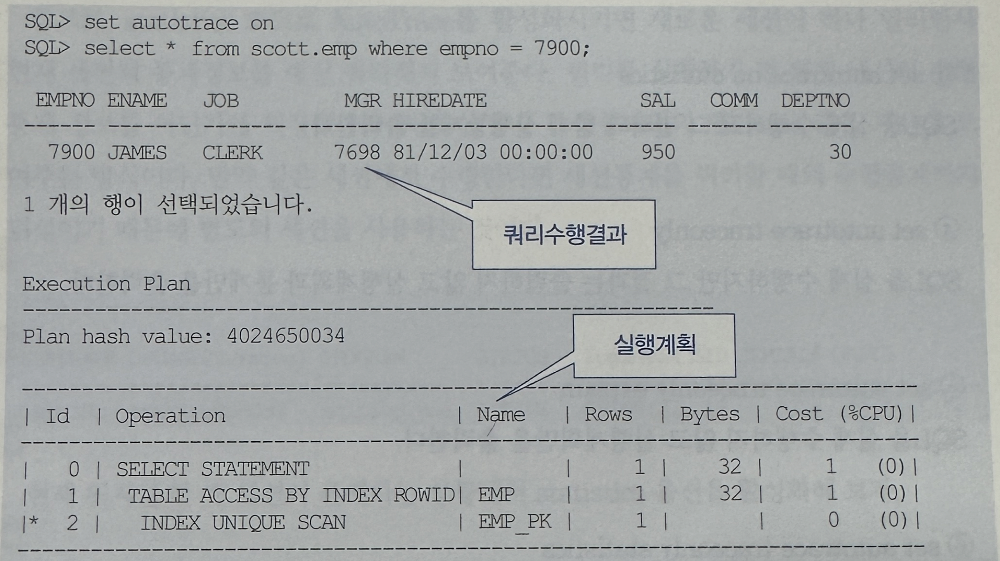
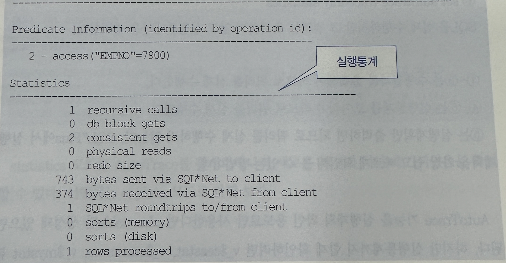
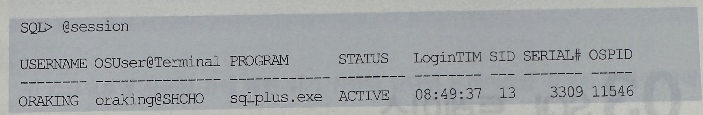
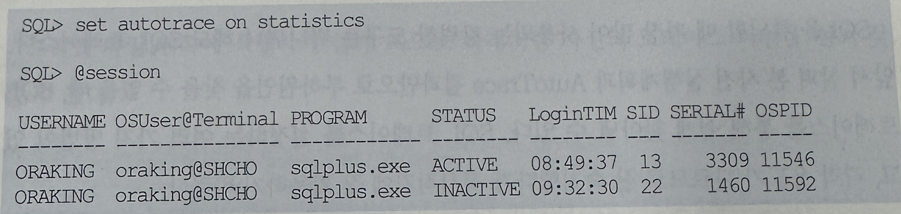
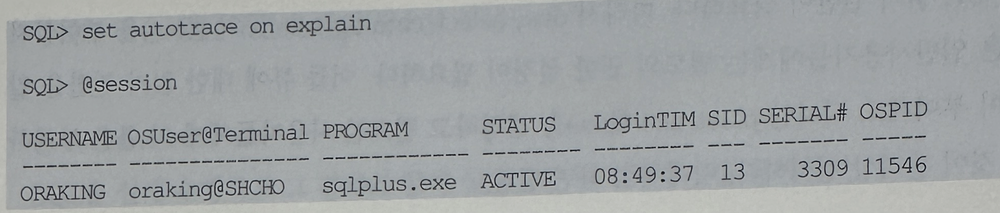
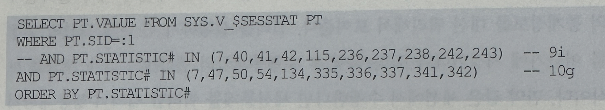

## 2. AutoTrace
- AutoTrace결과에는 SQL을 튜닝하는데 유용한 정보들을 많이 포함하고 있어 가장 즐겨 사용되는 도구 중 하나




- 아래와 같은 옵션 조합에 따라 필요한 부분만 출력해 볼 수 있음
  1. set autotrace on
     - SQL을 실제 수행하고 그 결과와 함께 실행계획 및 실행 통계를 출력함
  2. set autotrace on explain
     - SQL을 실제 수행하고 그 결과와 함께 실행계획을 출력함
  3. set autotrace on statistics
     - SQL을 실제 수행하고 그 결과와 함께 실행 통계를 출력함
  4. set autotrace traceonly
     - SQL을 실제 수행하지만 그 결과는 출력하지 않고 실행계획과 통계만을 출력함
  5. set autotrace traceonly explain
     - SQL을 실제 수행하지 않고 실행계획만을 출력
  6. set autotrace traceonly statistics
     - SQL을 실제 수행하지만 그 결과는 출력하지 않고 실행통계만을 출력
  - 1~3은 수행결과를 출력해야 하므로 쿼리를 실제 수행함
  - 4~6은 실행 통계를 보여줘야 하므로 쿼리를 실제 수행함
  - 5는 실행계획만 출력하면 되므로 쿼리를 실제 수행하지 않음
- SQL*Plus에서 실행계획을 가장 쉽고 빠르게 확인해볼 수 있는 방법
- AutoTrace기능을 실행계획 확인 용도로만 사용한다면 plan_table만 생성돼 있으면 됨
- 하지만 실행통계까지 함께 확인하려면 v_$sesstat, v_$statname, v_$mystat 뷰에 대한 읽기 권한이 필요함
- 따라서 dba, select_catalog_role 등의 롤을 부여받지 않은 일반 사용자들에게는 별도의 권한 설정이 필요함
- 이들 뷰에 대한 읽기 권한을 일일이 부여해도 되지만 plustrace롤(role)을 생성하고 필요한 사용자들에게 이 롤을 부여하는 것이 관리상 편리함
- 아래 처럼 하면 됨
```
SQL> @?/sqlplus/admin/plustrce.sql
SQL> grant plustrace to scott;
```
- 참고로 statistics 모드로 AutoTrace를 활성화 시키면 새로운 세션이 하나 열리면서 현재 세션의 통계 정보를 대신 쿼리해서 보여줌
- 쿼리를 실행하기 전 현재 세션의 수행 통계 정보를 어딘가에 저장했다가 쿼리 실행 후 수행통계와의 델타 값을 계산해 보여주는 방식
- 만약 같은 세션에서 수행한다면 세션 통계를 쿼리할 대의 수행 통계까지 뒤섞이기 때문에 별도의 세션을 사용하는 것



- 현재 위처럼 한 개 세션이 존재하는 상황에서 statistics옵션을 활성화 시켜본다
  


- statistics모드로 AutoTrace를 활성화 하니 새로운 세션이 하나 추가되었음을 확인할 수 있음
- 이번에는 explain모드로 바꿔본다



- 아까 새롭게 열렸던 세션이 사라진 것을 확인하기 바람
- statistics옵션을 활성화 했을 때 내부적으로 수행되는 SQL문은 아래와 같음

