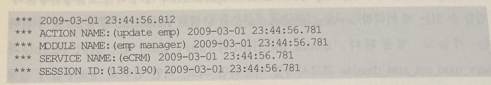

## 3. SQL 트레이스
- SQL을 튜닝할 때 가장 많이 사용되는 도구
- 사전 실행계획과 AutoTrace 결과만으로 부하 원인을 찾을 수 없을 때 SQL 트레이스를 통해 쉽게 찾아낼 수 있음
- SQL 트레이스를 설정하는 여러가지 방법이 있고, 각각 요도가 다르므로 잘 숙지했다가 적시적지에 활용

### 1. 자기 세션에 트레이스 걸기
- 현재 자신이 접속해 있는 세션에만 트레이스를 설정하는 방법


- 위와 같이 트레이스를 설정하고 SQL을 수행한 후에는 user_dump_dest 파라미터로 지정된 서버 디렉토리 밑에 트레이스 파일이 생성됨(.trc)
- 가장 최근에 생성되거나 수정된 파일을 찾아 분석하면 되는데, 파일 찾기에 어려움을 느끼는 사람은 아래 쿼리를 활용하길 바람


- 위 스크립트에 사용된 뷰에 대한 읽기 권한이 없다면 아래 명령을 먼저 수행한다.

```
SQL>alter session set tracefile_identifier = 'oracking';
```

- 그럼 뒤쪽에 식별자라 붙게 되므로 아래처럼 자신의 트레이스 파일을 쉽게 찾을 수 있음


#### TKProf 유틸리티
- 트레이스 파일을 직접 열어 본 독자라면 이 파일을 그대로 분석하기는 쉽지 않음
- 물론 숙련된 전무나갈면 아래 내용을 직접 확인하면서 더 많은 정보들을 얻어낼 수 있음
- 하지만 일반적인 상황에서는 몇가지 분석 팩터에 따라 좀 더 보기 쉬운 형태로 포맷팅하는 것이 필요


- TKProf 유틸리티를 사용하면 트레이스 파일을 보기 쉽게 포맷팅해 줌
- 아래처럼 유닉스 쉘(Shell)이나 도스 프롬프트 상에서 tkprof를 치면 사용법을 확인할 수 있음


- 아래는 TKProf 유틸리티의 가장 일반적인 사용법
- sys=no 옵션은 SQL을 파싱하는 과정에서 내부적으로 수행되는 SQL 문장을 제외시켜줌

```
tkprof ora10g_ora_14370_oraking.trc report.prf sys=no
```
- TKProf의 Full Name에 대해서는 여러가지 설이 있는데, 아래 셋 중 하나로 요약됨
  - Trace Kernel PROFile
  - Transient Kernel PROFile
  - ToolKit PROFiler
- 이제 TKProf를 통해 생성된 report.prf 파일을 vi 에디터나 윈도우 노트패드로 열고 결과를 확인하면 됨

#### 트레이스 결과 분석
- 지금까지 설명한 내용은 자주 반복하다 보면 누구나 쉽게 할 수 있지만, 이제부터 분석작업은 쉽지가 않음
- 아마 제대로 분석할 만큼 숙련하려면 본서 1권은 물론 2권까지이핮 모두 독파한 후에 가능한 일
- 하지만 차큰차큰 따라오다 보면 뜻밖에 쉽고 재미있다고 느낄 것이므로 부담을 가질 필요는 없음


- SQL문 바로 밑에 있는 Call 통계(Statistics) 컬럼들의 의미부터 살펴본다
- Call
  - 커서 상태에 따라 Parse, Execute, Fetch 세 개의 Call로 나누어 각각에 대한 통계 정보를 보여줌
  - Parse : 커서를 파싱하고 실행 계획을 생성하는데 대한 통계
  - Execute : 커서의 실행 단계에 대한 통계
  - Fetch : 레코드를 실제로 Fetch 하는 데 대한 통계
- count
  - Parse, Execute, Fetch 각 단계가 수행된 횟수
- cpu
  - 현재 커서가 각 단계에서 사용한 cpu time
- elapsed
  - 현재 커서가 각 단계를 수행하는데 소요된 시간
- disk
  - 디스크로부터 읽은 블록 수
- query
  - Consistent 모드에서 읽은 블록 수
- current
  - Current 모드에서 읽은 블록 수
- Rows
  - 각 단계에서 읽거나 갱신한 처리 건수
- 좀 더 자세한 설명은 각 장에서 자연스럽게 이루어질 것이며, 2절에서 보았던 AutoTrace 결과와 일치하는 항목과 비교해보면 다음과 같음


- Call 통계 아래쪽에 보이는 Row Source Operation에 대해서도 각 장에서 더욱 상세한 분석 방법이 설명될 것
- 여기서는 각 항목의 의미만을 간단히 살펴본다.


- 왼쪽에 보이는 Rows는 각 수행 단계에서 출력(Flow-Out)된 로우 수를 의미함
- 오라클 버전 7까지는 각 단계에서 Processing Count를 보여주다가 8i부터 출력 건수로 바뀌기 시작해 9i부터는 확실히 그렇게 바뀜
- 오라클은 Flow-Out방식으로 바뀌면서 생긴 단점을 보완하려고 9.2.0.2버전부터 각 수행 단계별로 cr, pr, pw, time등을 표시하기 시작
- 각각 Consistent 모드 블록 읽기, 디스크 블록 읽기, 디스크 블록 쓰기, 소요시간을 의미
- 9i에서는 pr, pw대신 r, w로 표시했었음
- 그리고 꼭 기억해야 할 중요한 사실은, 부모는 자식 노드의 값을 누적한 값을 갖는다는 점
- 예를 들어 위에서 EMP 테이블 액세스 단계는 cr=2이고 그 자식 노드인 EMP_PK인덱스 액세스 단계는 cr=1이므로 인덱스를 읽고 난 후 테이블을 액세스 하는 단계에서 순수하게 일어난 cr 개수는 1개임

#### 이벤트 트레이스
- 오라클은 오래 전부터 다양한 종류의 이벤트 트레이스를 제공해 왔고. 이를 통해서도 SQL 트레이스를 걸 수 있는데 방법은 다음과 같음

```
alter session set events '10046 trace name context forever, level 1';
alter session set events '10046 trace name context off';
```
- 특히 이 방식을 사용하면 레벨 설정을 통해 바인드 변수와 대기 이벤트 발생 현황까지 수집할 수 있음
- 설정할 수 있는 레벨 값은 1, 4, 8, 12이며, 레벨 1은 지금까지 살펴본 일반적인 SQL 트레이스와 같음
- 레벨을 4또는 12로 설정했을 때 트레이스 파일을 열어보면 아래처럼 바인드 변수에 대한 정보를 확인할 수 있음


- 레벨을 8또는 12로 설정하면 SQL수행 도중 대기 이벤트가 발생할 때 마다 트레이스 파일에 아래와 같은 정보들이 로그처럼 계속 기록됨


- 그리고 이를 TKProf로 포맷팅하면 아래처럼 각 이벤트별로 집계된 정보를 볼 수 있음
- 이벤트 분석을 통해 SQL이 빨리 수행되지 못하게 한 병목 요인을 쉽게 파악할 수 있음
- 대기 이벤트가 무엇인지에 대해서는 1장에서 자세히 설명함


- 10046 트레이스를 걸 때 레벨을 4 이상으로 설정하면 트레이스 파일이 매우 급격하게 커지므로 주의가 필요하다
- 계속 모니터링 하다가 적정 시점에 정지시키는 것을 잊지 말아야 함

#### Elased time = CPU time + Wait time
- 위 대기 이벤트 정보는 쿼리 병목 원인을 찾아내는데 결정적인 역할을 함
- 앞에서 Call 통계에서 CPU time과 Elapsed time을 간단히 설명했지만 DB 튜닝을 처음 시작하는 독자에게는 이 두 값의 의미가 혼란스러울 것
- 대기 이벤트 개념을 이용해 그 의미를 좀 더 자세히 살펴본다
- 오라클이 내부적으로 사용하는 측정 단위와 방법 때문에 생기는 오차가 있긴 하지만 Elapsed time은 CPU time과 Wait time의 합으로 정의할 수 있음
  - Elapsed time = CPU time + Wait time = Response시점 - Call 시점
- Elapsed time은 Call 단위로 측정이 이루어 짐
- 사용자로부터 데이터베이스 Call을 받은 순간부터 Response 를 보내는 순간까지의 소요시간을 말하며, Response 시점에서 Call 시점을 차감해서 구함
- 예를 들어 13초에 Call을 보냈는데 25초에 Response를 받았다면 Call Elapsed time은 12초가 됨
- 또 한가지 알아야 할 것은, 애플리케이션 커서 캐싱 기법을 사용하지 않는 한 하나의 SELECT문을 수행하는 동안 최소 3번의 Call이 발생하고, DML문은 단 2번의 Call이 발생한다는 사실
  - SELECT문 = Pare Call + Execute Call + Fetch Call( -> 1회 이상)
  - DML문 = Parse Call + Execute Call
- 특히 SELECT 문에서 다량의 데이터를 사용자에게 전송할 때는 Fetch Call이 전송 레코드 건수 / ArraySize만큼 여러 번 발생함
- 따라서 하나의 SQL을 수행할 때의 Total Elapsed time은, 수행 시 발생하는 모든 Call의 Elapsed time을 더해서 구함
- 예제 변경


- 위에서 경과 시간을 보면 사용자가 느끼는 쿼리 총 소요시간은 8.71 변경
- 하지만 아래 SQL 트레이스에서 Call통계를 보면 DB구간에서의 총 소요시간은 0.07초에 불과함


- 1000건을 읽는데 ArraySize를 100으로 설정했으므로 one-row fetch까지 합쳐 11번의 Fetch Call이 발생했고, Parse Call과 Execute Call이 발생했고, Parse Call과 Execute Call까지 합쳐 총 13번의 Call이 발생했음
- 따라서 13번 발생한 Call 각각에 대한 소요시간을 더한 총 소요시간이 0.07초임
- 데이터베이스 내부적으로는 0.07초 동안만 일을 했고, 나머지 시간은 애플리케이션으로부터 추가 Call을 기다리면서 Idle 상태로 대기한 시간임
- 또한 CPU Time과 Elapsed time간 시간 차는 0.07초간 일하는 동안애도 실제로 프로세스가 CPU를 점유하고 원할하게 일을 진행한 시간은 0.03초에 불과하다는 사실을 말해줌
- 나머지 0.04초는 대기상태에 빠졌던 것으로 이해하면 됨
- 지금까지 설명한 내용은 그림 3-1을 통해 쉽게 이해할 수 있음


- SQL 수행 전 이벤트 트레이드 레벨을 8로 설정했으므로 다음과 같이 이벤트 발생 현황까지 확인할 수 있음
- 이를 통해 CPU time과 Elapsed time간의 갭(GAP), 그리고 사용자가 느낀 총 소요시간과 갭이 발생했던 이유를 설명할 수 있음


- 가당 눈에 띄는 것은 SQL*Net message from client 이벤트
- 이 대기 이벤트는 Idle 이벤트로서 오라클 서버 프로세스가 사용자에게 결과를 전송하고 다음 Fetch call이 올때까지 대기한 시간을 더한 값임
- 11번 발생하는 동안 8.43초를 대기했으므로 사용자가 느낀 총 소요시간 8.71초의 대부분을 이 값이 차지한 것을 알 수 있음
- 오라클 서버 입장에서는 할 일 없이 대기한 시간이고 app와 Network 구간에서 소모된 시간임
- 커넥션을 맺은 상태에서 쿼리와 쿼리 수행 사이 thinking time이 긴 애플리케이션이나, 서버로부터 데이터를 Fetch하고 클라이언트 내부적으로 많은 연산을 수행한 후에 다음 Fetch call 을 날리는 배치 프로그램에서 특히 이 값이 크게 나타남
- SQL*Net message to client도 Idle이벤트에 속함
- 클라이언트에게 메시지를 보냈는데, 클라이언트가 너무 바쁘거나 네트워크 부하 때문에 메시지를 잘 받았다는 신호가 정해진 시간보다 늦게 도착하는 경우
- 위 리포트에서 오라클이 일하는 Elapsed time동안 발생한 대기 이벤트로는 db sequential read와 SQL*Net more data to client 두개가 있음
- db file sequential read는 Single Block Read방식으로 디스크 블록을 읽을 때 발생하는 대기 이벤트
- SQL*Net more data to client는 클라이언트에게 전송할 데이터가 남았는데 네트워크 부하때문에 바로 전송하지 못할 때 발생하는 대기 이벤트
- 5장에서 설명하겠지만 오라클 서버는 내부저긍로 SDU단위로 패킷을 나누어 전송함
- 하나의 SDU 단위 패킷을 전송했는데 잘 받았다는 신호가 정해진 시간보다 늦게 도착하면 대기가 발생하는데, 그때 발생하는 대기 이벤트가 SQL*Net more data to client임
- Elapsed time은 Response 시점에서 Call시점을 차감해서 구한다고했음
- 반면, CPU time과 Wait time은 각 발생구간의 시간을 더해서 구하며, 내부 타이머의 측정 단위떄문에 반올림된 수치를 사용함
- 따라서 이론적으로 Elapsed time이 CPU time과 Wait time을 더한 값이지만 둘 간에는 항상 오차가 발생함
- 심지어 CPU time이 Elapsed을 초과하기도 함
- 지금까지 Call 통계에서 CPU time과 Elapsed time이 어떻게 다른지 그리고 10046 이벤트 트레이스 레벨을 8로 설정했을 때 나오는 이벤트 발생 현황에 대한 분석방법을 비교적 자세히 설명함
- 10046이벤트 트레이스 다음으로 자주 사용되는 것이 10053트레이스임
- 이는 실행계획을 생성하는 CBO의 의사 결정 과정을 추적하는 것을 가능케 하며, 이를 통해 옵티마이저가 이상한 돌출 행동을 보이는 원인을 찾아낼 수 있는 경우가 종종 있음

### 2. 다른 세션에 트레이스 걸기
- 성능 문제가 발생한 튜닝 대상 SQL목록을 이미 확보했다면 앞에서처럼 자기 자신의 세션에 트레이스를 걸어 문제 SQL의 트레이스 정보를 수집해 분석을 진행하면 됨
- 하지만 아직 튜닝 대상이 SQL이 수집되지 않은 상황이라면 커넥션 Pool에 놓인 세션 또는 시스템 레벨로 트레이스를 걸어 SQL 수행 정보를 수집해야 함
- 또는 특정 세션에서 심한 성능 부하를 일으키고 있다면 이미 수행중인 그 세션에 트레이스를 걸어야 되는데 그럴떄 사용할 수 있는 방법들이 제공되며 버전에 따라 다름
- 오라클  9i에서 Serial 번호가 3인 145번 세션에 레벨 12로 10046이벤트 트레이스를 걸려면 아래와 같이 하면 됨

```
SQL> exec dbms_system.set_ev(145, 3, 10046, 12, '');
```
- 트레이스를 해제할 떄는 레벨 0으로 설정하면 됨

```
SQL> exec dbms_system.set_ev(145, 3, 1046, 0, '');
```
- dbms_system.set_sql_trace_in_session 프로시저를 이용하는 방법도 있으나 오라클은 이것을 사용하지 말 것을 권고하고 있음
```
dbms_system.set_sql_trace_in_session(sid=> 145, serial#=> 3, sql_trace=> true);
```
- 오라클 10g이후부터는 dbms_monitor 패키지를 사용함


- 트레이스를 해제할 때는 session_trace_disable 프로시저를 사용함


- 문제가 발생한 세션에 틀이스를 걸 떄 버전에 상관없이 오래 전부터 사용하던 명령어는 oradebug임.
- 자세한 사용법은 'oradebug help'를 입력하면 나오지만 기본 사용 패턴만 간단히 예시하면 아래와 같음
- 트레이스를 설정하고자 하는 세션의 OSPID를 먼저 확인해야 하는데, 확인된 값이 3796이라고 가정함


- 이제 해당 세션에 레벨 8로 트레이스가 설정되었음. 트레이스 파일명을 확인하려면 아래처럼 하면 됨

```
sys@ORA10G> oradebug tracefile_name
d:\oracle\admin\ora10g\udump\ora10g_ora_3796.trc
```
- 트렐이스를 해제하는 방법은 아래와 같음
```
sys@ORA10G> oradebug event 10046 trace bane context off
명령문을 처리했음
sys@ORA10G> oradebug close_trace
명령문을 처리했음
```
- 시스템 레벨로 전체 세션에 트레이스를 거는 방법은 아래와 같음

```
SQL> alter system set sql_trace = true;
SQL> alter system set sql_trace = false;
```

- 물론 시스템 전체에서 트레이스를 걸 떄도 10046 이벤트 트레이스를 이용하면 레벨 설정을 할 수 있지만 심각한 부하를 일으키으로 사용할 일이 없음
- 부득이한 경우, 짧은 시간동안만 걸었다가 해제하는 용도로 사용해야함

### 3. Service, Module, Action 단위로 트레이스 걸기
- 최근 개발된 n-Tier 구조의 애플리케이션은 WAS에서 DB와 미리 맺어놓은 커넥션 Pool에서 세션을 할당받기 떄문에 특정 프로그램 모듈이 어떤 세션에서 실행될지 알 수 없고, 한 모듈 내에서 여러 SQL을 수행할 때 각각 다른 세션을 통해 처리될 수도 있음
- 이런 환경에서 성능 문제가 발생한 특정 모듈이나 SQL에 대해서만 트레이스를 거는 것은 매우 어려운 작업임
- WAS에서 맺은 세션에만 트레이스를 건 후에 트레이스 파일을 모두 뒤져 해당 모듈에서 수행한 SQL을 찾아내야 하므로 번거롭고 시간도 많이 소요됨
- 게다가 커넥션 Pool에 유지되는 세션 개수는 동적으로 늘었다 줄었다 하는데도 트레이스를 설정한 후에 새로 맺어진 세션에 대해서는 속수무책임
- 하는 수 없이 DB트리거를 이용해 로그온 되는 시점에 트레이스가 걸리도록 하거나 시스템 레벨로 전체 트레이스를 걸어야만 함
- 하지만 10g부터 service, module, action별로 트레이스를 설정하고 해제할 수 있는 dbms_monitor패키지가 소개되면서 위와 같은 불편함이 모두 사라짐


- 위 쿼리 결과를 보면, 현재 접속해 있는 시스템의 service_name은 eCRM이고, 백그라운드 프로세스를 제외하면 5개 세션이 접속해있음
- service_name이 eCRM인 세션에 모두 트레이스를 걸려면 아래처럼 하면 됨
- 현재 접속해 있는 4개 세션 뿐 아니라 앞으로 새로 커넥션을 맺는 세션 중에서도 service_name이 eCRM이면 자동으로 트레이스가 설정됨


- 트레이스가 제대로 설정됐는지 확인하려면 아래처럼 하면 됨


- 이제 특정 module에만 트레이스를 거는 방법을 알아본다.
- 우선 위에 접속한 세션들의 프로그램에 따라 module과 action이 각각 다르게 설정되있는 것을 확인하길 바람
- 프로그램에 의해 자동으로 설정된 값이며, 이를 사용자가 직접 변경할 수 있음


- 현재 접속한 세션의 module과 action이 변경됨
- 이제 Module이 emp manager인 세션에만 트레이스를 걸어본다.


- 지금은 현재 module명이 emp manager인 세션에만 트레이스가 설정됐지만, 앞으로 새로 커넥션을 맺는 세션 중 module이 emp manager인 세션에는 모두 트레이스가 자동 설정됨
- 트레이스 해제 방법은 아래와 같음


- 아래처럼 한 프로그램 모듈 내에서 각 SQL마다 action을 바꿔가며 실행한다면 v$session을 조회해 현재 어떤 action이 수행 중인지 쉽게 확인할 수 있음
- 특히 장시간 수행되는 배치 프로그램을 모니터링할 때 유용함


- 위 프로그램을 수행하면서 모니터링한 결과 'update emp' action을 수행하는 단계에서 시간이 오래 걸리는 것이 확인되었다고 하자
- 그래서 이 action에만 트레이스를 걸고 싶을 때 아래와 같이 하면 된다.


- 이제 emp_manager 프로시저를 실행하면 update문에 대해서만 그 수행정보가 트레이스 파일에 수집됨
- 트레이스 파일을 열어보면 아래와 같은 정보가 입력돼 있는 것을 볼 수 있음



- 지금까지 설명한 기능을 효과적으로 사용하려면 모든 프로그램 모듈 수행 전에 dbms_application_info.set_module 프로세저를 한번씩 호출하도록 프로그램을 변경해야 함
- 데이터베이스 Call이 한번씩 더 발생하기는 하나, I/O작업이 전혀 없고 세션Global 변수 값만 살짝 바꿔주기 때문에 부하가 거의 없다고 할 수 있음
- SQL단위로 set_action을 자주 수행하는 것은 시스템에 다소 부하를 줄 수 있으므로 SQL수행이 빈번한 OLTP성 프로그램 보다는 배치 프로그램에만 적용하는게 좋음
- 그리고 set_module 호출하는 부분은 개발자가 모듈마다 일일이 삽입하려면 귀찮거니와 빠뜨리기 쉬우므로 WAS에서 커넥션을 얻을 때마다 호출되는 공통 모듈 내에 추가시켜 주는 것이 좋음
- 필요할 떄만 이 프로시저가 호출되도록 옵션을 제공할 수도 있음
- 필자는 이미 몇몇 개발 프로젝트에 이 방법을 적용해 세션 모니터링과 튜닝 작업을 효과적으로 진행한 경험이 있음
- 독자가 속한 프로젝트에도 반드시 적용할 것을 권고함
- 참고로 v$session 뷰에서 client_identifier 컬럼이 특정 값으로 설정된 세션에만 트레이스를 걸 수도 있음
- 현재 세션에 client_identifier를 설정하는 방법은 아래와 같음
```
exec dbms_session.set_identifier('oraking');
```
- 그리고 client_identifier가 oraking으로 설정된 세션에만 트레이스를 걸려면 아래와 같이 하면 됨


- dbms_monitor패키지를 이용해 row source operation과 대기 이벤트 발생 현황만 수집할 수 있는게 아니라, service, module, action단위로 v$sesstat 통계정보를 수집하는 기능도 제공됨
- dbms_monitor의 serv_mod_act_stat_enable과 serv_mod_act_stat_disble 프로세저를 이용하면 되고, 어떤 단위로 정보 수집이 진행중인지 확인하려면 dba_enable_aggregation뷰를 이용한다
- service, module, action별로 수집된 수행 통계를 확인하려면 v$serv_mod_act_stats뷰를 이용하면 됨
- 활용 방법은 트레이스 걸 때와 모두 동일하므로 따로 설명하지는 않는다
- 참고로 v$session에서 client_identifier별로 수행통계를 수집할 때는 client_id_stat_enable과 client_id_stat_disable 프로시저를 이용하고, 수집된 수행통계를 확인하려면 v$client_stats뷰를 이용하면 됨