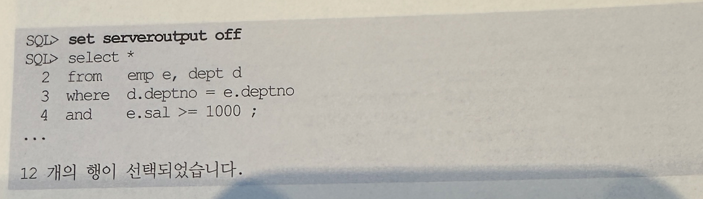

## DBMS_XPLAN 패키지
- 오라클 9.2버전에 소개된 dbms_xplan패키지를 통해 plan_table에 저장된 실행계획을 좀 더 쉽게 출력해 볼 수 있게 되었음
- 오라클은 9i부터 Plan_table에 더 많은 정보들을 담기 시작했고, 이 패키지를 이용하지 않더라도 직접 쿼리해 보면 과거보다 더 많은 유용한 정보를 얻어낼 수 있음
- 오라클 10g부터는 라이브러리 캐시에 캐싱돼있는 SQL커서에 대한 실행계획은 물론 Row Source별 수행통계까지 손 쉽게 출력해 볼 수 있도록 기능이 확장됨
- AWR에 수집된 과거 수행됐던 SQL에 대한 실행계획을 확인하는 것도 가능

### 1. 예상 실행계획 출력
- 앞에서 @?/rdbms/admin/utlxpls 스크립트를 사용해 실행계획을 출력하는 방법을 이미 봤는데, 그 스크립트를 열어보면 내부적으로 dbms_xplan패키지를 호출하고 있는 것을 볼 수 있음
```
select plan_table_output
from table(dbms_xplan.display('plan_table', null, 'serial'))
```
- 첫번째 인자에는 실행계획이 저장된 plan table명을 입력하고, 두 번쨰 인자에는 statement_id를 입력하면 됨
- 두 번째 옵션이 NULL일 때는 가장 마지막 explain plan명령에 사용했던 쿼리의 실행 계획을 보여줌
- 병렬 쿼리에 대한 실행계획을 수집했다면 @?/rdbms/admin/utlxplp 스크립트를 수행함으로써 병렬 항목에 대한 정보까지 볼 수 있음
- 그 외에도 dbms_xplan.display 함수를 직접 쿼리하면 아래와 같이 세 번째 인자를 통해 다양한 포멧 옵션을 선택할 수 있음
- 직접 해보면 어떻게 다른지 쉽게 알 수 있으므로 일일이 설명하지는 않음


  
- basic 옵션을 사용하면 ID, Operation, Name 컬럼만 보이는데, format 인제를 아래처럼 구사하면 Rows, Bytes, Cost 컬럼까지 출력해줌


- Rows, Bytes, Cost 이외에 추가로 사용할 수 있는 옵션으로는 다음과 같은 것들이 있음
  - PARTITION
  - PARALLEL
  - PREDICATE
  - PROJECTION
  - ALIAS
  - REMOTE
  - NOTE
- 위 모든 항목들을 다 출력해 보이려면 일일이 나열할 필요 없이 all 옵션을 사용하면 됨

```
select * from table(dbma_xplan.display('PLAN_TABLE', 'SQL1', 'ALL'));
```

- 그리고 아래처럼 outline 옵션을 사용하면 다음과 같은 실행계획을 수립하는데 필요한 힌트 목록을 보여줌


- 아래는 all과 outline 을 함께 사용한 것과 같음
```
select * from table(dbms_xplan.display('PLAN_TABLE', 'SQL', 'ADVANCED'));
```

### 2. 캐싱된 커서의 실제 실행계획 출력
- 커서가 무엇인지는 4장에서 자세히 다루지만 여기서 간단히 정의해보면, 하드 파싱과정을 거쳐 메모리에 적재된 SQL과 Parse Tree, 실행계획, 그리고 그것을 실행하는데 필요한 정보를 담은 SQL Area를 말함
- 오라클은 라이브러리 캐시에 캐싱돼있는 각 커서에 대한 수행 통계를 볼 수 있도록 v$sql 뷰를 제공
- 이 뷰의 활용방안에 대해서는 뒤쪽에서 다시 설명함
- 이것과 함께 sql_id값으로 조인해서 사용할 수 있도록 제공되는 뷰가 몇가지 더 있음
- 그 중 활용도가 높은 것이 v$sql_plan과 v$sql_plan_statistics_all
- v$sql_plan뷰의 활용 방법부터 살펴본다.



- 위와 같은 쿼리를 수행하고 나면 캐시오딘 커서 정보를 v$sql에서 조회할 수 있고, v$sql_plan을 통해 실제 수행하면서 사용했던 실행계획까지 확인해 볼 수 있음
- v$sql_plan를 조회하려면 마지막 수행한 SQL의 sql_id와 child_number값을 알아야 함
- 아래 쿼리를 이용해 쉽게 찾을 수 있다
- 위에서 쿼리 수행 전에 serveroutput을 off시키는 것을 잊지말자
- 안 그러면 dbms_output.disable 프로시저를 호출하는 커서의 sql_id를 찾게 됨


- v$sql_plan뷰를 일반 plan table처럼 쿼리해서 원하는 방식으로 포맷팅할 수 있지만 dbms_xplan.display_cursor 함수를 이용하면 편함

```
select * from table(dbms_xplan.display_cursor('[sql_id]',[child_no],'[ format] '));
```

- 이 하뭇는 라이브러리 캐시에 현재 캐싱돼있는  SQL 커서의 실제 실행계획과, 실제 계획을 만들면서 예상했던 Rows, Cost, Time 정보를 보여줌
- sql_id와 child_number를 매번 찾는게 귀찮다면(당연히 귀찮음), 첫 번째, 두번쨰 인자에 NULL 값을 넣어주면 됨
- 맨 우측 format 인자에는 앞으로 dbms_xplan.display 함수에 사용했던 옵션들을 그대로 사용할 수 있고 출력 포맷도 같음


- 참고로 dbms_xplan.display_awr 함수를 이용하면 AWR에 수집된 과거 수행했던 SQL 에 대해서도 같은 준석작업을 진행할 수 있음

### 3. 캐싱된 커서의 Row Source별 수행 통계 출력
- SQL문에 gather_plan_statistics 힌트를 사용하거나, 시스템 또는 세션 레벨에서 statistics_level 파라미터를 all로 설정하면, 오라클은 실제 SQL을 수행하는 동안의 실행계획 각 오퍼레이션 단계 별로 수행통계를 수집함
- 참고로, '_rowsource_execution_statistics'파라미터를 true로 설정하거나, SQL 트레이스를 걸어도 Row Source별 수행 통계가 수집됨
- 조회할 때는 v$sql_plan_statistics 또는 v$sql_plan_statistics_all뷰를 이용하면 됨
- 예제를 보면서 어떻게 활용할 수 있는지 확인해본다


- 이제 Row Source별 수행 통계가 수집됨
- v$sql_plan_statistics를 조회하려면 마지막 수행한 SQL의 sql_id와 child number 값을 알아야 하며, 방법은 앞에서 이미 살펴봄
- 아래처럼 쿼리하려면 SQL 트레이스를 통해 볼 수 있는 Row Source Operation과 같은 정보가 출력됨
- SELECT-list가 길고 복잡해 다 보여주지 못하는 것에 대해 미안하게 생각하지만, case 문을 적절히 사용하면 아래처럼 출력되도록 쉽게 구현할 수 있음


- SQL 트레이스를 걸어도 같은 결과를 얻을 수 있으므로 TKProf를 이용하기 전에 먼저 Row Source Operation을 확인하고, Call 통계 정보는 필요할 때만 확인하는 식으로 이용할 수 있음
- v$sql_plan_statistics 뷰에는 모든 통계 항목에 대해 마지막 수행 통계치와 누적 통계치를 조회할 수 있도록 칼럼이 두개씩 제공됨
- 아래와 같은 식
  - output_rowsm last_output_rows
  - cr_buffer_gets, last_cu_buffer_gets
  - disk_reads, last_disk_read,
- 따라서 마지막 수행 통계ㅏ 누적 수행통계를 자유롭게 뽑아볼 수 있고, 위에서 예시한 과정을 스크립트로 만들어 두면 편리하게 사용할 수 있음
- 아래는 필자가 만들어서 쓰고 있는 스크립트 활용 예시로 누적 값을 출력해 보이고 있음
- 왼쪽 Execs는 수행 횟수임


- dbms_xplan_display_cursor함수는 우리를 대신해 위 뷰를 읽어 깔끔하게 포맷팅해주는 기능을 제공함
- 아래처럼 dbms_xplan.display 함수에는 없던 iostats, memstats, allstats 옵션을 사용하면 실제 수행 시 Row Source별 수행 통계를 보여줌
- 여기서도 가장 최근 수행한 SQL을 찾을 때는 첫 번째, 두 번째 인자에 NULL 값을 입력하면 됨


- 아래는 출력된 결과샘플
- 여기서는 E-Rows는 SQL을 수행하기 전 옵티마이저가 각 Row Source별로 예상했던 로우 수로서 v$sql_plan에서 읽어온 값임
- A-Rows는 실제 수행 시 읽었던 로우 수로서, v$sql_plan_statistics에서 읽어온 항목임
- 이처럼 옵티마이저의 예상 로우 수와 수행 시 실제 로우 수를 비교해 보여주므로 옵티마이저의 행동을 관찰할 때 유용하게 사용할 수 있음


- 기본적으로 누적 값(last_ 접두가사 붙지 않은 컬럼)을 보여주며, 아래처럼 format옵션의 last를 추가해주면 마지막에 수행했을 때의 일량(last_ 접두사가 붙은 컬럼)을 보여줌

```
select * from table(dbms_xplan.display_cursor ('7f5y19ywtkwgt',0,'ALLSTATS LAST'))
```