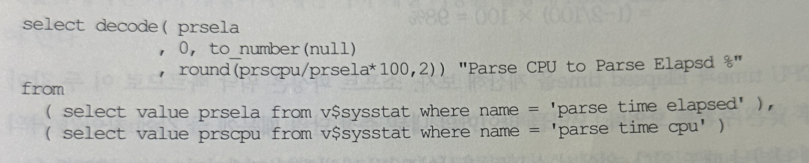

## 5. V$SYSSTAT
- 오라클은 성능 측정 지표로 활용 가능한 항목들을 선정하고, SQL이 수행되는 동안 지속적으로 그 항목들에 대한 누적 통계치를 저장
- 인스턴스 기동 후 현재까지 누적된 수행 통계치를 시스템 레벨로 확인하고자 할 때 사용하는 뷰가 v$sysstat이고, 개별 세션별로 확인할 때 사용하는 뷰가 v$sesstat임
- 현재 접속해 있는 본인 세션에 대한 수행 통계는 v$mystat을 통해 확인할 수 있음
- v$statname을 조회해보면 9i기준 264개 10g 기준 380개, 11g기준 469개 측정항목을 볼 수 있음
- 앞에서 AutoTrace의 Statistics 옵션을 활성화 시켰을 때 별도의 세션을 내부적으로 띄워 sys.v_$sesstat를 조회하는 것을 보여줌
- 그떄 사용했던 통계 항목들을 시스템 레벨로 확인하려면 아래와 같이 v$sysstat을 조회해 보면 됨


- 본서를 모두 읽고 나면 최소한 여기 나열된 항목들에 대해서는 정확한 의미를 파악할 수 있음
- 이 외에도 성능지표로서 꽤 의미있는 항목들이 많지만, 일일이 나열에 가며 설명하지는 않을 것임
- 그것을 이해하는 데 필요한 수없이 많은 배경지식을 지면을 통해 모두 설명할 수 없기 때문
- 정의만 나열하는 식의 설명이라면 오라클 공식 매뉴얼을 통해 쉽게 얻을 수 있음

### 1. 시스템 수행 통계 수집 및 분석
- v$sysstat이나 v$sesstat에 나타나는 값들은 인스턴스 기동 후 또는 세션 수립 후 현재까지 누적된 값이므로 그 값의 크고 작음만 의미 있는 정보를 얻기는 어려움
- 이를 제대로 활용하는 방법은, 두 구간 사이의 변화량을 구해 SQL 수행 도중에 내부적으로 어떤 일들이 발생했는지를 판명하는 것
- 작업을 수행한 세션과 별도로 세션을 하나 더 열어 아래 create문을 수행함
- 작업을 수행할 세션의 SID를 미리 알아놔야 하며, AutoTrace에서 설명했 듯 별도의 세션을 이용하는 것은 v$sesstat를 조회해 insert할 때의 통계치가 섞이는 것을 방지하기 위함임


- 이제 본래의 세션에서 SQL문이나 일련의 배치 JOB을 수행함
- 작업이 완료되면 별도 세션에서 아래 insert문을 수행하고 커밋함


- 이제 수집된 수행통계를 쿼리해 두 구간 사이의 증분을 구해보면 작업 수행 도중 오라클 내부적으로 어떤 일들이 일어났는지 알 수 있음


- 시스템 레벨로도 v$sysstat 정보를 주기적으로 수집해 저장해 두면 위와 같은 구간 분석을 통해 시스템 전바의 시간대별 Load Profilling이 가능함
- 그림 3-2는 session logical reads항목을 이용해 RAC 3개 노드 각각에서 발생하는 하루 동안의 Logical Reads발생량을 그래프로 비교해 보인것


- v$sysstat을 읽어 지정된 테이블에 insert하는 간단한 프로시저를 하나 작성하고, 이를 주기적으로 수행하도록 dbms_scheduler를 이용해 job으로 등록하면 됨
- v$sysstat을 읽는데 단 1초도 걸리지 않으므로 시스템에 주는 부하도 거의 없음

### 2. Ratio 기반 성능 분석
- 위에서 수집된 수행통계 자료를 이용해 DB의 전반적인 건강상태를 체그할 수 있는 의미 있는 Ratio값들을 구할 수 있음
- 자주 분석되는 항목들은 아래와 같고 주로 공유리소스 사용 빈도와 경합발생비율을 점검함
  - Buffer Nowait %
  - Redo NoWait %
  - Buffer Hit %
  - Latch Hit %
  - In-memory Sort %
  - Library Hit %
  - Soft Parse %
  - Execute to Parse %
  - Parse CPU to Parse Elapsd %
  - % Non-Parse CPU
  - Memory Usage %
  - % SQL with executions> 1
  - % Memory for SQL w/exec>1
- 지금부터 이들 분석항목들에 대해 설명하는데, 각 Ratio를 구할 때 사용된 공식을 함께 기술하였으므로 더 쉽게 이해할 수 있음
- 본서를 처음 읽는 독자라면 이하 내용을 이해하기가 결코 쉽지만은 않을 것임
- 그렇다면 대략적인 의미만 파악하고 넘어가도 좋음
- 그 대신 본서 1권과 2권에서 설명함는 SQL 튜닝 원리, 그리고 간간이 다루어지는 아키텍쳐를 충분히 이해한 상태에서 다시 한번 내용을 읽어보기를 바람
- 그때는 별 어려움 없이 잘 이해될 것임

#### Buffer Nowait %
- 버퍼 블록을 읽으려 할 때 buffer busy waits 대기 없이 곧바로 읽기에 성공한 비율임
```
select round(100*(1-bfwt/gets),2) "Buffer Nowait %"
from
    ( select sum(count) bfwt from v$waitstat) ,
    ( select value gets from v$sysstat where name = 'session logical reads')
```
#### Redo NoWait %
- Redo 로그를 기록할 공간을 요청하지 않고 곧바로 Redo 엔터리를 기록한 비율을 말함
- 이 비율이 낮다면, 로그 스위칭이 느리거나 너무 자주 발생함을 의미함
- 로그 스위칭 횟수가 문제라면 Redo 로그 파일 크기를 증가시킬 필요가 있음
- 로그 스위칭이 자주 발생하지 않는데도 이 항목이 낮은 수치를 보인다면 I/O 서브 시스템이 느린것이 원인일 것
- Redo 로그 파일을 덜 바쁜 디스크 또는 Redo 로그만을 위한 전용 디스크로 옮기는 것을 고려 해야함
- 비용이 허락된다면 더 빠른 디바이스로 교체하는 것도 방법임

```
select round(100*(1-rlsr/rent),2) "Redo NoWait %"
from
    ( select value rlsr from v$sysstat where name = 'redo log space requests') ,
    ( select value rent from v$sysstat where name = 'redo entries' )
```

#### LGWR write
- 1장 오라클 아키텍쳐에서 설명했덧 LGWR 프로세스가 Redo 로그 버퍼를 Redo 로그에 기록하는 시점은 다음과 같음
  1. 3초마다 DBWR 프로세스로부터 신호를 받을 때
  2. 로그 버퍼의 1/3이 차거나 기록된 Redo 레코드량이 1MB를 넘을 때
  3. 사용자가 커밋 또는 롤백 명령을 날릴 때
- 1과 2는 LGWR에 의해 비동기 방식으로 진행되기 때문에 트랜잭션이 Redo 레코드를 기록하면서 작업을 계속 진행하는 데 영향을 미치지 않음
- 즉 LGWR가 Redo 로그 버퍼를 로그에 기록하는 동안에도 서버 프로세스는 새로운 Redo 엔트리를 로그 버퍼에 기록할 수 있음
- 로그 버퍼가 로그 블록 단위(버퍼 캐시 블록 Size와는 다르며 OS의 최소 I/O 단위에 의해 결정됨)
- 의 순환 방식으로 관리되기 대문에 가능한 일임
- 단 이때도 LGWR 작업 속도보다 Redo 생성이 더 빨리 진행되면 Redo 엔트리를 기록할 공간이 부족하게 되므로 Log buffer space 이벤트에서 대기하는 현상이 발생할 수 있음
- 반면 3은 Redo 레코드가 Redo 로그에 기록되었음이 보장되어야만 트랜잭션을 마칠 수 있기 때문에 동기(sync)방식으로 진행됨(1장에서 설명한 Log Force at Commit 참조). 따라서 LGWR가 작업을 완료할 때 까지 기다려야 하고, 이때 발생하는 것이 log file sync 대기 이벤트임
- 커밋을 했는데 어떤 이유에서건 LGWR가 작업을 빨리 마치지 못하면 1초 간격으로 log file sync 이벤트를 발생시키면서 계속 대기하게 됨

### Redo log space requests
- 말 그대로 Redo 로그 공간(Redo 로그 버퍼가 아니라 Redo 로그 파일 공간)
- 에 대한 요청이 발생하는 것을 말함
- 이는 로그 스위치가 일어날 때 생기는 현상
- 로그 스위치가 일어나면 짧은 순간이지만 서버 프로세스는 LGWR프로세스가 현재 (CURRENT) Redo 로그에 쓰기를 완료하고 새로운 Redo 로그를 오픈할 때까지 Redo를 생성하지 못하고 계속 기다려야 하기 때문
- 참고로, 로그 스위치가 끝나면 그때까지 대기했던 서버 프로세스들이 동시에 Redo 레코드를 기록하므로 로그 버퍼가 금방 부족해져 log buffer space 대기 이벤트가 발생할 가능성이 높음

#### Buffer Hit %
- 디스크 읽기를 수반하지 않고 버퍼 캐시에서 블록 찾기에 성공한 비율
- I/O를 최소화하고 버퍼 캐시 히트율을 높이는 원리에 대해서는 6장에서 다룸


#### Latch Hit %
- 래치 경합 없이 첫 번쨰 시도에서 곧바로 래치를 획득한 비율을 말함
- 래치에 대해서는 1장에서 대기 이벤트와 함께 자세히 설명했음

```
select round(100*(1-sum(misses)/ sum(gets)),2) "Latch Hit %"
from v$latch
```

#### Library Hit %
- 이 항목부터 '% Non-Parse CPU' 까지는 파싱 부하와 관련 있는 측정 항목들임
- 라이브러리 캐시 히트율은 Get 히트율과 Pin 히트율로 나눌 수 있는데, 여기서는 그 중 Pin 히트율을 표시하고 있음
- Pin히트율은 실행단계와 관련 있음
- 라이브러리 캐시에 이미 적재된 SQL 커서를 실행하거나 오브젝트 정보를 읽으려할 때 해당 커서 또는 오브젝트 정보가 힙 영역에서 찾아진다면 히트에 성공한 것
- 만약 캐시에서 밀려나 찾을 수 없는 경우가 빈번하게 발생한다면 히트율이 낮게 나타나고, 그만큼 다시 로드해야 하는 부하가 생기므로 라이브러리 캐시 효율이 좋지 않음을 뜻함

```
select round(100 * sum(pinhits)/sum(pins), 2) "Library Cache Pin Hit %"
from v$librarycache
```
- 참고로 Get 히트율은 Parse 단계와 관련 있음.
- 이 수치가 낮다면 해당 SQL 커서 또는 오브젝트에 대한 핸들을 찾을 수 없어 하드 파싱 또는 최초 로드가 자주 발생하는 경우임


```
select round(100 * sum(gethits)/sum(gets), 2) "Library Cache Get Hit %"
from v$librarycache
```

- 라이브러리 캐시 구조에 대한 사전 지식이 없다면 이해하기 어려운 내용이지만 4장 라이브러리 캐시 최적화 원리를 공부한 후에 다시 본다면 어렵지 않다고 느낄 것

#### Soft Parse %
- 실행계획이 라이브러리 캐시에서 찾아져 하드파싱을 일으키지 않고 SQL을 수행한 비율을 말함
- 공식은 아래와 같음
```
(전체 Parse Call 횟수 - 하드파싱 횟수) / (전체 Parse Call 횟수) * 100
```
- 이 비율이 낮다면 바인드 변수를 사용하도록 애플리케이션을 개선해야 함


#### Execute to Parse %
- Parse Call 없이 곧바로 SQL을 수행한 비율, 즉 커서를 애플리케이션에서 캐싱한 채 반복 수행한 비율을 말함
- 애플리케이션 커서 캐싱 기법은 라이브러리 캐시 최적화 원리를 설명하는 4장에서 다룸
- 그리고 n-Tier 아키텍쳐에서 일반적으로 이 값이 낮게 나타나는 이유, n-Tier 임에도 불구하고 높은 수치를 보일 수 있는 이유 등에 대해서도 4장에서 다룸


#### Parse CPU to Parse Elapsd %
- 파싱 총 소요 시간 중 CPU time이 차지한 비율임
- 파싱에서 소요된 시간 중 실제 일을 수행한 시간 비율을 말함
- 이 값이 낮다면 파싱 도중 대기가 많이 발생했음을 의미함



- 이 수치가 낮다면 Shared Pool과 라이브러리 캐시에 경합이 많다는 것을 뜻함
- 대개 하드 파싱 부하 때문
- Load Profile에서 초당 하드 파싱 횟수를 점검해보라 이 값이 5개 정도만 되더라도 그 영향력은 매우 크게 나타남
- 시스템 오픈을 앞두고 하드 파싱이 원인이라는 진단 리포트를 받게 되면 개발팀 입장에서는 매우 곤혹스러움
- 뒤늦게 바인드 변수를 사용하도록 프로그램을 개선하려면 상당히 많은 공수가 필요하기 때문이다
- 따라서 개발팀은 하드 파싱 부하를 대개 인정하려고 하지 않음
- 하드 파싱 부하에 대한 또 다른 성능 지표인 Soft Parse %가 98%가 넘는다며 진단이 잘못되었다고 항변함
- 실제로 Parse CPU to Parse Elapsd %가 50% 안팎의 낮은 수치를 보이더라도 Library Hit %나 Soft Parse % 모두 99%에 가까운 수치를 보이는 경우가 대부분임
- 그런 결과가 나오는 이유가 무엇인지 예를 통해 설명해본다.


- 위 표에서 SQL1이 99번 수행되었고, SQL2가 1번 수행되었음
- 애플리케이션 커서 캐싱 기법을 사용하지 않는다면 SQL1과 SQL2 각각에 대한 Parse Call이 각각 99번과 1번
- 하드파싱은 SQL1에서 한번, SQL2에서 한번 발생했을 것
- 그러면 전체 Soft Parse %은 다음과 같이 구해지고, Livrary Hit % 도 같은 값으로 계산됨

```
Soft Parse % = (1-hard_parse/parse_calls) * 100 = (1-2/100) * 100 = 98%
```

- CPU time과 Elapsed time을 계산해보자. 소프트 파싱은 워낙 빠르므로 이 두값이 매우 낮은 수치를 보임
- 오라클 타이머의 내부 측정 단위 때문에 둘 간에 차이가 거의 없게 나타날 때도 있음
- 위에서 소프트 파싱이 98번 발생했고 그때마다 parse CPU time과 parse Elapsed time이 각각 0.00001초와 0.00002초였다고 하자.
- 그리고 하드 파싱 할 때는 두 번 모두 parse CPU time과 parse Elapsed time이 각각 0.05초와 0.1초가 소요되었다고 하자
- 그러면 총 CPU time과 Elapsed time 은 아래와 같이 구해짐

```
Total parse CPU time = 0.05 * 2 + 0.00001 * 98 = 0.10098
Total parse Elapsed time = 0.1 * 2 + 0.00002 * 98 = 0.20196
```
- 이제 위 공식에 따라 CPU to Parse Elapsd %를 구해본다
```
CPU to Parse Elapsd %  = 0.10098/0.20196 * 100 = 50%
```
- CPU to Parse Elapsd %가 50% 낮은 상태에서 Soft Parse%가 98%로 높게 나타날 수 있는 이유를 이해했을 것
- 정리하면 소프트 파싱은 하드 파싱에 비해 매우 빠르므로 CPU to Parse Elapsd % 값에 미치는 영향력이 작음
- 반면 하드 파싱은 발생 횟수가 적더라도 매우 느리므로 영향력이 큼
- 수치가 커서 크게 영향을 미칠 뿐 아니라 Shared Pool과 라이브러리 캐시 관련 대기 이벤트가 소프트 파싱에 비해 더 많이 발생하므로 CPU time과 Elapsed time간 격차를 더 키움
- 두 시스템 간 소프트 파싱 비율이 갇더라도 라이브러리 캐시 부하가 더 심한 시스템은, 하드 파싱할 때 경합이 발생할 가능성이 크므로 CPU to Parse Elapsd % 값이 더 낮게 나타날 수 있음
- 초당 하드 파싱 횟수(Hard Parses)가 거의 나타나지 않는데도 이 Ratio가 낮은 수치를 기록한다면 Parse Call 자체가 많아 발생하는 경합이라고 이해하면 됨
- 4장에서 설명하는 애플리케이션 커서 캐싱이나 세션 커서 캐싱 기능을 활용해 Parse Call 부하를 줄여 주어야 함

#### % Non-Parse CPU
- SQL을 수행하면서 사용한 전체 CPU time 중 파싱 이외의 작업이 차지한 비율
- 이 비율이 낮다면 파싱 과정에서 소비되는 CPU time 비율이 높은 것이므로 파싱 부하를 줄이도록 애플리케이션을 개선해야 함
- 구체적인 개선 방법에 대해서는 4장에서 설명함


#### In-memory Sort %
- 전체 소트 수행 횟수에서 In-Memory 소트 방식으로 수행한 비율을 말함
- 오라클 내부적인 소트 수행 원리는 6장에서 간단히 다루고, 구체적인 소트 튜닝 기법에 대해서는 2권에서 다룸


#### Memory Usage %
- Shared Pool 내에서 현재 사용중인 메모리 비중을 말함


#### % SQL with executions>1
- 전체 SQL 개수에서 두 번 이상 수행된 SQL이 차지하는 비중을 말함
- 이 값이 낮게 나타난다면 조건절에 바인드 변수를 사용하지 않고 Literal 상수 값을 이용하는 쿼리의 수행 빈도가 높은 것을 의미

#### % Memory for SQL w/exec>1
- 전체 SQL이 차지하는 메모리 중 두 번 이상 수행된 SQL이 차지하는 메모리 비중
- 이 값이 낮게 나타난다면 조건절에 바인드 변수를 사용하지 않고 Literal 상수 값을 사용하는 쿼리에 의해 Shared Pool이 낭비되고 있음을 의미함

<br/><br/>

- 지금까지 살펴본 Ratio 기반 성능진단 항목들은 DB 전반의 건강상태를 체크하기 위해 오랫동안 사용돼 온 것들이고 아직까지 매우 유용한 지표로서 활용되고 있음
- 다만, 이 값들은 문제가 발견되었으 ㄹ때 그 원인을 분석하는 데에 취약하다는 단점이 있음
- 시스템 레벨에서 평균적 의미의 측정이 주로 이루어지므로 개별 세션이나 트랜잭션 레벨에서 느껴지는 속도감과 동떨어진 결과를 낼 수 있다는 것도 흠임
- 세션 레벨로도 측정할 수는 있지만 원인 분석에 큰 도움을 못 주므로 그렇게 하는 경우는 없음

