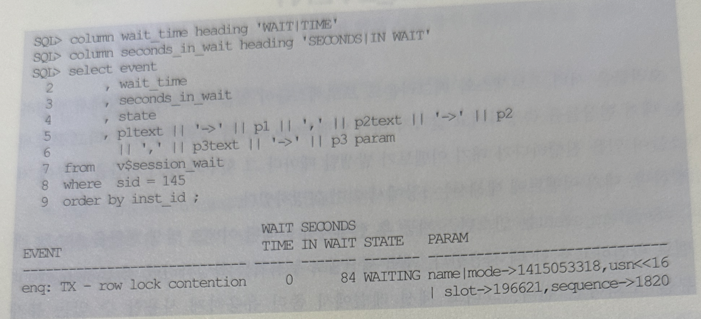

## 6. v$system_event
- 오라클은 서버 프로세스와 백그라운드 프로세스들이 일을 처리하는 과정에서 발생하는 대기 현상들을 측정하려고 갖가지 대기 이벤트를 정의
- 그리고 프로세스들이 일을 진행하다가 대기 이벤트가 발생할 때마다 그 횟수와 대기 시간을 내부에 저장함
- 대기 이벤트에 대해서는 1장에서 이미 설명함
- v$system_event는 인스턴스 기동 후 현재까지 누적된 이벤트 발생 현황을 시스템 레벨로 확인하고자 할때 사용함
- 개별 세션별로 누적치를 확인하려면 v$session_event 뷰를 조회하면 됨
- 그리고 세션 레벨에서 좀 더 유용하게 사용하게 할 수 있는 뷰가 v$session_wait 인데, 이는 세션별로 현재 진행중이거나 바로 직전에 발생했던 이벤트 정보만을 보여줌
- 대기 이벤트는 v$system_event, v$session_event, v$session_wait 등 뷰를 통해 확인할 수 있을 뿐 아니라, 각 세션별로 이벤트 발생 상황을 로깅하는 기능도 제공함
- 앞에서 설명한 10046 이벤트 트레이스에서 레벨을 8또는 12로 설정하면 SQL수행 도중 대기 이벤트가 발생할 때마다 트레이스 파일에 기록을 남긴다고 했는데, 그것을 말하는 것임
- 10046 이벤트 트레이스 레벨을 8로 설정하고 소요시간이 오래 걸리는 쿼리를 수행해본다
- 쿼리가 다 끝나 TKProf를 돌려 보기 전에라도 유닉스쉘 프롬포트 상에서 tail 명령을 통해 트레이스 파일 뒤쪽에 어떤 이벤트 정보들이 쌓이는지 확인해 볼 수 있음
- 그리고 그 정보를 통해 쿼리 성능이 느린 1차적인 원인(디스크 I/O, Lock, 래치 경합, RAC 병목, 네트워크 트래픽 등)을 판단할 수 있음
```
$ tail -20f /usr/local/oracle/admin/ORA10g/udump/ora10g_ora_19678.trc
```
- 이벤트 트레이스를 걸지 않았더라도 v$session_wait을 조회해보면 아래처럼 해당 세션에서 현재 어떤 이벤트가 발생하고 있는지 곧바로 확인해볼 수 있음



- 쿼리 결과는 WAIT_TIME 값에 따라 해석이 달라짐
  - WAIT_TIME > 0 : 마지막 대기 이벤트를 대기한 시간
  - WAIT_TIME = 0 : 이 이벤트를 현재 대기 중
  - WAIT_TIME = -1 : 마지막 대기 이벤트를 대기한 시간이 10ms 미만
  - WAIT_TIME = -2 : 타이밍이 활성화되지 않음
- 위 사례는 WAIT_TIME = 0이므로 현재 대기가 진행중이고, 로우 Lock 때문에 트랜잭션이 84초간 블로킹 돼 있었음을 알 수 있음
- 앞 절에서 v$sysstat를 주기적으로 수집해 저장해 둠으로써 시스템레벨로 시간대 별로 Load Profiling하는 사례를 보여주었는데, v$system_event까지 저장하도록 프로시저에 추가해 두면 대기 이벤트 발생 현황도 함께 분석할 수 있음
- v$system_event도 읽는데 1초가 걸리지 않으므로 초단위로 너무 자주 수집하지만 않는다면 시스템에 주는 부하도 미미하다고 볼 수 있음
- 그림 3-3은 v$system_event를 5분 주기로 수집해 하루 동안의 이벤트 발생 현황을 그래프로 그린 것
- 오후 1시20분부터 50분 가량 Application 관련 대기 이벤트가 지속적으로 발생했는데, Application 관련 대기 이벤트가 발생하는 것은 대부분 Lock이 원인임
- 새벽 1시부터 과도하게 발생한 User_IO 대기 이벤트는 오브젝트 통계 정보를 수집하는 Job이 수행되었기 때문
- v$sysstat을 통해 수집된 자료에서 그림3-3분석 내용과 관련 있는 항목을 같이 그래프로 그려 대비해 보이면 더 의미있는 분석이 가능함

