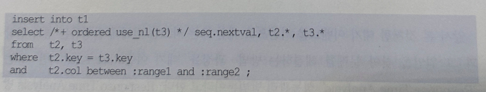
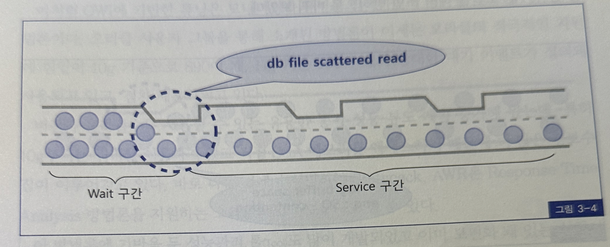
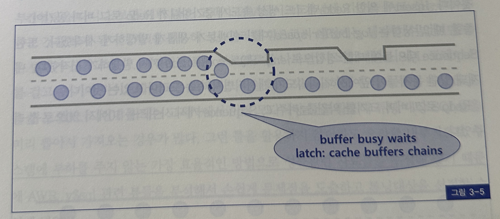
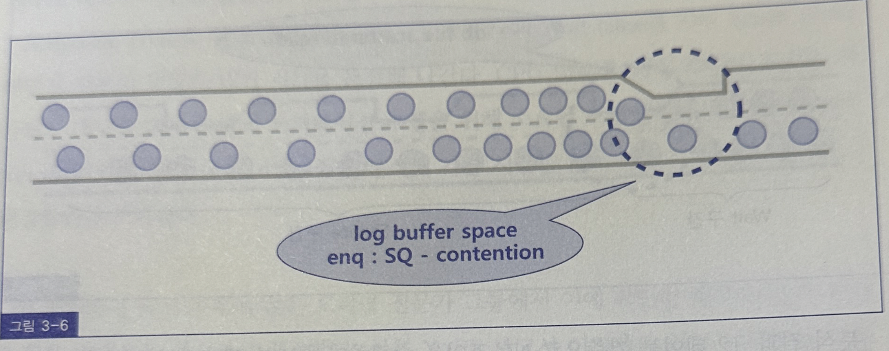
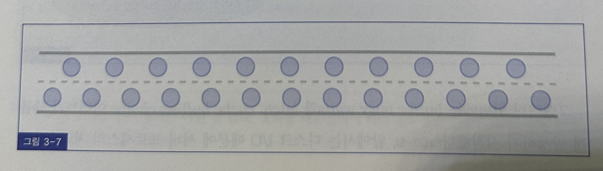

## Reponse Time Analysis 방법론과 OWI
- 앞서 본 것 처럼 대기 이벤를 기반으로 세션 또는 시스템 전체에 발생하는 병목 현상과 그 원인을 찾아 문제를 해결하는 방법, 과정을 '대기 이벤트 기반' 또는 'Response Time Analysis' 성능관리 방법론이라고 함
- Response Time Anlysis 방법론은 1999년 6월에 'Yet Another Performance Profiling Method' 라는 제목의 오라클 기술 백서가 발표되면서 주목 받기 시작했음

```
Reponse Time = Service Time + Wait Time
             = CPU Time + Queue Time
```
- 이 보고서는 오라클 서버의 응답시간을 서비스 시간과 대기 시간의 합으로 정의하고 있음
- 서비스 시간은 프로세스가 정상적으로 동작하며 일을 수행한 시간을 말함
- CPU time과 같은 의미
- 대기 시간은 대기 이벤트가 발생해 수행을 잠시 멈추고 대기한 시간을 말함
- 다른 말로 'Queue time' 이라고 함
- Response Time을 위와 같이 정의하고 CPU time은 파싱 작업에 소요된 시간인지 아니면 쿼리 본연의 오퍼레이션 수행을 위해 소요된 시간인지를 분석함
- Wait time은 각각 발생한 대기 이벤트들을 분석해 가장 시간을 많이 빼앗긴 이벤트 중심으로 해결 방안을 모색한다.
- 이 방법론이 제시된 후에 많은 오라클 전문가 그룹에서 이에 착안한 새로운 분석 기법과 활용 방법들을 제시하기 시작했음
- 물론 YAPP 보고서 이전에도 대기 이벤트를 이용한 분석이 행해졌지만 이벤트 종류가 더 다양화, 세분화 되면서 새로운 활용 방법들을 모색하게 된 것
- OWI는 Response Time Analysis 방법론을 지원하려고 오라클이 제공하는 기능과 인터페이스를 통칭하는 말로서, 'Oracle Wait Interface'의 준말임
- Response Time Analysis 방법론에 기반한 튜닝은 병목 해소과정이라고 요약할 수 있음
- 예를 들어보면 아래 쿼리를 수행하는 20개 프로세스가 동시에 떠서 작업을 수행중이라고 가정한다
- 하루 저녁에 1억건을 처리해야 하는 배치 프로그램이어서 속도를 향상시키려고 서로 읽는 범위를 달리하여 프로그램 Parallel방식으로 수행되도록 한 것



- 20개를 동시에 수행 시켰는데도 생각처럼 속도가 나질 않아 이벤트 분석을 해 보니 DB file scattered read 대기 이벤트가 Wait time의 대부분을 차지하고 있었음
- 이 이벤트의 발생 원인은 Full Table Scan임
- 그림 3-4는 2차선 일반통행로에서 병목 대문에 차들이 한 대씩만 진행하고 있는 모습을 표현한 것



- 분석 결과 t2 테이블 기준으로 NL조인을 수행하면서 반복 액세스가 일어나는 t3 테이블 조인 컬럼에 인덱스가 없어 매번 Full Table Scan으로 처리되고 있음
- 인덱스를 추가해 정상적인 Index Scan으로 처리되도록 튜닝을 실시함



- 그랬더니 이번에는 Buffer busy waits과 latch: cache buffers chains이벤트가 새롭게 발생하기 시작함
- 앞에서는 디스크 I/O때문에 서버 프로세스의 처리속도가 매우 느렸었는데, 이제 많은 처리를 버퍼 캐시 내에서 할 수 있게 됨으로 인해 서버 프로세스의 처리 속도가 크게 향상되었고 그 때문에 버퍼 블록에 대한 동시 액세스가 증가하면서 경합이 발생하기 시작한 것
- 캐싱된 버퍼 블록에 대한 읽기 요청이 많아 생기는 문제이므로 블록 요청 횟수를 줄여야 함
- NL 조인을 해시 조인 방식으로 바꿔봄



- 이제 버퍼 캐시에서 발생하던 경합이 해소됨으로 인해 또 다른 문제가 발생함
- select 경합이 해소되니 이번에는 insert 처리 부분에서 경합이 발생하기 시작함
- insert에 의한 Redo 레코드 생성 속도가 증가하므로 Redo 로그 버퍼 공간이 부족할 때 발생하는 log buffer space 대기 이벤트가 새롭게 발생하기 시작함
- 또한 Sequence 테이블에 대한 경합으로 enq : SQ - contention까지 발생하기 시작함
- 내재돼 있던 문제들이 앞에서 처리속도가 개선되면서 속속 드러나고 있는 것
- Redo 로그 버퍼 크기를 약간 늘려주고 Sequence 캐시 사이즈를 10에서 20으로 늘려줌



- 이제 그림 3-7에서 보듯 병목 구간이 모두 제거돼 차량 소통이 원할한 2차선 도로가 됨
- OWI 기반 튜닝 방법론의 효과성을 여실피 보여주는 사례라고 함
- 가공된 것이라고 생각할지 모르지만 실제로 튜닝했던 두 개의 사례를 합쳤을 뿐
- 이처럼 OWI에 기반한 튜닝은 모니터링 튜닝을 반복하면 병목을 해소해 나가는 방법론임
- 오라클 사요앚 그룹을 통해 소개된 방법론이 이제는 오라클의 적극적인 자원에 힘입어 10g 기준으로 890여개 11g기준 960 여개의 방대한 대기 이벤트가 정의돼 사용되고 있고 점차 세분화 되고 있음
- 버전이 올라갈수록 사용할 수 있는 유용한 동적 성능 뷰도 계속 증가해 왔는데 특히 10g부터는 쿼리를 이용하지 앟고 직접 SGA 메모리를 액세스하기 때문에 더 많은 정보수집이 이루어 지고 있음
- 바로 다음 절에서 설명하는 Statepack, AWR은 Response Time Analysis 방법론을 지원하는 오라클의 표준 도구라고 할 수 있음
- 이 방법론에 기반을 둔 성능관리 툴도 많이 개발되었고, 이미 보편화 돼 있는 실정
- 이들 툴은 대기 이벤트 발생현황을 지속적으로 수집하면서 실시간으로 병목 발생 상황을 체크해주고, 과거 시점에 대한 리포팅 기능도 제공함
- 또한 인터넷을 통해 무수히 많은 OWI 관련 자료들이 쏟아져 나오고 있고, 관련 서적들도 잇따라 출간됨
- 많은 고객사 DBA들이 이 개념에 기반을 두고 성능관리를 하는 것을 보게 됨
- OWI를 이용해 성능관리를 함으로 예전에는 생각할 수 없었던 많은 변화가 생기고 있음
- 예전에는 튜닝 프로젝트를 나가면 시스템 레벨로 SQL 트레이스를 걸고 수 기가 바이트에 이르는 트레이스 파일을 머지하고 분석해 튜닝 대상 SQL을 뽑곤 했음
- 그런데 이제는 고객사에서 이런 모니터링 툴을 활용해 튜닝 대상 SQL들을 미리 뽑아서 가져오는 경우가 많음
- 그런데 이제는 고객사에서 이런 모니터링 툴을 활용해 튜닝 대상 SQL들을 미리 뽑아서 가져오는 경우가 많음
- 그런 툴을 활용하지 않더라도 오라클 내부적으로 시스템에 부하를 주지 않는 가장 효율적인 방법으로 성능관련 자료들을 수집해 놓기 떄문에 AWR v$sql 관련 뷰들을 분석해서 손쉽게 문제점을 도출하고 튜닝 대상을 선장할 수 있게 됨
- 그리고 OWI 분석을 통해 DBMS 내부 Internal 아키텍쳐와 원리들을 더 깊이 있게 파악할 수 있게 된 것도 큰 변화중 하나임
- 예를 들어 예전에는 Enqueue Lock이 발생하면 애플리케이션에서 발생시키는 사용자 Lock이 원인이라고 주로 생각했었음
- 하지만 이제는 대기 이벤트명과 파라미터를 통해 사용자 Lock이 원인인지, Unique Key 중복 또는 인덱스 분할에 의한 것인지 ITL 부족인지 그것도 아니면 Sequence경합에 의한 것인지 원인을 분명하게 식별해 낼 수 있게 됨
- 문제를 빨리 찾기 위해서 해결 속도도 빨라짐
- 이제는 OWI DB성능관련 커뮤니케이션 프로토콜로서 확실히 자리매김힘
- 본서가 OWI를 주제로 한 책이 아님에도 불구하고 OWI 개념을 이만큼 상세하게 설명할 수 밖에 없는 이유도 그 때문임