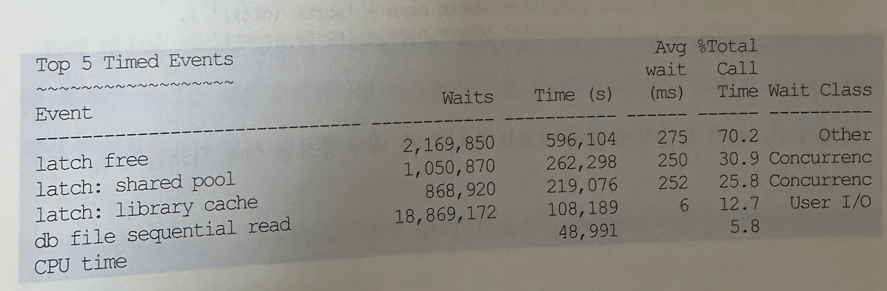

## 8. Statespack / AWR
- 앞에서 v$sysstat과 v$sustem_event를 주기적으로 수집해 성능관리에 활용하는 사례를 보여주었는데, 8i부터 사용하던 StatsPack과 10g이후 사용하게 된 AWR(Automatic Workload Repository) 도 같은 원리를 적용해 표준화 된 방식으로 성능관리를 지원하려고 오라클이 제공하는 패키지임
- 이들 패키지는 앞에서 설명한 Ratio 기반 성능진단과 Wait event 기반 성능진단 방법론 둘 다 가지고 있음
- 아래 나열한 동적 성능 뷰를 주기적으로 특정 Repository에 저장하고, 이를 분석해 오라클 데이터베이스의 전반의 건강 상태를 체크하고 병목 원인과 튜닝 대상을 식별해내는데 사용됨
  - v$segstat
  - v$undostat
  - v$latch
  - v$latch_children
  - v$sgastat
  - v$pgastat
  - v$sysstat
  - v$system_event
  - v$waitstat
  - v$sql
  - v$sql_plan
  - v$sqlstats(10g이후)
  - v$active_session_history(10g이후)
  - v$osstat(10g이후)
  - 기타 등등
- Statspack 과 AWR은 거의 같은 내용을 담고 있으며, 다른 점이 있다면 정보를 수집하는 방식에 있음
- Statspack은 SQL을 이용한 딕셔너리 조회 방식인데 반해 AWR은 DMA(Direct Memory Access)방식으로 SGA를 직접 액세스하기 떄문에 좀 더 빠르게 정보를 수집할 수 있음
- 부하가 적기 때문에 AWR은 Statspack보다 더 많은 정보를 수집하고 제공할 수 있게 됨
- 오라클 9i에서는 Statspack의 정보를 수집하는데 따른 부하 때문에 스냅샷을 자주 수행하기 어려웠음
- 그래서 사용자가 수동으로 statspack.snap 명령을 날리거나 정해진 기간 동안만 JOB에 등록해 DB 성능 정보를 수집했었음
- 하지만 10g AWR 부터는 Automatic이 의미하는 것처럼 자동으로 성능 자료를 수집해 일정기간 보관함
- 오라클이 10g를 출시할 즈음 대규모 컨퍼런스를 개최했는데, 그 자리에서 AWR을 소개하면서 DB속에 내장된 DataWarehouse라고 표현했던 기억이남
- 실제 AWR에 수직된 자료를 활용하다 보면 틀린말이 아니라는 생각이 듬
- 기본 설정을 변경하지 않았을 떄 스냅샷 주기는 1시간이고 일주일 간 보관됨
- 특별한 진단을 요할 때는 더 짧은 주기로 수집하고 더 오래 보관하도록 설정을 변경할 수 있음
- 물론 이 기능을 사용하고 싶지 않다면 멈추게 할 수 있지만 그대로 두고 잘 활용하는 편이 나음

### 1. Statspack / AWR 기본 사용법
- Statspack에서는 PERFSTAT 계정 밑에 'stats$'로 시작하는 뷰를 통해 수집된 성능 정보들을 조회함
- AWR에서는 SYS계정 밑에 'dba_hist_'로 시작하는 뷰를 이용한다.
- 이들 뷰를 이용해 다양한 성능 분석 자료를 보고서 형태로 뽑아볼 수 있음
- 직접 작성한 쿼리를 이용할 수 있지만, 아래 스크립트를 이용하면 표준화된 보고서를 출력해줌
```
SQL> @?/rdbms/admin/awrrpt
```
- 참고로 Statspack을 이용한다면 아래와 같이 하면 됨
```
SQL> @?/rdbms/admin/spreport
```
- 성능진단 보고서를 출력할 때는 측정 구간(interval), 즉 시작 스냅샷 id와 종료 스냅샷 ID를 어떻게 입력하느냐가 가장 중요함
- 만약 매일매일 시스템의 Load Profile이 어떻게 변하는지 비교할 목적이라면 9~18시까지 하루 업무 시간을 기준으로 뽑아도 상관없음
- 어느 요일에 SQL 수행과 트랜잭션이 가장 많은지, 어느 요일에 I/O가 많이 발생하는지 등을 비교해 자신이 관리하는 시스템의 사용 패턴을 파악하는 것도 의미 있는 정보가 될 수 있음
- 하지만 문제점을 찾아 성능 이슈를 해결할 목적이라면 peak 시간대 또는 장애가 발생한 시점을 전후해 가능한 짧은 구간을 선택해야됨
- 그러지 않으면 실상 peak 시간대에 시스템 정상 가동이 어려운 상황이었는데도 보고서상으로 전혀 문제가 없다는 진단이 내려질 수 있음
- 따라서 사용자 인터뷰를 통해 성능 저하 현상을 경험했던 시간대를 파악하거나 sar, topas, vmstat, osstat등 os모니터링 도구를 이용해 CPU, 메모리, I/O 사용량 정보를 수집하고 이를 통해 peak 시간대를 파악해야 됨
- 중대형급 이상 시스템 관리자라면 대개 그런 정보들을 매일 수집해 보관하고 있기 때문에 업무 협조 요청을 통해 쉽게 관련 자료들을 받아볼 수 있음
- 그림 3-8은 sar 명령어를 통해 하루 동안 수집한 CPU 사용량을 그래프로 그려본 것


- 9~10시, 17시가 peak 시간대 이므로 이 구간의 AWR 리포트를 출력한다면 의미있는 분석이 가능함
- 앞에서 v$sysstat과 v$system_event 활용사례에서 보았듯 AWR 뷰(dba_hist_)를 직접 쿼리해 하루 동안의 각 통계 항목별 성능추이와 이벤트 발생 현황을 표와 그래프로 그려볼수 있음
- 아래는 정해진 기간 동안 각 구간별로 SQL 수행 횟수를 뽑아보는 쿼리 예시임


### 2. statspack/ awr 리포트 분석
- AWR 뷰를 잘 활용하면 상용 모니터링 툴 도움 없이도, DBA, 개발자 누구나 다양한 성능 진단 보고서를 만들어 낼 수 있음
- 문제는 그렇게 만들어진 보고서를 가지고 병목 원인을 파악하고 해결 방안을 마련할 수 있어야 하는데, 보고서 내용을 해석하는 것부터 쉽지 않음
- 하지만 어렵다고 성급하게 포기하지 말기 바람
- 관심을 갖고 조금만 파고들면 의외로 쉽다는 것을 느낄 것임
- 10g AWR을 기준으로 80여 페이지에 달하는 방대한 분량의 보고서가 출력돼 나오지만, 그 모든 내용을 완벽하게 해석해야 한다는 부담감을 가질 필요는 없음
- 그 중 일부 중요한 항목만 정확히 해석할 줄 안다면 시스템 성능을 진단하고 AWR을 효과적으로 활용하는데 큰 지장이 없기 때문임
- Statspack과 AWR은 우리 현대인이 1~2년에 한번 씩 정기적으로 받는 건강검진과 같음
- 건강검진을 받고 며칠 기달리면 '종합건강진단결과표'를 받게 되는데, 거기서 맨 앞장 또는 맨 뒷장을 펼쳐보면 전체 진단겨로가를 포함한 '종합 의견서'가 포함돼 있음
- 마찬가지로 Statspack과 AWR리포트에도 맨 첫장을 보면 오라클 데이터베이스의 건강상태를 한눈에 파악해 볼 수 있는 요약 보고서가 나옴
- 그 한장의 데이터베이스의 건강상태를 한눈에 파악해 볼 수 있는 요약 보고서가 나옴
- 그 한장의 보고서를 정확히 해석할 수 만 있다면 이미 AWR을 효과적으로 활용할 수 있는 만반의 준비를 갖춘 셈임
- 의사가 아닌 한 검진결과표에 나오는 모든 내용을 이해하기 어렵지만, 간호사쯤 되면 '종합의견서' 정도는 이해하고 당사자에게 건강상태를 설명해줄 수 있는 것과 마찬가지임
- 사실 의학 지식에 문외한인 우리에게 그 내용조차 완벽히 이해하기 어려움
- 지금부터 AWR 리포트 첫 장에 나오는 DB 건강상태 '종합의견서'를 해석하는 방법을 설명할 것이고, 일부는 이미 앞에서 설명됨
- 맨 위에 나오는 Cache Sizes항목들은 버퍼 캐시, Shared Pool, 로그 버퍼 등 SGA를 이루는 주요 캐시 영역에 대한 크기 정보를 참고삼아 보여주는 것이므로 따로 설명하지는 않겠음
- 그 아래쪽에 있는 Load Profile 부터 살펴본다.


- Per Second는 각 측정 지표 값들을 측정시간(Snapshot interval, 초)으로 나눈 것
- 따라서 초당 부하 발생량을 의미함
- Per Transaction은 각 측정 지표 값들을 트랜잭션 개수로 나눈 것
- 한 트랜잭션 내에서 평균적으로 얼만큼의 부하(Load)가 발생하는지를 나타내는 것
- 사실 트랜잭션 개수가 Commit 또는 rollback수행 횟루를 단순히 더한 값이어서 의미 없는 수치로 받아들여질 때가 종종 있음
- 예를 들어 조회 위주의 시스템이라면 I/O 수치는 계속 누적되는 반면 Commit 발생 횟수는 적기 때문에 트랜잭션당 Logical Reads와 Pysical Reads 항목이 매우 높게 나타남
- 실제 업무적인 의미에서 트랜잭션과 괴리가 있다는 사실과, 본인이 관리하는 시스템의 특성을 이해한 상태에서 수치를 해석할 필요가 있음
- AWR에서 보여지는 위 항목들은 dba_hist_sysstat뷰에서 얻은 결과이므로 각각 어떤 통계 항목을 조회했는지를 안다면 각각의 의미를 어렵지 않게 이해할 수 있음
- 그런데 dba_hist_sysstat를 이용하려면 여러 조인과 필터 조건 때문에 쿼리가 복잡해지므로 v$sysstat 뷰를 이용해 설명하려고 함
- 순서대로 쿼리를 나열하면 아래와 같다.
```
select value rsiz from v$sysstat where name = 'redo size';
select value gets from v$sysstat where name = 'session logical reads';
select value chng from v$sysstat where name = 'db block changes';
select value phyr from v$sysstat where name = 'physical reads';
select value phyw from v$sysstat where name = 'physical writes'
select value ucal from v$sysstat where name = 'user calls'
select value prse from v$sysstat where name = 'parse count (total) '
select value hprse from v$sysstat where name = 'parse count (hard) '
select srtm + srtd from
( select value srtm from v$sysstat where name = 'sorts (memory) ' ),
( select value srtd from v$sysstat where name = 'sorts (disk) ' )
select value logc from v$sysstat where name = 'logons cumulative'
select value exe from v$sysstat where name = 'execute count'
select ucom + urol from
( select value ucom from v$sysstat where name = 'user calls' ),
( select value urol from v$sysstat where name = 'user rollbacks')
```
- Load Profile 바로 아래에는 다음 항목들이 나옴
```

% Blocks changed per Read: 1.49 Recursive Call %: 35.33
Rollback per transactions %: 3.81 Rows per Sort: 274.24

```
- 각각 의미를 공식을 보면서 이해해본다
- 여기서도 AWR뷰 대신 v$sysstat 을 이용함
- 따라서 쿼리를 직접 수행한다면 인스턴스 기동 후 현재까지의 누적치를 기준한 통계치가 구해짐
  - %Blocks changed per Read : 읽은 블록 중 갱신이 발생하는 비중


  - Rollback per transaction % : 최종적으로 커밋되지 못하고 롤백된 트랜잭션 비중


  - Recursive Call % : 전체 Call 발생 횟수에서 Recursive Call이 차지하는 비중을 나타냄
    - 사용자 정의 함수/프로시저를 많이 사용하면 이 수치가 높아지며, 하드파싱에 의해서도 영향을 받음


  - Rows per Sort : 소트 수행시 평균 몇 건을 처리했는지를 나타냄


  - 이어서 인스턴스 효율성에 관한 리포드가 나오며, 매우 중요한 성능 지표들임


  - 각 항목에 대한 설명은 v$sysstat을 다룰 때 이미 했으므로 생략하겠음.
  - 여기 Ratio기반 분석 항목들은 Execute to Parse % 항목을 제외하면 모두 100%에 가까운 수치를 보여야 정상
  - 위에서 Parse CPU to Parse Elapsd % 항목이0.85%로 비정상적으로 낮은 수치를 보인 것은, Active 프로세스가 동시에 폭증하면서 과도한 Parse Call이 발생한 장애 상황에서 측정했기 때문
  - 뒤에서 설명하는 Top 5 대기 이벤트 상황을 보면 당시 어떤 일을 발생했는지 짐작할 수 있음
  - 인스턴스 효율성에 이어, Top 5 Timed Event로 넘어가기 전에 Shared Pool 사용 통계가 나옴


- Shared Pool 사용 통계는 AWR 리포트 구간 시작 시점의 Shared Pool 메모리 상황과 종료 시점에서의 메모리 상황을 보여줌
- 이에 대해서도 앞에서 이미 설명헀으므로 생략



- Top 5 Timed Events는 AWR 리포트 구간 동안 누적 대기 시간이 가장 컸던 대기 이벤트 5개를 보여줌
- 우리 몸에서 혈액 순환을 방해하는 요소가 어떤 것들이 있는지 상위 5개를 뽑아서 보여주는 것과 같음
- 위 리포트는 Active 프로세스가 동시에 폭증하면서 과도한 Parse call을 일으키고 OS레벨에서 paging까지 심하게 발생했던 장애 상황에서 측정한 것
- CPU time은 대기 이벤트가 아니며, 원활하게 일을 수행했던 Service time이지만, 가장 오래 대기를 발생시켰던 이벤트와의 점유율을 서로 비교해 볼 수 있도록 Top5대기 이벤트에 포함해 주고 있음
```
Total Call(=Response) Time = Service Time + Queue Time = CPU time + Wait Time
```

- 위 공식에 의하면 CPU time %와 Wait time %를 더한 값이 100을 넘을 수 없지만 위 사례는 비정상적인 장애 상황이어서 그런지 100%를 넘김
- CPU time이 Total Call Time에서 차지하는 비중이 가장 높아 TOP 1에 차지한다면 일단 DB의 건강상태가 양호하다는 청신호인 셈
- 반대로 CPU time 비중이 아래쪽으로 밀려난다면 어딘가 이상이 발생했다는 적신호로 받아들여야 함
- 서비스가 정상적으로 수행된 시간대에 AWR 리포트를 뽑더라도 CPU time을 제외하고 항상 4개의 대기 이벤트가 나열됨
- 따라서 실제 시스템에 악영향을 주었는지 대한 세부적인 분석 없이 대기 이벤트 순위가 상위에 매겨졌다는 이유만으로 이상 징후로 해석하는 우를 범해서는 안됨
- 예를 들어, 래치나 Lock 관련 대기 이벤트 순위가 상위로 매겨졌다면, 문제가 발생했음을 나타내는 위험 신호일 가능성은 높지만 래치의 경우는 CPU 사용률까지 같이 분석해봐야 함
- 래치 경합은 CPU 사용률을 높이는 주 원인이므로, 그 당시 CPU 사용률이 높지 않았다면 다른 이벤트보다 상대적으로 많이 발생한 것에 불과할 수 있음
- 그리고 트랜잭션 처리 위주의 시스템이라면 log file sync 대기 이벤트가 Top5 내에 포함되었다고 무조건 이상징후로 보기 어렵다
- 이벤트가 많이 발생한 것만으로 불필요한 커밋을 자주 날렸다고 판단해서는 안 되는 것
- I/O관련 대기 이벤트가 상위로 올라오는 것은, 상황에 따라 다르게 해석해야 됨
- 데이터베이스는 I/O 집약적인 시스템이므로 db file sequential read, db file scattered read 대기 이벤트가 상위에 매겨지는게 정상임
- OLTP 시스템이냐 DW, OLAP 시스템이냐에 따라 둘 간의 순서가 바뀔 수는 있지만, I/O 대기 이벤트가 높게 나타나는 것은 대개 정상이라는 뜻
- 다만, 이 두 대기 이벤트가 CPU time보다 높은 점유율을 차지하고 OS 모니터링 결과 CPU 사용률도 매우 높은 상황이 지속된다면 I/O 튜닝이 필요한 시스템일 가능성이 높음
- 결론적으로 이 두 대기 이벤트는 I/O 효율화 튜닝이 필요한 시스템에도 순위가 높계 매겨지지만 튜닝이 잘 된 시스템에서도 마찬가지 결과가 나오므로 상세한 분석을 통해 결론을 도출해야 함
- 반대로 대기 이벤트 발생 현황만을 높고 보면 별 문제가 없어 보이나, 실제 사용자가 느끼는 시스템 성능은 매우 느린경우가 많음
- 아무리 peak time 전후로 리포트 구간을 짧게 가져가더라도 시스템 레벨로 측정한 값이기에 그럼
- Top-N 대기 이벤트 분석에 의한 성능 진단이 갖는 한계가 바로 여기에 있음.
- 앞에서 설명한 Ratio에 기반한 인스턴스 효율성 분석이 갖는 한계점과 같다고 할 수 있음
- 분석한 결과를 바탕으로 실제 성능 문제를 해결할 수 있으려면 세션 레벨의 상세한 분석이 추가로 이루어져야 함
- 그런 의미에서 ASH 기능을 바로 이어서 설명하고자 함