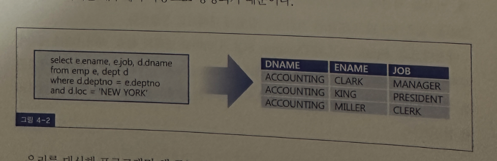
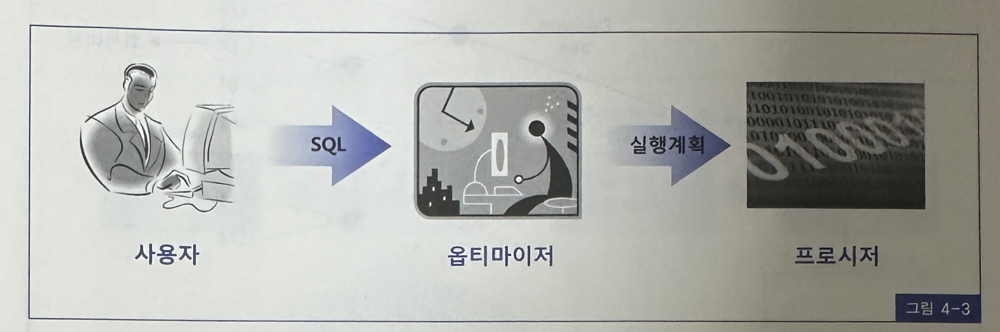
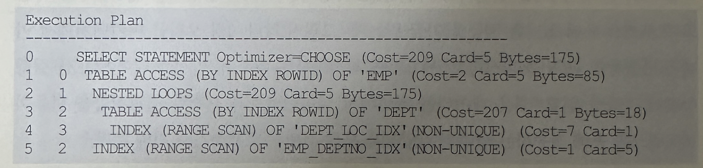
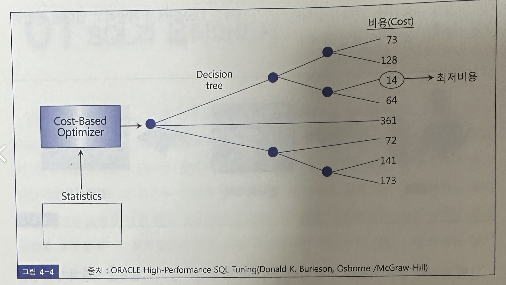

# 4. 라이브러리 캐시 최적화 원리
- 본 장에서는 DBMS가 SQL을 처리하는 과정을 설명
- 특히 SQL 파싱과 최적화 단계에서 부하가 발생하는 원리에 대해 자세히 다룸
- 아무리 강조해도 지나치지 않은 바인드 변수 사용의 중요성을 역설하고, 바인드 변수를 사용했을 때 생길 수 있느 부작용과 해법에 대해서도 알아봄
- 바인드 변수를 사용하더라도 과도한 Parse Call 때문에 생기는 부하는 피하기 어려운데, 커서를 세션에 캐싱함으로써 부하를 줄이거나 애플리케이션에 캐싱함으로써 Parse Call을 일으키기 않고 SQL을 처리하는 방법에 대해서도 설명한다.
- 마지막으로 Static SQL과 Dynamic SQL의 의미를 명확히 하고, 라이브러리 캐시에 부하를 주지 않는 선에서 꼭 필요한 때에만 Dynamic SQL을 사용할 수 있도록 사용 기준으로제시하려고 함
- 그리고 Static SQL로 구현하는 데에  도움을 주고자 몇가지 기법을 설명한다.

## SQL과 옵티마이저

- SQL을 4세대 언어라고 말함
- 4세대 언어라 하면 GUI 환경의 비주얼 개발 툴을 말함
- SQL이 왜 4세대 언어인지 의아할 것
- 4세대 언어에서는 버튼을 만들 때 마우스 드래그 한번이면 충분하고 그 버튼을 만들기 위한 코딩은 내부에서 자동으로 이루어짐
- 우리가 DBMS에 명령을 날릴 떄도 SQL이라고 하는 구조화된 질의언어를 통해 원하는 결과 집합을 요구할 뿐 그 결과집합을 얻기 위한 처리 절차를 개발자가 직접 기술하지 않기 때문에 SQL도 4세대 언어라고 함
- 개발 업무를 시작했다면 처음부터 범용 RDBMS만을 사용해온 독자라면 당연한 것 아닌가 여기겠지만, 파일 시스템이나 dbase3 + foxpro, clipper 같은 xbase 계열에서 데이터베이스 프로그래밍을 해 본 독자라면 무엇을 말하는지 눈치챘을 것임
- 예전에는 두 개 테이블을 조인해 사용자가 원하는 결과집합을 얻으려면 기준 테이블을 전에는 두 개 테이블을 조인해 사용자가 원하는 결과 집합을 얻으려면, 기준 테이블을 select 하고 한 건씩 fetch 하면서 반태편 테이블로부터 조인 레코드를 seek 하는 과정을 루핑을 통해 반복 수행하는 프로시저를 직접 개발자가 코딩해야 했음
- 하지만 옵티마이저가 내장된 DBMS를 사용한다면 그럴 필요가 없음
- 예컨데 EMP와 DEPT 테이블을 조인하는 아래 SQL문 하나만 작성하면 결과 집합을 얻기 위해 필요한 프로세저는 내부에서 자동으로 생성되기 때문

- 우리를 대신해 프로그래밍 해 주는 존재가 DBMS에 내장돼 있는것.
- 바로 SQL 옵티마이저가 그것임, 따라서 옵티마이저가 내장된 DBMS에서 개발하고 있다면, 진정한 프로그래머는 옵티마이저인 셈임

- 그림 4-3과 같은 과정을 거쳐 옵티마이저에 의해 생성된 처리 절차를 사용자가 확인할 수 있도록 트리 구조로 표현한 것이 실행계획이다.

- SQL 옵티마이저는 최소비용, 최적의 경로로 선택해서 사용자가 원하는 작업을 가장 효율적으로 수행할 수 있는 프로시저를 자동으로 생성해주는 DBMS의 핵심 기능이라고 이해하면됨
- 옵티마이저의 최적화 수행 단계를 요약하면 아래와 같음
  - 사용자가 던진 쿼리수행을 위해, 후보군이 될 만한 실행 계획들을 찾아냄
  - 데이터 딕셔너리에 미리 수집해 놓은 오브제트 통계 및 시스템 통계 정보를 이용해 각 실행계획의 예상 비용을 산정함
  - 각 실행계획의 비용을 비교해서 최소 비용을 갖는 하나를 선택함

- 참고로 옵티마이저를 설명하고 나면 SQL 파싱과 최적화를 담당하는 별도의 백그라운드 프로세스가 떠 있냐는 질문을 받는데, 그렇지 않음
- 1장 오라클 아키텍쳐에서 이미 설명했듯이 SQL을 파싱하고, 필요하면 최적화를 수행하며, 커서를 열어 SQL을 실행하면서 블록을 읽고 읽은 데이터를 정렬해서 클라이어트가 요청한 결과집합을 만들어 네트워크를 통해 전송하는 일련의 작업들을 모두 서버 프로세스가 처리해줌