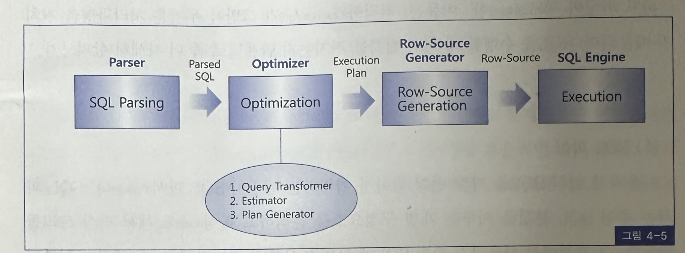
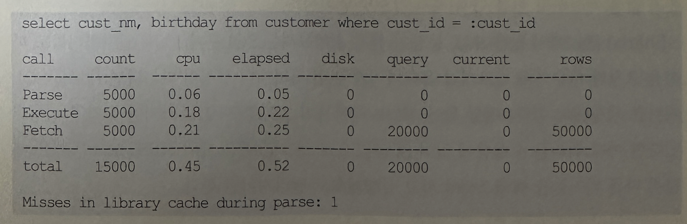
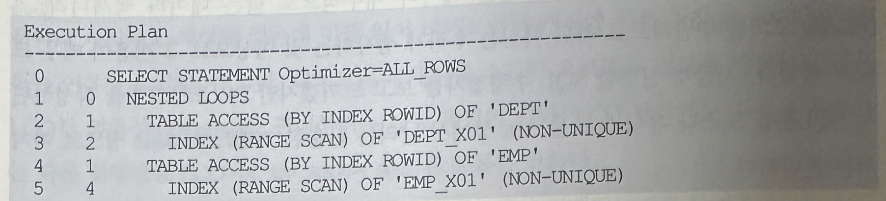
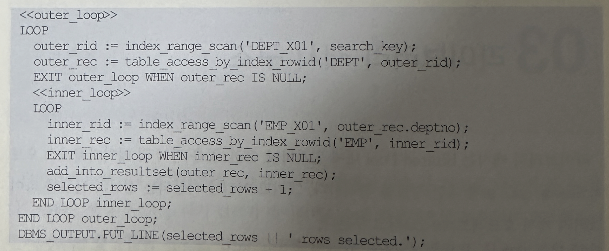

## SQL 처리과정



- 위 사진은 SQL 처리과정을 요약한 것
- 사용자가 SQL문을 던지면 오라클은 SQL 파싱을 거친 후 해당 SQL이 메모리에 캐싱돼 있는지를 먼저 확인함
- 만약 메모리에서 찾으면 곧바로 실행할 수 있찌만, 찾지 못했을 때는 최적화 단계를 거치게 됨
- 파싱 단계에서 SQL 커서를 메모리에서 찾아 곧바로 실행단계로 넘어가는 것을 소프트 파싱이라고 하고, 찾는데 실패해 최적화 및  Row-Source 생성단계를 거치는 것을 하드 파싱이라고 함
- 아래는 같은 SQL을 5000번 반복 수행하는 동안 수집한 SQL 트레이스 결과



- 맨 아래쪽 Misses in library cache during parse가 1이고, Parse Call이 5000이므로 5000번 수행하는 동안 첫 번쨰 시점에는 SQL 커서를 찾지 못해 하드파싱을 했고 나머지 4999번은 라이버르리 캐시에 공유된 커서를 반복 재사용했음을 알 수 있음
- Misses in library cache during parse 가 0이었다면 최초 수행할 때부터 이미 다른 세션에 의해 커서가 캐싱돼 있던 경우임
- 하드 파싱이 하드한 이유는 최적화가 그만큼 무거운 처리 과정을 거치기 때문인데, SQL을 수행할 때 어떤 절차를 거치는지 단계별로 좀 더 자세히 살펴본다

### SQL 파싱
#### 정의
- 사용자가 던진 SQL을 가장 먼저 받아서 처리하는 엔진이 SQL 파서임

#### 처리 순서
- SQL 파서는 우선 SQL문장을 이루는 개별 구성 요소를 분석하고 파싱해서 파싱 트리를 만듬
- 그 과정에서 사용자가 던진 SQL에 문법적 오류가 없는지 Syntax 체크가 이루어짐
- 예를들어 사용할 수 없는 키워드를 사용했거나 순서가 바르지 않거나 누락된 키워드가 있는지 등을 체크하는 것임
- 파싱 트리가 만들어지고 나면 Semantic 체크를 통해 의미상 오류가 없는지 확인함
- 존재하지 않거나 권한 없는 오브젝트를 사용했을 때, 또는 존재하지 않는 칼럼을 참조했다면 이 단계에서 에러 메시지를 만나게 됨
- 문법적으로 완전하고 의미상 오류가 없다면 해싱 알고리즘을 이용해 해당 SQL 커서가 Shared Pool에 캐싱돼 있는지를 확인함
- 그러기 위해 먼저 SQL ASCII 텍스트에 대한 숫자 값을 계산하고 이를 다시 해시 값으로 변환함

#### 주의사항
- Shared Pool 에서 찾은 SQL문장이 현재 수행하려는 SQL문과 100%일치하더라도 파싱을 요청한 사용자가 다르거나 옵티마이저 관련 파라미터 설정이 다르다면 새로운 SQL 커서를 생성해야 한다
- 예를 들어 EMP 테이블이 SCOTT과 HR 스키마에 각각 생성돼 있다면 아래 쿼리를 수행함에 있어 SCOTT으로 로그인 했을때와 HR로 로그인 했을 떄 각각 다른 테이블을 액세스해야 하고 실행계획도 달라져야만 한다.

```
select count(*) from emp
```
- SQL 파서의 역할은 여기까지임. Shared Pool에서 정확히 일치하는 SQL 커서를 찾았다면 실행단계로 넘기면 되지만 매칭되는 SQL문을 못찾거나, 찾더라도 새로운 SQL커서를 생성해야만 하는 상황이라면 최적화를 수행해야 하므로 이제 공은 옵티마이저에게 넘어감


### SQL 최적화
- 옵티마이저는 앞에서도 설명했듯이 시스템 통계 및 오브젝트 통계 정보를 판단기준으로 삼아 다양한 액세스 경로를 비교하고 그 중 가장 효율적인 실행계획을 선택해주는 DBMS의 핵심 엔진임
- 옵티마이저가 최적화를 수행할 떄 세부적으로 아래 3개의 서브 엔진을 사용함

#### 옵티마이저의 서브엔진
- Query Transformer
  - 사용자가 던진 SQL을 그대로 둔 채 최적화하는 게 아니라 우선 최적화하기 쉬운 형태로 변환을 시도함
  - 물론 쿼리 변환 전 후 결과가 동일함이 보장될 때만 그렇게 함
- Plan Generator
  - 하나의 쿼리를 수행하는데 있어, 후보군이 될만한 실행계획들을 생성해 내는 역할으 ㄹ함
- Estimator
  - 쿼리 오퍼레이션 각 단계의 선택도 카디널리티 비용을 계산하고 궁극적으로는 실행계획 전체에 대한 총 비용을 계산해 낸다
  - 이는 어디까지나 예상치며, 각 단계를 수행하는데 필요한 I/O, CPU, 메모리 사용량 등을 에측하기 위해 데이터베이스 오브젝트 통계정보와 하드웨어적인 시스템 성능과 통계정보(CPU 속도, single block read time, Multiblock read time 등)를 이용함
  - 이들은 오브젝트 통계와 시스템 통계 정보는 오라클이 자동으로 수집하거나 DB 관리자의 정책에 따라 주기적으로 수집됨
- 이 세가지 엔진 중 최적의 실행계획을 만드는데 있어 어느 것 하나 중요하지 않은 것이 없음
- Query Transformer 는 워낙 중요하므로 2권에서 별도의 챕터를 할애해 거기서 집중적으로 다룸
- Plan Generator와 Estimator도 Query Transformer 못지 않게 중요함
- 최적의 실행계획을 선택하려면 그만큼 선택의 폭이 넓어야 함
- 그러려면 옵티마이저가 많은 실행 계획들을 고려대상으로 삼을 수 있도록 짧은 시간 내에 실행계획들을 많이 만들고 이에 대한 비용을 평가할 수 있어야만 함
- 그런데 하나의 쿼리를 수행하는 데 있어 너무 다양한 액세스 경로와 조인 방식, 조인 순서가 존재하므로 쉽지 않은 문제임
- 예를 들어 5개의 테이블을 조인하려면 조인 순서만을 고려하더라도 5! 개의 실행계획을 평가해야 함
- 그리고 120개 실행계획에 포함된 각 조인 오퍼레이션에 대해 NL조인 소트머지 조인, 해시 조인 등 다양한 도인 방식 까지 고려해야 함
- 게다가 각 테이블을 액세스하는데 있어 테이블 전체를 스캔할지 아니면 인덱스를 이용할지, 그리고 인덱스를 이용한다면 Index Range Scan, Index Unique Scan, Index Full Scan, Fast Full Scan, Index Skip Scan등 다양한 액세스 방식 중 어느 것을 사용할지 결정해야 함
- 이 모든 요소들을 고려한다면 불과 5개 테이블을 조인하는 데에만 수천, 수만개의 실행계획을 생성해야 하고, 각각에 대한 비용을 산정하고 평가해야만 함
- 현실적으로 모든 실행계획을 평가하는 것은 불가능하므로 최적화에 걸리는 총 소요 시간을 단축시킬 목적으로 오라클은 몇가지 지능적인 테크닉을 사용함
- Adaptive search strategy
  - 쿼리 수행 시 예상되는 총 수행 시간에 비해 쿼리 최적화에 걸리는 시간이 일정비율을 넘지 않도록 적응적 탐색 전략을 사용함
- Multiple Initial ordering Heuristic
  - 이것은 조인 순서를 무순위로 평가하는게 아니라 최적의 실행계획을 발견할 가능성이 높은 순서대로 비용을 평가하는 것을 말함
  - 그렇게 함으로써 실행계획을 평가하는 도중에 멈추더라도 그중에서 선택된 실행계획이 거의 최적이거나 최적은 아니더라도 최소한 만족할 만한 수준의 좋은 실행계획에 속할 가능성을 높임
- 이 두 테크닉에 대한 좀 더 자세한 설명을 원한다면 2002년 2월에 발표된 오라클 백서 Query Optivization in Oracle9i 또는 2005년 6월에 발표된 Query Optimization in Oracle Database10g Release2를 참조하기 바람

### Row-Source Generation
- 옵티마이저의 최적화 과정을 거치면 아래와 같이 SQL 처리과정을 표현한 실행계획이 만들어짐



- 이것은 개념 수준의 실행계획이지 실제 실행 가능한 형태는 아님
- 따라서 이것을 실행 가능한 코드 또는 프로시저 형태로 포맷팅하는 작업이 필요함
- 이 역할을 Row Source Generator가 담당함
- Row-Source는 레코드 집합을 반복 처리하면서 사용자가 요구한 최종 결과 집합을 실제적으로 생성하는데 사용되는 제어 구조를 말함
- 이를테면 아래와 같은 모습일 겻임
  


- 사실 지금까지 설명한 옵티마이저의 내부 처리 과정을 모두 이해할 필요는 없음 다만, 최적화를 수반한 하드 파싱이 얼마나 무거운 작업인지를 설명하고 싶었을 따름임
- 데이터 베이스에서 이루어지는 처리과정은 대부분I/O 작업에 집중되는 반면 하드 파싱은 CPU를 많이 소비하는 몇 안되는 작업 중 하나에 속함
- 하드 파싱 과정에서 Shared Pool 과 라이브러리캐시에 대해 발생하는 래치 경합도 CPU를 많이 소비하게 만드는 요인으로 작용함
- 그리고 한번 수행될 때 마다 내부적으로 많은 데이터 딕셔너리 조회를 수반하므로 하드 파싱은 우리가 생각하는것 이상으로 그 비용이 매우 크다고 했음
- 지금껏 설명한 SQL 수행절차를 보고 느끼겠지만 DB 프로그램을 작성하면서 SQL 문을 도스나 유닉스 프롬프트 상에서 날리는 단순한 커맨드 정도로 여겨서는 안됨
- 이렇게 무거운 작업을 거쳐 얻은 겨로가물을 한 번만 사용하고 버린다면 이만저만한 낭비가 아님
- 그래서 파싱 겨로가를 거친 SQL 커서를 재사용할 수 있도록 캐싱해 두는 메모리 공간이 바로 라이브러리 캐시임
- 지금부터 라이브러리 캐시의 내부 구조를 살펴봄으로써 이를 최적화 할 수 있는 원리가 어디에 숨어 있는지 찾아 보기로 한다.

