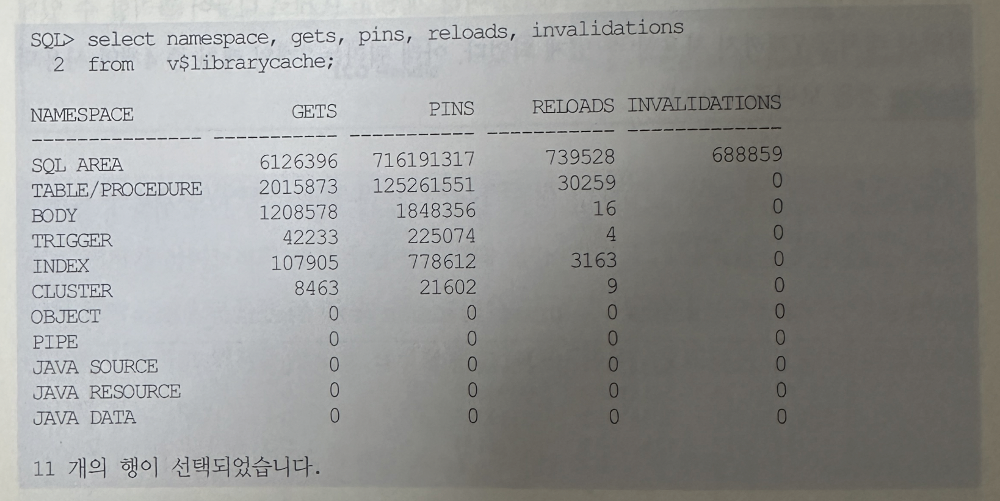
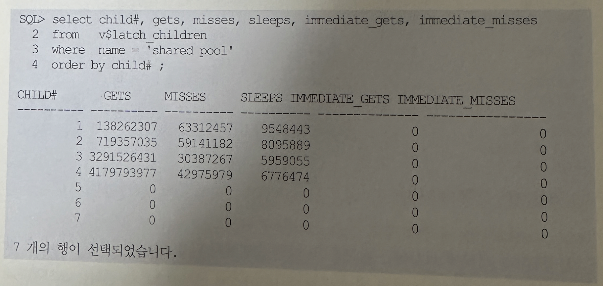
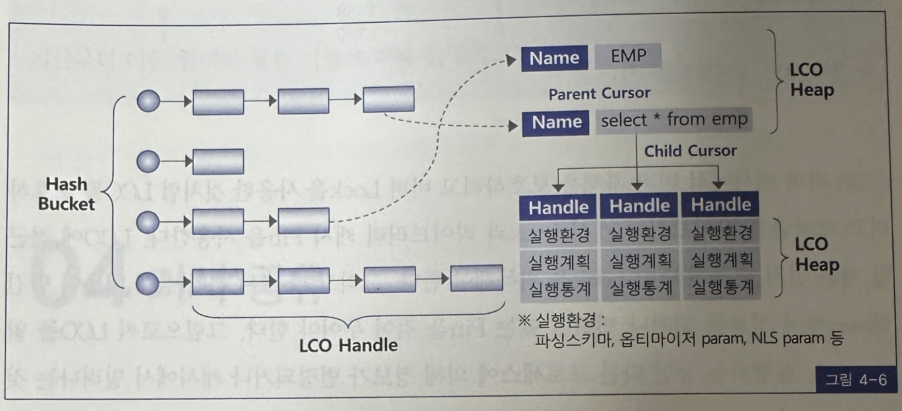
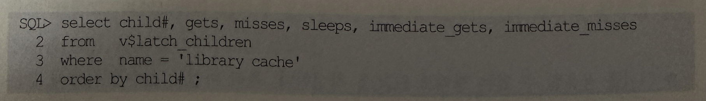
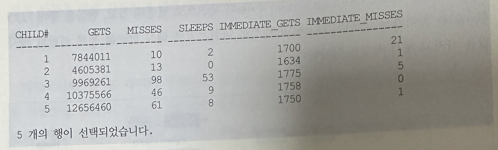

## 라이브러리 캐시 구조
- 라이브러리 캐시는 Shared Pool 내에 위치하며, SQL 공유 커서 및 데이터베이스 오브젝트(테이블, 인덱스 등)에 대한 정볼를 관리함
- 그리고 여기에 저장되는 정보의 단위를 라이브러리 캐시 오브젝트라고 부름
- SQL 커서 뿐 아니라 컴파일을 거친 프로시저, 함수, 패키지, 트리거 등 PL/SQL프로그램을 담는 PL/SQL Area도 라이브러리 캐시에 저장됨
- SQL 커서와 PL/SQL 오브젝트 처럼 실헹 가능한 오브젝트를 실행가능 LCO라 부르기로 한다
- 라이브러리 캐시에는 실행가능 오브젝트 뿐 아니라 거기서 참조하는 테이블, 인덱스, 클러스터 같은 데이터베이스 오브젝트 정보들도 동등하게 하나의 오브젝트로서 관리되는데, 이들을 지금부터 오브젝트 LCO라고 부름
- 스키마 오브젝트 정보는 데이터 딕셔너리 캐시에도 캐싱돼 있는데 이를 읽어 라이브러리 캐시에 중복 저장하는 이유가 궁금할 수 있음
- 라이브러리 캐시에 스키마 오브젝트 정보를 캐싱하는 것은 LCO간 의존성을 관리하는 데에 목적이 있음
- LCO 각각에는 자신을 참조하는 다른 실행기능 LCO(커서, 함수, 프로시저, 패키지 등)목록을 가짐
- 아래는 라이브러리 캐시에 어떤 유형의 오브젝트들이 적재되는 지를 보여줌

- 라이브러리 캐시에 캐싱되는 정보를 또 다른 측면으로 다음 두가지로 나누어 볼 수 있음
  1. 생성 후 Drop 하기 전까지 데이터베이스에 영구적으로 보관되는 오브젝트(이하 Stored Object) 정보, 테이블, 인덱스, 클러스터, 뷰, 트리거, 패키지, 사용자 정의함수/프로시저 등이 여기에 해당됨
    - 이들 오브젝트는 생성될 때부터 이름을 갖는 것이 특징임
  2. 실행 시점에 생성되서 인스턴스가 떠 있는 동안에만 존재하는 일시적인 오브젝트 정보가 그것임 커서와 Anonymous PL/SQL 문이 대표적인데, 이들은 이름을 따로 지정하지 않으며 문장을 구성하는 전체 문자열 그대로가 이름 역할을 함
- 라이브러리 캐시는 데이터 딕셔너리 캐시와 함꼐 Shared Pool에 할당된 메모리 공가능ㄹ 사용함
- Shared Pool도 DB 버퍼 캐시처럼 LRU 알고리즘에 의해 관리되며, 재사용 빈도가 낮은 SQL 은 캐시에서 밀어냄으로써 새로운 SQL을 캐싱할 수 있도록 공간을 확보함
- Shared Pool에서 특정 오브젝트 정보 또는 SQL 커서를 위한 Free Chuck를 할당 받으려 할 때 필요한 래치가 shared pool 래치임
- 예전에는 하나의 shared pool래치로 전체를 관리하였으나 9i부터 shared pool을 여러 개 sub pool로 나누어 관리할 수있게 되면서 래치도 7개까지 사용할 수 있게되었음
- 아래 쿼리는 7개의 래치 중 4개만 사용되고 있는 것을 보여주고 있음

- Shared Pool을 관리하는 내부 메커니즘까지 깊이 알 필요는 없으며, 여기서 독자에게 보이고자 한 것은 예전보다 늘긴 했지만 사용할 수 있는 래치 개수가 7개 뿐이라는 사실임
- 만약 그 이상의 동시 사용자가 순간적으로 과도한 하드 파싱 부하를 일으킨다면 shared Pool 래치에 대한 경합 현상이 나타날 수있음
- 라이브러리 캐시도 DB 버퍼 캐시처럼 해시 구조로 관리됨
- 즉 해시 버킷에 LCO gosemf(-> LCO를 식별하고 힙을 포인틴하는데 사용)이 체인으로 연결돼 있고, 핸들을 통해 LCO힙을 찾아가는 구조임
- DB 버퍼 캐시와 마찬가지로 해시 함수를 통해 리턴된 해시 값을 가지고 해시 버킷을 할당함

- 그림 4-6을 보면 오브젝트 LCO인 EMP 테이블 정보와 실행 가능 LCO에 해당하는 SQL 커서가 라이브러리 캐시와 함께 적재돼 있음
- 그리고 그림에서 보듯 커서는 Parent 커서 밑에 Child 커서가 연결되는 구조를 가짐
- SQL 문장이 100% 동일한대도 커서를 공유하지 못하고 커서를 별도로 생성해야 할 때가 있는데, 오라클은 그럴 때 다중 Child커서를 사용함
- DB 버퍼 캐시에서 체인으로 연결된 리스트 구조를 보호하기 위해 cache buffers chains 래치를 사용하는 것처럼 라이브러리 캐시 체인을 탐색하고 변경하려면 먼저 library cache 래치를 획득해야 함
- 이에 대한 경합이 발생할 때 latch: library 대기 이벤트가 발생함
- 아래 쿼리에서 보는 것처럼 library cache 래치 개수도 몇 개(cpu 개수에 근접)에 불과하므로 하드 파싱은 물론이고 소프트 파싱이 많이 발생해도 래치에 대한 경합이 증가하게 됨

- DB 버퍼 캐시에서 버퍼 자체를 보호하려고 버퍼 Lock을 사용한 것처럼 LCO를 보호하려고 오라클은 라이브럽리 캐시 Lock과 라이브러리 캐시 Pin을 사용함
- LCO에 접근할 때는 먼저 핸들에 대한 Lock을 획득해야 함
- 그러고 나서 LCO 의 실제 내용이 담긴 힙에서 정보를 읽거나 변경할 때는 Pin을 걸어 두어야 함
- 그럼으로써 LCO를 읽고 쓰고 실행하는 동안 다른 프로세스에 의해 정보가 변경되거나 캐시에서 밀려나는 것을 방지함
- Shared pool 래치와 Library Cache 래치 경합은 소프트 하드 파싱을 동시에 심하게 일으킬 때 발생
- library cache Lock 과 library Cache pin 대기 이벤트는 주로 SQL 수행 도중 DDL을 날릴 . 때발생함
- 트랜잭션이 활발한 주간에 DDL문을 날려 데이터베이스 오브젝트 정의를 변경하면 라이브러리 캐시에 심한 부하를 유발하게 되므로 주의해야 함
- 라이브러리 캐시 Lock과 라이브러리 캐시 Pin에 대한 좀 더 자세한 설명을 원한다면 부록을 참조하길 바람
- 부록에는 LCO접근을 위해 Lock과 Pin 두개의 직렬화 장치를 따로 두는 이유까지 설명하고 있음
- 라이브러리 캐시 최적화를 위한 데이터베이스 관리자 측면에서의 튜닝 기법들이 몇 가지 있지만, 그보다 중요하고 효과가 큰 것은 개발 측면에서의 노력이며 아래 3가지로 요약할 수 있음
  - 커서를 공유할 수 있는 형태로 SQL 을 작성
    - 특히 바인드 변수를 사용해 같은 형태의 SQL에 대한 반복적인 하드파싱이 일어나지 않도록 해야 함
  - 세션 커서 캐싱 기능을 이용해 라이브러리 캐시에서 SQL 찾는 비용을 줄임
  - 애플리케이션 커서 캐싱을 이용해 Parse Call 발생량을 줄임
- 지금부터 이들 원리와 활용 기법에 대해 설명한다.