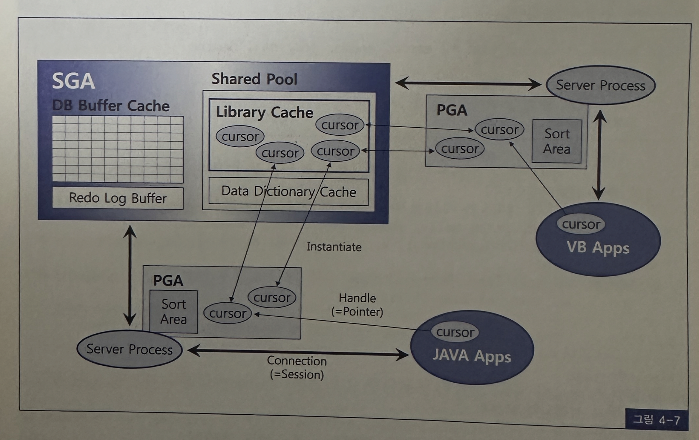
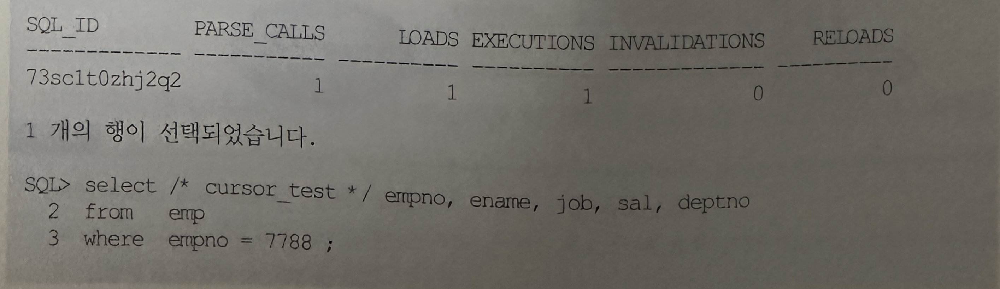
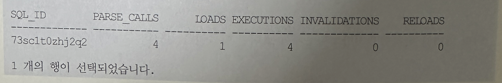
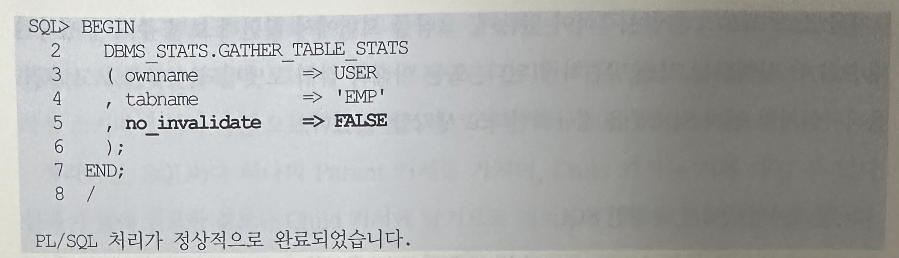
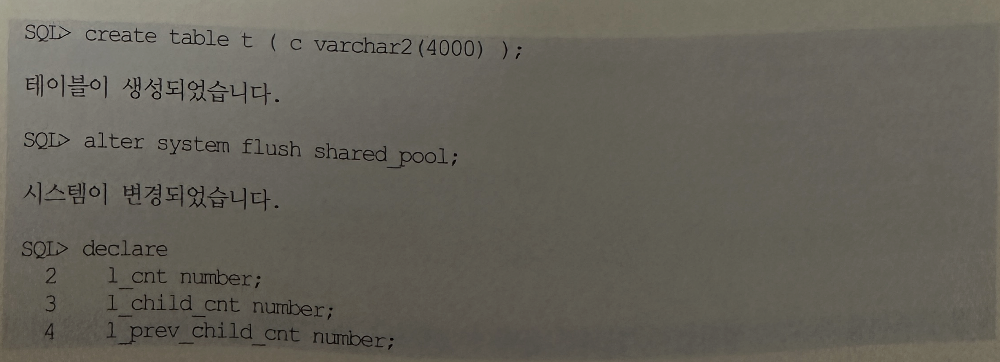
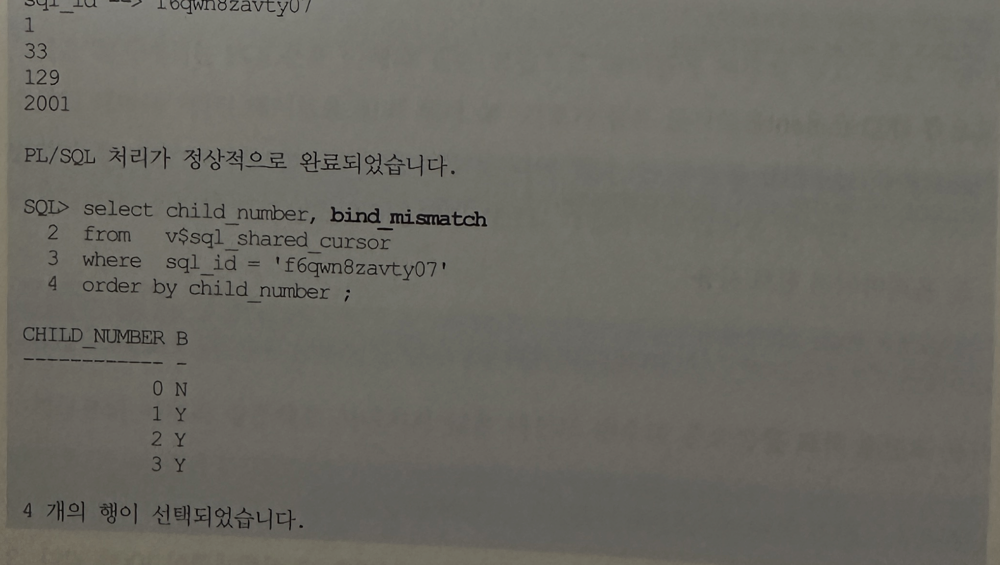

## 커서 공유

### 1. 커서란?
- 커서는 상황에 따라 여러가지 의미로 사용되므로 커서 공유를 설명하기에 앞서 커서가 무엇인지 그 의미부터 정확히 할 필요가 있음
- 결론부터 말하면 우리가 흔히 말하는 커서는 아래 3가지를 모두 일컫는말임

#### 세션 커서(session cursor)
- 라이브러리 캐시에 공유돼 있는 커서를 실행할 때는 우선 PGA 영억에 메모리를 할당함
- 이를 Private SQL Area 라고 하는데 Persistent Area와 Runtime Area로 나뉨
- Shared SQL AREA를 읽어 커서를 실행하는데 필요한 정보들을 Private SQL Area에 담고 공유 커서를 가리키는 포인터를 유지함
- 그리고 커서의 상태 정보도 관리함
- 커서를 실행하기 위한 이런 준비 과정을 "커서를 오픈한다"고 표현하고 PGA에 저장된 커서 정보(즉, 파싱된 SQL문과 문장을 수행하는데 필요한 기타 정보)를 또한 커서라고 부름
- 오래 전에 C++와 JAVA 프로그래밍을 시작하면서 객체지향프로그래밍 개념을 공부했던 기억이 있음
- OOP에서 절때 빠질 수 없는 클래스와 객체를 논할 때 대개 아래와 같이 설명함 
  - 클래스를 인스턴스화 한 것이 객체임
  - 클래스는 디자인이고 그것을 실체화 한것이 객체임
  - 클래스는 붕어빵을 만드는 틀이고 객체는 그 틀로써 만들어 낸 붕어빵임
- 라이브러리 캐시에 공유돼 있는 커서는 SQL을 수행하는 데 필요한 루틴을 정의한 것
  - 클래스 샹태읻다
- 물론 그 루틴을 정의하고 클래스를 디자인한 것은 옵티마이저임
- 커서 오픈 즉, 라이브러리 캐시에 공유돼 있는 커서를 PGA로 인스턴스화 하는 것을 요즘 JAVA 스타일로 하면 아래와 같음

```
Cursor c = new Corsor();
```

- 자바 런타임이 이부분을 만나면 메모리를 할당하고 클래스를 객체로 인스턴스화 함으로써 실제 처리 루틴을 실행할 수 있는 상태로 만듬
- 마찬가지로 오라클에서도 커서를 오픈하면 라이브러리 캐시에 공유돼 있는 커서를 인스턴스화함으로써 PGA에 커서를 위한 메모리 공간을 할당하고, 실제 데이터 추출을 시작할 수 있도록 준비 작업을 함
- 이제 '세션 커서'와 '커서 오픈'에 대한 개념이 명확해 졌을 것임

#### 애플리케이션 커서(application cursor)
- 마지막으로 PGA에 있는 커서를 핸들링 하려면 JAVA, VB, Pro*C PL/SQL 같은 클라이언트 애플리케이션에도 리소스를 할당해야 하는데, 이 또한 커서라는 용어를 사용함
- 그림 4-7은 지금까지 설명한 공유 커서, 세션 커서, 애플리케이션 커서 개념을 이해하기 쉽게 그림으로 표현하는 것
 


### 2. 커서 공유
- 오라클에서 "커서를 공유한다"는 표현을 자주 사용하는데, 여기서 말하는 커서는 라이브러리 캐시의 공유 커서를 일컫는다
- 세션 커서, 애플리케이션 커서를 다른 프로세스와 공유할 수 없음은 자명함
- 위에 그림에서 라이브러리 캐시에 4개의 커서가 공유돼 있는 것을 . 볼수 있고 우측 하단에 있는 커서는 현재 두개의 서버 프로세스에 의해 참조되고 있음을 표현하고 있음
- 라이브러리 캐시에 공유돼있는 커서의 수행 통계를 v$sql을 통해 조회해볼 수 있음
- v$sql을 조회하면서 실제 공유된 커서가 어떻게 반복 재사용되는지 확인해본다.





- 이미 의미를 파악했겠지만 v$sql에서 조회한 항목들을 간단히 설명해본다
  - parse_calls: 라이브러리 캐시에서 SQL 커서를 찾으려는 요청 횟수
  - loads: 하드파싱을 거친 SQL 실행계획을 라이브러리 캐시에 적재한 횟수
  - executions : SQL을 수행한 횟수
  - invalidations : 커서가 무효화된 횟수, 커서가 참조하고 있는 오브젝트에 중요한 변화가 일어났음을 의미함
- 같은 SQL을 3번 수행하는 동안 라이브러리 캐시에서 SQL을 찾는 Parse Call이 세번 발생했고, 하드파싱은 단 한번 일어남
- Shared Pool을 모두 비우고 테스트를 시작했으므로 SQL을 첫 번째 수행할 때 하드파싱이 일어났을 것
- 위 테스트를 통해 공유된 하나의 커서를 세 번 재사용했음을 알 수 있음
- 이제 다른 세션끼리도 같은 커서를 공유해서 재사용할 수 있는지 확인해본다.
- 아래처럼 세션을 닫고 새로운 세션을 맺거나 다른 세션에서 테스트를 계속 해본다.
  



- 다른 세션에서 같은 SQL을 수행할 때도 이전 세션에서 적재한 커서를 재사용했음을 . 알수 있음
- 이렇게 공유돼 있던 커서가 어떤 이유에서건 무효화될 수 있음
- 예를 들면, 커서가 참조하고 있던 오브젝트 컬럼이 추가/삭제되거나 새로운 인덱스가 만들어지거나 또는 오브젝트 통계를 새로 수집하는 등의 DDL 문이 수행되는 경우임
- 컬럼이 삭제되면 이전 커서가 잘못된 컬럼 참조를 할 수 있기 때문에 무효화 되어야 하고, 오브젝트 통계를 재수집하면 이전에 수립된 실행계획이 더이상 최적이 아닐 수 있으므로 해당 커서는 무효화되어야만 하는 것
- EMP 테이블 통계정보를 재수집해본다.



- 라이브러리 캐시에 있는 커서들이 여러 세션에 의해 공유되면서 반복 재사용 되는 것을 직접 확인해 보았음
- 공유된 커서를 사용할 때는 최적화 및 Row-Source Generation 단계를 생략하고 곧바로 실행 단계로 넘어가므로 보다 효율적이고 빠르게 SQL을 수행한다고 설명함
- 커서가 공유되려면 커서를 식별하는 키 값이 같아야 하는데, 라이브러리 캐시에서 커서를 식별하기 위해 사용되는 키 값은 SQL 문장 그 자체임
- SQL문을 구성하는 전체 문자열이 이름 역할을 한다는 뜻
- 오라클 10g부터 v$sql을 조회해보면, sql_id라는 별도의 식별자 컬럼을 두고 있지만 이것은 고객 테이블에서 고객번호(PK)의 대체키로서 주민등록번호를 사용할 수 있는 것과 같음
- 즉 고객번호와 주민등록번호가 서로 1:1대응관계를 갖는 것처럼 sql_id와 SQL_fulltext는 1:1로 대응됨
- 따라서 SQL문 중간에 작은 공백문자 하나만 추가하더라도 서로 다른 SQL문장으로 인식해 새로운 SQL_ID를 발급받게 됨
- 즉 커서가 공유되지 않는다.
- 가끔 소스 프로그램에는 주석이 있는데 오라클 서버에서 확인해 보면 주석이 제거된 채 SQL이 실행되는 것을 발견하게 됨
- 또는 아래와 같이 포맷팅되는 것을 보고 SQL옵티마이저가 먼저 SQL문을 정규화한다고 생각할 수 있음

#### 클라이언트에서 발행한 SQL

```
select * from emp where ename like 'S%' and depno = 20 and sal > 2500
```

#### 서버에서 수집된 SQL

```
select * from emp where (((ename like 'S%')and deptno = 20) and sal > 2500)
```

- 하지만 오라클은 절대 이런 일을 자행하지 않음
- 사용자가 던진 SQL그대로 최적화를 수행하며, SQL문 . 그자체를 식별자로서 사용할 뿐
- 그럼에도 위와 같은 현상이 발생하는 것은 PreCompiler의 소행 때문이다
- 또는 10g 부터 PL/SQL로 작성된 SQL에 주석이 있다면 컴파일 과정에서 없애버림
- 따라서 최종적으로 던진 SQL문에는 주석이 사라짐
- 10g 버전 PL/SQL엔진은 주석을 제거할 뿐 아니라 소문자를 대문자로 바꾸기도 함

### Child 커서를 공유하지 못하는 경우
- SQL문장이 100% 동일한대도 SQL커서를 공유하지 못하고 별도의 SQL 커서를 생성해야 할 때도 있음
- 앞에서 이미 예로 들었듯이 EMP 테이블이 SCOTT과 HR 스키마에 각각 생성돼 있다면 이를 참조하는 동일 쿼리를 SCOTT으로 로그인해서 수행할 때 각각 다른 테이블을 액세스해야 하고 실행계획도 달라져야 함
- 이럴 때 오라클은 별도의 Child 커서를 생성한다.
- Drop 하기 전까지 영구적으로 보관되는 Stored Object(테이블, 인덱스, 함수, 프로시저, 패키지 등)는 생성될 때부터 유일하게 식별 가능한 이름이 부여되므로 Child 오브젝트를 사용할 필요가 없음
- 하지만 SQL 커서처럼 실행시점에 생성돼서 인스턴스가 떠있는 동안에만 존재하는 Transient Object는 이름을 따로 지정하지 않고 문장을 구성하는 전체 문자열 그대로가 LCO를 식별하는 이름 역할을 함
- 그래서 전체 문자열은 같지만 다른 방식으로 실행해야 하거나 파싱 스키마에 따라 다른 오브젝트를 참조하는 상황에서 Child 커서가 필요해짐
- 정리하면 SQL마다 하나의 Parent 커서를 가지며, Child 커서는 여러개일 수 있음
- 실제 수행에 필요한 정보는 Child 커서에 담기므로 적어도 한 개의 Child 커서를 가짐
- v$sqlarea는 Parent 커서 정보를 보여주고, v$sql은 child 커서 정보를 보여줌
- 아래는 SCOTT과 HR 스키마 각각에 EMP 테이블을 만들고 각 계정으로 로그인해서 select * from emp 쿼리를 수행한 후에 v$sqlarea와 v$sql을 쿼리했을 때의 결과를 보여줌


- SQL 하나당 여러개의 Child 커서를 갖는 것이 바람직한 현상은 아님
- AWR 리포트에서 Version Count가 20개 이상인 SQL 목록을 따로 보여주는 이유도 그 때문임
- 아래는 Version Count 가 가장 높은 SQL문을 찾는 쿼리임

```
select * from v$sqlares
order by version_count desc
```

- version count 수치가 높은 SQL 일수록 커서를 탐색하는 데 더 많은 시간을 소비하므로 library cache 래치에 대한 경합 발생 가능성을 증가시킴
- 예를 들어 ASP(application service provider) 서비스를 하면서 테이블을 하나로 통합하지 않고 각 고객사마다 별도의 사용자 계정을 발급하는 방식으로 설계했다고 가정함
- 그러면 각 사용자 계정마다 같은 테이블을 생성해 두고 로그인할 때 각자의 계정을 사용함으로써 같은 SQL문을 사용하면서도 각기 자신의 테이블을 액세스하도록 구현할 것임
- 같은 SQL문을 사용하므로 Parent 커서는 공유하겠지만 Child커서는 개별적으로 생성될 것이고, 모든 SQL문에 대해 많은 Child 커서를 갖는 구조이므로 당연히 라이브러리 캐시 효율은 나빠짐
- v$sqlarea
  - 오라클 메뉴얼에서 v$sqlarea를 찾아보면 SQL마다 하나의 로우를 출력한다고 돼어 있어 Parent커서 정보라고 간주해도 무방하지만 사실 대부분 값들이 v$sql을 group by 해서 집계한 것
  - 간혹 같은 SQL문장에 대해 두 개 로우가 출력되는 경우가 있어 Parent 커서가 두 개 인것 처럼 착학할 수 있지만, 집계된 값들을 잘 분석해보면 v$sql에서 볼 수 있는 child 커서 저옵가 일치함
  - 따라서 group by 하는 과정에서 Child 커서가 하나의 로우로 Merge 되지 않아 두 개 로운로 표현되었을 뿐 같은 Parent 커서를 가리키고 있음(Hash Value Address가 동일)을 알 수 있음
  - SQL 하나 당 여러개의 Child 커서를 갖는 것이 바람직한 현상은 아님
  - AWR 리포트에서 Version CounT가 20개 이상인 SQL 목록을 따로 부여주는 이유도 그 때문임
  - 아래는 Version Count가 가장 높은 SQL 문을 찾는 쿼리임
- 하나의 SQL문장이 여러개 Child 커서를 갖게 되는 이유
  - SQL에서 참조하는 오브젝트명이 같지만 SQL을 실행한 사용자에 따라 다른 오브젝트를 가리킬 때
  - 참조 오브젝트가 변경돼 커서가 무효회되면 이후 그 커서를 처음사용하려는 세션에 의해 다시 하드파싱돼아되는데, 특정 세션이 아직 기존 커서를 사용중일 때
  - 옵티마이저 모드를 비롯해 옵티마이저 관련 파라미터가 다를 때
  - 입력된 바인딩 값의 길이가 크게 다를 때
  - NLS 파라메터를 다르게 설정했을 때
  - SQL 트레이스를 활성화 했을 때
- v$sql_shared_cursor 다이나믹 뷰는 새로운 child커서가 왜 기존 child 커서와 공유 되지 못했는지 이유를 설명해줌


- 같은 쿼리를 두 번 수행하는데, 한 번은 옵티마이저 모드를 FIRST_ROWS로, 다른 한번은 ALL_ROWS로 설정한 상태에서 수행하고 v$sql_shared_cursor를 조회해보았음


- 위 쿼리 결과를 통해 두 번째 child 커서가 새로 생성된 이유가 옵티마이저 모드 불일치 때문인 것을 알 수 있음
- 옵티마이저 모드를 제외한 다른 옵티마이저 관련 파라미터 불일치가 원인일 때는 optimizer_mismatch 컬럼에 표시되며, 10gR1까지는 이를 구분하지 않고 optimizer_mismatch 하나로 보여줌
- 아래 테스트 결과는, 입력된 바인드 값이 32, 128, 2000 바이트를 넘을 때마다 새로운 Child 커서가 생성됨을 보여줌





### 4. parent 커서를 공유하지 못하는 경우
- 지금까지 SQL 문장이 동일한데도 커서를 공유하지 못해 하나의 parent 커서에 Child 커서가 여러개 달리는 경우를 살펴봄
- SQL 문장 자체는 같더라도 의미적으로 다른 오브젝트를 참조하거나, 실행환경이 달라 다른 실행계획을 고려해야 하는 상황에서 발생하는 현상임을 이해했을 것ㅇ
- 이제 의미적으로 같고 실행환경이 같은데도 커서를 공유하지 못해 Parent 커서 자체가 여러개 생성되는 경우를 살펴본다

#### 1. 공백문자 또는 줄바꿈

```
SELECT * FROM CUSTOMER;
SELECT *  FROM CUSTOMER;
```

#### 2. 대소문자 구분

```
SELECT * FROM CUSTOMER;
SELECT *  FROM customer;
```

#### 3. 테이블 Owner 명시

```
SELECT * FROM CUSTOMER;
SELECT * FROM HR.CUSTOMER;
```

#### 4. 주석(Comment)

```
SELECT * FROM CUSTOMER;
SELECT /* 주석문 */ * FROM CUSTOMER;
```

#### 5. 옵티마이저 힌트 사용

```
SELECT * FROM CUSTOMER;
SELECT /*+ all_rows */ * FROM CUSTOMER;
```

#### 6. 조건절 비교 값

```
SELECT * FROM CUSTOMER WHERE CUST_ID = '0000001';
SELECT * FROM CUSTOMER WHERE CUST_ID = '0000002';
```

- 이 외에도 더 다양한 케이스가 있을 것
- 1,2,4는 실행계획이 100% 같음
- 3번도 OWNER 를 명시했는지 여부만 다를 뿐 테이블을 참조한 것이라면 실행계획은 같음
- 그럼에도 문자열을 조금 다르게 기술했다는 이유 때문에 서로 다른 SQL로서 각각 하드파싱을 일으키고 서로 다른 공간을 차지하면 Shared Pool을 낭비하게 됨
- 이런 비효율을 줄이고 공유 가능한 형태로 SQL을 작성하려면 개발 초기에 SQL 작성 표준을 정해 이를 준수하도록 해야 함
- 하지만 1~4번처럼 SQL을 작성한다고 해서 라이브러리 캐시 효율이 우려할 만큼 크게 나빠지지는 않음
- 마침 둘 이상의 개발자가 100% 같은 내용의 SQL을 각각 다르게 작성할 가능성은 매우 작기 때문임
- 쿼리 툴에서 수행되는 임의질의(Ad-Hoc Query)는 그럴 가능성은 크더라도 수행 빈도가 매우 낮아 문제될 것이 없음
- 5번은 의도적으로 실행계획을 달리 가져가려는 것이므로 논외로 하고 라이브러리 캐시 효율과 직접 관련이 큰 것은 6번같은 패턴임
- 즉 조건절에 바인드 변수를 사용하지 않고 서로 다른 Literal 값으로 문자열을 대체하는 경우임
- 만약 OLTP성 업무를 처리하는 애플리케이션에서 6번과 같은 패턴으로 SQL을 개발한다면 결코 좋은 성능을 보장받을 수 없음
- 개별 쿼리 성능으로 보면 잘 느끼지 못하지만 동시 트랜잭션이 몰리는 peak 시간대에 시스템을 장애 상황으로 몰고가는 주범임
- 어떤 회사에서 SQL문을 아래와 같은 모습으로 테이블에 저장해놓고 프로그램이 수행될 때마다 쿼리 테이블을 쿼리해서 #기호가 붙은 문자열을 사용자 입력 값으로 변환한 후 최종 쿼리를 날리도록 한 것을 본 적이 있음
- 본 장에서 설명하는 라이브러리 캐시 최적화 원리를 미리 알았더라면 이런 식으로 개발하지는 않았을 것

```
SELECT * FROM TABLE1
WHERE 기관코드 = #기관코드
AND   주문일자 BETWEEN #시작일자 AND #종료일자
```
- 지금부터 아무리 강조해도 지나치지 않은 바인드 변수의 중요성에 대해 설명하려고 함