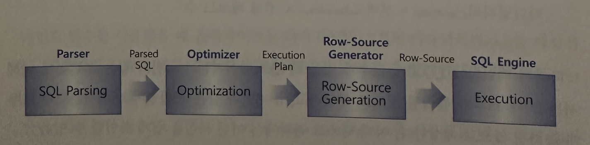

## 바인드 변수의 부작용과 해법
- 바인드 변수 사용과 관련해서 꼭 알아둬야 할 중요한 사실이 있음
- 앗펀 그림 4-5에서 본 SQL수행 절차를 다시 상기시켜본다.



- 바인드 변수를 사용하면 최초 수행할 때 최적화를 거친 실행계획을 캐시에 적재하고, 실행시점에는 그것을 그대로 가져와 값을 다르게 바인딩하면서 반복 재사용하게 됨
- 여기서 변수를 바인딩하는 시점이(최적화 시점보다 나중인) 실행시점이라는 사실을 아는 것이 중요
- 즉 SQL을 최적화 하는 시점에 조건절 컬럼의 데이터 분포도를 활용하지 못하는 문제점을 가짐(바인드 변수를 사용하면 통계 정보를 사용하지 못한다고 흔히 말하는데, 정확히 표현하면 컬럼 히스토그램 정보를 사용하지 못하는 것 뿐임, 히스토그램을 제외한 다른 통계 정보들은 충분히 활용함)
- 따라서 바인드 변수를 사용할 때 옵티마이저는 평균 분포를 가정한 실행계획을 생성함
- 컬럼 분포가 균일할 때는 문제될 것이 없지만 그렇지 않을 때는 실행 시점에 바인딩되는 값에 따라 최적이 아닌 실행계획일 수 있어 문제임
- 특히 등치 조건이 아닌 부등호나 Between 같은 범위 기반 검색조건일 때는 고정된 규칙을 사용하므로 아래 1~4번은 선택도 5%로 계산하고 5~8번 까지는 0.25%로 계산함


- 2권에서 설명하겠지만 비용 계산에 기초가 되는 카디널리티는 전체 레코드 수에 선택도를 곱해서 구함

```

카디널리티 = 선택도 * 전체 레코드 수
```
- 따라서 테이블에 1000개 로우가 있을 떄 옵티마이저는 1~4번과 같은 조건절에 대해서는 50개 로우가 출력될 것을 예상하고 5~8번과 같은 조건절에 대해서는 3개가 출력될 것으로 예상됨
- 아래 테스트 결과에서 이런 사실을 쉽게 확인할 수 있음


- 바인드 변수를 사용했을 때 옵티마이저는 각각 50개와 3개의 카디널리티를 예상하였음
- 사용자가 실제 입력한 값에 따라 전혀 결과가 달라질 수 있지만 옵티마이저로서는 어떨 수 없는 선택을 한 것임
- 반면 아래처럼 상수 조건식(no<=100 no between 500 and 600을 )을 사용했을 때는 거의 정확한 카디널리티를 계산해 냄


- 이처럼 바인드 변수를 사용할 때는 정확한 컬럼 히스토그램에 근거하지 않고 카디널리티를 구하는 정해진 계산식에 기초해 비용을 계산하므로 최적이 아닌 실행계획을 수립할 가능성이 높음
- 바인드 변수를 사용하면 컬럼 히스토그램을 제대로 활용하지 못할 뿐만 아니라 파티션 테이블을 쿼리할 때 파티션 레벨 통계 정보를 이용하지 못하게 되는 것도 바인드 변수의 대표적인 부작용중 하나임
- 파티션 레벨 통계보다 다소 부정확한 테이블 레벨 통계를 이용함으로써 옵티마이저가 가끔 악성 실행 계획을 수립함

### 1. 바인드 변수 Peeking
- 바인드 변수의 부작용을 극복하려고 오라클은 9i부터 바인드 변수 Peeking기능을 도입
- Peeking이라는 단어가 의미하듯이 이 기능은 SQL이 첫 번째 수행되면서 하드파싱될 때 함께 딸려온 바인드 변수 값을 살짝 훔쳐 보고, 그 값에 대한 컬럼 분포를 이용해 실행계획을 결정하는 것
- 다른 DBMS도 같은 기능을 제공하는데, 예를 들어 SQL Server에서는 Parameter Sniffing이라고 부름
- 그런데 이것은 매우 위험한 기능이 아닐 수 없음
- 어제까지 잘 돌던 프로그램이 어느날 갑자기 느려지는 현상이 발생할 수 있기 때문임
- 예를 들어 아파트 매물 분포가 그림 4-8같다고 한다
- 아직 인덱스 원리에 대해 설명하지 않았지만 서울시와 경기도처럼 선택도가 높은 데이터를 인덱스를 경유해 액세스할 때면 오히려 더 느려진다는 사실만큼은 잘 알고 있다.
  


```
select * from 아파트매물 where 도시 = :CITY;
```

- 아파트 매물을 검색하는 위 쿼리가 처음 수행되는 시점에 사용자가 '서울시' 또는 '경기도'를 입력했다면 옵티마이저는 아마 테이블을 Full Scan하는 실행계획을 수립할 것임
- 그러면 이 실행계획이 캐시에서 밀려나기 전까지 '제주도'가 입력되든 '강원도'가 입력되든 항상 테이블을 Full Scan하게 됨(참고로 Bind 변수 Peeking에서 사용된 값보다 아주 긴 값이 입력되면 실행계획을 다시 수립하는 기회를 얻게 됨. 하지만 이 사례에서 해당사항이 없는 것 같음. 4절 커서 공유 중 (3)커서를 공유하지 못하는 경우를 참조하기 바람)
- 그 다음날 쿼리가 청므 수행될 때는 사용자가 우연히 '제주도'를 입력헀음
- 그러면 Index Range Scan을 통해 테이블을 액세스하는 실행계획을 수립하게 되고, 그 이후에는 계속해서 같은 방식으로 수행됨
- 서울시와 경기도 매물이 많다면 검색이 이루어지는 비중도 그럴 텐데, 실행계획이 캐시에서 밀려나기 전까지 이 애플리케이션에서 서울시와 경기도 매물을 겸색하는 사용자는 예전보다 느려진 성능 때문에 짜증을 느끼게 됨
- 그리고 이 쿼리의 수행빈도가 낮아 캐시에서 자주 밀려난다면 하루 중 실행계획이 수시로 바뀔 수 있으니 이 또한 문제가 아닐 수 없음
- 사실 9i까지 대부분 DB 관리자들이 컬럼 히스토그램을 거의 생성하지 않은 채 오라클을 운영했엇는데, DB 운영 정책에 따랐다기 보다는 통계정보를 수집할 때 사용하는 dbms_stats의 기본 설정이 히스토그램을 생성할지 여부를 오라클이 판단하는 쪽으로 바뀜
- 이전에는 히스토그램을 전혀 생성하지 않거나 몇몇 개만 생성하던 것이 10g부터 더 많은 컬럼에 히스토그램이 생성됨으로 말미암아 바인드 변수 Peeking에 의한 폐해가 더 도드라져 보이게 됨
- 잘못 수립된 실행계획 때문에 느린 애플리케이션도 문제지만 시스템 운영자 입장에서는 자주 실행계획이 바뀌어 어제와 오늘의 수행 속도가 급격히 달라지는 현상을 더 민감하게 받아들일 수 밖에 없음
- 차라리 항상 느린 애플리케이션이라면 튜닝을 통해 해결할 수 있어 더 낫다.
- 또 한가지 바인드 변수 Peeking 기능이 활성화 되었어도 Explain Plan명령을 통해 확인하는 사전 실행계획은 이 기능이 적용되지 않은 실행계획임을 주지할 필요가 있음
- Explain Plan 명령을 통해 실행계획을 확인할 대는 바인드 값을 제공하지 않으므로 옵티마이저는 바인드 값을 Peeking할 수 없음
- 당연히 이 떄의 실행계획은 평균 분포를 가정한 실행계획일 거고 그 실행계획을 확인하고 배포한 SQL이 실제 실행시점에는 바인드 변수 Peeking을 일으켜 다른 방식으로 수행될 수 있음
- 이런 저런 연유로, 바인드 변수 Peeking기능을 개발한 오라클 개발팀 입장에서는 안타까운 일이지만 현재 대부분 운영 시스템에서는 아래처럼 이 기능을 비활성화시킨 상태에서 운영중임

```
alter system set "_optim_peek_user_binds" = FALSE;
```

### 2. 적응형 커서 공유
- 바인드 변수의 문제점을 해결하려고 10g에 도입된 Peeking기능이 또 다른 부작용을 일으키자 11g에서 한번 더 개선된 기능을 소개하려고 한다
- '적응형 커서 공유'라고 하는 기능인데 입력된 바인드 변수 값의 분포에 따라 다른 실행계획이 사용되도록 하는 것임
- 앞에서 예로 든 아파트 매물 사례를 가지고 설명하면
  1. 쿼리에 처음 수행되는 시점에서 선택도가 매우 높은 서울시가 입력되면 테이블을 Full Scan하는 실행게획을 수립함. 이를 1번 커서라고 한다. 이후 서울시가 입력되면 1번 커서를 반복 재사용함
  2. 선택도가 매우 낮은 제주도가 입력된다면 컬럼 히스토그램을 확인해 본 후 인덱스를 이용하는 새로운실행계획을 만듬. 이제 캐시에는 두 개의 Child커서가 동시에 캐싱돼 있음. 새로 만든 실행게획을 2번 커서라고 한다.
  3. 서울시만큼 선택도가 높은 경기도가 입력되면 히스토그램을 확인해 본 후 1번 커서를 사용하기로 결정한다.
  4. 제주도와 비슷한 선택도를 갖는 강원도가 입력되면 히스토그램을 확인해 본 후 2번 커서를 사용하기로 결정함
- 오라클은 적응형 커서 공유와 관련한 수행 통계를 관찰할 수 있도록 아래 세가지 뷰를 제공함
  - v$sql_cs_statistics
  - v$sql_cs_histogram
  - v$sql_cs_selectivity
- 이 기능이 작동하려면 기본적으로 조건절 컬럼에 히스토그램이 생성돼 있어야 함
- 그 상태에서 옵티마이저가 바인드 변수 값에 따라 실행계획을 달리 가져갈 필요가 있다고 판단되는 SQL 커서에 대해서 이 기능이 활성화 됨
- 그런 커서를 Bind Sensitive커서라고 부르며 v$sql 을 조회해보면 is_bind_sensitive 컬럼이 Y로 표시돼 있음
- 하지만 Bind Sensitive 모드에서는 아직 바인드 값에 따라 실행계획이 바뀌지는 않으며 우선 Bind Aware모드로의 전환이 필요함
- 오라클은  Bind Sensitive 커서에 대해 내부적으로 별도의 히스토그램과 수행 통계를 관리하며 특정 값으로 실행했을 때 이전에 비해 많은 일량을 처리한 것으로 판단되는 순간 해당 커서를 bind Aware 모드로 전환함
- 이때부터 기존 커서는 사용이 중지되고 새로운 커서가 생성되기 시작함
- 커서가 바인드 값 별로 따로 만들어지는 것은 아니며, 선택도가 비슷한 것끼리는 같은 커서를 공유함
- Bind Aware 모드에서 생성된 커서를 Bind Aware 커서라고 부르며, v$sql 에서 is_bind_aware 컬럼이 'Y'로 표시됨
- 위에서 아파트 매물 사례를 가지고 간단하게 기본 개념 위주로 설명헀는데, 방금 설명한 메커니즘을 바로 적용해 다시 설명해본다
- 앞서 설명할 때, 2번에서 제주도가 처음 입력되는 시점에 곧바로 새로운 실행계획을 만든다고 함
- 처음에는 서울시를 위해 최적화된 기존 실행계획을 그대로 사용해본다
- 수행 결과 이전보다 많은 일량을 처리한 것으로 판단되면 bind aware모드로 전환됨
- 그 상태에서 한번 더 제주도가 입력되는 순간 제주도를 위해 최적화된 커서가 새로 만들어짐
- 만약 두 번째 제주도를 입력하지 않고 서울시를 입력해도 기존 것을 버리고 새로운 실행계획을 만듬
- 이미 Bind aware모드로 전환했기 때문
- 기존 사용되던 커서는 v$sql에서 is_shareable 컬럼이 N으로 설정되며 이후 라이브러리 캐시에 공간이 필요할 때 가장 먼저 밀려남
- 이 기능을 사용하려면 조건절 컬럼에 히스토그램이 생성돼 있어야 함
- 데이터 딕셔너리에 저장되는 히스토그램에는 여러 버킷이 존재하고, 옵티마이저가 실행계획을 수립할 때 이 정보를 이용해 입력 값에 대한 선택도를 산정함
- 각 Bind Aware 커서는 히스토그램상 자신이 처리해야 할 버킷이 내부적으로 결정됨
- 따라서 이 모드에서 SQL을 실행하면 현재 입력된 바인드 값을 처리할 커서가 캐싱돼 있는지를 먼저 찾음
- 만약 적당한 커서를 찾지 못하면 하드 파싱을 통해 실행계획을 생성함
- 이 때 새로 생성된 커서의 실행계획이 기존에 캐싱돼 있던 커서의 실행계획과 결과적으로 같다면, 그 중 하나만 사용하고 나머지는 버림
- 그럼으로써 같은 실행계획을 가진 커서바 불필요하게 많이 만들어지는 것을 방지함
- 이미 예상되는 부작용이 한가지가 있음
- 위에서 제주도가 처음 입력되는 시점에 곧바로 새로운 실행계획을 만들지는 않는다는 대목임
- 일단 서울시를 위해 만들어진 기존 커서의 실행계획을 그대로 사용해 보고 성능이 나쁘다고 판단되면 그때부터 Bind Aware 모드로 전환한다는 것
- 스스로 학습하는 옵티마이저 개념이 도입왼 또 하나의 사례라고 할 수 있는데 제주도가 첫번째 실행되는 시점에는 한번은 인내심을 갖고 Full Scan을 참아내야 함
- "일단 실행해보고 안 좋으면 바꾼다"식의 접근 방법은 안정적 운영을 최고의 가치로 여기는 시스템 운영자 입장에서는 불만족스러운 기능으로 여겨질 소지가 있음

### 3. 입력 값에 따라 SQL 분리
- 바인드 변수가 시스템 성능과 확장성을 위해 워낙 중요하기 때문에 어떤 식으로든 그 부작용을 없애려는 DBMS 차원의 노력은 계속 이어질 것
- DBMS벤더가 부작용 없이 문제를 완젼히 해소할 때까지는 개발자 입장에서 노력이 필요하고 이처럼 어려운 문제들을 해결하는 것이 이 문제를 완전히 해소할 때까지 개발자 입장에서의 노력이 필요하고, 이처럼 어려운 문제들을 해결하는 것이 개발하는 사람의 본분이고 보람임
- 인덱스 액세스 경로로서 중요하고 조건절 컬럼의 데이터 분포가 균일하지 않은 상황에서 바인드 변수 사용에 따른 부작용을 피하려면 바인딩 되는 값에 따라 실행계획을 아래와 같이 분리하는 방안을 고려해야 함


- 여기서도 주의할 사항이 한가지 있는데, OLTP 시스템에서 union all을 이용해 SQL을 지나치게 길게 작성하면 오히려 라이브러리 캐시 효율을 떨어뜨리게 된다는 사실임
- 예를 들어 union all을 사용해 10개의 SQL을 결합했다고 가정
- 그러면 하드파싱 시점에 옵티마이저는 10개 SQL을 최적화해야 함
- 그리고 그만큼 Shared Pool에서 많은 공간을 차지하게 됨
- 10개가 항상 골고루 사용된다면 모르지만 그 중 한 두개만 주로 사용된다면 나머지는 불필요하게 공간만 낭비하는 결과를 초래함
- 더욱이 매번 수행할 때마다 긴 텍스트를 파싱하면서 syntax를 체크하고 파싱트리를 만들어 Semantic 체크하는 과정을 반복한다고 생각해본다.
- Parse 단계에서 CPU를 과도하게 소비할 것임은 불 보듯 뻔함
- 아래는 Union all 을 이용해 매우 길게 작성된 어떤 SQL의 트레이스 결과임
- 159번 수행되면서 Elapsed time을 기준으로 총 9.22초가 소요되었는데 그 중 5.87초를 parse 단계에서 소비하고 있음을 알 수 있음


- 이처럼 union all을 이용해 SQL을 길게 작성하면, 라이브러리 캐시 효율을 떨어뜨리고 Parse 단계의 CPU 사용률을 높일 뿐 아니라 Execute단계에서도 CPU 사용률을 높이는 결과를 초래함
- 실행계획 분기 조건에 의해 제외되는 부분은 실행되지 않는다고 생각하겠지만 I/O를 일으키지 않을 뿐 실제 실행은 일어나기 때문임
- 아래 Row Source Operation에서 리턴된 결과 집합이 0이고 블록 I/O도 발생하지 않은 위쪽 부분에서 time 항목이 0보다 큰 값임을 확인하길 바람


- 이처럼 union all을 사용해 SQL을 길게 작성하는 패턴을 많이 사용하면 시스템 전반의 CPU 사용률을 높이고 라이브러리 캐시 부하를 가중시킴
- 네트워크를 통한 메시지 전송량도 증가하므로 좋을게 없음
- 따라서 배치 프로그램이나 DSS 시스템이라면 상관없겠지만 OLTP 시스템이라면 union all을 이용하는 것보다 아래처럼 애플리케이션 단에서 조건에 따라 SQL을 분기하는 것이 바람직함


### 4. 예외적으로 Literal 상소값 사용
- 입력 값에 따라 SQL을 분리하는 방법이 모든 경우에 적용될 수 있는 해법은 못됨
- 값의 종류가 의외로 많을 수 있고, 값의 종류가 늘거나 줄 때 소스를 일일이 변경해 줘야 하는 관리상 부담도 존재
- 우리가 그런 기법들을 동원해야만 하는 근본 원리와 취지를 다시 생각해보면, 조건절 컬럼의 값 종류가 소수일때는 바인드 변수보다 오히려 Literal 상수를 사용하는게 나은 선택일 수 있음
- 왜냐면 입력 값 종류가 몇 개 불과하다면 하드파싱 부하가 미미할 테고, Literal 상수를 사용함으로 옵티마이저가 더 나은 선택을 할 가능성이 커지기 때문
- 부등호나 between 같은 범위 검색조건일 때도 Literal 상수를 사용하는 것이 최적화 측면에서 유리함을 앞서 설명하였음
- 특히 배치 프로그램이나, DW OLAP등 정보계 시스템에서는 일자 조건이 빠지지 않고, 거의 대부분 검색 조건이므로 Literal 상수값을 사용할 때 더 나은 실행계획이 수립됨
- 게다가 배치 프로그램이나 정보계 시스템에서 수행되는 SQL은 대부분 Long Running 쿼리이므로 파싱 소요시간이 쿼리 총 소요시간에서 차지하는 비중에 매우 낮고, 사용빈도도 낮아 하드파싱에 의한 라이브러리 캐시 부하를 크게 염려할 필요가 없음
- OLTP성 애플리케이션이더라도 사용 빈도가 아주 낮아 하드파싱에 의한 라이브러리 캐시 부하를 유발할 가능성이 없다면, 예외적으로 Literal 상수값을 사용하는 것도 고려해 볼 수 있음
- 예외적으로 적용해야지, 단순히 바인드 변수 정의하는게 귀찮다고 그렇게 해서는 안됨
- 다시 강조하지만 OLTP 환경이라면 특별한 몇몇 경우를 제외하고는 반드시 바인드 변수를 사용해야 함
