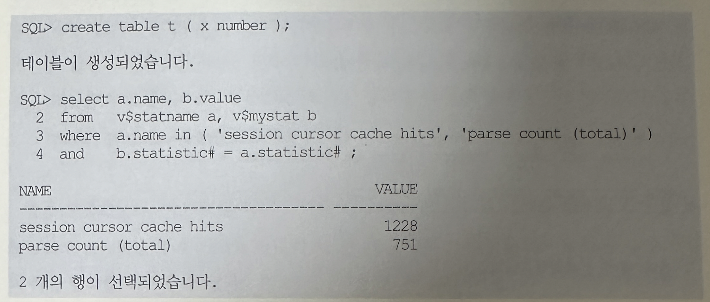
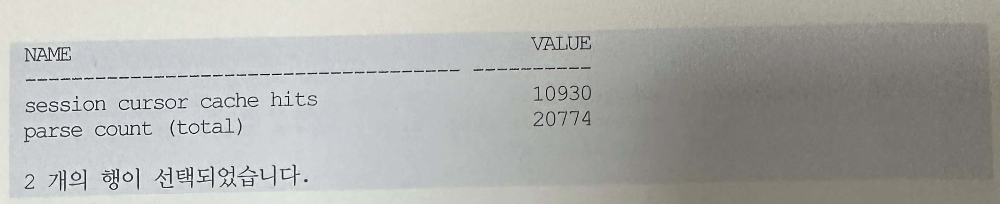

## 07 세션 커서 캐싱
- 지금까지 설명한 것처럼 커서를 공유할 수 있는 형태로 SQL을 작성하면 하드파싱을 최소화해 궁극적으로 시스템 확장성을 높일 수 있음
- 그런데 하드파싱을 하지 않더라도 SQL 구문을 분석해서 해시 값을 계산하고 library Cache 래치를 획득한 후 라이브러리 캐시에서 커서를 탐색하는 과정 자체도 부담스러운 작업임
- 특히 SQL 동시 수행이 많을 때는 경합까지 발생하므로 시스템에 부하를 주게 됨

- 당연한 얘기일 수 있지만 SQL수행 횟수가 높을 때 파싱 관련 경합도 함께 증가하는 것을 알 수 있음
- 그러면 파싱 경합을 줄여 라이브러리 캐시 효율을 높이겠다고 SQL수행횟수를 제한해야 되나?
- 이것은 구더기 무서워 장 못 담그는 격이며, 고가의 DBMS를 사다놓고 부하가 될 수 있으니 조금만 일을 시키라는 것과 다름 없음
- 무론 하나의 SQL로 처리할 수 있는데 불필요하게 커서를 열어 루프를 돌면서 또 다른 SQL을 반복 수행하도록 개발하는 경우가 있기는 함
- 그런 경우가 아니라면 SQL 수행 횟수를 줄일 수는 없는 것
- 이에 SQL 수행횟수를 줄이지 않고도 Parse Call에 따른 부하를 가볍게 하려는 노력과 시도가 DBMS 벤더 차원에서 계속 이루어지고 있음
- 따라서 개발자 및 DBA는 그런 기능들을 잘 활용할 필요가 있음
- 앞에서 커서를 정의하면서, Shared pool에 위치한 공유 커서를 실행하려고 PGA로 인스턴스화 한 것이 세션 커서라고 설명함
- 쿼리를 수행한 후에 커서를 닫으면 세션 커서를 위해 할당된 메모리는 물론 공유 커서를 가리키는 포인터까지 바로 해제됨
- 그 다음에 같은 SQL을 수행하면 커서를 오픈하기 위한 라이브러리 캐시 탐색 작업을 다시 해야 함
- 이에 오라클은 자주 수행하는 SQL에 대한 세션 커설르 세션 커서 캐시에 저장할 수 있는 기능을 제공하는데, 이를 세션 커서 캐싱이라고 함
- 이 기능을 활성화하면, 커서를 닫는 순간 해당 커서의 Parse Call 횟수를 확인해 보고 그 값이 3보다 크거나 같으면 세션 커서를 세션 커서 캐시로 옮김
- 세션 커서 캐시에는 SQL 텍스트와 함께 공유 커서를 가리키는 포인터를 저장함
- 커서는 닫힌 상태지만 공유 커서에 대한 참조를 유지하기 때문에 다음 수행 시 더 빨리 커서를 오픈할 수 있음
- 따라서 자주 수행되는 SQL문에 의해 발생하는 라이브러리 캐시 부하를 경감시킬 수 있음
- 즉 SQL문을 파싱해서 구문을 분석하고 라이브러리 캐시에서 커서를 찾는 과정에서 소모되는 CPU 사용량을 줄일 수 있음은 물론 소프트 파싱 과정에 발생하는 래치 요청 횟수를 감소시키는 효과를 가져옴
- 세션 커서 캐시 내에서도 LRU 알고리즘을 사용함으로써 새로운 엔트리를 위한 공간이 필요할 때마다 기존 세션 커서 중 사용 빈도가 낮은 것부터 밀어냄

#### session_cached_cursors
- 얼마나 많은 세션 커서를 캐싱할지를 지정하는 파라미터로서, 이 값을 0보다 크게 설정하면 Parse Call이 발생할 때마다 라이브러리 캐시를 탐색하기 전에 세션 커서 캐시를 먼저 살펴봄
- 거기서 커서를 찾으면 라이브러리를 탐색하지 않고도 곧바로 공유 커서를 찾아 커서를 오픈할 수 있음
- 참고로 탐색을 위한 래치 획득은 피할 수 있지만 찾은 커서에 Pin을 설정하고 나중에 다시 해제하는 과정에서 발생할 수 있는 충돌을 막아야 하므로 library 캐시 래치를 완전히 회피하지는 못함

- v$sql을 보면 user_opening과 users_executing 두 컬럼이 있는데, 세션 커서 캐싱기능을 계속 설명하기에 앞서 이 두값의 의미를 먼저 살펴봄
- users_opening
  - 공유 커서를 참조하고 있는 세션 커서의 수를 보여줌
  - 수행을 마쳐 커서를 닫았다 하더라도 참조를 버리지 않은 채 세션 커서의 캐시로 옮겨진다면 여기에 집계됨
- users_executing
  - 해당 SQL을 현재 실행중인 즉 커서가 열려있는 세션 커서의 수를 보여줌
  - DML일 때는 수행을 마칠 때 커서가 자동으로 닫히지만 select문은 EOF(end of fetch)에 도달했을 때 커서가 닫힘
  - 따라서 토드나 오렌지같은 쿼리 툴에서 대량의 데이터를 Array 단위로 Fetch 하는 도중에 이 값을 조회해보면 1 이상의 값을 보임
  - 데이터를 끝까지 Fetch 하고 나면 이 값은 1만큼 줄어듬
  - 참고로 SQL을 수행중일 때는 공유 커서에 대한 참조를 유지한 상태어야 하므로 이 값은 user_opening보다 항상 작거나 같음
- 설명했듯이 커서를 닫더라도 세션 커서 캐시에서 공유 커서를 참조하고 있을 때는 users_opening에 계수됨.
- 따라서 이 두 값의 변화를 관찰함으로써 세션 커서 캐싱의 작동 원리를 파악할 수 있음

- 세션 커서 캐싱 기능을 활성화한 상태에서 같은 SQL에 대한 Parse Call이 반복해서 세 번 일어나는 순간 users_opening 값이 0에서 1로 바뀐 것을 볼 수 있음
- user_executing은 계속 0이므로 수행을 마치자마자 커서는 바로 닫히는 것을 알 수 있음
- 그리고 세번째 수행되기 전까지 users_opening 값이 0인 것을 통해 커서를 닫자마자 공유 커서에 대한 참조까지 곧바로 해제하는 것을 알 수 있음
- users_opening에서 open의 의미가 실제 커서가 열려 있음을 의미하는 것이 아님을 기억할 필요가 있음
- 커서는 닫힌 상태이지만 공유 커서에 대한 참조를 유지하기 때문에 다음 수행 시 더 빨리 커서를 오픈할 수 있는 것임
- 톰 카이트는 자신의 저서인 Effective Oracle By Design에서 세션 커서 캐싱 기능을 Softer Soft Parses라고 표현한 바 있음
- 같은 SQL문을 매번 하드파싱하지 않고 라이브러리 케시에 공유된 커서를 반복 재사용하는 소프트 파스보다 더 소프트하다는 것을 잘 표현해주고 있음
- 이 기능의 활용 빈도는 session cursor cache hits항목을 통해 측정할 수 있는데, 아래 테스트 결과를 통해 살펴본다

- 현재까지의 session cursor cache hits, parse count(total)두 항목에 대한 값을 기억한다.

- parse count(total) 항목의 증가량을 통해, PL/SQL문에서 100개의 다른 Insertansdmf 10000번 수행하는 동안 10000번 가량 Parse Call이 발생한 것을 알 수 있음
- session_cached_cursors 파라미터를 0으로 설정했으므로, session cursor cache hits 항목은 전혀 값이 증가하지 않음
- 이제 session_cached_cursors 파라미터를 100으로 설정하고 같은 테스트를 진행해 본다.

- session_cached_cursors파라미터를 100으로 설정하니까 100개의 다른 insertansdmf 10000번 수행하는 동인 session cursor cache hits 항목도 10000번 가까이 증가한 것을 볼 수 있음
- 여기서 parse call도 여전히 10000번 가량 증가한 것을 볼 수 있음
- 이를 통해 커서를 세션 커서에 캐싱하다고 parse Call까지 줄지는 않는 것을 알 수 있음
- 다시 얘기하지만, 세션 커서 캐싱 기능은 parse call을 대체하기 보다 parse call 부하를 감소시키는 기능으로 이해해야 함

- 만약 애플리케이션 특성상 세션 커서 캐싱 기능이 효과를 발휘할 수 있는 구조라면, DBA와 협의하여 시스템 레벨에서 session_cached_cursors 파라미터를 조정하는 것을 고려해 볼 수 잇음
- 그리고 이 파라미터는 세션 레벨에서도 변경이 가능하므로, 정해진 개수의 SQL을 반복 수행하는 프로그램 모듈만 설정 값을 늘려 주더라도 라이브러리 캐시 부할르 줄이는 데 도움이 됨
- PL/SQL에서는 SQL 커서를 자동으로 캐싱해 주는데, 10g부터는 이 기능이 session_cached_cursors 파라미터를 0보다 크게 설정할 때만 작동함
- 따라서 10g 이후 버전에서는 세션 커서 캐싱 기능을 반드시 활성화 해야함