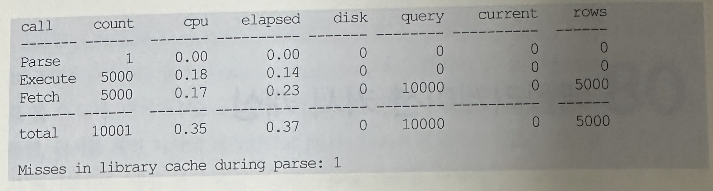
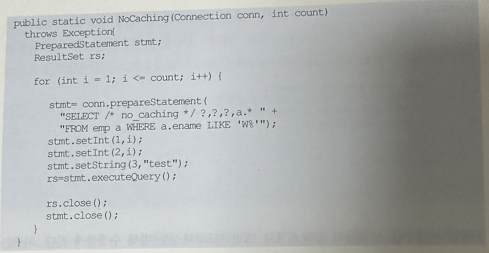
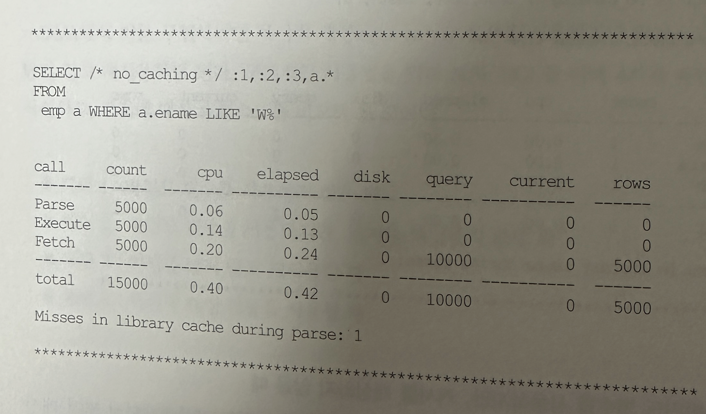

### 애플리케잇현 커서 캐싱
- 세션 커서를 캐싱하면 SGA의 공유 커서를 빠르게 찾아서 커서를 오픈할 수 있음
- 하지만 세션 커서 캐시에 있는 SQL을 수행하더라도 공유 커서 힙을 Pin하고 실행에 필요한 메모리 공간을 PGA에 할당하는 등의 작업은 반복하게 됨
- 이 과정마저 생략하고 빠르게 SQL을 수행하는 방법이 있는데 이를 애플리케이션 커서 캐싱이라고 함
- 개발 언어마다 구현 방법이 다르므로 이 기능을 활용하려면 API를 잘 살펴봐야 함
- Pro.C에서는 SQL을 수행하는 부분을 아래처럼 두 개 옵션으로 감싸면 커서를 놓지 않고 반복 재사용함

```
for(;;) {
    EXEC ORACLE OPTION (HOLD_CURSOR=YES);
    EXEC ORACLE OPTION (HOLD_CURSOR=NO);
    EXEC SQL INSERT...
    EXEC ORACLE OPTION (HOLD_CURSOR=YES);
}
```

- HOLD_CURSOR 옵션은 애플리케이션 커서와 세션 커서와의 관계를 다루는 반면 RELEAS_CURSOR옵션은 공유 커서와 세션 커서와의 관계를 다룸
- 일반적으로는 Execute Call횟수만큼 Parse Call이 반복되지만 애플리케이션 커서 캐싱 기능을 이용하면 공유 커서를 Pin한 채 반복 수행하므로 Parse Call이 최초 한번만 발생하고 이후로는 발생하지않음
- 아래는 애플리케이션에서 커서를 캐싱한 채 같은 SQL을 5000번 반복 수행했을 때의 SQL 트레이스 결과



- parse Call이 한번만 발생했고 이후 4999번 수행할 때는 Parse Call이 전혀 발생하지 않았음을 알 수 있음(최초 Parse Call이 발생한 시점에 라이브러리 캐시에서 커서를 찾지 못해 하드파싱을 수행한 사실도 라이브러리 캐시 miss 항목을 통해 읽을 수 있어야 함)
- JAVA에서 이를 구현하려면 묵시성 캐싱 옵션을 사용하거나 Statement를 닫지 않고 재사용하면 됨
- 구체적인 사용법을 익혀본다
- SQL을 아래 4가지 패턴으로 작성하고 각각에 대한 수행속도를 비교해 볼것임
  - 패턴 1 : 바인드 변수를 사용하지 않을 때
  - 패턴 2 : 바인드 변수를 사용하지만, 커서를 캐싱하지 않을 때
  - 패턴 3 : 커서를 닫지 않고 재사용할 때
  - 패턴 4 : 묵시성 캐싱 기능을 사용할 때

#### 1. 바인드 변수를 사용하지 않을 때
```
public class ParseCall (
    public static void NoBinding(Connection conn, int count)
    throws Exception{
        PreparedStatement stmt;
        ResultSet rs;

        for(int i = 1; i <= count; i++) {
            stmt = conn.prepareStatement(
                "SELECT /* no_binding */" + i + "," + i + ",'test', a.* " +
                "FROM emp a WHERE a.ename LIKE 'W%'"
            )
            rs=stmt.executeQuery();

            rs.close();
            stmt.close();
        }
    }
)
```
- 바인드 변수를 사용하지 않았으므로 매번 하드 파싱을 반복 수행하게 됨
- 아래는 SQL 트레이스에서 맨 마지막 것만을 추출한 것


#### 2. 바인드 변수를 사용하지만, 커서를 캐싱하지 않을 때
- 아래는 바인드 변수를 사용했지만 본 절에서 설명하고 있는 애플리케이션 커서 캐싱 기법을 사용하지 않음



- 따라서 Parse Call이 Execute Call 횟수만큼 발생하게 됨
- 하지만 하드파싱은 전혀 발생하지 않거나 한번쯤은 발생함
- 아래 트레이스 결과가 이를 증명함



#### 4. 커서를 닫지 않고 재사용할 때
- 이번에는 아래처럼 PreparedStatement를 루프문 바깥에 선언하고 루프 내에서 반복 사용하다가 루프를 빠져 나왔을 때 닫음
- JAVA PreparedStatement 객체가 앞에서 설명했던 '애플리케이션 커서'에 해당함


- 아래 트레이스 결과를 보면, 앞에서 HOLD_CURSOR 와 RELEASE_CURSOR 옵션을 사용한 PRO*C 사례에서 보앗듯이 Parse Call이 한번만 발생함

