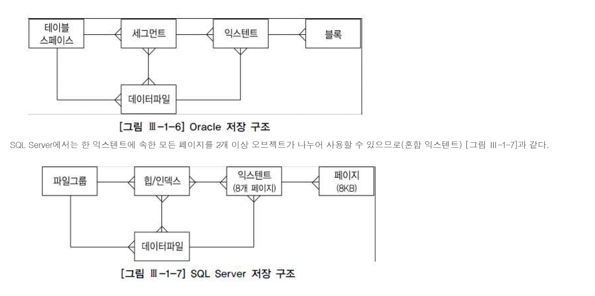

## 1. 아키텍쳐 개관

### 모델링의 정의
- DBMS마다 데이터베이스에 대한 정의가 조금씩 다른데, Oracle에서는 디스크에 저장된 데이터 집합을 데이터베이스라고 부름
- 그리고 SGA 공유메모리 영역과 이를 액세스하는 프로세스 집합을 합쳐서 인스턴스라고 함
- 기본적으로 하나의 인스턴스가 하나의 데이터베이스만 액세스하지만 RAC(Real application cluster)환경에서는 여러 인스턴스가 하나의 데이터베이스를 액세스할 수 있음
- 하나의 인스턴스가 여러 데이터베이스를 액세스할 수 없음

### SQL Server 아키텍쳐
- SQL Server 아키텍쳐를 간단히 표현하자면 Server는 하나의 인스턴스당 최고 32767개의 데이터베이스를 정의해 사용할 수 있음
- 기본적으로 master model msdb tempdb등의 시스템 데이터베이스가 만들어지며 여기에 사용자 데이터베이스를 추가로 생성하는 구조
- 데이터베이스 하나를 만들 때마다 주(Primary 또는 main) 데이터 파일과 트랜잭션 로그 파일이 하나씩 생기는데 전자는 확장자가 mdf이고 후자는 idf임
- 저장할 데이터가 많으면 보조 데이터 파일을 추가할 수 있으며 확장자는 ndf임

## 2. 프로세스
- SQL Server는 스레드 기반 아키텍쳐 이므로 프로세스 대신 쓰레드라는 표현을 써야함
- SQL Server 뿐만 아니라 Oracle도 Windows 버전에선 쓰레드를 사용하지만 프로세스와 일일이 구분하면서 설명하려면 복잡해 지므로 특별히 쓰레드를 언급해야 할 경우가 아니라면 간단히 프로세스로 통칭 하기로 함
- 잠시 후 표로써 정리해보겠지만 주요 스레드의 역할은 Oracle 프로세스와 크게 다르지 않음
- 프로세스는 서버 프로세스와 백그라운드 프로세스 집합으로 나뉨
- 서버 프로세스는 전면에 나서 사용자가 던지는 각종 명령을 처리하고 백그라운드 프로세스는 뒤에서 묵묵히 주어진 역할을 수행함

### 서버 프로세스
- 서버 프로세스는 사용자 프로세스와 통신하면서 사용자의 각종 명령을 처리하며, SQL Server에선 Worker 쓰레드가 같은 역할을 담당
- 좀 더 구체적으로 말해, SQL를 파싱하고 필요하면 최적화를 수행하며, 커서를 열어 SQL을 실행하면서 블록을 읽고, 읽은 데이터를 정렬해서 클라이언트가 요청한 결과집합을 만들어 네트워크를 통해 전송하는 일련의 작업을 모두 서버 프로세스가 처리해줌
- 스스로 처리하도록 구현되지 않은 기능, 이를테면 데이터 파일로부터 DB 버퍼 캐시로 블록을 적재하거나 Dirty 블록을 캐시에서 밀어냄으로 Free 블록을 확보하는 일, 그리고 Redo 로그 버퍼를 비우는 일 등은 OS, I/O 서브시스템, 백그라운드 프로세스가 대신처리하도록 시스템 Call을 통해 요청함
- 클라이언트가 서버 프로세스와 연결하는 방식은 DBMS마다 다르지만 Oracle을 예로 들면 전용 서버 방식과 공유서버 방식, 두가지가 존재

#### 1. 전용서버 방식
- 순서
  - 1. 사용자가 Listener에 연결요청
  - 2. 리스너는 프로세스 생성 및 연결요청 상속
  - 3. 서버는 Resend 패킷 전송
  - 4. 연결 후 작업 요청
  - 5. 처리 후 결과 전송
- 처음 연결 요청을 받는 리스너가 서버 프로세스를 생성해주고, 이 서버 프로세스가 단 하나의 사용자 프로세스를 위해 전용(Declicated) 서비스르 지공한다는 점이 특징
- 만약 SQL을 수행할 때마다 연결 요청을 반복하면 서버 프로세스의 생성과 해제도 반복하게 되므로 DBMS에 매우  큰 부담을 주고 성능을 크게 떨어뜨려버림
- 따라서 전용 서버 방식을 사용하는 OLTP성 애플리케이션에선 Connection Pooling기법을 필수적으로 사용해야 함
- 예를들어 50개의 서버 프로세스와 연결된 50개의 사용자 프로세스를 공유해서 반복 재사용하는 방식

#### 2. 공유서버 방식
- 공유서버는 말 그대로 하나의 서버 프로세스를 여러 사용자 세션이 공유하는 방식으로 앞서 설명한 Connection Pooling 기법을 DBMS 내부에 구현해놓은 것으로 생각하면 쉬움
- 즉, 미리 여러개의 서버 프로세스를 띄워 놓고 이를 공유해서 반복 재사용한다
- 공유 서버 방식으로 Oracle에 접속하면 사용자 프로세스는 서버 프로세스와 직접 통신하지 않고 Dispatcher 프로세스를 거침
- 사용자 명령이 Dispatcher에게 전달되면 Dispatcher는 이를 SGA에 있는 요청 큐에 등록함
- 이후 가장 먼저 가용해진 서버 프로세스가 요청 큐에 있는 사용자 명령을 꺼내서 처리하고 그 결과를 응답 큐에 등록함
- 응답 큐를 모니털이하던 Dispatcher가 응답 결과를 발견하면 서용자 프로세스에게 전송해 줌

### 백그라운드 프로세스

|Oracle|SQL Server|설명|
|--|--|--|
|System Monitor </br> (SMON)|Database CleanUp</br> Shrinking thread|장애가 발생한 시스템을 재기동할 때 인스턴스 복구를 수행하고, 임시 세그먼트와 익스텐트를 모니터링|
|Process Monitor </br>(PMON)|Open Data Services(OPS)|이상이 생긴 프로세스가 사용하던 리소스를 복구한다
|Database Writer(DBWn)|Lazywriter thread|버퍼 캐시에 있는 Dirty 버퍼를 데이터 파일에 기록함|
|Log Writer(LGWR)|Log writer thread|버퍼 캐시에 있는 Dirty 버퍼를 데이터 파일에 기록|
|Archiver(ARCn)|N/A|꽉 찬 Redo 로그가 덮어 쓰여지기 전에 Archive 로그 디렉토리로 백업|
|Checkpoint(CKPT)|Database Checkpoint thread|Checkpoint 프로세스는 이전에 CheckPoint가 일어났던 마지막 시점 이후의 데이터베이스 변경 사항을 데이터 파일에 기록하도록 트리거링하고, 기록이 완료되면 현재 어디까지 기록했는지를 컨트롤 파일과 데이터 파일 헤더에 저장함 <br> 좀 더 자세히 설명하면 Write Ahead Logging 방식(데이터 변경 전에 로그부터 남기는 메커니즘)을 사용하는 DBMS는 Redo 로그에 기록해 둔 버퍼 블록에 대한 변경 사항 중 현재 어디까지를 데이터 파일에 기록했는지 체크포인트 정보를 관리해야 함. <br> 이는 버퍼 캐시와 데이터 파일이 동기화된 시점을 가리키며, 장애가 발생하면 마지막 체크포인트 이후 로그 데이터만 디스크에 기록함으로 인스턴스를 복구할 수 있도록 한느 용도로 사용됨 <br> 이 정보를 갱신하는 주기가 길수록 장애 발생 시 인스턴스 복구 시간도 길어짐
|Recoverer(RECO)|Distributed Transaction Coordinator(DTC)|분산 트랜잭션 과정에 발생한 문제를 해결함|

## 3. 파일구조

### 데이터 파일
- Oracle과 SQL Server 모두 물리적으로는 데이터 파일에 데이털르 저장하고 관리함
- 공간을 할당하고 관리하기 위한 논리적인 구조도 크게 다르지 않지만 약간의 차이는 있음

#### 블록(=페이지)
- 대부분 DBMS에서 I/O는 블록 단위로 이루어짐
- 데이터를 읽고 쓸 때의 논리적인 단위가 블록인 것
- Oracle은 블록이라고 하고, SQL Server는 페이지라고 함
- Oracle은 2KB 4KB 8KB 16KB 32KB 64KB의 다양한 블록 크기를 사용할 수 있지만, SQL Server에서는 8KB 단일 크기를 사용
- 블록 단위로 I/O한다는 것은 하나의 레코드에서 하나의 칼럼만을 읽으려 할 때도 레코드가 속한 블록 전체를 읽게 됨을 뜻함
- SQL 성능을 좌우하는 가장 중요한 성능지표로 액세스하는 블록 개수이며 옵티마이저의 판단에 가장 큰 영향을 미치는 것도 액세스해야 할 블록 개수임
- 옵티마이저의 판단에 가장 큰 영향을 미치는 것도 액세스해야 할 블록 개수
- 예를 들어 옵티마이저가 인덱스를 이용해 테이블을 액세스할지 아니면 Full Table Scan할지를 결정하는 데 있어 가장 중요한 판단 기준은 읽어야 할 레코드 수가 아니라 읽어야 하는 블록 개수

#### 익스텐트
- 데이터를 읽고 쓰는 단위는 블록이지만, 테이블 스페이스로부터 공간을 할당하는 단위는 익스텐트임
- 테이블이나 인덱스에 데이터를 입력하다가 공간이 부족해지면 해당 오브젝트가 속한 테이블 스페이스(물리적으로는 데이터 파일)로부터 추가적인 공간을 할당받는데, 이때 정해진 익스텐트 크기의 연속된 블록을 할당받음
- 예를 들어 블록 크기가 8KB인 상태에서 64KB단위로 익스텐트를 할당하도록 정의 한다면, 공간이 부족할 때마다 테이블 스페이스로부터 8개의 연속된 블록을 찾아(찾지 못하면 새로 생성) 세그먼트에 할당해줌
- 익스텐트 내 블록은 논리적으로 인접하지만, 익스텐트끼리는 서로 인접하지 않음
- 예를 들어, 어떤 세그먼트에 익스텐트 2개가 할당되는데, 데이터 파일 내에서 이 둘이 서로 멀리 떨어져 있을 수 있음
- 참고로 Oracle은 다양한 크기의 익스텐트를 사용하지만, SQL Server에선 8개 페이지의 익스텐트만 사용한다.
- 페이지 크기도 8KB로 고정이므로 익스텐트는 항상 64KB인 셈임
- 또한 Oracle은 한 익스텐트에 속한 모든 블록을 단일 오브젝트가 사용하지만, SQL Server에서는 2개 이상의 오브젝트가 나누어 사용할 수도 있음
- SQL Server는 다음 2가지 타입의 익스텐트를 사용함
  - 균일 익스텐트
    - 64KB 이상의 공간을 필요로 하는 테이블이나 인덱스를 위해 사용되며, 8개 페이지 단위로 할당된 익스텐트를 단일 오브젝트가 모두 사용됨
  - 혼합(Mixed) 익스텐트
    - 한 익스텐트에서 할당된 8개 페이지를 여러 오브젝트가 나누어 사용하는 형태임
    - 모든 테이블이 처음에는 혼합 익스텐트로 시작하지만 64kb를 넘으면서 2번째부터 균일 익스텐트를 사용함

#### 세그먼트
- SQL Server에서는 세그먼트라는 용어를 사용하지 않지만, 힙 구조 또는 인덱스 구조의 오브젝트가 여기에 속함
- 세그먼트는 테이블 인덱스 Undo처럼 저장공간을 필요로 하는 데이터베이스 오브젝트임
- 저장 공간을 필요로 한다는 것은 한 개 이상의 익스텐트를 사용함을 뜻함
- 테이블을 생성할 때 내부적으로는 테이블 세그먼트가 생성됨
- 인덱스를 생성할 떄 내부적으로 인덱스 세그먼트가 생성됨
- 달느 오브젝트는 세그먼트와 1:1 대응 관계를 갖지만 파티션은 1:M 관계를 가짐
- 즉 파티션 테이블을 만들면, 내부적으로 여러개의 세그먼트가 만들어짐
- 한 세그먼트는 자신이 속한 테이블 스페이스 내 여러 데이터 파일에 걸쳐 저장될 수 있음
- 즉 세그먼트에 할당된 익스텐트가 여러 데이터 파일이 흩어져 저장되는 것이며, 그래야 디스크 경합을 줄이고 I/O 분산 효과를 얻을 수 있음

#### 테이블 스페이스
- 테이블 스페이스는 세그먼트를 담는 콘테이너임
- 여러 데이터 파일로 구성됨, SQL Server의 파이르 그룹이 Oracle 테이블 스페이스에 해당됨
- 데이터는 물리적으로 데이터 파일에 저장되지만, 사용자가 데이터파일을 직접 선택하진 않음
- 사용자는 세그먼트를 위한 테이블 스페이스를 저장할 뿐 실제 값을 저장할 데이터 파일을 선택하고 익스텐트를 할당하는 것은 DBMS의 몫임
- 각 세그먼트는 정확히 한 테이블 스페이스에만 속하지만, 한 테이블 스페이스에는 여러 테이블 스페이스에 걸쳐 저장될 수 없다는 것
- 하지만 앞서 얘기했듯이 한 세그먼트가 여러 데이터 파일에 걸쳐 저장될 수는 있음
- 한 테이블 스페이스가 여러 데이터 파일에 걸쳐 저장될 수는 있음
- 한 테이블 스페이스가 여러 데이터 파일로 구성되기 때문임
- 지금까지 설명한 내용을 요약하면 다음과 같음



### 임시 데이터 파일
- 임시 데이터 파일으 특별한 용도로 사용됨
- 대량의 정렬이나 해시 작업을 수행하다가, 메모리 공간이 부족해지면 중간 결과 집합을 저장하는 용도
- 임시 데이터 파일에 저장되는 오브젝트는 말 그디로 임시로 저장하다 자동으로 삭제됨
- Redo 정보를 생서하지 않기 때문에 나중에 파일에 문제가 생겼을때 복구되지 않음
- 따라서 백업할 필요도 없음
- Oracle에선 임시 테이블 스페이스를 여러개 생성해두고, 사용자마다 별도의 임시 테이블 스페이스를 지정해줄 수 있음

```
create temporary tablespace big_temp tempfile '/usr/local/oracle/oradata/ora10g/big_temp.dbf' size 2000m;
alter user scott temporary tablespace big_temp;
```
- SQL Server는 단 하나의 tempdb 데이터베이스를 사용함,tempdb는 전역 리소스로서 시스템에 연결된 모든 사용자의 임시 데이터를 여기에 저장함.

### 로그 파일
- DB버퍼 캐시에 가해지는 모든 변경사항을 기록하는 파일을 Oracle은 Redo로그라고 부름, SQL Server에서는 트랜잭션 로그라고 부름
- 변경된 매모리 버퍼 블록을 디스크 사으이 데이터 블록에 기록하는 작업은 Random I/O 방식으로 이루어지기 때문에 느림
- 반면 로그 기록은 append 방식으로 이루어지기 때문에 상대적으로 매우 빠름
- 따라서 대부분 DBMS는 버퍼 블록에 대한 변경사항을 건건이 데이터 파일에 기록하기 보다 우선 로그 파일에 Append 방식으로 빠르게 기록하는 방식을 사용함.
- 그러고 나서 버퍼 블록과 데이터 파일 간 동기화는 적절한 수단을 이용해 나중에 배치. 방식으로 일괄 처리함
- 사용자의 갱신 내용이 메모리상의 버퍼 블록에만 기록된 . 채아직 디스크에 기록되지 않더라도, Redo 로그를 믿고 빠르게 커밋을 완료한다는 의미에서 이를 'Fast Commit'
- 인스턴스 장애가 발생하더라도 로그 파일을 이용해 언제든 복구 가능하므로 안심하고 커밋을 완료할 수 있는 것
- Fast commit 은 빠르게 트랜잭션을 처리해야 하는 모든 DBMS의 공통적인 메카니즘임

#### Online Redo 로그
- 캐시에 저장된 변경 사항이 아직 데이터 파일에 기록되지 않은 상태에서 정전 등으로 인스턴스가 비정상 종료이면, 그떄 까지의 작업 내용을 모두 잃게 됨
- 이러한 트랜잭션 데이터의 유실을 대비하기 위해 Oracle은 Online Redo 로그를 사용함
- 마지막 체크포인트 이후부터 사고 발생 직전까지 수행되었던 트랜잭션들을 Redo 로그를 이용해 재현하는 것이며, 이를 캐시 복구라고 함
- Online Redo 로그는 최소 두개 이상의 파일로 구성됨
- 현재 사용중인 파일이 꽉 차면 다음 파일로 로그 스위칭(log switching)이 발생하며, 계속 로그를 써 나가다가 모든 파일이 꽉 차면 다시 첫 번쨰 파일 ㅂ터 재사용하는 라운드 로빈 방식을 사용함

#### 트랜잭션 로그
- 트랜잭션 로그는 Oracle의 Online Redo 로그와 대응되는 SQL Server의 로그 파일임
- 주 데이터 파일임
- 즉 데이터베이스마다 트랜잭션 로그 파일이 하나씩 생기며 확장자는 Id임
- 트랜잭션 로그 파일은 내부적으로 '가상 로그 파일'이라 불리는 더 작은 단위의 세그먼트로 나뉘며, 이 기상 로그 파일의 갯수가 너무 많아지지 않도록(즉 조각화가 발생하지 않도록) 옵션을 지정하는게 좋음
- 예를 들어 로그 파일을 애초에 넉넉한 크기로 만들어 자동 증가가 발생하지 않도록 하거나, 어쩔 수 없이 자동 증가한다면 증가하는 단위를 크게 지정하는 것

#### Archived(Offline)Redo 로그
- Archived Redo로그는 Oracle에서 Online Redo 로그가 재사용 되기 전에 다른 위치로 백업해 둔 파일을 말함
- 디스크가 깨지는 등 물리적인 저장 매체에 문제가 생겼을 때 데이터베이스(또는 미디어) 복구를 위해 사용됨
- 참고로 SQL Server에는 Archived Redo 로그에 대응되는 개념이 없음


## 4. 메모리 구조
- 메모리 구조는 시스템 공유 메모리 영역과 프로세스 전용 메모리 영역으로 구분됨
- 지금부터 시스템 공유 메모리 영역의 구성 요소인 DB 버퍼 캐시, 공유 풀, 로그 버펄르 순서대로 살펴보고 마지막으로 프로세스 전용 메모리 영역인 Process Global Area를 살핀다.

#### 시스템 공유 메모리 영역
- 시스템 공유 메모리라는 말은 . 말그대로 여러 프로세스(또는 스레드)가 동시에 액세스할 수 있는 메모리 영역으로서, Oracle에서는 'System Global Area(SGA)', SQL Server에서는 'Memory Pool'이라고 부름
- 공유 메모리를 구성하는 캐시 영역은 그 외에 Large 풀(Large Pool), 자바 풀(Java Pool) 등을 포함하고, 시스템 구조와 제어 구조를 캐싱하는 영역도 포함함
- 시스템 공유 메모리 영역은 여러 프로세스에 공유되기 때문에, 내부적으로 래치 버퍼 Lock 라이브러리 캐시 Lock/Pin 같은 액세스 직렬화 메커니즘이 사용됨

#### 프로세스 전용 메모리 영역
- Oracle은 프로세스 기반 아키텍쳐 이므로 서버 프로세스가 자신만의 전용 메모리 영역을 가질 수 있는데 이를 Process Global  Area(PGA)
- 데이터를 정렬하고 세션과 커서에 관한 상태 정보를 저장하는 용도로 사용함
- 쓰레드 기반 아키텍쳐를 사용하는 SQL Server는 프로세스 전용 메모리 영역을 갖지 않음
- 쓰레드는 전용 메모리 영역을 가질 수 없고, 부모 프로세스의 메모리 영역을 사용하기 떄문
- 참고로 Windows 버전 Oracle도 쓰레드를 사용하지만, 프로세스 기반의 Unix 버전과 같은 인터페이스를 제공하고 구조에 대한 개념과 설명도 구별하지 않음

### DB 버퍼 캐시
- DB 버퍼 캐시는 데이터 파일로부터 읽어 드린 데이터 블록을 담는 캐시 영역
- 인스턴스에 접속한 모든 사용자 프로세스는 서버 프로세스를 통해 DB 버퍼 캐시의 버퍼 블록을 동시에 (내부적으로는 버퍼 Lock을 통해 직렬화) 해서 엑세스 할 수 있음
- 일부 Direct Path Read 메커니즘이 작동하는 경우를 제외하면 모든 블록 읽기는 버퍼 캐시를 통해 이루어짐
- 즉 읽고자 하는 블록을 먼저 버퍼 캐시에서 찾아보고 없을 때 디스크에서 읽음
- 디스크에서 읽을 때도 먼저 버퍼 캐시에 적재한 후에 읽음
- 데이터 변경도 버퍼 캐시에 적재된 블록을 통해 이루어지며, 변경된 블록(Dirty 버퍼 블록)을 주기적으로 데이터 파일에 기록하는 작업은 DBWR 프로세스의 몫임
- 디스트 I/O 는 물리적으로 액세스 암(Arm)이 움직이면서 헤드를 통해 이루어지는 방면, 메모리 I/O는 전기적 신호에 불과하기 떄문에 디스크 I/O에 비교할 수 없을 정도로 빠름
- 디스크에 읽은 데이터 블록을 메모리 상에 보관해 두는 기능이 모든 데이터베이스 시스템에 필수적인 이유임

#### 버퍼 블록의 상태
- 모든 버퍼 블록은 아래 세가지 중 하나의 상태에 놓임
- Free 버퍼
  - 인스턴스 기동 후 아직 데이터가 읽히지 않아 비어있는(Clean 버퍼)이거나, 데이터가 담겼지만 데이터 파일과 서로 동기화 돼있는 상태여서 언제든지 덮어 써도 무방한 버퍼 블록을 말함
  - 데이터 파일로부터 새롤운 데이터 블록을 로딩하려면 먼저 Free 버퍼를 확보해야 함
  - Free 상태인 버퍼에 변경이 발생하면 그 순간 Dirty 버퍼로 상태가 바뀜
- Dirty 버퍼
  - 버퍼에 캐시된 이후 변경이 발생하지만, 아직 디스크에 기록되지 않아 데이터 파일 블록과 동기화가 필요한 버퍼 블록을 말함
  - 이 버퍼 블록들이 다른 데이터 블록을 위해 재사용되려면 디스크에 먼저 기록되어야 하며, 기록되는 순간 Free 버퍼로 상태가 바뀜

#### LRU 알고리즘
- 버퍼 캐시는 유한한 자원이므로 모든 데이터를 캐싱해 둘 수 없음
- 따라서 모든 DBMS는 사용 빈도가 높은 데이터 블록 위주로 버퍼 캐시가 구성되도록 LRU(Last Recently used)알고리즘을 사용
- 모든 버퍼 블록 헤더를 LRU 체인에 연결해 사용 빈도 순으로 위치를 옮겨 가다, Free 버퍼가 필요해질 때면 액세스 빈도가 낮은 쪽(LRU end) 데이터 블록부터 밀어내는 방식임
- 아래 사진과같은 컨베이어 벨트를 생가갛면 LRU 알고리즘을 쉽게 이해할 수 있음


### 공유 풀
- 공유 풀은 딕셔너리 캐시와 라이브러리 캐시로 구성되며, 버퍼 캐시처럼 LRU 알고리즘을 사용함
- SQL Server 에서 같은 역할을 하는 메모리 영역을 프로시저 캐시라고 함

#### 딕셔너리 캐시
- 데이터베이스 딕셔너리는 테이블, 인덱스 같은 오브젝트는 물론 테이블 스페이스 , 데이터 파일, 세그먼트, 익스텐트, 사용자, 제약에 관한 메타 정보를 저장하는 곳
- 그리고 딕셔너리 캐시라는 말은 . 말그대로 딕셔너리 정보를 캐싱하는 메모리 영역
- '주문' 테이블을 예로 들면 입력한 주문 데이터는 데이터 파일에 저장하다가 버퍼 캐시를 경유해 읽히지만, 테이블 매타 정보는 딕셔너리 저장하다가 딕셔너리 캐시를 경유해 읽힘

#### 라이브러리 캐시
- 라이브러리 캐시(Library Cache)는 사용자가 수행한 SQL문과 실행계획, 저장 프로세저를 저장해 두는 캐시 영역이다.
- 사용자가 SQL 명령어를 통해 결과집합을 요청하면 이를 최적으로 (->가장 적은 리소스를 사용하면서 가장 빠르게) 수행하기 위한 처리 Plan이 있음
- 빠른 쿼리 수행을 위해 내부적으로 생성한 읽종의 프로세저와 같은 것이라고 이해하기 쉬움
- 쿼리 구문을 분석해서  문법 오류 및 실행 권한 등을 체크하고 최적화 과정을 거쳐 실행계획을 만들고, SQL 실행 엔진이 이해할 수 이쓴ㄴ 형태로 포맷팅하는 전 과정을 하드파싱이라고 함
- 특히 최적화 과정은 하드 파싱을 무겁게 만드는 가장 결정적 요인인데, 같은 SQL을 처리하고 이런 무거운 작업을 반복 수행하는 것은 매우 비효율적임
- 그것을 해결하기 위한 캐시 공간을 따로 두게 되었고, 그것이 바로 라이브러리 캐시 영역임
- 캐싱된 SQL과 그 실행계획의 재사용성을 높이는 것은 SQL 수행 성능을 높이고 DBMS 부하를 최소화하는 핵심 원리 . 중하나임

### 로그 버퍼
- DB 버퍼 캐시에 가해지는 모든 변경사항을 로그 파일에 기록한다고 앞서 설명함
- 로그 엔트리도 파일에 곧바로 기록하는 것이 아니라, 먼저 로그 버퍼에 기록함
- 건건이 디스크에 기록하기 보다 일정량을 모았다가 기록하면 훨씬 빠르기 때문
- 좀 더 자세히 설명하면 서버 프로세스가 데이터 블록 버퍼에 변경을 가하기 전에 Redo 로그 버퍼에 먼저 기록해 두면 주기적으로 LGWR 프로세스가 Redo 로그 파일에 기록함
- Oracle의 Redo 로그 Redo 로그 버퍼와 대비되는 개념이 SQL Server의 트랜잭션 로그, 로그 캐시임
- 변경이 가해진 Dirty 버퍼를 데이터 파일에 기록하기 전 항상 로그 버퍼를 먼저 로그 파일에 기록해야만 하는데 그 이유는 인스턴스 장애가 발생할 때면 로그 파일에 기록된 내용을 재현해 캐시 블록을 복구하고, 최종적으로 커밋되지 않은 트랜잭션은 롤백해야 하기 때문임
- 이때 로그 파일에는 없는 변경 내역이 이미 데이터 파일에 기록돼 있으면 사용자가 최종 커밋하지 않은 트랜잭션이 커밋되는 결과를 초래하기 때문이다.
- 정리해보면 버퍼 캐시 블록을 갱신하기 전에 변경사항을 먼저 로그 버퍼에 기록해야 하며, Dirty 버퍼를 디스크에 기록하기 전에 해당 로그 엔트리를 먼저 로그 파일에 기록해야 하는데, 이를 White Ahead Logging이라고 함
- 그리고 로그 버퍼를 주기적으로 로그 파일에 기록한다고 했는데 늦어도 커밋 시점에는 로그 파일에 기록해야 함(Log Force at commit)
- 메모리 상의 로그 버퍼는 언제든 유실될 가능성이 있기 때문
- 로그를 이용한 Fast Commit이 가능한 이유는 로그를 이용해 언제든 복구 가능하기 떄무닝라고 설명한 것을 상기하기 바람
- 다시 말하지만, 로그 파일에 기록했음이 보장돼야 안심하고 커밋을 완료할 수 있음
  
### PGA(Process Global Area)
- 각 Oracle 서버 프로세스는 자신만의 PGA(Process/Program/Private Global Area) 메모리 영역을 할당받고 이를 프로세스에 중속적인 공유 데이털르 저장하는 용도로 사용됨
- PGA는 다른 프로세스와 공유되지 않은 독립적인 메모리 공간으로서, 래치 메커니즘이 필요없어 똑같은 개수의 블록을 읽더라도 SGA 버퍼 캐시에서 읽는 것이 훨씬 빠름
- PGA 내에서 Sort Area가 할당되는 위치는 SQL 문 종류와 소트 수행 단계에 따라 다름.
- DML 문장은 하나의 Execute Call 내에서 모든 데이터 처리를 완료하였으므로 Sort Area는 UGA에 할당됨
- 앞에서 이미 설명한 것 처럼 쓰레드(Thread)기반 아키텍쳐를 사용하는 SQL Server는 프로세스 전용 메모리 영역을 갖지 않음
- 대신 데이터 정렬은 Memory Pool 안에 있는 버퍼 캐시에서 수행하며, 세션 관련 정보는 Memory Pool 안에 있는 Connection Context 영역에 저장됨

#### User Global Area(UGA)
- 전용 서버 방식으로 연결할 때는 프로세스와 세션이 1:1 관계를 갖지만, 공유 서버(Shared Server)방식으로 연결할 때는 1:M 관계를 갖는단
- 즉 세션이 프로세스 개수보다 많아질 수 있는 구조로, 하나의 프로세스가 여러개 세션을 위해 일함
- 따라서 . 각세션을 위한 독립적인 메모리 공간이 필요해지는데, 이를 UGA라고 함
- 전용 서버 방식이라과 해서 UGA를 사용하지 않는 것은 아님
- UGA는 전용 서버 방식으로 연결할 때는 PGA에 할당되고, 공유 서버 방식으로 연결할 때는 SGA에 할당됨
- 구체적으로 후자는 Large Pool이 설정됐을 때는 Large Pool에 그렇지 않을 때는 Shared Pool에 할당하는 방식임

#### Call Global Area(CGA)
- PGA에 해당하는 메모리 공간으로 CGA도 있음
- Oracle은 하나의 데이터베이스 Call을 넘어서 다음 Call 까지 계속 참조 되어야 하는 정보다 UGA에 담고, Call 이 진행되는 동안에만 데이터는 CGA에 담음
- CGA는 Parse Call, Execute Call, Fetch Call마다 매번 할당받음
- Call이 진행되는 동안 Recursive Call이 발생하면 그 안에서도 Parse Execute, Fetch 단계 별로 CGA가 추가로할당됨
- CGA에 할당된 공간은 하나의 Call이 끝나자 마자 해제되어 PGA로 반환됨

#### Sort Area
- 데이터 정렬을 위해 사용되는 Sort Area는 소트 오퍼레이션이 진행되는 동안 공간이 부족해질 때마다 청크(Chunk)단위로 조금씩 할당됨
- 세션마다 사용할 수 있는 최대 크기를 이전에는 sort_area_size 파라미터로 설정하였으나, 9I부터는 새로운 새로 생긴 workarea_size_policy 파라미터를 auto(기본 값)으로 설정하면 Oracle이 내부적으로 결정함


## 5. 대기 이벤트
- DBMS내부에서 활동하는 수 많은 프로세스 간에는 상호 작용이 필요
- 그 과정에서 다른 프로세스가 일을 마칠 때 까지 기다려야만 하는 상황이 자주 발생함
- 그 때마다 해당 프로세스는 자신이 일을 계속 진행할 수 있는 조건이 충족될 떄까지 수면 상태로 대기하는데 그 기간에 정해진 간격으로(1초 3초 등)각 대기 유형별 상태와 시간 정보가 공유 메모리 영역에 저장됨
- 대개 누적치만 저장되지만, 사용자가 원하면(10046 이벤트 트레이스를 활성화 하면)로그처럼 파일로 기록해 주기도 함
- 이러한 대기 정보를 Oracle 에서는 대기 이벤트라고 부름 SQL Server에서는 대기 유형(wait type)이라고 부름
- 대기 이벤트가 중요한 이유는, 1990년대 후반부터 이를 기반으로 한 Response Time Analysis 성능 관리 방법론이 데이터 베이스 성능 진단 분야에 일대 변혁을 가져왔기 때문
- 세션 또는 시스템 전체에 발생하는 병목 현상과 그 원인을 찾아 문제를 해결하는 방법과 과정을 다루는 이 방법론은 데이터 베이스 서버의  응답 시간을 서비스 시간과 대기 시간의 합으로 정의하고 있음

```
Response Time = Service Time + Wait Time = CPU Time + Queue Time
```
- 서비스 시간(Service Time) 은 프로세스가 정상적으로 동작하며 일을 수행한 시간을 말함
- CPU Time 과 같은 의미임
- 대기 시간(Wait Time)은 프로세스가 잠시 수행을 멈추고 대기한 시간을 말함
- 다른 말로 방법론은 Response Time을 위와 같이 정의하고, CPU Time과 Wait Time을 각각 break down하면서 서버의 일량과 대기. ㅣ간을 분석해 나감
- CPU Time은 파싱 작업에 소비한 시간인지 아니면 쿼리 본연의 오퍼레이션 수행을 위해 소비한 시간인지를 분석함
- Wait Time은 각각 발생한 대기 이벤트들을 분석해 가장 시간을 많이 소비한 이벤트 중심으로 해결 방안을 모색함
- Oracle 10g 기준으로 대기 이벤트 개수는 890여개에 이르는데, 그 중 가장 자주 발생하고 성능 문제와 직결되는 것들을 일부 소개한다
- 참고로 . 본단락은 oracle 중심으로만 설명하는데 SQL Server는 대기 유형이 잘 알려지지 않은 데다 아직 활용도가 낮은 편이기 때문
- 참고로 DB를 모니터링 하거나 성능 진단 업무를 담당하지 않는다면 아래 내용을 굳이 공부하지 않아도 됨
- 그럼에도 여기서 소개하는 이유는 DBMS 병목이 주로 어디서 발생하는지 그리고 어떤 이벤트로써 측정되는지를 간단하게나마 보여주기 위한 것이므로 부담없이 읽어 나가기 바람

### 라이브러리 캐시 부하

- 아래는 라이브러리 캐시에서 SQL 커서를 찾고 최적화 하는 과정에서 경합이 발생했음을 나타내는 대기 이벤트임
```
latch: shared pool
latch: library catch/li>
```

- 라이브러리 캐시와 관련해 자주 발생하는 대기 이벤트로는 아래 2가지가 있는데 이들은 수행중인 SQL이 참조하는 오브젝트에 다른 사용자가 DDL 문장을 수행할 때 나타남
```
library cache lock
library cache pin
```
- 라이브러리 캐시 관련 경합이 급증하면 심각한 동시성 저하를 초래하는데, 2절에서 이를 최소화하는 방안을 소개함

### 데이터베이스 Call과 네트워크 부하
- 아래 이벤트에 의해 소모된 시간은 애플리케이션과 네트워크 구간에서 소모된 시간으로 이해하면 됨
```
SQL *Net message from client
SQL *Net message to client
SQL *Net more data to client
SQL *Net more data from client

```
- SQL *Net message from client 이벤트는 사실 데이터베이스 경합과는 관련이 없음
- 클라이언트로부터 다음 명령이 올 때까지 Idle 상태로 기다릴 때 발생하기 때문
- 반면, 나머지 세개의 대기 이벤트는 실제 네트워크 부하가 원인일 수 있음
- SQL *Net message to client와 SQL *Net more data to client 이벤트는 클라이언트에게 메시지를 보냈는데 메시지를 잘 받았다는 신호가 정해진 시간보다 늦게 도착하는 경우에 나타나며 클라이언트가 너무 바쁜 경우일 수도 있음
- SQL *Net more data from client 이벤트는 클라이언트로부터 더 받을 데이터가 있는데 지연이 발생하는 경우임
- 이들 대기 이벤트를 해소하는 방안에 대해서는 3절에서 다룸

### 디스크 I/O 부하
- 아래는 모두 디스크 I/O가 발생할 때마다 나타나는 대기 이벤트임
```
db file sequential read
db file scattered read
direct path read
direct path write
direct path write temp
direct path read temp
db file parallel read
```
- 이들 중 특히 주목할 대기 이벤트는 db file sequential read와 db file scattered read임
- 전자는 Single Block I/O를 수행할 때 나타나는 대기 이벤트
- Single Block I/O는 말 그대로 한번의 I/O call 에 하나의 데이터 블록만 읽는 것을 말함
- 인덱스 블록을 읽을 때, 그리고 인덱스를 거쳐 테이블 블록을 액세스할 때 이 방식을 사용함
- 후자는 Muitiblock I/O를 수행할 때 나타나는 대기 이벤트임
- Multiblock I/O는 I/O Call이 필요한 시점에 인접한 블록들을 같이 읽어 메모리에 적재하는 것을 말함
- Table Full Scan 또는 Index Fast Full Scan 시 나타남
- 이들 대기 이벤트를 해소하는 방안에 대해서는 4절에서 다루며, 4장과 5장에서 더 자세히 다룸

### 버퍼 캐시 경합
- 아래는 버퍼 캐시에서 블록을 읽는 과정에 경합이 발생했음을 나타내는 대기 이벤트임
```
latch: cache buffers chains
latch: cache buffers lru chain
buffer busy waits
dfree buffer waits
```
- 버퍼 캐시에서 블록을 읽더라도 이들 대기 이벤트가 심하게 발생하는 순간 동시성은 현저히 저하되는데, 이들 대기 이벤트를 해소하는 방안도 디스크 I/O 부하 해소 방안과 다르지 않음
- 따라서 이들 경합의 해소 원리도 4절과 더불어 4장 5장에서 함께 다루게 됨

### Lock 관련 대기 이벤트
- 아래 enq로 시작되는 대기 이벤트는 Lock과 관련된 것으로서, 그 발생 원인과 해소 방안을 2장에서 일부 소개함
```
enq: TM - contrention
enq: TX - row lock contention
enq: TX - index contention
enq: TX - allocate ITL entry
enq: TX contention
latch free
```
- latch free는 특정 자원에 대한 래치를 여러 차례(2000 번 가량) 요청했지만 해당 자원이 계속 사용 중이어서 잠시 대기 상태로 빠질 때마다 발생하는 대기 이벤트임
- 래치(latch)는 우리가 흔히 말하는 Lock과 조금 다름
- Lock은 사용자 데이터를 보호하는 반면, 래치는 SGA에 공유돼 있는 갖가지 자료구조를 보호하는 목적으로 사용하는 가벼운 Lock임
- 래치도 일종의 Lock이지만 큐잉 메커니즘을 사용하진 않음
- 따라서 특정 자원에 액세스하려는 프로세스는 래치 획득에 성공할 때까지 시도를 반복할 뿐 우선권을 부여받지는 못함
- 이는 가장 먼저 래치를 요구했던 프로세스가 가장 늦게 래칠르 얻을 수 있음을 뜻함
- 지금까지 소개한 것 외에 자주 발생하는 대기 이벤트로는 아래와 같은 것들이 있음
```
log file sync/li
checkpoint completed
log file switch completion
log buffer space

```

## 2. 데이터 베이스 모델의 기본 개념의 이해

## SQL 처리과정
- 과거에 파일 시스템이나 dBase lll+. FoxPro Clipper같은 xBase 계열에서 데이터 베이스 프로그래밍 할 떄는 데이터 처리 절차를 프로그래머가 직접 작성해야 함
- 하지만 지금은 구조화된 질의언어(SQL, Structured Query Language)를 통해 사용자가 원하는 결과 집합만을 정의한다
- 그것을 얻는 데 필요한 처리 절차를 직접 기술하진 않음
- 우리 대신 프로그래밍 해 주는 엔진이 DBMS에 내장 돼 있기 때문
- SQL 옵티마이저가 바로 그런 역할을 해줌
- 옵티마이저에 의해 생성된 처리 절차를 실행계획이라 부르며 각 DBMS가 제공하는 인터페이스를 통해 아래와 같은 형태로 출력해볼 수 있음

### SQL 파싱
- 시스템 공유 메모리에서 SQL과 실행계획이 캐싱되는 영역을 오라클에서는 라이브러리 캐시, SQL Server에서는 프로시저 캐시라고 부른다고 1절에 설명함
- 지금부터는 설명의 편의를 위해 라이브러리 캐시로 부르기로 함
- 사용자가 SQL을 실행하면 제일 먼저 SQL 파서가 SQL문장에 문법적 오류가 없는지를 검사함
- 문법적으로 오류가 없으면 의미상 오류가 없는지를 검사하는데, 예를 들어 존재하지 않거나 권한이 없는 객체를 사용했는지, 또는 존재하지 않는 칼럼을 사용했는지 등을 검사함
- 이런 검사를 마치면 사용자가 발행한 SQL과 그 실행계획이 라이브러리 캐시에 캐싱됐는지를 확인함
- 만약 캐싱돼 있다면, 무거운 최적화 과정을 거치지 않고 곧바로 실행할 수 있음
  - 소프트파싱
    - SQL과 실행계획을 캐시에서 찾아 곧바로 실행 단계로 넘어가는 경우
  - 하드파싱
    - SQL과 실행계획을 캐시에서 찾지 못해 최적화 과정을 거치고 나서 실행단계로 넘어가는 경우를 말함
- 라이브러리 캐시는 해시 구조로 관리되기 때문에 SQL마다 해시 값에 따라 여러 해시 버킷으로 나누어 저장됨
- SQL을 찾을 때는 SQL 문장을 해시 함수에 입력해서 반환된 해시 값을 이용해 해당 해시 버킷을 탐색하면됨

### SQL 최적화
- 옵티마이저에 대해서는 3장에서 자세히 설명하지만, 여기서 간단히 살펴보고자 함
- SQL 최적화를 담당하는 엔진이 옵티마이저임
- 옵티마이저를 한마디로 요약하면 사용자가 요청한 SQL을 가장 빠르고 효율적으로 수행할 최적의 처리경로를 선택해주는 DBMS의 핵심엔진이라고 할 수 있음
- 앞서 옵티마이저의 최적화 과정을 거치는 경우를 하드파싱이라고 표현했는데 최적화 과정은 그만큼 무거운 작업을 수반함
- 예를 들어 5개의 테이블을 조인하려면 조인 수넛만 고려해도 5개의 실행계획을 평가해야함
- 120가지 실행 계획에 포함된 각 조인 단계별로 NL JOIN Sort Merge Join, Hash Join등 다양한 조인 방식까지 고려하면 경우의 수는 기하 급수적으로 늘어남
- 여기에 각 테이블을 Full Scan할지 인덱스를 사용할 지, 인덱스를 사용한다면 어떤 인덱스를 어떤 방식으로 스캔할지 까지 모두 고려해야 하므로 여간 무거운 작업이 아님
- 이렇게 힘든 과정을 거쳐 최적화된 SQL 실행 계획을 한번만 쓰고 버린다면 이만저만한 낭비가 아님
- 파싱 과정을 거친 SQL과 실행 계획을 여러 사용자가 공유하면서 재사용할 수 있도록 공유 메모리에 캐싱해 두는 이유가 여기 있음

## 캐싱된 SQL 공유

### 실행계획 공유 조건
- 방금 설명한 SQL 수행 절차를 정리해보면 다음과 같음
  - 문법적 오류와 의미상 오류가 없는지 검사함
  - 해시 함수로부터 반환된 해시 값으로 라이브러리 캐시 내 해시 버킷을 찾아감
  - 찾아간 해시 버킷을 체인으로 연결된 엔트리를 차례로 스캔하면서 같은 SQL문장을 찾음
  - SQL문장을 찾으면 함께 저장된 실행계획을 가지고 바로 실행함
  - 찾아간 해시 버킷에서 SQL 문장을 찾지 못하면 최적화를 수행
  - 최적화를 거친 SQL과 실행 계획을 방금 탐색한 해시 버킷 체인에 연결함
  - 방금 최적화한 실행계획을 가지고 실행함
- 방금 설명한 SQL 수행 절차에서 중요한 사실 하나를 발견할 수 있음
- 하드 파싱을 반복하지 않고 캐싱된 버전을 찾아 재사용하려면 캐시에서 SQL을 먼저 찾아야 하는데 캐시에서 SQL을 찾기 위해 사용되는 키 값이 "SQL문장 그 자체"라는 사실임
- SQL문을 구성하는 전체 문자열이 이름 역할을 한다는 뜻
- 물론 DBMS나 버전에 따라 별도의 SQL ID를 부여하기도 하지만 이 SQL ID가 SQL 전체 문장과 1:1로 대응되기 때문에 SQL 문장 자체가 식별자로 이용된다는 사실에는 변함이 없음
- 이것은 SQL 파싱 부하 해소 원리를 이해하는 데 있어 매우 중요한 의미를 가짐
- 즉 SQL 문장 중간에 작은 공백 문자 하나만 추가되더라도 DBMS는 서로 다른 SQL문장으로 인식되기 떄문에 캐싱된 버전을 사용하지 못하게 됨

### 실행계획을 공유하지 못하는 경우
- 예를 들어, 아래 6가지 경으에 옵티마이저는 각각 다른 SQL로 인식해 별도의 실행계획을 수립
- 공백 문자 또는 줄바꿈
```
SELECT * FROM CUSTOMER;SELECT * FROM CUSTOMER;
```
- 대소문자 구분
```
SELECT * FROM CUSTOMER;SELECT * FROM Customer;
```
- 주석
```
SELECT * FROM CUSTOMER; SELECT /*주석문 */ * FROM CUSTOMER; 
```
- 테이블 Owner 명시
```
SELECT * FROM CUSTOMER; SELECT * FROM HR.CUSTOMER;
```
- 옵티마이저 힌트 사용
```
SELECT * FROM CUSTOMER; SELECT /*+ all_rows*/ * FROM CUSTOMER;
```
- 조건절 비교 값
```
SELECT * FROM CUSTOMER WHERE LOGIN_ID = 'tommy'; SELECT * FROM CUSTOMER WHERE LOGIN_ID = 'karajan';
SELECT * FROM CUSTOMER WHERE LOGIN_ID = 'javaking'; SELECT * FROM CUSTOMER WHERE LOGIN_ID = 'oraking'
```
- 5번은 실행계획을 다르게 할 의도로 힌트를 사용했으므로 논외임
- 1~3번은 실행계획이 다를 아무런 이유가 없고 4번도 서로 같은 테이블이면 실행계획은 같아야 마땅함
- 그럼에도, 문자열을 조금 다르게 기술하는 사람에 서로 다른 SQL로 인식해 각각 하드파싱을 일으키고 서로 다른 메모리 공간을 차지하게 됨
- 이런 비효율을 줄이고 공유 가능한 형태로 SQL을 작성하려면 개발 초기에 SQL 작성 표준을 정해 이를 준수하도록 해야 한다
- 하지만 1~4번처럼 SQL을 작성한다고 해서 라이브러리 캐시 효율이 무려할 만큼 나빠지지는 않음
- 100%같은 내용의 SQL을 두 명의 개발자가 각각 다르게 작성할 가능성은 매우 낮기 때문임
- 쿼리 툴에서 수행되는 임시질의(Ad-Hoc Query)는 수행 빈도가 낮아 문제될 것이 없음
- 결론적으로 라이브러리 캐시 효율과 직접 관련있는 패턴은 6번뿐
- 즉 사용자가 입력한 값을 조건얼에 문자열로 붙여가며 매번 다른 SQL로 실행하는 경우
- 이런 패턴의 SQL을 리터럴 SQL이라고 함
- 만약 하루에 1000만번 로그인이 발생하는 로그인이 발생하는 애플리케이션에서 사용자 로그인은 6번처럼 리터럴 SQL로 개발했다면 어떤 일이 발생할까
- 시스템이 한가한 시간대에 개별 쿼리 성능으로 보면 잘 느끼지 못할 . 수있지만 사용자가 동시에 몰리는 peak 시간대에 시스템을 장애 상황으로 몰고 . 갈수도 있음

## 바인드 변수 사용하기 
- 사용자 로그인을 처리하는 프로그램에 SQL을 위 6번과 같은 식으로 작성하면, 아래  프로시저가 로그인 사용자마다 하나씩 만들어지게 됨
- 이들 프로시저를 만들어주는 역할을 옵티마이저가 담당한다고 했음
- 모든 프로세저의 처리 루틴이 같아면 여러 개 생성하기 보다 아래 처럼 로그인 ID를 파라미터로 받아 하나의 프로시저로 처리하도록 하는 것이 마땅함
```
procedure LOGIN(login_id in varchar2){...}
```
- 이처럼 파타미터 Driven 방식으로 SQL 을 작성하는 방법이 제공되는데, 그것이 곧 바인드 변수
- 바인드 변수를 사용하면 하나의 프로시저를 공유하면서 반복 재사용할 수 있음
```
SELECT *
FROM  CUSTOMER
WHERE LOGIN_ID = :LOGIN_ID;
```
- 위 SQL 과 같이 바인드 변수를 사용하면 이를 처음 수행한 세션이 하드 파싱을 통해 실행계획을 생성함
- 그 실행 계획을 한번 사용하고 버리는 것이 아니라 라이브러리에 캐싱해 둠으로써 같은 SQL을 수행하는 다른. ㅔ션들이 반복 재사용할 수있도록 함
- 즉, 이후 세션들은 캐시에서 실행계획을 얻어 처음 입력한 값만 새롭게 바인딩 하면서 바로 실행하게 됨
- 아래는 바인드 변수를 이용한 SQL을 20000번 수행할 때의 SQL 트레이스 결과임(SQL 트레이스를 처음 접한 독자는 부록 B를 참조하기 바람)
- Parse Call은 SQL 문장을 캐시에서 찾으려고 시도한 횟수를 말하는데, Execute Call 횟수 만큼 Parse Call 이 반복된 것을 볼 수 있음
- 최초 Parse Call이 발생한 시점에서 라이브러리 캐시에서 커서를 찾지 못해 하드 파싱을 수행한 사실도 아래 쪽 라이브러리 캐시 Miss 항목(굵은 글꼴)을 보고 알 수 있음
- 만약 처음 수행 할 때 부터 캐시에서 찾아진다면 이 항목은 0으로 표시됨
- 바인드 변수를 사용했을 때의 효과는 아주 분명함
- SQL과 실행 계획을 여러 . 개캐싱하지 않고 하나를 반복 재사용하므로 파싱 소용시간과 메모리 사용량을 줄여줌
- 궁극적으로 시스템 전반의 CPU와 메모리 사용률을 낮춰 데이터베이스 성능과 확장성을 높이고 특히 동시 사용자 접속이 많을 때는 . 그 효과성이 절대적임
- 아래와 같은 경우 바인드 변수를 쓰지 않아도 무방함
  - 배치 프로그램이나 DW, OLAP 등 정보계 시스템에서 사용하는 Long Running 쿼리
  - 이들 쿼리는 파싱 소요 시간이 쿼리 . 총소요시간에서 차지하는 비중이 매우 낮고, 수행 빈도도 낮아 하드 파싱에 의한 라이브러리 캐시 부하를 유발할 가능성이 낮음
  - 그러므로 바인드 변수 대신 상수 조건절을 사용함으로 옵티마이저가 칼럼 히스토그램을 활용할 수있도록 하는 것이 유리
  - 조건절 칼럼의 값 종류(Distinct Value)가 소수일 때
  - 특히 값 분포가 균일하지 않아 옵티마이저가 칼럼 히스토그램 정보를 활용하도록 유도하고자 할 떄
- 위 경우가 아니라면 특히 OLTP 환경에선 반드시 바인드 변수를 사용할 것을 권고함
- 위와 같은 권고에도 불구, 무분별하게 리터럴 SQL위주로 애플리케이션을 개발하면 라이브러리 캐시 경합 때문에 시스템 정상 가동이 어려운 상황에 직면할 수 있음
- 이에 대비해 각 DBMS는 조건절 비교 값이 리터럴 상수일 떄 이를 자동으로 변수화 시키는 기능을 제공함
- SQL Server에선 이 기능을 단순 매개 변수화 라고 부르며, 기본적으로 활성화 됨
- Oracle에선 cursor_sharing 파라미터를 시스템 또는 세션 레벨에서 FORCE나 SIMILAR로 설정(기본값은 EXACT)하면 됨
- 리터럴 쿼리에 의한 파싱 부하가 극심한 상황에서 이 기능이 시스템 부하들도 만만치 않음
- 무엇보다 이 옵션을 적용하는 순간 실행계획이 갑자기 바뀌어 기존에 잘 수행되던 SQL이 갑자기 느려질 수 있음
- 사용자가 의도적으로 사용한 상수까지 변수화되면서 문제를 일으키기도 함
- Oracle의 경우 이 기능은 응급 처방으로 사용해야지 절대 영구 적용할 목적으로 사용해선 안됨
- SQL Server에선 기본적으로 활성화 돼 있긴 하지만 가급적 바인드 변수를 사용으로 이 기능이 작동하는 경우를 최소화 해야 함

### 바인드 변수 사용시 주의사항
- 바인드 변수를 사용하면 SQL이 최초 수행될 때 최적화를 거친 실행계획을 캐시에 저장하고, 실행 시점에는 그것을 그대로 가져와 값만 다르게 바인딩하면서 재사용한다고 설명함
- 여기서 변수를 바인딩하는 시점이 최적화 이후라는 사실을 상기하기 바람
- 즉 나중에 반복 수행될 때 어떤 값이 입력될 지 알 수 없기 때문에 옵티마이저는 조건절 칼럼의 데이터 붑ㄴ포가 균일하다는 가정을 세우고 최적화를 수행함
- 칼럼에 대한 히스토그램 정보가 딕셔너리에 저장돼 있어도 이를 활용하지 못하는 것
- 칼럼 분포가 균일할 떄는 이렇게 처리해도 나쁘지 않지만그렇지 않을 때는 실행 시점에서 바인딩되는 값에 따라 쿼리 성능이 다르게 나타날 수 있음
- 이럴 때는 바인드 변수를 사용하는 것보다 상수 값을 사용하는 것이 나을 수 있는데, 그 값에 대한 칼럼 히스토그램 정보를 이용해 좀 더 최적의 실행 계획을 수립할 가능성이 높기 때문

### 바인드 변수 부작용을 극복하기 위한 노력
- 바인드 변수 사용에 따른 부작용을 극복하려고 Oracle 9i부터 바인드 변수 기능을 도입함
- SQL Server도 같은 기능을 제공하며 Parameter Sniffing이라고 부름
- Peeking이나 Sniffing이라는 단어가 의미하듯 이것은 SQL이 첫번 째 수행될 때의 바인드 변수 값을 살짝 훔쳐보고, 그 값에 대한 칼럼 분포를 이용해 실행 계획을 결정하는 기능임
- 그런데 이것은 매우 위험한 기능이 아닐 수 없다.
- 처음 실행될 때 입력된 값과 전혀 다른 분포를 갖는 값이 나중에 입력되면 쿼리 성능이 갑자기 느려지는 현상이 발생할 수 있기 때문
- 아침에 업무가 시작되면서 사용자가 처음 입력한 값이 무엇이냐에 따라 실행계획이 결정되고 그것에 의해 그날 하루 종일 프로그램의 수행 성능이 결정된다면 시스템 관리자 입장에서 불안하지 않을 수 없음
- 물론 해당 쿼리의 수행 빈도가 매오 높아 캐시에서 절대 밀려나지 않을 때 그렇다.
- 쿼리 수행 빈도가 낮아 캐시에서 자주 밀려나도 문제임
- 하루 중에 실행 계획이 수시로 바뀔 수 있기 때문이며, 이 또한 관리자를 불안하게 만드는 요인임
- 쿼리 수행 전에 확인하는 실행계획은 바인드 변수 Peeking 기능이 적용하지 않은 사실도 기억하기 바람
- 사용자가 쿼리 수행 전에 실행계획을 확인할 때는 변수에 값을 바인딩하지 않으므로 옵티마이저는 변수 값을 Peeking할 . 수없음
- 따라서 사용자는 평균 분포에 의한 실행계획을 확인하고 프로그램을 배포하게 되는데, 그 SQL이 실제 실행될 때는 바인드 변수 Peeking을 일으켜 다른 방식으로 수행될 수 있음
- 이런 이유로 현재 대부분의 운영 시스템에는 아래처럼 바인드 변수 Peeking기능을 비활성화 시킨 상태에서 운영중

```
alter system set "_optem_peek_user_bind" = FALSE;
```
- 바인드 변수 Peeking 같은 기능의 불완정성을 해소하기 위해 DBMS 벤더들이 계속 노력중임
- Oracle의 경우 11g에 와서 적응형 커서 공유 기능을 도입함으로써 입력된 변수 값의 분포에 따라 다른 실행계획이 사용되도록 처리되고 있음
- 하지만 이 기능도 아직 완전하지 못하기 때문에 부작용이 완전히 해소될 때 까진 개발자의 노력이 필요함
- 예를 들어, 아래 쿼리로 아파트 매물 테이블을 읽을 떄  서울시와 경기도처럼 선택도가 높은 값이 입력될 때는 Full Table Scan이 유리하고, 강원도나 제주도처럼 선택도가 낮은 값이 입력될 떄는 인덱스를 경유해 테이블을 액세스하는 것이 유리함

```
SELECT * FROM 아파트매물 WHERE 도시 = :CITY;
```
- 그럴 때이 쿼리에서 바인딩되는 값에 따라 실행계획을 아래와 같이 분리하는 방안을 고려할 수 있음
```
SELECT /*+FULL(a)*/ *
FROM 아파트 매물 a
WHERE :CITY in ('서울시','경기도')
and 도시 = :CITY union all 
SELECT /*+ INDEX (a IDX01)*/ *
FROM 아파트매물 a 
WHERE :CITY NOT IN ('서울시','경기도')
AND 도시 = : CITY;

```

## Static SQL과  Dynamic SQL
- 지금까지 하드파싱에 의한 라이브러리 캐시 부하를 최소화 하기 위한 방안으로서 바인드 변수 사용의 중요성을 강조하였음
- 이어서 애플리케이션 커서 캐싱 기능을 소개하기에 앞서 Static SQL과 DYNAMIC SQL 의 의미를 명확히 하고자 함

### Static SQL
- Static SQL이란 String형 변수에 담지 않고 코드 사이에 직접 기술한 SQL문을 말함
- 다른 말로 Embedded SQL 이라고도함
- 아래는 Pro*C 구문으로 Static SQL을 작성한 예시임
```
int main(){
  printf("사번을 입력하십시오: ");
  scanf("%d", &empno);
  EXEC SQL WHENEVER NOT FOUND GOTO notfound;
  EXEC SQL SELECT ENAME INTO :ename
  FROM EMP WHERE EMPNO = :empno;
  printf("사원명: %s.\n",ename);
  notfound; printf("%d는 존재하지 않는 사번입니다. \n", empno)
}
```
- SQL문을 String변수에담지 않고 마치 예약된 키워드처럼 C/C++ 코드 사이에 섞어서 기술한 것을 . 볼수. ㅣㅆ음
- Pro*C SQL와 같은 PreCompile언어를 잘 모르는 독자를 위해 간단히 설명하면
  - Pro*C에서 소스 프로그램 (.pc)을 작성해서 PreCompiler로  PreCompile하면 순수 C/C++코드가 만들어 짐
  - 이를 다시 C/C++ Compiler로 Compile 해 실행계획이 만들어지면 그것을 실행함
  - PreCompileer가 PreCompile 과정에서 Static(=Embedded) SQL을 발견하면 이를 SQL 런타임 라이브러리에 포함된 함수를 호출하는 코드로 변환함
  - 이 과정에서 결국 String형 변수에 담김
  - Static SQL이든 Dynamic SQL이든 PreCompile 단계를 거치고 나면 String 변수에 담기기는 마찬가지지만, Static SQL은 런타임 시에 절대 변하지 않으므로 PreCompile 단계에서 구문 분석, 유효 오브젝트 여부, 오브젝트 액세스 권한 등을 체크하는 것이 가능함

### Dynamic SQL
- Dynamic SQL 이란 String형 변수에 담아서 기술하는 SQL문을 말함
- String 변수를 사용하므로 조건에 따라 SQL문 등을 동적으로 바꿀 수 있고, 또는 런타임 시에 사용자로부터 SQL문을 동적으로 바꿀 수 있고, 또는 런타임 시에 사용자로부터 SQL문의 일부 또는 전부를 입력 받아서 실행할 수도 있음
- 따라서 PreCompile시 Syntax, Semantics 체크가 불가능하므로 Dynamic SQL에 대해선 Precompiler는 내용을 확인하지 않고 그대로 DBMS에 전달함
- 아래는 Pro*C에서 Dynamic SQL을 작성한 사례임
- SQL을 String형 변수에 담아 실행하는 것에 주목하기 바람
- 바로 아래 주석처리한 부분은 SQL을 런타임 . 시입력받는 방법을 예시함
- 예시 생략
- Static(=Embedded) SQL을 지원하는 개발 언어는 많지 않으며, PowerBuilder, PL/SQL, Pro*C, SQLJ정도가 있음
- 그 외 개발언어에선 SQL을 모두 String 변수에 담아서 실행함
- 따라서 이들 언어에서 작성된 SQL모두 Dynamic SQL임.
- 또한 Toad Orange, SQL*Plus 그리고 SQL Server의 쿼리 분석기 같은 Ad-hoc 쿼리 툴이서 작성하는 SQL도 모두 Dynamic SQL이다
- 이들 둘은 앞으로 어떤 SQL이 실행될 지 모르는 상태에서 빌드(Build)되며, 런타임 시에 사용자로부터 입력받은 SQL을 그대로 DBMS에 던지는 역할만 할 뿐

### 바인드 변수으 중요성 재강조
- 지금까지 Static, Dynamic SQL은 애플리케이션 개발 측면에서 구분일 뿐이며, 데이터베이스 입장에선 차이가 없음
- Static SQL을 사용하든 Dynamic SQL을 사용하든 옵티마이저는 SQL 문장 자체만 인식할 뿐 아니라 성능에도 영향을 주지 않음(단 Static SQL일 때만 애플리케이션 커서 캐싱 기능이 작동하는 개발언어도 있으므로 그 때는 성능에 영향을 줄 수 있음)
- 따라서 라이브러리 캐시 효율을 논할 때 Static이나 Dynamic이냐의 차이보다는 바인드 변수 사용 여부에 초점을 맞춰야 함
- Dynamic으로 개발하더라도 바인드 변수만 잘 사용했다면 라이브러리 캐시 효율을 떨어뜨리지 않는다는 뜻임
- 바인드를 사용하지 않고 Literal 값을 SQL문자열에 결합하는 방식으로 개발했을 때, 반복적인 하드 파싱으로 성능이 얼마나 저해되는지, 그리고 그 때문에 라이브러리 캐시에 얼마나 심한 경합이 발상해였는지 앞에서 충분히 설명하였음

## 애플리케이션 커서 캐싱
- 같은 SQL을 아주 여러번 반복해서 수행해야 할 때, 첫 번째는 하드 파싱이 일어나겠지만 이후부터는 라이브러리 캐시에 공유된 버전을 찾아 가볍게 실행할 수 있음
- 그렇더라도 SQL문장의 문법적, 의미적 오류가 없는지 확인하고, 해시 함수로부터 반환된 해시 값을 이용해 캐시에서 실행계획을 찾고, 수행에 필요한 메모리 공간(Persistent Area와 Runtime Area)을 할당하는 등의 작업을 매번 반복하는 것은 비효율적임
- 이런 과정을 생략하고 빠르게 SQL을 수행하는 방법이 있는데 이를 '애플리케이션 커서 캐싱이라고 부르기로 하자'
- 개발 언어마다 구현방식이 다르므로 이 기능을 활용하려면 API를 잘 살펴봐야 함
- Pro*C를 예로 들면, SQL을 수행하는 부분을 아래 처럼 두개 옵션으로 감싸면 됨
- 그러면 커서를 해제하지 않고 루프 내에서 반복 재사용함
- 일반적인 방식으로 같은 SQL을 반복 수행할 때는 Parse Call 횟수가 Execute Call 횟수와 같게 나타난다고 앞서 설명함
- 반면 위 트레이스 결과에선 Parse Call이 한 번만 발생했고, 이후 4999번 수행할 때는 Parse Call이 전혀 발생하지 않았음을 알 수 있음
- 최초 Parse call이 발생한 시점에 하드 파싱을  수행한 사실도 아래쪽 라이브러리 캐시 Miss 항목을 보고 알 수 있음
- JAVA에서는 이 기능을 구현하려면 아래와 같이 묵시적 캐싱(Implicit Caching)옵션을 사용하면 됨

## 1. 데이터베이스 Call 종류

### SQL 커서에 대한 직업 요청에 따른 분류
- Parse Call
  - SQL 파싱을 요청하는 Call
- Execute Call
  - SQL 실행을 요청하는 Call
- Fetch Call
  - SELECT 문의 결과 데이터 전송을 요청하는 Call

### Call 발생 위치에 따른 분류
#### User Call
- DBMS 외부로부터 요청되는 Call을 말함
- 동시 접속자 수가 많은 Peak 시간대의 시스템 확장성을 떨어뜨리는 가장 큰 요인 . 중한가지는 User Call임
- User Call이 많이 발생하도록 개발된 프로그램은 결코 성능이 좋을 수 없고 이는 개발자의 기술력에 의해서도 좌우되지만 많은 겨우 애플리케이션 설계와 프레임워크 기술 구조에 기인함
- 이를 테면 Array Processing을 제대로 지원하지 않는 프레임워크, 화면 페이지 처리에 대한 잘못 설계된 표준 가이드,  사용자 정의 함수/ 프로시저에 대한 무조건적인 제약 등이 그것임
- 그리고 프로시저 단위 모듈을 지나치게 잘게 쪼개서 SQL을 건건이 호출되도록 설계하는 것도 대표적임
- DBMS 성능과 확장성을 높이려면 User Call을 최소화하려는 노력이 무엇보다 중요하며, 이를 위해 아래와 같은 기술요소들을 적극적으로 활용해야 한다.
  - Loop 쿼리를 해소하고 집합적 사고를 통해 One SQL로
  - Array Processing
    - Array 단위 Fetch , Bulk Insert/Update/Delete
  - 부분범위 처리 워닐 활용
  - 효과적인 화면 페이지 처리
  - 사용자 정의 함수/프로시저/트리거의 적절한 활용

#### Recursive Call
- DBMS 내부에서 발생하는 Call을 말함
- SQL 파싱과 최적화 과정에서 발생하는 데이터 딕셔너리 조회
- 사용자 함수/프로시저 내에서 SQL 수행이 여기에 해당됨
- Recursive Call을 최소화하려면 바인드 변수를 적극적으로 사용해 하드파싱 발생 횟수를 줄여야 함
- 그리고 사용자 정의 함수와 프로시저가 어떤 특징을 가지며 내부적으로 어떻게 수행되는지 . 잘이해하고 시의 적절하게 사용해야 함
- 무조건 사용하지 못하도록 제약하거나 무분별하게 사용하지 말아야 한다는 뜻임

## 데이터 베이스 Call과 성능

### One SQL 구현의 중요성
- 루프를 돌면서 여러 작업을 반복 수행하는 프로그램을 One SQL로 구현했을 . 때얼마나 놀라운 성능 개선 효과가 나타나는지 경험해 . 본적이 있는가?
- 있다면 그 원리가 무엇이라고 생각하는가
- 그것은 방금 설명한 데이터베이스 Call 횟수를 줄인 데에 있음
- 1번과 10번 10번과 100번의 차이는 크지 않지만 1번과 10만번 1번과 100만번의 차이는 실로 엄청나다
- 만약 처리해야 할 실적이 10만건이면 . 이테이블에 대한 Fetch Call이 10만번 (뒤에서 설명할 Array 단위 Fetch 기능을 이용하지 않을 떄)
- 납입방법, 월 요금 집계 테이블로의 INSERT 를 위한 Parse call과 Execute Call이 각각 최대 50만번, 따라서 최대 110만번의 데이터 베이스 Call이 발생할 . 수있다
- 위 프로그램을 DBMS내에서 수행되는 사용자 정의 프로시저로 개발하면 네트워크 트래픽 없는 Recursive call만 발생하므로 제법 빠르게 수행될 것임
- 하지만 위와 같이 Java C, VB Delphi등으로 개발된 애플리케이션에서 수행 성능에 심각한 문제가 나타남
- 실제 수, 자세히 분석해 보면 그 이유를 수 있는데, 대부분 시간을 네트워크 구간에서 소비(그 중일부는 애플리케이션 단에서 소비한 시간일 것임)하거나 데이터베이스 call이 발생할 때마다 OS로부터 CPU와 메모리 리소스를 할당받으려고 기다리면서 소비함

### 데이터베이스 Call과 시스템 확장성
- 데이터베이스 Call은 개별 프로그램의 수행 속도에 큰 영향을 미칠 뿐만 아니라 궁극적으로 시스템 전체의 확장성에 영향을 미침
- 인터엣 쇼핑몰에서 조회한 상품 중 일부를 선택한 후 위시리스트에 등록하는 프로그램을 예로 들어본다
- 위시리스트 버튼을 클릭할 . 때수행되는 프로그램을 아래처럼 구현하였다면, 선택한 상품이 5개 일때 메소드도 5번 호출해야 하기 때문에 ParseCall과 Execute Call 이 각각 5번씩 발생함
- 반면 아래와 같이 구현하였다면 메소드를 1번만 호출하기 때문에 Parse Call과 Execute Call도 각각 한번씩만 발생함
- 단적으로 말해 24시간 내내 이 프로그램만 수행된다면 시스템이 5배의 확장성을 갖는 것이며 AP 설계가 DBMS성능을 좌우하는 중요한 역할을 보여주는 사례라고 하겠음

## Array Processing 활용
- Array Processing기능은 활용하면 한 번의 SQL (INSERT/UPDATE/DELETE) 수행으로 다량의 레코드를 동시에 처리할 수 있음
- 이는 네트워크를 통한 데이터 베이스 Call을 줄이고 궁극적으로 SQL 수행시간과 CPU 사용량을 획기적으로 줄여줌
- 앞서 보았던 납입방법별_월요금집계 테이블 가공 사례에 Array Processing 기법을 적용하면 다음과 같음
- INSERT할 데이터는 계속 Array에 담기만 하다가 1000건 쌓일 때마다 한 번씩 executeBatch를 수행하는 부분을 주의깊게 살펴보기 바람
- SELECT 결과집ㅎ바을 Fetch 할 1000개 단위로 Fetch하도록 조정하였음
- 위 프로그램을 수행해 보면 One SQL로 구현할 때와 거의 비슷한 속도를 보임
- One SQL로 통합했을 때 나타나는 극적인 성능 개선 효과가 데이터베이스 Call 횟수를 줄이는데 있음을 여기서도 알 수 있음
- 대용량 데이터를 처리하는데 있어 Array Processing은 필수적인데, 그. 효과를 극대화하려면 연속된 일련의 처리 과정이 모두 Array단위로 진행돼야 함
- 이를테면 Array 단위로 수천건 씩 아무리 빠르게 Fetch하더라도 다음 단계에서 수행할 INSERT가 건건이 처리된다면 그 효고가 크게 반감되며, 반대의 경우도 마찬가지임
- 이해를 돕기 위해 PL/SQL을 ㅇ용해 데이터를 Bulk로 1000건씩 Fetch 해서 INSERT 하는 예제를 보이면 다음과 같음
- Bulk Collection와 Forall 구문에 대한 자세한 설명은 메뉴얼을 참조하기 바람
- 그리고 Array Processing 기법을 지원하는 인터페이스가 개발언어마다 다르므로 API를 통해 반드시 확인하고 적극적으로 활용하기 바람

## Fetch Call 최소화

### 부분범위처리 원리
- 현재 자신이 사용하고 있는 시스템에서 가장 큰 테이블을 아무 조건없이 쿼리해본다
- 테이블에 데이터가 아무리 많아도 엔터를 누르자마자 결과가 출력되기 시작하는 것을 볼 수 있음
- SQL Server를 사용중이라면 쿼리 분석기의 Text모드에서 테스트하기를 바람
- 데이터 양과 무관하게 이처럼 빠른 응답속도를 보일 수 있는 원리가 무엇인가
- 집을 짓는 공사장을 에로 들어본다
  - 미장공이 시멘트를 이용해 벽돌을 쌓은 동안 운반공은 수레를 이용해 벽돌을 일정량씩 나누어 운반하고 있음
  - 쌓여 있는 벽돌을 한번에 실어 나를 수 없기 때문
  - 운반공은 미장공이 벽돌을 더 가져오라는 요청이 있을 때만 벽돌을 실어 나름
  - 추가 요청이 없으면 운반작업은 거기서 멈춤
- DBMS도 이처럼 데이터를 클라이언트에게 전송할 때 일정량씩 나누어 전송함
- Oracle의 경우 Array Size 또는 FetchSize 설정을 통해 운반단위를 조정할 수 있음
- 예를 들어 SQL*Plus 에서 ArraySize를 변경하는 명령어는 다음과 같음
```
set arraysize 100
```
- 그리고 아래는 ArraySize를 100으로 설정한 상태에서 Select 문장을 수행할 때의 SQL 트레이스 결과임
- 30000개 로우를 읽기 위해 Fetch Call이 301번 발생하는 것을 보고도 ArraySize가 100으로 설정된 상태에서 수행된 쿼리임을 짐작할 수 있음
- SQL Server의 경우 네트워크 패키지 크기로 운반단위를 조절하는데 쿼리 분석기 옵션에서 네트워크 패키지 크기 항목을 보면 기본 값이 4096바이트로 설정된 것을 볼 수 있음(참고로 Oracle도 Array 크기의 데이터를 내부적으로 다시 SDU (Session Data Util, Session 레이어), TDU(Transport Data Unit, Transport 레이어) 단위로 나누어 전송함, ArraySize를 작게 설정하면 하나의 네트워크 패킷에 담아 전송하겠지만 크게 설정하면 여러개 패킷으로 나누어 전송할 수 밖에 없ㅇㅁ은 당연함)
- 전체 결과 집합중 아직 전송하지 않은 분량이 많이 남아있어도 클라이언트로부터 추가 Fetch Call을 받기 전까지 서버는 그대로 멈춰 서서 기다림
- 이처럼 쿼리 결과집합을 전송할 때 전체 데이터를 연속적으로 전송하지 않고 사용자로부터 Fetch Call 이 있을떄마다 일정량씩 나누어 전송하는 것을 이른바 부분범위 처리 라고 한다.
- OLTP성 업무에서는 쿼리 결과 집합이 아주 많아도 그 중 일부만 Fetch해서 보여주고 멈춰도 되는 업무가 많음
- 화면상에서 수천 수만 건을 일일이 스크롤 하며 데이터를 보는 사용자는 거의 없기 때문임
- 사용자가 다음 버튼을 클릭하거나 그리드 스크롤을 내릴 떄만 추가적인 Fetch Call을 일으켜 필요한 만큼 더 가져오면 됨
- 물론 커서를 h Call이 아니라 별도의 쿼리 수행을 통해 나머지는 다름 개념으로 이해해야 함
- 이런 화면 처리가 가능한 업무라면 출력 대상 레코드가 많을수록 Array를 빨리 채울 수 있어 쿼리 응답속도도 그만큼 빨라짐
- 잘 설계된 인덱스와 부분범위 처리 방식을 이용해 대용량 OLTP 환경에서 극적인 성능개선 효과를 얻을 수 있는 원리가 여기에 숨어있음
- 참고로 출력 대상 레코드가 많을수록 으답 속도가 빨라지는 것은 부분범위 처리가 가능한 업무에만 해당함
- 결과집합 전체를 Fetch하는 DW/OLAP성 업무나 서버 내에서 데이터를 가공하는 프로그램에선 결과집합이 많을수록 더 빨라지는 일은 있을 수 없음
- DBMS 서버가 부분범위 처리 방식으로 데이터를 전송하는데도 어떤 개발팀은 결과를 모두 Fetch 하고서 이 출력을 시작하도록 애플리케이션을 개발함
- 또 어떤 개발팀은 첫 화면부터 빠르게 출력을 시작하도록 하지만 사용자의 명시적인 Fetch 요청이 없어도 백그라운드에서 계속 Fetch Call 을 일으켜 클라이언트 캐시에 버퍼링 하도록 개발하기도 함
- SQL Serer 개발 환경에서 가장 많이 사용되는 쿼리 분석기의 Grid 모드가 전자에 해당하기 때문에 SQL Server 사용자들은 부분범위 처리 원리를 설명해도 쉽게 이해하지 못하는 경향이 있음
- Oracle을 위한 쿼리 툴 중에도 부분범위처리를 활용하지 않고 결과 집합 전체를 모았다가 출력하는 툴이 있음
- 이것은 클라이언트 쿼래 툴의 특성일뿐이며 모든 DBMS는 데이터를 일정량씩 나누어 전송함
- 여기서 강조하고자 하는 바는, 불필요한 데이터베이스 Call과 네트워크 부하를 일으켜선 결코 고성능 데이터베이스 애플리케이션을 구축하기 힘들다는 사실임
- 팀 단위의 소규모 애플리케이션을 개발중이라면 모르겠지만, 전사적 또는 전국 단위 서비스를 제공하는 애플리케이션을 개발중이라면 본 장에서 설명하는 아키텍쳐 기반 튜닝 원리를 정확히 이해하고 적용하려고 노력해야 함

### Array Size 조정에 의한 Fetch Call 감소 및 블록 I/O 감소 효과
- 지금까지 설명한 부분범위 처리 원리를 이해했다면 네트워클르 통해 전송해야 할 데이터량에 따라 ArraySize를 조절할 필요가 있음을 직감했을 것
- 예를 들어 대량 데이터를 파일로 내려받는다면 어차피 전체 데이터를 전송해야 하므로 가급적 값을 크게 설정해야 함
- ArraySize를 조정한다고 전송해야 할 총량이 줄지는 않지만, Fetch Call 횟수를 그만큼 줄일 수 있을 것임
- 반대로 앞 쪽 일부 데이터만 Fetch 하다가 멈추는 프로그램이라면 ArraySize를 작게 설정하는 것이 유리함
- 많은 데이터를 읽어 전송하고도 정작 사용되지 않는 비효율을 줄일 수 있기 때문
- ArraySize를 조정하는데 왜 블록 I/O가 줄어드는 것일까
  - 10개의 블록이 있다고 하자
  - 총 30개 레코드 이므로 ArraySize를 3으로설정하면 Fetch 횟수는 10이고 블록 I/O은 12번이나 발생하게 됨
  - 왜냐하면 10개 레코드가 담긴 블록들은 각각 4번에 걸쳐 걸쳐 반복 액세스 해야하기 때문임
  - 그림에서 보듯, 첫 번째 Fetch 에서 읽은 1번 블록은 2-4번째 Fetch 에서도 반복 액세스하게 됨
  - 2번 블록은 4-7번째 Fetch, 3번 블록은 7-10번 Fetch 에 의해 반복적으로 읽힘
  - 만약 ArraySize를 10으로 설정한다면 3번의 Fetch와 3번의 블록 I/O로 줄일 수 있음
  - 그리고 ArraySize를 30으로 설정하면 Fetch 횟수는 1로 줄여듬
  - ArraySIze를 늘리면서 Fetch Count와 블록 I/O를 측정값은 반비례 관계를 보임\
- SQL *Plus이외의 프로그램 언어에서 Array 단위 Fetch 기능을 활용하는 방법을 살펴본다
- Oracle PL/SQL 에서 커서를 열고 레코드를 Fetch 하면 9i까지는 한번에 한 로우씩만 처리했었음
- 10g부터는 자동으로 100개씩 Array Fetch 가 일어나지만, 아레 처럼 커서의 Open, Fetch, Close가 내부적으로 이루어지는 Cursor FOR Loop구문을 이용할 때만 작동한다는 사실을 기억하기를 바람
```
for item in cursor loop.......end loop
```