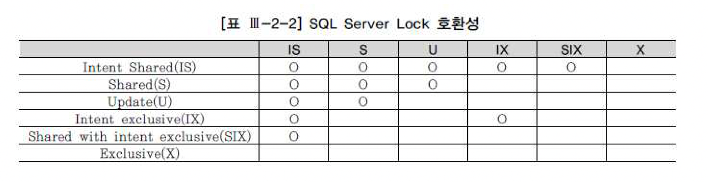

## 1.Lock 기본

### Lock이란?
- 고가의 DBMS를 사용하는 이유로는 성능, 관리의 편이성 등 여러가지 측면이 있지만, 무엇보다 트랜잭션 처리 능력이 가장 기본적이고 핵심적인 요소라고 할 수 있음
- 같은 자원을 액세스하려는 다중 트랜잭션 환경에서 데이터베이스의 읽관성과 무결성을 유지하려면 트랜잭션의 순차적 진행을 보장할 수 있는 직렬화 장치가 필요함
- 영화관 좌석을 예약하는 시스템을 예를 들면 두 명이 동시에 좌석을 요청할 때 정확히 한 명만 좌석을 배정받도록 할 수 있어야 함
- 이런 직렬화가 가능하도록 하기 위해 모든 DBMS가 공통적으로 사용하는 매커니즘이 Lock이다
- 중요한 것은 DBMS마다 Lock을 구현하는 방식과 세부적인 기능이 많이 다르다는 사실임
- 따라서 자신이 사용하고 있는 DBMS만의 독특한 Lock 매커니즘을 정확히 이해하지 못한 상태에선 결코고품질 데이터베이스를 구축할 수 없음

### 공유 Lock과 배타적 Lock
- DBMS는 각 트랜잭션의 오퍼레이션별로 적당한 수준의 Lock을 자동으로 설정함
- 필요한 경우 일부 Lock에 대해서는 사용자가 직접 제어하는 방법도 제공함
- 가장 기본이 되는 LocK 모드는 공유 LocK과 배타적 Lock임

#### 공유 Lock
- 공유 Lock은 데이터를 읽고자 할때 사용됨
- 다른 공유 Lock과는 호환되지만 배타적 lock과는 호환되지 않음
- 호환된다는 말은 한 리소스에 두개 이상의 Lock을 동시에 설정할 수 있음을 뜻함
- 다시 말해 공유 Lock을 설정한 리소스에 다른 트랜잭션이 추가로 공유 Lock을 설정할 수 있지만 배타적 Lock은 불가능함
- 따라서 자신이 읽고 있는 리소스를 다른 사용자가 동시에 읽을 수는 있어도 변경은 불가능함
- 반대로 다른 사용자가 읽고 있는 리소스를 동시에 읽을 수는 있어도 변경 중인 리소스를 동시에 읽을 수는 없음

#### 배타적 Lock
- 배타적 Lock은 데이터를 변경하고자 할 때 사용되며, 트랜잭션이 완료될 때 까지 유지됨
- 말 그대로 배타적이기 때문에 그 Lock이 해제될 때 까지는 다른 트랜잭션은 해당 리소스에 접근할 수 없음
- 변경이 불가능할 뿐 아니라 읽기도 불가능함
- 반대로 다른 트랜잭션에 의해 Lock이 설정된 리소스는 그것이 공유 Lock이든 배타적 Lock을 동시에 설정할 수 없음

### 블로킹과 교착상태

#### 블로킹
- 블로킹은 Lock 경합이 발생해 특정 세션이 작업을 진행하지 못하고 멈춰 선 상태를 말함
- 공유 Lock끼리는 호환되기 대문에 블로킹이 발생하지 않음
- 공유 Lock과 배타적 Lock은 호환되지 않아 블로킹이 발생할 수 있다
- 배타적 Lock끼리는 당연히 호환되지 않음
- 블로킹 상태를 해소하는 방법은 커밋 뿐임
- 즉 Lock 경합이 발생하면 먼저 Lock을 설정한 트랜잭션이 완료될 떄 까지 후행 트랜잭션은 기다려야 하며, 이런 현상이 자주 나타난다면 사용자가 느끼는 애플리케이션 성능이 좋을 리 없음
- Lock에 의한 성능 저하를 최소화하는 방안을 살펴본다
  - 트랜잭션의 원자성을 훼손하지 않는 선에서 트랜잭션을 가능한 짧게 정의하려는 노력이 필요함
    - Oracle은 데이터를 읽을 때 공유 Lock을 사용하지 않기 때문에 다른 DBMS에 비해 상대적으로 Lock 경합이 적게 발생함
    - 그렇더라도 배타적 Lock 끼리 발생하는 경합은 피하지 못하므로 불필요하게 트랜잭션을 길게 정의해선 안됨
  - 같은 데이터를 갱신하는 트랜잭션이 동시에 수행되지 않도록 설계하는 것도 중요함
    - 특히 트랜잭션이 활발한 주간에 대용량 갱신 작업을 수행해선 안됨
  - 주간에 대용량 갱신 작업이 불가피 하다면 블로킹 현상에 의해 사용자가 무한정 기다리지 않도록 적절한 프로그래밍 기법을 도입해야 함
    - 예를 들어 SQL Server 에서는 세션 레벨에서 LOCK_TIMEOUT을 설정할 수 있음
    - 아래는 Lock에 의한 대기 시간이 최대 2초를 넘지 않도록 설정한 것
  ```
  set lock_timeout 2000
  ``` 
  - Oracle이라면 update/delete문장을 수행하기 전에 nowait나 wait 옵션을 지정한 select -- for update문을 먼저 수행해 봄으로써 Lock이 설정됐는지 체크할 수 있고, 발생한 예외사항(exception)에 따라 적절한 조치를 취할 수 있음
```
select * from t where no = 1 for update nowait 대기 없이 Exception 던짐
SELECT * FROM T where no = 1 for update wait 3 -> 3초 대기 후 Exception을 던짐
```
  - 트랜잭션 격리성 수준을 불필요하게 상향 조정하지 않음
  - 트랜잭션을 잘 설계하고 대기 현상을 피하는 프로그래밍 기법을 적용하기 앞서, SQL 문장이 가장 빠른 시간 내에 처리를 완료하도록 하는 것이 Lock 튜닝의 기본이고 효과도 가장 확실함

#### 교착상태
- 교착상태는 두 세션이 각각 Lock을 설정한 리소스를 서로 액세스하려고 마주보며 진행하는 상황을 말하며, 둘 중 하나가 뒤로 물러나지 않으면 영영 풀릴 수 없음
- 흔히 좁은 골목길에 두 대의 차량이 마주 선 것에 비유하곤 함
- 교착상태가 발생하면 DBMS가 둘 중 한 세션에 에러를 발생시킴으로써 문제를 해결하는데, 이를 방지하려면 어떻게 해야하나?
- 조금 전 설명한 Lock 튜닝 방안은 교착상태 발생 가능성을 줄이는 방안이기도 함
- 여러 테이블을 액세스하면서 발생하는 교착상태는 테이블 접근 순서를 같게 처리하면 피할 수 있음
- 예를 들어 마스터 테이블과 상세 테이블 둘 다 갱신할 때 마스터 테이블 다음에 상세 테이블을 갱신하기로 규칙을 정하고, 모든 애플리케이션 개발자가 이 규칙을 지킨다면, 교착상태는 발생하지 않을 것
- SQL Server라면 잠시 후 설명할 갱신 Lock을 사용함으로써 교착 상태 발생 가능성을 줄일 수 있음

## SQL Server Lock

### Lock 종류

#### 공유 Lock
- SQL Server의 공유 Lock은 트랜잭션이나 쿼리 수행이 완료될 때 까지 유지되는 것이 아니라 다음 레코드가 읽히면 곧바로 해제됨
- 단 기본 트랜잭션 격리 성 수준에서만 그렇다
- 격리성 수준을 변경하지 않고도 트랜잭션 내에서 공유 Lock이 유지되도록 하려면 아래와 같이 테이블 힌트로 holdlock을 지정하면 됨
- 트랜잭션 격리성 수준에 대해서는 다음 절에서 설명함
```
begin tran
select 적립포인트, 방문횟수, 최근방문일시, 구매실적
  from 고객
  with (holdlock)
 where 고객번호 = :cust_num 새로운 
```
- 나중에 변경할 목적으로 레코드를 읽을 때는 반드시 위와 같은 패턴으로 트랜잭션을 처리해야 함
- 위 사례에서 방문횟수, 최근방문일시, 구매실적에 따라 새로운 적립 포인트를 계산하는데, 만약 고객 데이터를 읽고 적립 포인트를 변경하기 전에 다른 트랜잭션이 해당 고객 데이터를 변경한다면 적립 포인트가 비일관된 상태에 놓일 수 있기 때문임

#### 배타적 Lock
- 1항에서 설명한 내용과 같음

#### 갱신 Lock
- 앞서 공유 Lock을 설명하면서 예시로 하던 적립포인트 변경 프로그램을 공교롭게도 두 트랜잭션이 동시에 수행된다고 가정한다
- 그것도 같은 고객에 대해서 말임
- 두 트랜잭션 모두 처음에는 공유 Lock을 설정하다가 적립 포인트를 변경하기 직전에 배타적 Lock을 설정하려고 할 것임
- 두 트랜잭션은 상대편 트랜잭셩에 의한 공유 Lock이 해제되기만을 기다리는 교착상태에 빠지게 됨
- 이런 잠재적인 교착상태를 방지하려고 SQL Server는 갱신(update)Lock을 두게 되었고, 이 기능을 사용하려면 아래와 같이 updlock힌트를 지정하면 됨

#### 의도 Lock
- 특정 로우에 Lock을 설정하면 그와 동시에 상위 레벨 개체에 내부적으로 의도 Lock이 설정됨
- Lock을 설정하려는 개체의 하위 레벨에서 선행 트랜잭션이 어떤 작업을 수행 중인지를 알리는 용도로 사용되며, 일종의 푯말(Flag)이라고 할 수 있음
- 예를 들어, 구조를 변경하기 위해 테이블을 잠그려 할 때 그 하위의 모든 페이지나 익스텐트, 심지어 로우에 어떤 Lock이 설정돼 있는지를 일일이 검사해야 한다면 좀처럼 작업이 끝나지 않을 수 있음
- 의도 Lock은 그런 현상을 방지해 줌
- 즉 해당 테입르에 어떤 모드의 의도 Lock이 설정돼 있는지 보고도 작업을 진행할 지 아니면 기다릴지를 결정할 수 있음

#### 스키마 Lock
- 테이블 스키마에 의존적인 작업을 수행할 때 사용됨
  - Sch-S(Schema Stability)
    - SQL을 컴파일 하면서 오브젝트 스키마를 참조할 때 발생, 읽는 스키마 정보가 수정되거나 삭제되지 못하도록 함
  - Sch-M(Schema Modification)
    - 테이블 구조를 변경하는 DDL 문을 수행할 때 발생하며, 수정 중인 스키마 정보를 다른 세션이 참조하지 못하도록 함

#### Bulk Update Lock
- 테이블 Lock의 일종으로, 테이블에 데이터를 Bulk Copy 할 때 발생함. 병렬 데이터 로딩을 허용하지만 일반적인 트랜잭션 작업은 허용되지 않음

### Lock 레벨과 Escalation

#### Lock 레벨과 Escalation
- 로우 레벨
  - 변경하려는 로우에만 Lock을 설정하는 것을 말함
- 페이지 레벨
  - 변경하려는 로우가 담긴 데이터 페이지에 Lock을 설정하는 것을 말함
  - 같은 페이지에 속한 로우는 진행중인 변경 작업과 무관하더라도 모두 잠긴 것과 같은 효과가 나타남
- 익스텐트 레벨
  - 익스텐트 전체가 잠김
  - SQL Server의 경우 하나의 익스텐트가 여덟개 페이지로 구성되므로 8개 페이지에 속한 모든 로우가 잠긴 것과 같은 효과가 나타남
- 테이블 레벨
  - 테이블 전체 그리고 관련 인덱스까지 모두 잠김
- 데이터베이스 레벨
  - 데이터베이스 전체가 잠김
  - 이는 보통 데이터베이스를 복구하거나 스키마를 변경할 때 일어남
- 위 5가지 레벨 외에 인덱스 키에 로우 레벨을 거는 경우도 있음

#### Lock Escalation
- Lock Escalation이란 관리할 Lock 리소스가 정해진 임계치를 넘으면서 로우 레벨 락이 페이지, 익스텐트, 테이블 레벨 락으로 점점 확장되는 것을 말함
- 이는 SQL Server, DB2 UDB 처럼 한정된 메모리 상에서 Lock 매니저를 통해 Lock 정보를 관리하는 DBMS에서 공통적으로 발생할 수 있는 현상
- Locking레벨이 낮을 수록 동시성은 좋지만, 관리해야 할 Lock 개수가 증가하기 때문에 더 많은 리소스를 소비함
- 반대로 Locking레벨이 높을 수록 적은 양의 Lock리소스를 사용하지만 하나의 Lock으로 수많은 레코드를 한번에 잠그기 때문에 동시성은 나빠짐


### Lock 호환성
- 호환된다는 말은 한 리소스에 두 개 이상의 Lock을 동시에 설정할 수 있음을 똣함
- 앞서 설명한 Lock 종류별로 호환성을 요약하면 아래와 같음



- 스키마 Lock의 호환성은 다음과 같음
  - Sch-S는 Sch-M을 제외한 모든 Lock과 호한
  - Sch-M은 어떤 Lock과도 호환되지 않음

## Oracle Lock
- Oracle은 공유 리소스와 사용자 데이터를 보호할 목적으로 DML Lock, DDL Lock, 래치(Latch), 버퍼 Lock, 라이브러리 캐시 Lock/Pin 등 다양한 종류의 Lock을 사용함
- 이들 중 애플리케이션 개발 측면에서 가장 중요하게 다루어야 할 Lock은 무엇보다 DML Lock임
- DML Lock은 다중 사용자에 의해 동시에 액세스 되는 사용자 데이터의 무결성을 보호해 줌
- DML LocK에는 로우 Lock과 테이블 Lock이 있음

### 로우 Lock
- Oracle에서 로우 Lock은 항상 배타적임
- insert, update, delete문이나 select...for update문을 수행한 트랜잭션에 의해 설정되며, 이 트랜잭션이 커밋 도는 롤백할 때까지 다른 트랜잭션은 해당 로우를 변경할 수 없음
- Oracle에서 일반 select문에 의해 읽힌 레코드에는 어떤 Lock도 설정되지 않음
- 다른 DBMS처럼 읽기 작업에 대한 공유 Lock을 사용하지 않기 때문에 Oracle에서 읽기와 갱신 작업은 서로 방해하지 않음
  - 읽으려는 데이터를 다른 트랜잭션이 갱신 중이더라도 기다리지 않음
  - 갱신하려는 데이터를 다른 트랜잭션이 읽는 중이더라도 기다리지 않음
  - 갱신하려는 데이터를 다른 트랜잭션이 갱신 중이면 기다림
- Oracle이 공유 Lock을 사용하지 않고도 일관성을 유지할 수 있는 것은 Undo 데이터를 이용한 다중 버전 동시성 제어 메커니즘없이 레코드의 속성으로서 로우 Lock을 구현하기 때문에 아무리 많은 레코드를 갱신하더라도 절대 Lock Escalation은 발생하지 않음

### 테이블 Lock
- 한 트랜잭션이 로우 Lock을 얻는 순간, 해당 테이블에 대한 테이블 Lock을 얻음
- 그럼으로써 현재 트랜잭션이 갱신 중인 테이블에 대한 호환되지 않는 DDL 오퍼레이션을 방지함
- 테이블 구조를 변경하지 못하도록 막는 것
- 테이블 Lock종류로는 5가지가 있음
```
Row Share(RS)
Row Exclusive(RX)
Share(S)
Share Row Exclusive(SRX)
Exclusive

```
- 대표적으로 select...for update문을 수행할 때는 RS 모드 테이블 Lock을 얻고, insert update delete문을 수행할 때 RX 모드 테이블 Lock을 얻는다
- DML 로우 Lock을 처음 얻는 순간 묵시적으로 테이블 Lock을 얻지만 아래 처럼 Lock Table명령어를 이용해 명시적으로 테이블 Lock을 얻을 수도 있음
- 테이블 lock이라고 하면 테이블 전체에 Lock이 걸린다고 생각하기 쉬움
- DML 수행 시 항상 테이블 Lock이 함께 설정된다고 했는데, 만약 이것이 SQL Server의 테이블 레벨 Lock 처럼 테이블 전체를 잠그는 기능이라면 다른 트랜잭션이 더는 레코드를 추가하거나 갱신하지 못하도록 막게 될 것임
- 하지만 RX와 RX간 호환성이 있으므로 그런일은 발생하지 않음
- Oracle에서 말하는 테이블 Lock은 Lock을 획득한 선행 트랜잭션이 해당 테이블에서 현재 어떤 작업을 수행중인지를 알리는 일종의 푯말임
- 후행 트랜잭션은 어떤 테이블 Lock이 설정돼 있는지만 보고도 그 테이블로의 진입 여부를 결정할 수 있음