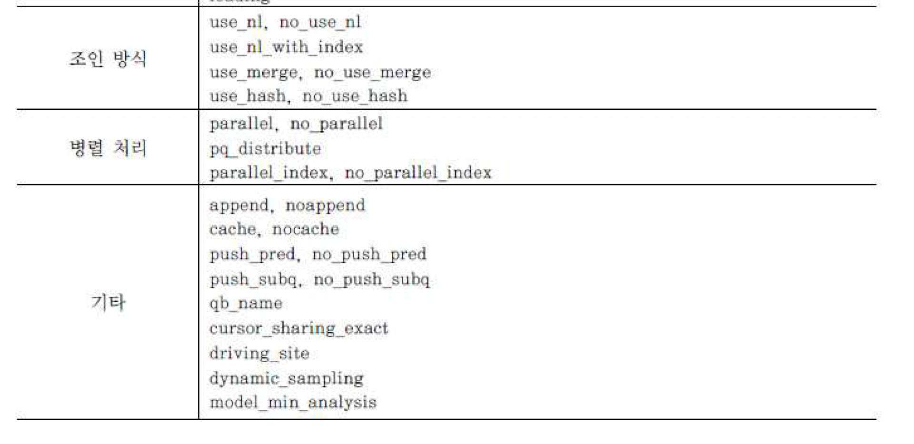

# 옵티마이저 원리

## 옵티마이저 소개

### 옵티마이저란?
- SQL을 가장 빠르고 효율적으로 수행할 최적의 처리경로를 생성해주는 DBMS 내부의 핵심 엔진임
- 사용자가 구조화된 질의언어로 결과집합을 요구하면, 이를 생성하는데 필요한 처리 경로는 DBMS에 내장된 옵티마이저가 자동으로 생성해줌
- 옵티마이저가 생성한 SQL 처리 경로를 실행계획이라 부름
- 옵티마이저의 SQL 최적화 과정을 요약하면 다음과 같음
  - 사용자가 던진 쿼리수행을 위해 후보군이 될만한 실행계획을 가짐
  - 데이터 딕셔너리에 미리 수집해놓은 오브젝트를 통계 및 시스템 통계 정보를 이용해 각 실행계획의 예상 비용을 산정함
  - 각 실행계획을 비교해서 최저비용을 갖는 하나를 선택함

### 옵티마이저 종류
- 옵티마이저는 다음 두 가지로 나뉘며, 앞서 설명한 SQL 최적화 과정은 비용기반 옵티마이저에 관한 것

#### 규칙기반 옵티마이저
- 규칙기반 옵티마이저는 다른 말로 휴리스틱 옵티마이저라고 불림
- 미리 정해놓은 규칙에 따라 액세스 경로를 평가하고 실행계획을 선택함
- 여기서 규칙이란 액세스 경로별 우선순위로서 인덱스 구조, 연산자, 조건절 형태가 순위를 결정짓는 주요인임

#### 비용 기반 옵티마이저
- 비용 기반 옵티머이저는 말 그대로 비용을 기반으로 최적화를 수행함
- 여기서 비용이란 쿼리를 수행하는 데 소요되는 일량 또는 시간을 뜻함
- CBO가 실헹계획을 수립할 때 판단 기준이 되는 비용은 어디까지나 예상치임
- 미리 구해놓은 테이블과 인덱스에 대한 여러 통계정보를 기초로 각 오퍼레이션 단계별 예상 비용을 산정하고, 이를 합산한 총비용이 가장 낮은 실행계획을 선택함
- 비용을 산정할 때 사용되는 오브젝트 통계 항목으로는 레코드 개수, 블록 개수, 평균 행 길이 칼럼 값의 수, 칼럼 값 분포, 인덱스 높이, 클러스터링 팩터 같은 것을이 있음
- 오브젝트 통계 뿐만 아니라 최근에는 하드웨어적 특성을 반영한 시스템 통계 정보까지 이용함
- 역사가 오래된 Oracle은 RBO에서 출발하였으나, 다른 상품 RDBMS는 탄생 초기부터 CBO를 채택함
- Oracle 도 10G 버전부터 RBO에 대한 지원을 중단하였으므로 본서는 CBO를 중심으로 설명함
  - 스스로 학습하는 옵티마이저
    - 전통적으로 옵티마이저는 오브젝트 통계와 시스템 통계로부터 산정한 '예상' 비용만으로 실행계획을 수립해옴
    - 하지만 앞으로 예상치와 런타임 수행 결과를 비교하고, 예상치가 빗나갔을 때 실행계획을 조정하는 옵티마이저로 발전할 것
    - 최근에 발표된 각 DBMS 버전은 이미 이런 기능을 포함하고 있음

#### SQL 최적화 과정
- Oracle 기준으로, SQL 최적화 및 수행 과정을 좀 더 자세히 표현하면 아래와 같음
  - Parser로 SQL 파싱
  - 옵티마이저로 옵티마이징
    - 쿼리 변환
    - 추정 작업
    - 계획 생성
  - 실행계획을 토대로 Row Source 생성
  - SQL 엔진으로 실행

#### 서브 엔진별 역할
- Parser
  - SQL 문장을 이루는 개별 구성요소를 분석하고 파싱해서 파싱 트리를 만듬
  - 이 과정에서 사용자 SQL에 문법적 오류가 없는지 , 의미상 오류가 없는지 확인함
- Optimizer
  - Query Transformer
    - 파싱된 SQL을 좀 더 일반적이고 표준적인 형태로 변환
  - Estimator
    - 오브젝트 및 시스템 통계정보를 이용해 쿼리 수행 각 단계의 선택도, 카디널리티, 비용을 계산하고, 궁극적으로 실행계획 전체에 대한 총 비용을 계산해냄
  - Plan Generator
    - 하나의 쿼리를 수행하는 데 있어, 후보군이 될만한 실행계획들을 생성해 냄
  - Row-Source Generator
    - 옵티마이저가 생성한 실행계획을 SQL 엔진이 실제 실행할 수 있는 코드 형태로 포매팅함
  - SQL Engine
    - SQL을 실행함
- Oracle 뿐만 아니라 다른 DBMS도 비슷한 처리 과정을 통해 실행계획을 생성함
- 참고로 M.Jarke와 J.Koch가 펴낸 책에서는 쿼리 최적화 과정을 다음과 같이 설명하고 있는데 표에서 설명한 내용이 Parser와 Optimizer역할에 해당하는 내용이다.
  - 쿼리를 내부 표현방식으로 변환
  - 표준적인 형태로 변환
  - 후보군이 될만한 프로시저를 선택
  - 실행계획을 생성하고, 가장 비용이 적은 것을 선택

### 최적화 목표

#### 전체 처리속도 최적화
- 쿼리 최종 결과집합을 끝까지 읽는 것을 전제로, 시스템 리소스를 가장 적게 사용하는 실행계획을 선택함
- Oracle SQL Server 등을 포함해 대부분 DBMS의 기본 옵티마이저 모드는 전체 처리 속도 최적화에 맞춰져 있음
- Oracle에서 옵티마이저 모드를 바꾸는 방법은 다음과 같음

```
alter system set optimizer_mode = all_rows : 시스템 레벨 변경
alter session set optimizer_mode = all_rows: - 세션 레벨 변경
```

#### 최초 응답속도 최적화
- 전체 결과집합 중 일부만 읽다가 멈추는 것을 전제로, 가장 빠른 응답속도를 낼 수 있는 실행계획을 선택함
- 만약 이 모드에서 생성한 실행계획으로 데이터를 끝까지 읽는다면 전체 처리 속도 최적화 실행계획보다 더 빠른 리소스를 사용하고 전체 수행 속도도 느려질 수 있음
- Oracle 옵티마이저에게 최초 응답속도 최적화를 요구하려면 옵티마이저 모드를 first_rows로 바꿔주면 됨
- SQL 서버에서는 테이블 힌트로 fastfirstrow를 지정하면 됨
- Oracle에서 옵티마이저 모드를 first_rows_n으로 지정하면 예를들어 시스템 또는 세션 레벨에서 first_rows_10으로 지정하면 사용자가 전체 결과집합 중 처음 10개 로우만 ㅇ릭고 머추는 것을 전제로 가장 빠른 응답을 낼 수 있는 실행계획을 선택함
- 쿼리 레벨에서 힌트를 사용하려면 아래와 같이 하면 됨

```
select /*+ first_rows(10)*/
from t
where;
```

- SQL 서버에서는 쿼리 힌트로 fast 10을 지정하면 됨

```
select *
from t
where OPTION(fast 10);
```

## 2. 옵티마이저 행동에 영향을 미치는 요소

### SQL과 연산자 형태
- 결과가 같더라도 SQL을 어떤 형태로 작성하는지 또는 어떤 연산자를 사용하는지에 따라 옵티마이저가 다른 선택을 할 수 있고, 이는 쿼리 성능에 영향을 미침

### 옵티마이징 팩터
- 쿼리를 똑같이 작성하더라도 인덱스, IOT, 클러스터링, 파티셔닝 MV등을 어떻게 구성하는지에 따라 실행계획과 성능이 크게 달라짐

### DBMS 제약 설정
- 개체 무결성, 참조 무결성, 도메인 무결성 등을 위해 DBMS가 제공하는 PK, FK, Check Not Null 같은 설정 기능을 이용할 수 있고, 이들 제약 설정은 옵티마이저가 쿼리 성능을 최적화 하는데 매우 중요한 정보를 제공함
- 예를 들어 인덱스 칼럼에 Not Null 제약이 설정돼 있으면 옵티마이저는 전체 개수를 구하는 Count 쿼리에 이 인덱스를 활용할 수 있음

### 옵티마이저 힌트
- 옵티마이저의 판단보다 사용자가 지정한 옵티마이저 힌트가 우선함
- 옵티마이저 힌트에 대해서는 뒤에 좀 더 자세히 다룸

### 통계정보
- 통계정보가 옵티마이저에게 미치는 영향력은 절대적임
- 뒤에서 통계정보를 이용한 비용계산 원리를 설명할 때 느끼겠지만, CBO의 모든 판단 기준은 통계 정보에서 나옴

### 옵티마이저 관련 파라미터
- SQL, 데이터, 통계정보, 하드웨어 등 모든 환경이 동일하더라도 DBMS 버전을 업그레이드 하면 옵티마이저가 다르게 작동할 수 있음
- 이는 옵티마이저 관련 파라미터가 추가 또는 변경되면서 나타나는 현상

### DBMS 버전과 종류
- 옵티마이저 관련 파라미터가 같더라도 버전에 따라 실행계획이 다를 수 있음
- 또한 같은 SQL 이더라도 DBMS종류에 따라 내부적으로 처리하는 방식이 다를 수 있음

## 3. 옵티마이저의 한계
- 옵티마이저가 사람이 만든 소프트웨어 엔진에 불과하며 결코 완벽할 수 없음을 이해하는 것은 매우 중요함
- 현재의 기술 수준으로 해결하기 어려운 문제가 있는가 하면, 기술적으론 가능한데 현실적인 제약(토예정보 수집량과 최적화를 위해 허락된 시간) 때문에 아직 적용하지 못하는 것들도 있음
- 옵티마이저가 완벽하지 못하게 만드는 요인이 어디에 있는지 살펴본다.

### 옵티마이징 팩터의 부족
- 옵티마이저는 주어진 환경에서 가장 최적의 실행계획을 수립하기 위해 정해진 기능을 수행할 뿐
- 옵티마이저가 아무리 정교하고 기술적으로 발전하더라도 사용자가 적절한 옵티마이징 팩터를 제공하지 않는다면 결코 좋은 실행계획을 수립할 수 있음

### 통계 정보의 부정확성
- 최적화에 필요한 모든 저보를 수집해서 보관할 수 있다면 옵티마이저도 그만큼 고성능 실행계획을 수립하겠지만, 100% 정확한 통계정보를 유지하기는 현실적으로 불가능함
- 특히 칼럼 분포가 고르지 않을 때 칼럼 히스토그램이 반드시 필요한데, 이를 수집하고 유지하는 비용이 만만치 않음
- 칼럼을 결합 할 때의 모든 결합 분포를 미리 구해두기 어려운 것도 큰 제약 중 하나임
- 이는 상관관계에 있는 두 칼럼이 조건절에 사용될 때 옵티마이저가 잘못된 실행계획을 수립하게 만드는 주 요인임
```
select * from 사원 where 직급 = '부장' and 연봉 >= 5000;
```
- 직급이(부장, 과장, 대리 사원)의 집합이고 각각 25%의 비중을 가짐
- 그리고 전체 사원이 1000명이고 히스토그램상 '연봉 >= 5000' 조건에 부합하는 사원 비중이 10퍼면 옵티마이저는 위 쿼리 조건에 해당하는 사원 수를 25(=1000*0.25+0.1)명으로 추정함
- 하지만 알다시피 직급과 연봉 간에는 상관관계가 매우 높아, 만약 모든 부장의 연봉이 5천 이상이면 실제 위 쿼리 결과는 250임
- 이런 조건절에 대비해 모든 칼럼 간 상관관계와 결합분포를 미리 저장해두면 좋겠지만 거의 불가능에 가까움
- 테이블 칼럼이 작을수록 잠재적인 칼럼 조합의 수는 기하급수적으로 증가하기 때문임

### 바인드 변수 사용 시 균등분포 가정
- 아무리 정확한 칼럼 히스토그램ㅇ르 보유하더라도 바인드 변수를 사용한 SQL 에서는 무용지물임
- 조건절에 바인드 변수를 사용하면 옵티마이저가 균등 분포를 가정하고 비용을 계산하기 때문임

### 비현실적인 가정
- 옵티마이저는 쿼리 수행 비용을 평가할 때 여러 가정을 사용하는데, 그 중 일부는 상당히 비현실적이어서 종종 이해할 수 있는 실행계획을 수립하곤 함
- 예전 Oracle 버전에선 Single Block I/O와 Multiblock I/O의 비용을 같게 평가하고 데이터 블록의 캐싱 효과도 고려하지 않았는ㄴ데, 그런 것들이 비현실적인 가정의 좋은 예시임
- DBMS 버전이 올라가면서 이런 비현실적인 가정들이 계속 보완되고 있지만 완벅하지않고, 모두 해결되리라고 기대하는 것도 무리임

### 규칙에 의존하는 CBO
- 아무리 비용기반 옵티마이저라 하더라도 부분적으로는 규칙에 의존함
- 예를 들어 최적화 목표를 최초 응답 속도에 맞추면 (Oracle을 예로 들면 Optimizer_mode = first_rows), order by 소트를 대체할 인덱스가 있을 때 무조건 그 인덱스를 사용함
- 다음 절에서 설명할 휴리스틱 쿼리 변환도 좋은 예라고 할 수 있음

### 하드웨어 성능
- 옵티마이저는 기본적으로 옵티마이저 개발팀이 사용한 하드웨어 사양에 맞춰져 있음
- 따라서 실제 운영 시스템의 하드웨어 사양이 그것과 다를 때 옵티마이저가 잘못한 실행계획을 수립할 가능성이 높아짐
- 또한 애플리케이션 특성(I/O 패턴, 부하정도 등)에 의해서도 하드웨어 성능은 달라짐

## 4. 통계정보를 이용한 비용 계산 원리
- 실행계획을 수립할 때 CBO는 SQL 문장에서 액세스할 데이터 특성을 고려하기 위해 통계정보를 이용함
- 최적의 실행계획을 위해 통계정보가 항상 데이터 상태를 정확하게 반영하고 있어야 하는 이유임
- DBMS 버전이 올라갈수록 자동 통계관리 방식으로 바뀌고 있지만, 가끔 DB 관리자가 수동으로 수집관리 해주어야 할 때도 있음
- 옵티마이저가 참조하는 통계정보 종류로 아래 네가지가 있음

### 옵티마이저 통계 유형
- 테이블 통계
  - 전체 레코드 수, 총 블록 수, 빈 블록 수, 한 행당 평균 크기 등
- 인덱스 통계
  - 인덱스 높이, 리프 블록 수, 클러스터링 팩터, 인덱스 레코드 수 등
- 칼럼 통계
  - 값의 수, 최저 값, 최고 값, 밀도 Null 값 개수, 칼럼 히스토그램 등
- 시스템 통계
  - CPU 속도, 평균적인 I/O 속도, 초당 I/O 처리량 등

### 선택도
- 선택도는 전체 대상 레코드 중에서 특정 조건에 의해 선택될 것으로 예상되는 레코드 비율을 말함
- 선택도를 가지고 카디널리티를 구하고, 다시 비용을 구해 인덱스 사용여부, 조인 순서와 방법 등을 결정하므로 선택도는 최적의 실행 계획을 수립하는데 있어 가장 중요한 요인이라고 함
- 선택도 -> 카디널리티 -> 비용 -> 액세스 방식, 조인 순서, 조인 방법 등 결정 히스토그램이 있으면 그것으로 선택도를 산정하며, 단일 칼럼에 대해서는 비교적 정확한 값을 구함
- 히스토그램이 있거나 있더라도 조건절에 바인드 변수를 사용하면 옵티마이저는 데이터 분포가 균일하다고 가정한 상태에서 선택도를 구함
- 히스토그램이 등치 조건에 대한 선택도를 구하는 공식은 다음과 같음
- 선택도 = 1/Distinct value 개수 = 1/Num distinct

### 카디널리티
- 카디널리티는 특정 액세스 단계를 거치고 난 후 출력될 것으로 예상되는 결과 건수를 말하며, 아래와 같이 총 로우 수에 선택도를 곱해서 구함
```
카디널리티 = 총 로우 수 * 선택도 칼럼 히스토그램이 나을때 '=' 조건에 대한 선택도가 1/num_distinct이므로 카디널리티는 아래와 같이 구해짐
카디널리티 = 총 로우 수 * 선택도 = num_rows / num_distinct

select * from 사원 where 부서 := 부서
```
- 예를 들어 위 쿼리에서 부서 칼럼의 Distinct Value 개수가 10이면 선택도는 0.1(=1/10)이고, 총 사원 수가 1000명일 때 카디널리티는 100이 됨
- 옵티마이저는 위 조건절에 의한 결과집합이 100건일 것으로 예상한다는 뜻
- 조건절이 두 개 이상일 때는 각 칼럼의 선택도와 전체 로우 수를 곱해 주기만 하면 됨

```
select * from 사원 where 부서 =:부서 and 직급 =: 직급
```
- 직급의 도메인이 부장, 과장, 대리, 사원 이면 Distinct Value 개수가 4이므로 선택도는 0.25임
- 따라서 위 쿼리의 카디널리트는 25(=1000 * 0.1 * 0.25)

### 히스토그램
- 미리 저장된 히스토그램 정보가 있으면 옵티마이저는 그것을 사용해 더 정확하게 카디널리티를 구할 수 있음
- 특히 분포가 균일하지 않은 칼럼으로 조회할 때 효괄르 발휘함
- 히스토그램은 아래 두가지 유형이 있음
  - 도수분포 히스토그램 그림생략
  - 높이균형 히스토그램 그림생략

### 비용
- CBO는 비용을 기반으로 최적화를 수행하고 실행계획을 생성한다고 설명한다
- 여기서 비용이란 쿼리를 수행하는데 소요되는 일량 또는 시간을 뜻함
- 어디까지나 예상치임
- 옵티마이저 비용 모델에는 I/O 비용 모델과 CPU 비용 모델 두가지가 있음
- I/O 비용 모델
  - 예상되는 I/O 요청 횟수만을 쿼리 수행 비용으로 간주해 실행계획을 평가
- CPU 비용 모델
  - I/O 비용모델에서 시간 개념을 더해 비용을 산정함
- 지면 관계상 본서는 I/O 비용 모델만 다룸

#### 인덱스를 경유한 테이블 액세스 비용
- I/O 비용 모델에서의 비용은 디스크 I/O Call 횟수(논리적/물리적으로 읽은 블록 개수가 아닌 I/O Call 횟수)를 의미함
- 그리고 인덱스를 경유한 테이블 액세스 시에는 Single Block I/O 방식이 사용됨
- 이는 디스크에서 한 블록을 읽을 때마다 한 번의 I/O Call을 일으키는 방식이므로 읽기 될 불리적 블록 개수가 I/O Call 횟수와 일치함
- 따라서 인덱스를 이용한 테이블 액세스 비용은 아래와 같은 공식으로 구할 수 있음
```
비용 = blevel --인덱스 수직적 탐색 비용 + (리프 블록 수 * 유효 인덱스 선택도) -
- 인덱스 수평적 탐색 비용 + (클러스터링 팩터 * 유효 테이블 선택도) -- 테이블 Random 액세스 비용
```

#### 인덱스를 경유한 테이블 액세스 비용 항목
- blevel
  - 브랜치 레벨을 의미하며, 리프 블록에 도달하기 전에 읽게 될 브랜치 블록 개수
- 클러스터링 팩터
  - 특정 칼럼을 기준으로 같은 값을 갖는 데이터가 서로 모여있는 정도, 인데스를 경유해 테이블 전체 로우를 액세스할 때 읽을 것으로 예상되는 논리적인 블록 개수를 계수화함
- 유효 인덱스 선택도
  - 전체 인덱스 레코드 중에서 조건절을 만족하는 레코드를 찾기 위해 스캔할 것으로 예상되는 비율
  - 리프 블록에는 인덱스 레코드가 정렬된 상태로 저장되므로 이 비율이 곧, 방문할 리프 블록 비율
- 유효 테이블 선택도
  - 전체 레코드 중에서 인덱스 스캔을 완료하고서 최종적으로 테이블을 방문할 것으로 예상되는 비율(%), 클러스터링 팩터는 인덱스를 경유해 전체 로우를 액세스할 때 읽힐 것으로 예상되는 테이블 블록 개수이므로 여기에 유효 테이블 선택도를 곱함으로써 조건절에 대해 읽힐 것으로 예상되는 테이블 블록 개수를 구할 수 있다.

#### Full Scan에 의한 테이블 액세스 비용
- Full Scan에 대해서는 테이블 전체를 순차적으로 읽어 들이는 과정에서 발생하는 I/O Call 횟수로 비용을 계산함
- Full Scan할 때는 한 번의 I/O Call로써 여러 블록을 읽어 들이는 Multiblock I/O 방식을 사용하므로 총 블록 수를 Multiblock I/O Call이 발생함
- 예를 들어 100 블록을 8개씩 나누어 읽는다면 13번의 I/O Call이 발생하고 I/O Call 횟수로써 Full Scan 비용을 추정함
- 따라서 Multiblock I/O 단위가 증가할 수록 I/O Call 횟수가 줄고 예상 비용도 줄게 됨


## 5. 옵티마이저
- 통계정보가 정확하지 않거나 기타 다른 이유로 옵티마이저가 잘못된 판단을 할 수 있음
- 그럴 때 프로그램이나 데이터 특성 정보를 정확히 알고 있는 개발자가 직접 인덱스를 지정하거나 조인 방식을 변경함으로 더 좋은 실행계획으로 유도하는 메커니즘이 필요함
- 옵티마이저 힌트가 바로 그것임
- 힌트 종류와 구체적인 사용법은 DBMS마다 첝차만별임
- 지면 관계상 모두 다룰 수 없으므로 Oracle, SQL Server 에 대해서만 설명하기로 한다.

### Oracle 힌트
#### 힌트 기술 방법
- Oracle에서 힌트를 기술하는 방법은 다음과 같다
```
대충 SELECT 옆에 /*+ 힌트명 */으로 기술한다.
```

#### 힌트가 씹히는 경우
- 다음의 경우 Oracled옵티마이저는 힌트를 무시하고 최적화를 진행함
  - 문법적으로 안 맞게 힌트를 기술
  - 의미적으로 안 맞게 힌트를 기술
  - 예를 들어, 서브쿼리에 unnest와 push_subq를 같이 기술한 경우(unnest되지 않은 서브쿼리만이 push_subq 힌트의 적용 대상임)
  - 잘못된 참조 사용
  - 없는 테이블이나 별칭을 사용하거나 없는 인덱스명을 지정한 경우
  - 논리적으로 불가능한 액세스 경로
  - 조인절에 등치 조건이 하나도 없는데 Hash Join으로 유도하거나 아래 처럼 Null 허용칼럼에 대한 인덱스를 이용해 전체 건수를 세려고 시도하는 등
```
select /*+ index(e emp_ename_idx) */ count(*) from emp e
```
- 버그
  - 위 경우 해당하지 않는 한 옵티마이저는 힌트를 가장 우선적으로 따름
  - 즉 옵티마이저는 힌트를 선택 가능한 옵션 정도로 여기는게 아니라 사용자로부터 주어진 명령어(directives)로 인식함
  - 여기서 주의할 점이 있음
  - Oracle은 사용자가 힌트를 잘못 기술하거나 잘못된 참조를 사용하더라도 에러가 발생하지 않는다는 사실
  - 힌트와 관련된 Oracle의 이런 정책은 프로그램 안정성 측면에 도움이 되는가 하면, 성능 측면에서 불안할 때도 있음
  - 예를 들어 힌트에 사용된 인덱스를 어느날 DBA가 삭제하거나 이름을 바꾸었다고 한다.
  - 그럴 때 SQL Server 에선 에러가 발생하므로 해당 프로그램을 수정하고 다시 컴파일해야 함
  - 프로그램을 수정하다 보면 인덱스 변경이 발생한다는 사실을 발견하게 되고 성능에 문제가 생기지 않도록 적절한 조치를 취할 것임
  - 반면 Oracle에선 프로그램을 수정할 필요가 있어 좋지만 내부적으로 Full Table Scan 하거나 다른 인덱스가 사용되면서 성능이 갑자기 나빠질 수 있음
  - 애플리케이션 운영자는 사용자가 불평하기 전까지 그런 사실을 알지 못하며 사용 빈도가 높은 프로그램에서 그런 현상이 발생해 시스템이 멎기도 함
  - DBMS마다 이처럼 차이가 있다는 사실을 미리 숙지하고, 애플리케이션 특성에 맞게 개발 표준과 DB 관리 정책을 수립할 필요가 있음

#### 힌트의 종류
- Oracle은 공식적으로 아래와 같이 많은 종류의 힌트를제공하며, 비공식 힌트까지  합치면 150개가 넘음
- 비공식까진 알필요는 없고 최소한 표에 있는 힌트는 용도와 사용법을 숙지할 필요가 있음




### SQL Server 힌트
- SQL Server 에서 옵티마이저 힌트를 저장하는 방법으로는 크게 3가지가 있음
  - 테이블 힌트
    - 테이블명 다음에 with절을 통해 지정함(fastfirstrow, holdlock, nolock 등)
  - 조인 힌트
    - FROM 절에 지정하며, 두 테이블 간 조인 전략에 영향을 미침, Loop, hash, merge, remote
  - 쿼리힌트
    - 쿼리당 맨 마지막에 한번만 지정할 수 있는 쿼리 힌트틑 아래와 같이 OPTION절을 이용함
- 앞에서 설명헀듯이 SQL Server는 문법이나 의미적으로 맞지 않게 힌트를 기술하면 프로그램 에러가 발생함


## 쿼리변환이란?
- 쿼리변환(Query Transformation)은, 옵티마이저가 SQL을 분석해 의미적으로 동일(-> 같은 결과를 리턴)하면서도 더 나은 성능이 기대되는 형태로 재작성하는 것을 말함
- 이는 본격적으로 실행계획을 생성하고 비용을 계산하기에 앞서 사용자 SQL을 최적화에 유리한 형태로 재작성하는 것으로 DBMS 버전이 올라갈수록 그 종류가 다양햊미은 물론 더 적극적인 시도가 이루어지고 있음
- 비용 기반 옵티마이저의 서브 엔진으로서 Query Transformer, Estimator, Plan Generator 가 있다고 설명했는데, 이 중 Query Transformer가 그런 역할을 담당함
- 쿼리 변환은 두가지 방식으로 작동함
- 휴리스틱 쿼리변환
  - 결과만 보장된다면 무조건 쿼리 변환을 수행함
  - 일종의 규칙기반(Rule-based)최적화 기법이라고 할 수 있으며, 경험적으로 (최소한 동일하거나) 항상 더 나은 성능을 보일 것이라는 옵티마이저 개발팀의 판단이 반영된 것
- 비용기반 쿼리 변환
  - 변환된 쿼리의 비용이 더 낮을 때만 그것을 사용하고, 그렇지 않을 때는 원본 쿼리 그대로 두고 최적화를 수행함

## 서브쿼리 Unnesting
- 서브쿼리 Unnesting은 중첩된 서브쿼리를 풀어내는 것을 말함
- 서브쿼리를 메인쿼리와 같은 레벨로 풀어낸다면 다양한 액세스 경로와 조인 메소드를 평가할 수 있음
- 특히 옵티마이저는 많은 조인 테크닉을 가지기 대문에 조인 형태로 변환했을 때 더 나은 실행계획을 찾을 가능성이 높아짐
- 아래는 하나의 쿼리에 서브쿼리가 이중 삼중으로 중첨될 수 있음을 보여줌
- 메인 쿼리에서 읽히는 레코드마다 서브쿼리를 반복 수행하며넛 조건에 맞지 않은 데이터를 골라내는 것
- 하지만 서브쿼리를 처리하는데 있어 필터 방식이 항상 최적의 수행 속도를 보장하지 못하므로 옵티마이저는 아래 둘 중 하나를 선택함
  - 동일한 결과를 보장하는 조인문으로 변환하고 나서 최적화 함
  - 이를 일컽어 서브쿼리 Unnesting이라고 함
  - 서브쿼리를 Unnesting 하지 않고 원래대로 둔 상태에서 최적화 함
  - 메인쿼리와 서브쿼리를 별도의 서브플랜으로 구분해 각각 최적화를 수행하며, 이 떄 서브쿼리에 필터 오퍼레이션이 나타남
- 1번 서브쿼리 Unnesting은 메인과 서브쿼리 간의 계층 구조를 풀어 서로 다른 레벨로 만들어 준다는 의미로 서브쿼리 Flattening 이라고 부름
- 이렇게 쿼리 변환이 이루어지고 나면 일반 조인문처럼 다양한 최적화 기법을 사용할 수 있게 됨
- 2번처럼 Unnesting하지 않고 쿼리 블록별로 최적화할 때는 각각의 최적이 쿼리문 전체의 최적을 달성하지 못할 때가 많음
- 그리고 Plan Generator가 고려 대상으로 삼을 만한 다양한 실행 계획을 생성해 내는 작업이 매우 제한적인 범위 내에서만 이루어짐
- 실제 서브쿼리 Unnesting이 어떤 식으로 작동하는지 살펴본다. 아래처럼 IN 서브쿼리를 포함하는 SQL문이 있음
```
select * from emp where deptno in (select deptno from dept)
```
- 이 SQL 문을 Unnesting 하지 않고 그대로 최적화한다면 옵티마이저는 아래와 같이 필터 방식의 실행계획을 수립함
- Predicate 정보를 보면 필터 방식으로 수행된 서브쿼리의 조건절이 바인드 변소루 처리된 부분이 눈에 띄는데 이것을 통해 옵티마이저가 서브쿼리를 별도의 서브 플랜으로 최적화한다는 사실을 알 수 있음
- 메인 쿼리도 하나의 쿼리 블록이므로 서브쿼리를 제외한 상태에서 별도로 최적화가 이루어짐(아무 조건절이 없으므로 Full Table Scan이 최적임)
- 이처럼 Unnesting하지 않은 서브쿼리를 수행할 때는 메인 쿼리에서 읽히는 레코드마다 값을 넘기면서 서브쿼리를 반복 수행함
- (내부적으로 IN 서브쿼리를 Exists 서브쿼리로 변환한다는 사실도 Predicate 정보를 통해 알 수 있음)
- 위 서브쿼리가 Unnesting 되면, 변환된 쿼리는 아래와 같은 조인문 형태가 됨
```
select * from (select deptno from dept) a, emp b, where b.deptno = a.deptno
```
- 그리고 이것은 바로 이어서 설명할 뷰 Merging과정을 거쳐 최종적으로 아래와 같은 형태가 됨
```
select emp.* from dept, emp where emp. deptno = dept.deptno
```
- 아래가 서브쿼리 Unnesting이 일어났을 때의 실행계획임
- 서브쿼리인데도 일반적인 Nested Loop 조인방식으로 수행된 것을 볼 수 있음
- 위 조인문을 수행할 때와 정확히 같은 실행계획임
- 주의할 점은, 서브쿼리를 Unnesting 한 겨로가가 항상 더 나은 성능을 보장하지 않는다는 사실임
- 따라서 최근 옵티마이저는 서브쿼리를 Unnesing 했을 때 쿼리 수행 비용이 더 낮은지를 비교해 보고 적용 여부를 판단하는 쪽으로 발전하고 있음
- 기본적으로 옵티마이저에게 맞기는 것이 바람직하나, 앞서 얘기했듯이 옵티마이저가 항상 완벽할 순 없으므로 사용자가 직접 이 기능을 제어할 필요성이 생김
- 이를 위해 Oracle은 아래 두 가지 힌트를 재공
  - unnest : 서브쿼리를 Unnesting 함으로 조인방식은 최적화하도록 유도함
  - no_unnest : 서브쿼리를 그대로 둔 상태에서 필터 방식으로 최적화하도록 유도함
- 서브쿼리가 M쪽 집합이거나 Nonunique 인덱스일때
- 지금까지 본 예제는 메인 쿼리의 emp 테이블과 서브쿼리의 dept 테이블이 M:1관계이기 대문에 일반 조인문으로 바꾸더라도 쿼리 결과가 보장됨
- 옵티마이저는 deptno 칼럼에 PK 제약이 설정된 것을 통해 dept 테이블이 1쪽 집합이라는 사실을 알 수 있음
- 따라서 안심하고 쿼리 변환을 실시함
- 만약 서브쿼리쪽 테이블 조인 칼럼에 PK/Unique 제약 또는 Unique인덱스가 없다면 일반 조인문처럼 처리헀을때 어떻게 되나?

#### 사례 1
```
select * from dept where deptno in (select deptno from emp)

```
- 위 쿼리는 1쪽 집합을 기준으로 M쪽 집합을 필터링하는 형태이므로 당연히 서브쿼리쪽 emp 테이블 deptno 칼럼에는 unique 인덱스가 없음
- dept 테이블이 기준 집합이므로 결과 집합은 이 테이블의 총 건수를 넘지 않아야 함
- 그런데 옵팉마이저가 임의로 아래와 같은 일반 조인문으로 변환한다면 M쪽 집합인 emp 테이블 단위의 결과집합이 만들어지므로 결과 오류가 생김

```
select * from (select deptno from emp) a, dept b where b.deptno = a.deptno
```

#### 사례 2
```
select * from emp where deptno in (select deptno from dept)
```
- 위 쿼리는 M쪽 집합을 드라이빙해 1쪽 집합을 서브쿼리로 필더링하도록 작성되어 있으므로 조인문으로 바꾸더라도 결과에 오류가 생기기 않음
- 하지만 dept테이블 deptno 칼럼에 PK/Unique 제약이나 Unique 인덱스가 없으면 옵티마이저는 emp와 dept 간의 관계를 알 수 없고, 결과를 확신할 수 없으니 일반 조인문으로 쿼리 변환을 시도하지 않음(만약 SQL 튜닝 차원에서 위 쿼리를 사용자가 직접 조인문으로 바꿨는데, 어느순간 dept 테이블 deptno 칼럼에 중복값이 입력되면서 결과에 오류가 생기더라도 옵티마이저에게는 책임이 없음)
- 이럴 때 옵티마이저는 두가지 방식 중 하나를 선택하는데 Unnesting 후 어느쪽 집합을 먼저 드라이빙 하느냐에 따라 달라짐
  - 1쪽 집합임을 확신할 수 없는 서브쿼리쪽 테이블이 드라이빙된다면, 먼저 sort unique 오퍼레이션을 수행함으로써 1쪽 집합을 만든 다음에 조인함
  - 메인 쿼리쪽 테이블이 드라이빙된다면 세미 조인(semi join) 방식으로 조인함
  - 이것이 세미 조인이 탄생하게 된 배경이라고 볼 수 있음
- NL 세미 조인으로 수행할 때는 sort unique 오퍼레이션을 수행하지 않고도 결과집합이 M쪽 집합으로 확장되는 것을 방지하는 알고리즘을 사용한다
- 기본적으로 NL Join과 동일한 프로세스로 진행하지만, Outer 테이블의 한 로우가 Inner 테이블의 한 로우와 조인에 성공하는 순간 진행을 멈추고 Outer 테이블의 다음 로우를 계속 처리하는 방식임

## 뷰 Merging
- 아래 <쿼리1>처럼 인라인 뷰를 사용하면 쿼리 내용을 파악하기가 더 쉬움
- 서브쿼리도 마찬가지
- 서브쿼리로 표현하면 아무래도 조인문보다 더 직관적으로 읽힘
```
<쿼리 1>
select * from (select * from emp where job = 'SALESMAN')a, (select * from dept where loc = 'CHICAGO') b where a.deptno = b.deptno
```
- 그런데 사람의 눈으로 볼 때 쿼리를 블록화하는 것이 더 읽기 편할지 모르나, 최적화를 수행하는 옵티마이저의 시각에서는 더 불편함
- 그런 탓에 옵티마이저는 가급적 <쿼리 2>처럼 블록을 풀어내려는 습성을 가짐
```
 <쿼리2>
  
select * from emp a, dept b, where a.deptno = b.deptno and a.job = 'SALESMAN' and b.loc = 'CHICAGO'
```
- 따라서 위에서 본 <쿼리1>의 뷰 쿼리 블록은 액세스 쿼리 블록(뷰를 참조하는 쿼리 블록)과의 머지(merge) 과정을 거쳐 <쿼리 2>와 같은 형태로 변환되는데, 일르 뷰 머징이라고 부름
- 뷰 머징해야 옵티마이저가 더 다양한 액세스 결로를 조사 대상으로 삼을 수 있게 됨
- 아래와 같이 조건절 하나만을 가진 단순한 emp_salesman 뷰가 있음
```
create or replace view emp_salesman as select empno, ename, job, hiredate, sal, comm, deptno from emp where job = 'SALESMAN';
```
- 위 emp_salesman 뷰와 조인하는 간단한 조인문을 작성한다
```
select e.empno, e.ename, e.job, e.mgr, e.sal, d dname from emp_salesman e.dept d where d.dept = e.deptno and e.sal >= 1500;
```
- 단순한 뷰는 Merging 하더라도 성능이 나빠지지 않음
- 하지만 아래와 같이 복잡한 연산을 포함하는 뷰를 Merging 하면 오히려 성능이 더 나빠질 수 있음
```
group by
select-list dp distinct 연산자 포함
```
- 따라서 뷰를 merging했을 때 쿼리 수행 비용이 더 낮아지는지를 조사한 후에 적용 여부를 판단하는 쪽으로 옵티마이저가 발전하고 있음
- 가급적 옵티마이저의 판단과 기능에 의존하는 것은 좋지만, 필요하다면 갭잘자가 이를 직접 조정할 줄도 알아야 함
- Oracle의 경우 이 기능을 제어할 수 있도록 merge의 no_merge 힌트를 제공하는데, 이를 사용하기에 앞서 실행계획을 통해 뷰 merging이 발생했는지, 그리고 그것이 적정한지 판단하는 능력이 더 중요함
- 아래는 뷰 Merging이 불가능한 경우인데 힌트가 제공됨

```
집합(set) 연산자(union, union all, intersect minus)
connect by 절
ROWNUM pseudo 칼럼
select-list에 집계함수(avg, count, max, min, sum)사용
분석함수
```