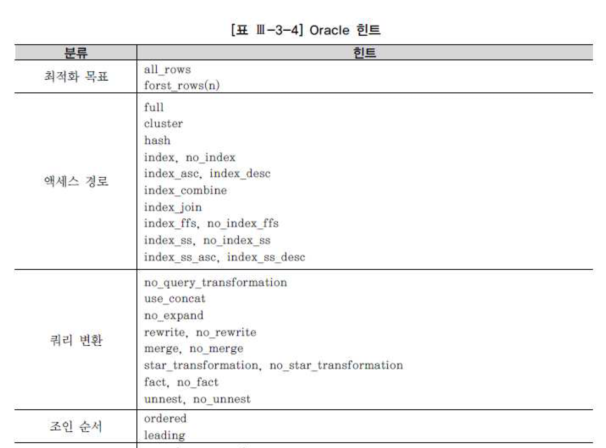

## 5. 옵티마이저
- 통계정보가 정확하지 않거나 기타 다른 이유로 옵티마이저가 잘못된 판단을 할 수 있음
- 그럴 때 프로그램이나 데이터 특성 정보를 정확히 알고 있는 개발자가 직접 인덱스를 지정하거나 조인 방식을 변경함으로 더 좋은 실행계획으로 유도하는 메커니즘이 필요함
- 옵티마이저 힌트가 바로 그것임
- 힌트 종류와 구체적인 사용법은 DBMS마다 첝차만별임
- 지면 관계상 모두 다룰 수 없으므로 Oracle, SQL Server 에 대해서만 설명하기로 한다.

### Oracle 힌트
#### 힌트 기술 방법
- Oracle에서 힌트를 기술하는 방법은 다음과 같다
```
대충 SELECT 옆에 /*+ 힌트명 */으로 기술한다.
```

#### 힌트가 씹히는 경우
- 다음의 경우 Oracled옵티마이저는 힌트를 무시하고 최적화를 진행함
  - 문법적으로 안 맞게 힌트를 기술
  - 의미적으로 안 맞게 힌트를 기술
  - 예를 들어, 서브쿼리에 unnest와 push_subq를 같이 기술한 경우(unnest되지 않은 서브쿼리만이 push_subq 힌트의 적용 대상임)
  - 잘못된 참조 사용
  - 없는 테이블이나 별칭을 사용하거나 없는 인덱스명을 지정한 경우
  - 논리적으로 불가능한 액세스 경로
  - 조인절에 등치 조건이 하나도 없는데 Hash Join으로 유도하거나 아래 처럼 Null 허용칼럼에 대한 인덱스를 이용해 전체 건수를 세려고 시도하는 등
```
select /*+ index(e emp_ename_idx) */ count(*) from emp e
```
- 버그
  - 위 경우 해당하지 않는 한 옵티마이저는 힌트를 가장 우선적으로 따름
  - 즉 옵티마이저는 힌트를 선택 가능한 옵션 정도로 여기는게 아니라 사용자로부터 주어진 명령어(directives)로 인식함
  - 여기서 주의할 점이 있음
  - Oracle은 사용자가 힌트를 잘못 기술하거나 잘못된 참조를 사용하더라도 에러가 발생하지 않는다는 사실
  - 힌트와 관련된 Oracle의 이런 정책은 프로그램 안정성 측면에 도움이 되는가 하면, 성능 측면에서 불안할 때도 있음
  - 예를 들어 힌트에 사용된 인덱스를 어느날 DBA가 삭제하거나 이름을 바꾸었다고 한다.
  - 그럴 때 SQL Server 에선 에러가 발생하므로 해당 프로그램을 수정하고 다시 컴파일해야 함
  - 프로그램을 수정하다 보면 인덱스 변경이 발생한다는 사실을 발견하게 되고 성능에 문제가 생기지 않도록 적절한 조치를 취할 것임
  - 반면 Oracle에선 프로그램을 수정할 필요가 있어 좋지만 내부적으로 Full Table Scan 하거나 다른 인덱스가 사용되면서 성능이 갑자기 나빠질 수 있음
  - 애플리케이션 운영자는 사용자가 불평하기 전까지 그런 사실을 알지 못하며 사용 빈도가 높은 프로그램에서 그런 현상이 발생해 시스템이 멎기도 함
  - DBMS마다 이처럼 차이가 있다는 사실을 미리 숙지하고, 애플리케이션 특성에 맞게 개발 표준과 DB 관리 정책을 수립할 필요가 있음

#### 힌트의 종류
- Oracle은 공식적으로 아래와 같이 많은 종류의 힌트를제공하며, 비공식 힌트까지  합치면 150개가 넘음
- 비공식까진 알필요는 없고 최소한 표에 있는 힌트는 용도와 사용법을 숙지할 필요가 있음




### SQL Server 힌트
- SQL Server 에서 옵티마이저 힌트를 저장하는 방법으로는 크게 3가지가 있음
  - 테이블 힌트
    - 테이블명 다음에 with절을 통해 지정함(fastfirstrow, holdlock, nolock 등)
  - 조인 힌트
    - FROM 절에 지정하며, 두 테이블 간 조인 전략에 영향을 미침, Loop, hash, merge, remote
  - 쿼리힌트
    - 쿼리당 맨 마지막에 한번만 지정할 수 있는 쿼리 힌트틑 아래와 같이 OPTION절을 이용함
- 앞에서 설명헀듯이 SQL Server는 문법이나 의미적으로 맞지 않게 힌트를 기술하면 프로그램 에러가 발생함


## 쿼리변환이란?
- 쿼리변환(Query Transformation)은, 옵티마이저가 SQL을 분석해 의미적으로 동일(-> 같은 결과를 리턴)하면서도 더 나은 성능이 기대되는 형태로 재작성하는 것을 말함
- 이는 본격적으로 실행계획을 생성하고 비용을 계산하기에 앞서 사용자 SQL을 최적화에 유리한 형태로 재작성하는 것으로 DBMS 버전이 올라갈수록 그 종류가 다양햊미은 물론 더 적극적인 시도가 이루어지고 있음
- 비용 기반 옵티마이저의 서브 엔진으로서 Query Transformer, Estimator, Plan Generator 가 있다고 설명했는데, 이 중 Query Transformer가 그런 역할을 담당함
- 쿼리 변환은 두가지 방식으로 작동함
- 휴리스틱 쿼리변환
  - 결과만 보장된다면 무조건 쿼리 변환을 수행함
  - 일종의 규칙기반(Rule-based)최적화 기법이라고 할 수 있으며, 경험적으로 (최소한 동일하거나) 항상 더 나은 성능을 보일 것이라는 옵티마이저 개발팀의 판단이 반영된 것
- 비용기반 쿼리 변환
  - 변환된 쿼리의 비용이 더 낮을 때만 그것을 사용하고, 그렇지 않을 때는 원본 쿼리 그대로 두고 최적화를 수행함

## 서브쿼리 Unnesting
- 서브쿼리 Unnesting은 중첩된 서브쿼리를 풀어내는 것을 말함
- 서브쿼리를 메인쿼리와 같은 레벨로 풀어낸다면 다양한 액세스 경로와 조인 메소드를 평가할 수 있음
- 특히 옵티마이저는 많은 조인 테크닉을 가지기 대문에 조인 형태로 변환했을 때 더 나은 실행계획을 찾을 가능성이 높아짐
- 아래는 하나의 쿼리에 서브쿼리가 이중 삼중으로 중첨될 수 있음을 보여줌
- 메인 쿼리에서 읽히는 레코드마다 서브쿼리를 반복 수행하며넛 조건에 맞지 않은 데이터를 골라내는 것
- 하지만 서브쿼리를 처리하는데 있어 필터 방식이 항상 최적의 수행 속도를 보장하지 못하므로 옵티마이저는 아래 둘 중 하나를 선택함
  - 동일한 결과를 보장하는 조인문으로 변환하고 나서 최적화 함
  - 이를 일컽어 서브쿼리 Unnesting이라고 함
  - 서브쿼리를 Unnesting 하지 않고 원래대로 둔 상태에서 최적화 함
  - 메인쿼리와 서브쿼리를 별도의 서브플랜으로 구분해 각각 최적화를 수행하며, 이 떄 서브쿼리에 필터 오퍼레이션이 나타남
- 1번 서브쿼리 Unnesting은 메인과 서브쿼리 간의 계층 구조를 풀어 서로 다른 레벨로 만들어 준다는 의미로 서브쿼리 Flattening 이라고 부름
- 이렇게 쿼리 변환이 이루어지고 나면 일반 조인문처럼 다양한 최적화 기법을 사용할 수 있게 됨
- 2번처럼 Unnesting하지 않고 쿼리 블록별로 최적화할 때는 각각의 최적이 쿼리문 전체의 최적을 달성하지 못할 때가 많음
- 그리고 Plan Generator가 고려 대상으로 삼을 만한 다양한 실행 계획을 생성해 내는 작업이 매우 제한적인 범위 내에서만 이루어짐
- 실제 서브쿼리 Unnesting이 어떤 식으로 작동하는지 살펴본다. 아래처럼 IN 서브쿼리를 포함하는 SQL문이 있음
```
select * from emp where deptno in (select deptno from dept)
```
- 이 SQL 문을 Unnesting 하지 않고 그대로 최적화한다면 옵티마이저는 아래와 같이 필터 방식의 실행계획을 수립함
- Predicate 정보를 보면 필터 방식으로 수행된 서브쿼리의 조건절이 바인드 변소루 처리된 부분이 눈에 띄는데 이것을 통해 옵티마이저가 서브쿼리를 별도의 서브 플랜으로 최적화한다는 사실을 알 수 있음
- 메인 쿼리도 하나의 쿼리 블록이므로 서브쿼리를 제외한 상태에서 별도로 최적화가 이루어짐(아무 조건절이 없으므로 Full Table Scan이 최적임)
- 이처럼 Unnesting하지 않은 서브쿼리를 수행할 때는 메인 쿼리에서 읽히는 레코드마다 값을 넘기면서 서브쿼리를 반복 수행함
- (내부적으로 IN 서브쿼리를 Exists 서브쿼리로 변환한다는 사실도 Predicate 정보를 통해 알 수 있음)
- 위 서브쿼리가 Unnesting 되면, 변환된 쿼리는 아래와 같은 조인문 형태가 됨
```
select * from (select deptno from dept) a, emp b, where b.deptno = a.deptno
```
- 그리고 이것은 바로 이어서 설명할 뷰 Merging과정을 거쳐 최종적으로 아래와 같은 형태가 됨
```
select emp.* from dept, emp where emp. deptno = dept.deptno
```
- 아래가 서브쿼리 Unnesting이 일어났을 때의 실행계획임
- 서브쿼리인데도 일반적인 Nested Loop 조인방식으로 수행된 것을 볼 수 있음
- 위 조인문을 수행할 때와 정확히 같은 실행계획임
- 주의할 점은, 서브쿼리를 Unnesting 한 겨로가가 항상 더 나은 성능을 보장하지 않는다는 사실임
- 따라서 최근 옵티마이저는 서브쿼리를 Unnesing 했을 때 쿼리 수행 비용이 더 낮은지를 비교해 보고 적용 여부를 판단하는 쪽으로 발전하고 있음
- 기본적으로 옵티마이저에게 맞기는 것이 바람직하나, 앞서 얘기했듯이 옵티마이저가 항상 완벽할 순 없으므로 사용자가 직접 이 기능을 제어할 필요성이 생김
- 이를 위해 Oracle은 아래 두 가지 힌트를 재공
  - unnest : 서브쿼리를 Unnesting 함으로 조인방식은 최적화하도록 유도함
  - no_unnest : 서브쿼리를 그대로 둔 상태에서 필터 방식으로 최적화하도록 유도함
- 서브쿼리가 M쪽 집합이거나 Nonunique 인덱스일때
- 지금까지 본 예제는 메인 쿼리의 emp 테이블과 서브쿼리의 dept 테이블이 M:1관계이기 대문에 일반 조인문으로 바꾸더라도 쿼리 결과가 보장됨
- 옵티마이저는 deptno 칼럼에 PK 제약이 설정된 것을 통해 dept 테이블이 1쪽 집합이라는 사실을 알 수 있음
- 따라서 안심하고 쿼리 변환을 실시함
- 만약 서브쿼리쪽 테이블 조인 칼럼에 PK/Unique 제약 또는 Unique인덱스가 없다면 일반 조인문처럼 처리헀을때 어떻게 되나?

#### 사례 1
```
select * from dept where deptno in (select deptno from emp)

```
- 위 쿼리는 1쪽 집합을 기준으로 M쪽 집합을 필터링하는 형태이므로 당연히 서브쿼리쪽 emp 테이블 deptno 칼럼에는 unique 인덱스가 없음
- dept 테이블이 기준 집합이므로 결과 집합은 이 테이블의 총 건수를 넘지 않아야 함
- 그런데 옵팉마이저가 임의로 아래와 같은 일반 조인문으로 변환한다면 M쪽 집합인 emp 테이블 단위의 결과집합이 만들어지므로 결과 오류가 생김

```
select * from (select deptno from emp) a, dept b where b.deptno = a.deptno
```

#### 사례 2
```
select * from emp where deptno in (select deptno from dept)
```
- 위 쿼리는 M쪽 집합을 드라이빙해 1쪽 집합을 서브쿼리로 필더링하도록 작성되어 있으므로 조인문으로 바꾸더라도 결과에 오류가 생기기 않음
- 하지만 dept테이블 deptno 칼럼에 PK/Unique 제약이나 Unique 인덱스가 없으면 옵티마이저는 emp와 dept 간의 관계를 알 수 없고, 결과를 확신할 수 없으니 일반 조인문으로 쿼리 변환을 시도하지 않음(만약 SQL 튜닝 차원에서 위 쿼리를 사용자가 직접 조인문으로 바꿨는데, 어느순간 dept 테이블 deptno 칼럼에 중복값이 입력되면서 결과에 오류가 생기더라도 옵티마이저에게는 책임이 없음)
- 이럴 때 옵티마이저는 두가지 방식 중 하나를 선택하는데 Unnesting 후 어느쪽 집합을 먼저 드라이빙 하느냐에 따라 달라짐
  - 1쪽 집합임을 확신할 수 없는 서브쿼리쪽 테이블이 드라이빙된다면, 먼저 sort unique 오퍼레이션을 수행함으로써 1쪽 집합을 만든 다음에 조인함
  - 메인 쿼리쪽 테이블이 드라이빙된다면 세미 조인(semi join) 방식으로 조인함
  - 이것이 세미 조인이 탄생하게 된 배경이라고 볼 수 있음
- NL 세미 조인으로 수행할 때는 sort unique 오퍼레이션을 수행하지 않고도 결과집합이 M쪽 집합으로 확장되는 것을 방지하는 알고리즘을 사용한다
- 기본적으로 NL Join과 동일한 프로세스로 진행하지만, Outer 테이블의 한 로우가 Inner 테이블의 한 로우와 조인에 성공하는 순간 진행을 멈추고 Outer 테이블의 다음 로우를 계속 처리하는 방식임

## 뷰 Merging
- 아래 <쿼리1>처럼 인라인 뷰를 사용하면 쿼리 내용을 파악하기가 더 쉬움
- 서브쿼리도 마찬가지
- 서브쿼리로 표현하면 아무래도 조인문보다 더 직관적으로 읽힘
```
<쿼리 1>
select * from (select * from emp where job = 'SALESMAN')a, (select * from dept where loc = 'CHICAGO') b where a.deptno = b.deptno
```
- 그런데 사람의 눈으로 볼 때 쿼리를 블록화하는 것이 더 읽기 편할지 모르나, 최적화를 수행하는 옵티마이저의 시각에서는 더 불편함
- 그런 탓에 옵티마이저는 가급적 <쿼리 2>처럼 블록을 풀어내려는 습성을 가짐
```
 <쿼리2>
  
select * from emp a, dept b, where a.deptno = b.deptno and a.job = 'SALESMAN' and b.loc = 'CHICAGO'
```
- 따라서 위에서 본 <쿼리1>의 뷰 쿼리 블록은 액세스 쿼리 블록(뷰를 참조하는 쿼리 블록)과의 머지(merge) 과정을 거쳐 <쿼리 2>와 같은 형태로 변환되는데, 일르 뷰 머징이라고 부름
- 뷰 머징해야 옵티마이저가 더 다양한 액세스 결로를 조사 대상으로 삼을 수 있게 됨
- 아래와 같이 조건절 하나만을 가진 단순한 emp_salesman 뷰가 있음
```
create or replace view emp_salesman as select empno, ename, job, hiredate, sal, comm, deptno from emp where job = 'SALESMAN';
```
- 위 emp_salesman 뷰와 조인하는 간단한 조인문을 작성한다
```
select e.empno, e.ename, e.job, e.mgr, e.sal, d dname from emp_salesman e.dept d where d.dept = e.deptno and e.sal >= 1500;
```
- 단순한 뷰는 Merging 하더라도 성능이 나빠지지 않음
- 하지만 아래와 같이 복잡한 연산을 포함하는 뷰를 Merging 하면 오히려 성능이 더 나빠질 수 있음
```
group by
select-list dp distinct 연산자 포함
```
- 따라서 뷰를 merging했을 때 쿼리 수행 비용이 더 낮아지는지를 조사한 후에 적용 여부를 판단하는 쪽으로 옵티마이저가 발전하고 있음
- 가급적 옵티마이저의 판단과 기능에 의존하는 것은 좋지만, 필요하다면 갭잘자가 이를 직접 조정할 줄도 알아야 함
- Oracle의 경우 이 기능을 제어할 수 있도록 merge의 no_merge 힌트를 제공하는데, 이를 사용하기에 앞서 실행계획을 통해 뷰 merging이 발생했는지, 그리고 그것이 적정한지 판단하는 능력이 더 중요함
- 아래는 뷰 Merging이 불가능한 경우인데 힌트가 제공됨

```
집합(set) 연산자(union, union all, intersect minus)
connect by 절
ROWNUM pseudo 칼럼
select-list에 집계함수(avg, count, max, min, sum)사용
분석함수
```

## 4. 조건절 Pushing
- 옵티마이저가 뷰를 처리함에 있어 1차적으로 뷰 Merging을 고려하지만 조건절(Predicate) Pushing을 시도할 수도 있음
- 이는 뷰를 참조하는 쿼리 블록의 조건절을 뷰 쿼리 블록안으로 밀어 넣는 기능을 말함
- 조건절이 가능한 빨리 처리되도록 뷰 안에서 밀어 넣는다면, 뷰 안에서의 처리 일량을 최소화하게 됨은 물론 리턴되는 결과 건수를 줄임으로써 다음 단계에서 처리해야 할 일량을 줄일 수 있음
- 조건절 Pushing과 관련해 DBMS가 사용하는 기술로는 다음 3가지가 있음
  - 조건절 Pushdown
    - 쿼리 블록 밖에 있는 조건절을 쿼리 블록 안족으로 밀어 넣는 것을 말함
  - 조건절 Pullup
    - 쿼리 블록 안에 있는 조건절을 쿼리 블록 밖으로 내오는 것을 말하며 그것을 다른 쿼리 블록에 Pushdown 하는데 사용
  - 조인조건 Pushdown
    -  NL Join수행 중에 드라이빙 테이블에서 읽은 값을 건건이 Inner 쪽(=right side)뷰 쿼리 블록 안으로 밀어 넣는것

### 조건절 Push down
- group by 절을 포함한 아래 뷰를 처리할 때, 쿼리 블록 밖에 있는 조건절을 쿼리 블록 안쪽에 밀어넣을 수 있다면 group by 해야 할 데이터량을 줄일 수 있음
- 인덱스 상황에 따라서는 더 효과적인 인덱스 선택이 가능하게 함

### 조건절 Pullup
- 조건절을 쿼리 블록 안으로 밀어 넣을 뿐만 아니라 안쪽에 있는 조건들을 바깥 쪽으로 끄집어 내기도 하는데 이를 조건절 Pullup이라고 함
- 그리고 그것을 다시 다른 쿼리 블록에 Pushdown 하는데 사용함

### 조인 조건(join predicate)Pushdown
- 조인 조건(join Predicate)Pushdown은 말 그대로 조인 조건절을 뷰 쿼리 블록 안으로 밀어 넣는 것으로서, NL 조인 수행 중에 드라이빙 테이블에서 읽은 조인 컬럼 값을 Inner 쪽 뷰 쿼리 블록 내에서 참조할 수 있도록 하는 기능
- 아래 실행계획에서 Group by 절을 포함한 뷰를 액세스하는 단계에서 view pushed predicate 오퍼레이션이 나타남
- 그 아래쪽에 emp_deptno_idx 인덱스가 사용된 것을 볼 수 있는데, 이는 dept 테이블로부터 넘겨진 deptno 에 대해서만 group by를 수행함을 의미함
```
select d.deptno, d.dname ,(select avg(sal) from emp where deptno = d.deptno) from dept d
```
- 집계함수가 여러 개일 때가 문제인데, 만약 아래와 같이 쿼리하면 emp에서 같은 범위를 반복적으로 액세스하는 비효율이 생긴다.
```
select d.deptno, d.dname ,(select avg(sal) from emp where deptno = d.deptno) avg-sal ,(select min(sal) from emp where deptno = d.deptno) min_sal ,(select max(sal) from emp where deptno = d.deptno) max_sal from dept d
```
- 이럴 때는 아래 처럼 구하고자 하는 값들을 모두 결합하고서 바깥쪽 액세스 쿼리에서 substr 함수로 분리하는 방법이 유용할 수 있다.
```
select deptno, dname, to_number(substr(sal, 1, 7)) avg_sal, to_number(substr(sal, 8, 7)) min_sal, to_number(substr(sal, 15)) max_sal 
from ( select / *+ no_merge */ d.deptno, d.dname ,(select lpad(avg(sal), 7) || Ipad(min(sal), 7) || max(sal) 
        from emp 
       where deptno = d.deptno) sal from dept d)
```
