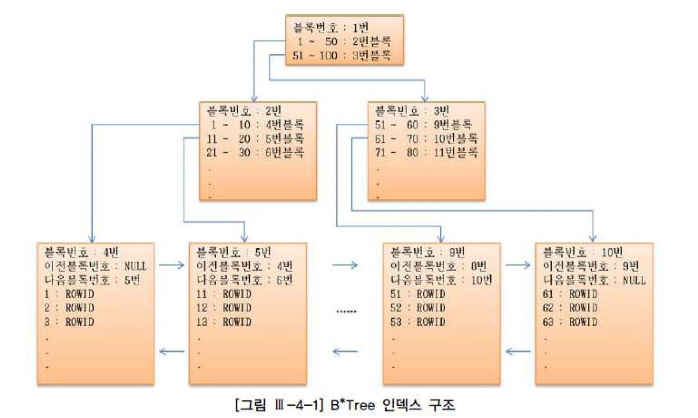
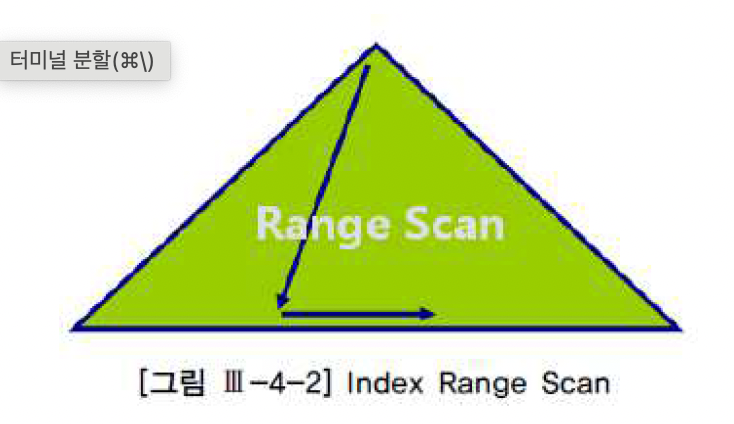
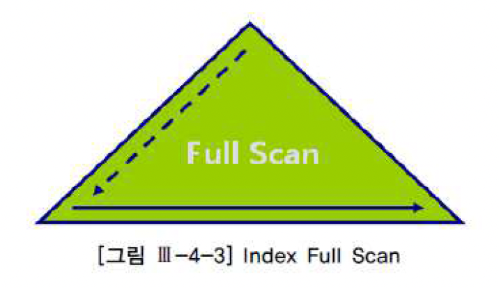

# 인덱스와 조인
- 지금 당장 책장에서 아무 책이나 골라 맨 뒤쪽에 있는 인덱스 부분을 펼쳐보길 바람
- 가나다 순으로 정렬되어 있고, 키워드가 같을 땐 페이지 순으로 정렬된 것을 볼 수 있을 것
- 인덱스를 잉요하면 원하는 키워드를 포함한 페이지를 빠르게 찾을 수 있음
- 인덱스가 없다면 책 전체를 한장씩 훑어가면 찾을 수 밖에 없음
- 데이터베이스에서 시용하는 인덱스도 다르지 않음
- 대용량 테이블에서 우리에게 필요한 데이터를 빨리 찾으려면 인덱스의 도움이 필요함
- 인덱스가 아예 없거나 적절한 인덱스를 찾지 못하면 테이블 전체를 읽어야 하기 때문에 시간이 오래 걸리는 것은 당연함

## 인덱스 구조
### 인덱스 기본
- 모든 DBMS는 나름의 다양한 인덱스를 제공하는데 저장 방식과 구조, 탐색 알고리즘이 조금씩 다르긴 해도 원하는 데이터베이스를 빨리 찾도록 돕는다는 근본적인 목적은 같음
- 여기서 가장 일반적으로 사용되는 B*Tree 인덱스 구조부터 살펴본다

- 그림에 예시한 인덱스 칼럼은 양의 정수만 저장할 수 있는 데이터 타입이라고 가정하고 그린 것
- 이름에서 앐 수 있듯 B-tree 인덱스는 나뭇잎으로 무성한 나무를 뒤집어 놓은 듯한 모습임
- 나무를 뒤집어 놓았으므로 맨 위쪽 뿌리에서부터 가지를 거쳐 맨 아래 나뭇잎까지 연결되는 구조임
- 처음에는 단 하나의 루트 블록에서 시작하겠지만 데이터가 점점 쌓이면서 루트, 브랜치, 리프 노드를 모두 갖춘 풍성한 나무로 성장함
- 중간에 물론 루트와 리프만으로 구성된 2단계 구조를 가짐
- 참고로 루트에서 리프 블록까지의 거리를 인덱스 길이라고 부르며 인덱스를 반복적으로 탐색할 때 성능에 영향을 미침
- 루트와 브랜치 블록은 각 하위 노드들의 데이터 값 범위를 나타내는 키 값과, 그 키 값에 해당하는 블록을 찾는데 필요한 주소 정보를 가짐
- 리프 블록은 인덱스 키 값과, 그 키 값에 해당하는 테이블 레코드를 찾아가는데 필요한 주소 정보를 가짐
- 기 값이 같을 때는 ROWID 순으로 정렬된다는 사실도 기억하기를 바람
- 리프 블록은 항상 인덱스 키 값 순으로 정려로디있기 때문에 범위 스캔 검색 조건에 해당하는 범위만 읽다가 멈추는 것이 가능하고, 정방향과 역방향 스캔이 둘다 가능하도록 양방향 연결 리스트 구조로 연결돼있다
- 아래는 NULL 값을 인덱스에 저장하는데 있어 Oracle과 SQL Server의 차이점을 설명한 것
  - Oracle에서 인덱스 구성 칼럼이 모두 null인 레코드는 인덱스에 저장하지 않음
    - 반대로 말하면 인덱스 구성 칼럼 중 하나라도 null 값이 아닌 레코드는 인덱스에 저장됨
  - SQL Server는 인덱스 구성 칼럼이 모두 null인 레코드도 인덱스에 저장됨
  - null 값을 Oracle맨 뒤에 저장하고 SQL Server는 맨 앞에 저장함
- Null 값을 처리하는 방식이 이처럼 DBMS마다 다르고, 이런 특성이 Null 값 조회에 인덱스가 사용될 수 있는지를 결정하므로 인덱스를 설계하거나 SQL 을 개발할 때 반드시 숙지하기 바람

### 인덱스 탐색
- 인덱스 탐색 과정을 수직적 탐색과 수평적 탐색으로 나눠서 설명할 수 있음
- 수평적 탐색은 인덱스 리프 블록에 저장딘 레코드끼리 연결된 순서에 따라 좌에서 우, 또는 우에서 좌로 스캔하기 때문에 '수평적'이라고 표현함
- 수직적 탐색은 수평적 탐색을 위한 시작 지접을 찾는 과정이라고 할 수 있으며 루트에서 리프 블록까지 아래쪽으로 진행하기 대문에 수직적

#### 레코드를 찾는 순서
- 우선 루트 블록에서 53이 속한 키 값을 찾음
  - 두번째 레코드가 선택될 것이므로 거기서 가리키는 것은 3번 블록으로 찾아감
- 3번블록에서 다시 53이 속한 키 값을 찾음
  - 여기서 첫 번째 레코드가 선택될 것이므로 9번 블록으로 찾아감
  - 찾아간 9번은 리프 블록이므로 거기서 값을 찾거나 못 찾거나 둘 중 하나임
  - 다행히 세 번째 레코드가 선택될 것이므로 9번 블록으로 찾아감
- 찾아간 9번은 리프 블록이므로 거기서 값을 찾거나 못찾거나 둘 중 하나임
  - 다행히 세 번째 블록에서 찾아지므로 함꼐 저장된 ROWID를 이용하여 테이블 블록을 찾아감
- ROWID를 분해해보면, 오브젝트 번호, 데이터파일 번호, 블록 번호, 블록 내 위치 정보를 알 수 있음
- 테이블 블록에서 레코드를 찾아감
- 인덱스가 Unique 인덱스가 아닌 한 값이 53인 레코드가 더 있을 수 있기 때문임
- 따라서 9번 블록에서 레코드 하나를 더 읽어 53인 레코드가 더 있는지 확인함
- 53인 레코드가 더이상 나오지 않을 때까지 스캔하면서 4번 테이블 액세스 단계를 반복함
- 만약 9번 블록을 다 읽었는데도 게속 53이 나온다면 10번 블록으로 넘어가서 스캔을 계속함

## 다양한 인덱스 스캔 방식
### Index Range Scan
- Index Range Scan은 인덱스 루트 블록에서 리프 블록까지 수직적으로 탐색한 후에 리프 블록을 필요한 범위만 스캔하는 방식임

- B*tree 인덱스의 가장 일반적이고 정상적인 형태의 액세스 방식이라고 할 수 있다
- 인덱스를 수직적으로 탐색한 후에 리프 블록에서 필요한 범위만 스캔한다고 했는데, 이는 범위 스캔이 의미하는 바를 잘 설명해주고 있음
- 데이터 베이스 프로그래밍에 경험이 많지 않은 초급 개발자는 대게 인덱스가 사용되는 실행계획을 보면 자신이 작성한 SQL 문에 문제가 없다고 판단하고 일단 안심함
- 하지만 실행계획 상 index Range Scan이 나타난다고 해서 항상 빠른 속도를 보장하는 것은 아님
- 인덱스를 스캔하는 범위를 얼마만큼 줄일 수 있느냐, 그리고 테이블로 액세스하는 횟수를 얼마만큼 줄일 수 있느냐가 관건이며, 이는 인덱스 설게와 SQL 튜닝의 핵심 원리 중 하나임
- Index Range Scan이 가능하게 하려면 인덱스를 구성하는 선두 컬럼이 조건절에 사용되어야 함
- 그렇지 못한 상태에서 인덱스를 사용하도록 힌트를 강제한다면 바로이어서 설명할 Index Full Scan방식으로 처리됨
- Index Range Scan 과정을 거쳐 생성된 결과집합은 인덱스 칼럼 순으로 정렬된 상태가 되기 때문에 이런 특징을 잘 이용하면 sort order by 연산을 생략하거나 min/max 값을 빠르게 추출할 수 있음

### Index Full Scan
- index full scan은 수직적 탐색없이 인덱스 리프 블록을 처음부터 끝까지 수평적으로 탐색하는 방식으로서, 대게는 데이터 검색을 위한최적의 인덱스가 없을 때 차선으로 선택하게 됨

- 수직적 탐색 없이 인덱스 리프 블록을 처음부터 끝까지 수평적으로 탐색한다고 했는데, 이는 개념적으로 설명하기 위한 것일 뿐 실제로는 그림처럼 수직적 탐색이 먼저 일어남
- 루트 블록과 브랜치 블록을 거치지 않고서는 가장 왼쪽에 위치한 첫번째 리프 블록으로 찾아갈 방법이 없기 때문
- 그래서 이 과정을 점선으로 표시함

#### Index Full Scan의 효용성
- SQL 처럼 선두 칼럼이 조건절에 없으면 옵티마이저는 우선적으로 Table Full Scan을 고려함
- 그런데 대용량 테이블이어서 Table Full Scan의 부담이 크다면 옵티마이저는 인덱스를 활용하는 방법을 다시 생각해 보지 않을 수 없음
- 데이터 저장공간은 가로 * 세로 즉 칼럼길이 * 레코드 수에 의해 결정되므로 대개 인덱스가 차지하는 면적은 테이블보다 훨씬 적게 마련임
- 만약 인데스 스캔 단계에서 대부분 레코드를 필터링하고 일부에 대해서만 테이블 액세스가 발생하는 경우라면 테이블 전체를 스캔하는 것보다 나음
- 이럴 때 옵티마이저는 index Full Scan 방식으로 선택할 수 있음
- 아래는 Index Full Scan이 효과를 발휘하는 전형적인 케이스임

#### 인덱스를 이용한 소트 연산의 대체
- Index full scan은 Index Range Scan과 마찬가지로 그 결과집합이 인덱스 칼럼 순으로 정렬되므로 Sort Order By 연산을 생략할 목적으로 사용될 수 있는데, 이는 차선책으로 선택한다기 보다 옵티마이저가 전략적으로 선택한 경우에 해당됨
- 옵티마이저는 소트 연산을 생략함으로 전체 집합 중 처음 일부만을 빠르게 리턴할 목적으로 Index Full Scan 방식을 선택한 것임
- 사용자가 그러나 처음 의도와 다르게 데이터 읽기를 멈추지 않고 끝까지 Fetch 한다면 Full Table Scan 한 것보다 훨씬 더 많은 I/O를 일으키면서  서버 자원을 낭비할 텐데, 이는 옵티마이저의 잘못이 결코 아니며 first_rows 힌트를 사용한 사용자에게 책임이 있음

### Index Unique Scan
- index Unique Scan은 수직적 탐색만으로 데이터를 찾는 스캔 방식
- Unique 인덱스를 '='조건으로 탐색하는 경우에 작동함

### Index Skip Scan
- 인덱스 선두 칼럼이 조건절로 사용되지 않으면 옵티마이저는 기본적으로 Table Full Scan을 선택함
- 또는 Table Full Scan 보다 I/O를 줄일 수 있거나 정렬된 결과를 쉽게 얻을 수 있다면 Index Full Scan 방식을 사용한다고 한다
- Oracle은 인덱스 선두 컬럼이 빠졌어도 인덱스를 활용하는 새로운 스캔방식을 9i 버전에서 선보였는데, 바로 Index Skip Scan이 그것임
- index Skip Scan 내부 수행 원리를 간단히 요약하면 루트 또는 브랜치 블록에서 읽은 칼럼 값 정보를 이용해 조건에 부합하는 레코드를 포함할 가능성이 있는 하위 블록만 골라서 액세스하는 방식이라고 할 수 있음
- 이 스캔 방식은 조건절에 빠진 인덱스 선두 컬럼의 Distinct Value 개수가 적고 후행 칼럼의 Distinct Value 개수가 많을 때 유용함

### Index Fast Full Scan
- 말 그대로 Index Fast Full Scan은 Index Full Scan보다 빠름
- Index Fast Full Scan이 Index Full Scan보다 빠른 이유는 인덱스 트리 구조를 무시하고 인덱스 세그먼트 전체를 Multiblock Road 방식으로 스캔하기 때문임
- Index Full Scan과의 차이점을 요약하면 아래와 같음
- 
|Index Full Scan|Index Fast Full Scan|
|--|--|
|1. 인덱스 구조를 따라 스캔   2. 결과집합 순서 보장  3. Single Block I/O   4. 병렬스캔 불가(파티션 돼 있지 않다면)   5. 인덱스에 포함되지 않은 칼럼 조회 시에도 사용 가능|1. 세그먼트 전체를 스캔   2. 결과집합 순서 보장 안 됨   3. Multiblock I/O   4. 병렬 스캔 가능   5. 인덱스에 포함된 칼럼으로만 조히할 때 사용 가능| 

### Index Range Scan Descending
- Index Range Scan과 기본적으로 동일한 스캔 방식임
- 인덱스를 뒤에서부터 앞쪽으로 스캔하기 때문에 내림차순으로 정렬된 결과집합을 얻는다는 점만 다름
- 아래 처럼 emp 테이블을 empno 기준으로 내림차순 정렬하고자 할 때 empno 칼럼에 인덱스가 있으면 옵티마이저가 알아서 인덱스를 거꾸로 읽는 실행계획을 수립합

## 3. 인덱스 종류
### B*Tree 인덱스
- 모든 DBMS가 B*Tree 인덱스를 기본적으로 제공하며, 추가적으로 제공하는 인덱스 구조는 모두 B * Tree를 기준으로 설명할 것이므로 여기서는 B * Tree 인덱스 구조에서 나타날 수 있는 index Fragmentation에 대한 개념만 잠시 살펴보기로 한다

#### Unbalance Index
- delete 작업 때문에 인덱스가 불균형 상태에 놓일 수 있다고 설명한 자료들을 볼 수 있음
- 즉 다른 리프 노드에 비해 루트 블록과 거리가 더 멀거나 가까운 리프 노드가 생길 수 있다는 것인데, B * Tree 구조에서 이런 현상은 절대 발생하지 않음
- B * Tree 인덱스의 'B'는 'Balance'의 약자로 인덱스 루트에서 리프 블록까지 어떤 갑승로 탐색하더라도 읽는 블록수가 같음을 의미함
- 즉 루트로부터 모든 리프 블록까지의 높이가 동일함

#### Index Skew
- 불균형은 생길 수 없지만 Index Fragmentation 에 의한 Index Skew또는 Sparse 현상이 생기는 경우는 종종 있고, 이는 인덱스 스캔 효율에 나쁜 영향을 미칠 수 있음
- Index Skew는 인덱스 엔트리가 왼쪽 또는 오른쪽에 치우치는 현상을 말함
- 예를 들어 아래와 같이 대량의 delete작업을 마치고 나면 인덱스 왼쪽에 있는 리프 블록들은 텅 비는 반면 오른쪽은 꽉 찬 상태가 됨
- Oracle의 경우 텅 빈 인덱스 블록은 커밋하는 순간 freelist로 반환되지만 인덱스 구조 상에는 그대로 남아 있어 인덱스 정렬 순서상 그곳에 입력될 새로운 값이 들어오면 언제든 재사용될 수 있다
- 새로운 값이 하나라도 입력되기 전 다른 노드에 인덱스 분배 사용됨
- 이때는 상위 브랜치에서 해당 리프 블록을 가리키는 엔트리가 제거되 다른 쪽 브랜치의 자식 노드로 이동하고 freelist에서도 제거됨
- 레코드가 모두 삭제된 블록은 이처럼 언제든 재사용이 가능하지만, 문제는 다시 채워질 때까지 인덱스 스캔 효율이 낮다는 데가 있음
- SQL Server 에선 Index Skew 현상이 발생하지 않음
- 추가적으로 B*Tree 인덱스를 체크함으로써 지워진 레코드와 페이지를 정리해주는 메커니즘을 갖기 때문임
- 인덱스 레코드를 지우면 리프트리코드로 마크 되었나가 이를 정리해주는 별도 쓰레드에 의해 비동기 방식으로 제거되는데 그 과정에서 텅 빈 페이지가 발견되면 인덱스 구조에서 제거됨