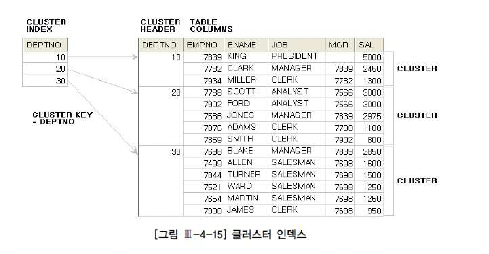
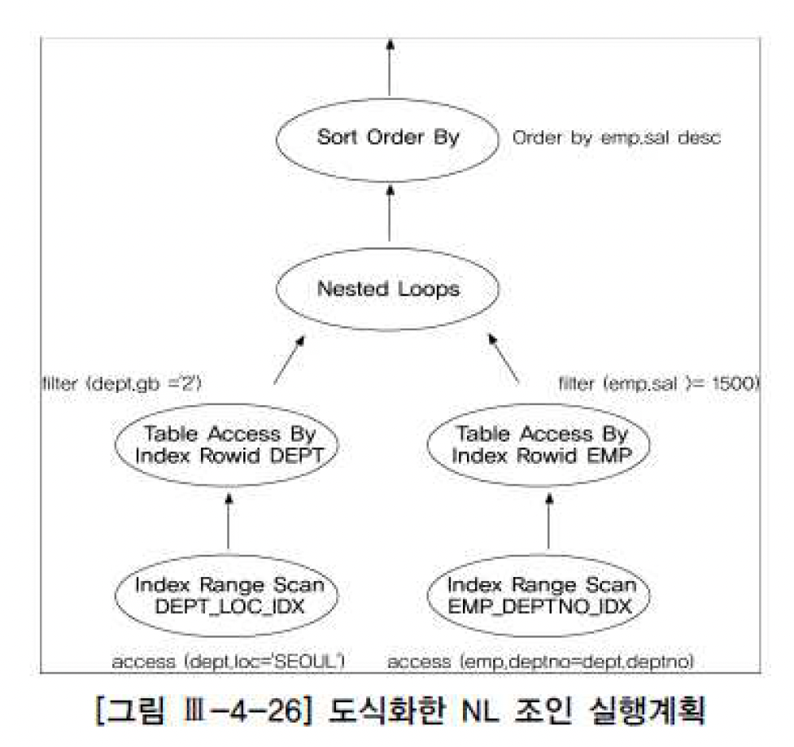
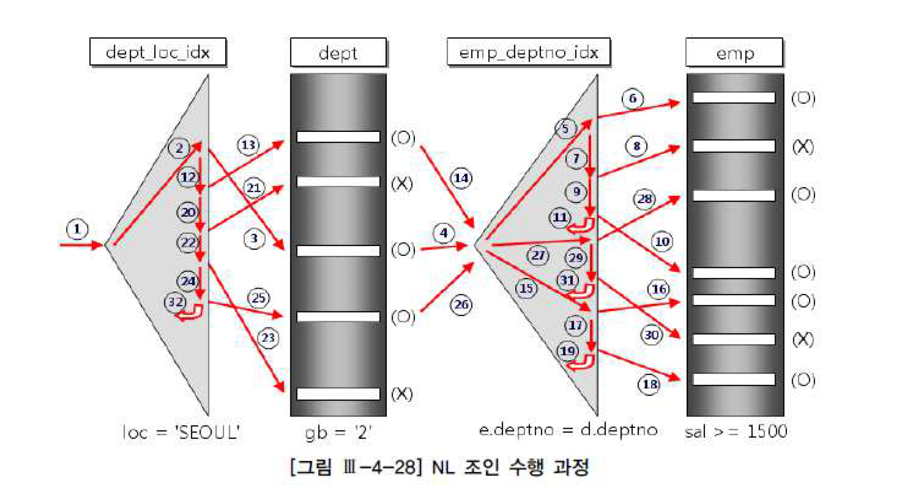
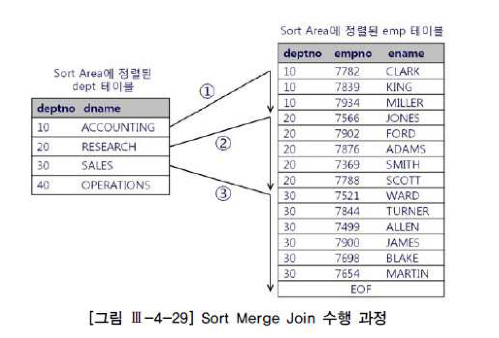
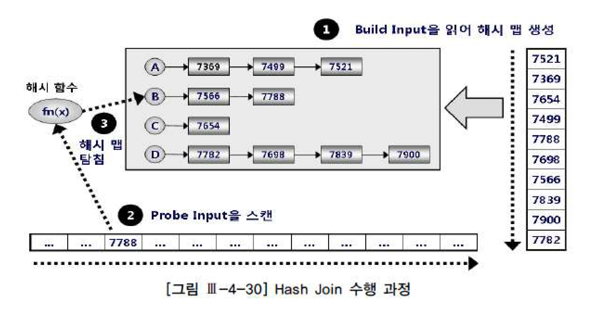
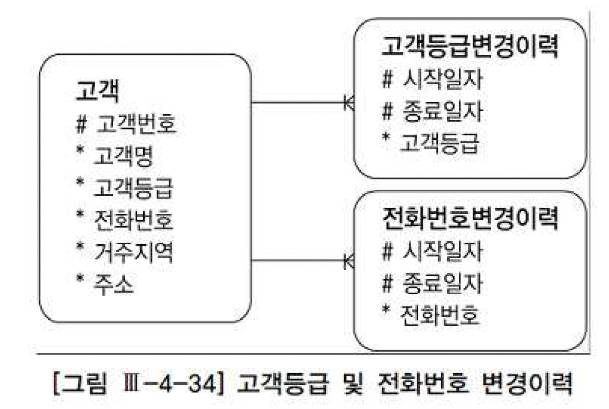

# 인덱스와 조인
- 지금 당장 책장에서 아무 책이나 골라 맨 뒤쪽에 있는 인덱스 부분을 펼쳐보길 바람
- 가나다 순으로 정렬되어 있고, 키워드가 같을 땐 페이지 순으로 정렬된 것을 볼 수 있을 것
- 인덱스를 잉요하면 원하는 키워드를 포함한 페이지를 빠르게 찾을 수 있음
- 인덱스가 없다면 책 전체를 한장씩 훑어가면 찾을 수 밖에 없음
- 데이터베이스에서 시용하는 인덱스도 다르지 않음
- 대용량 테이블에서 우리에게 필요한 데이터를 빨리 찾으려면 인덱스의 도움이 필요함
- 인덱스가 아예 없거나 적절한 인덱스를 찾지 못하면 테이블 전체를 읽어야 하기 때문에 시간이 오래 걸리는 것은 당연함

## 인덱스 구조
### 인덱스 기본
- 모든 DBMS는 나름의 다양한 인덱스를 제공하는데 저장 방식과 구조, 탐색 알고리즘이 조금씩 다르긴 해도 원하는 데이터베이스를 빨리 찾도록 돕는다는 근본적인 목적은 같음
- 여기서 가장 일반적으로 사용되는 B*Tree 인덱스 구조부터 살펴본다


- 그림에 예시한 인덱스 칼럼은 양의 정수만 저장할 수 있는 데이터 타입이라고 가정하고 그린 것
- 이름에서 앐 수 있듯 B-tree 인덱스는 나뭇잎으로 무성한 나무를 뒤집어 놓은 듯한 모습임
- 나무를 뒤집어 놓았으므로 맨 위쪽 뿌리에서부터 가지를 거쳐 맨 아래 나뭇잎까지 연결되는 구조임
- 처음에는 단 하나의 루트 블록에서 시작하겠지만 데이터가 점점 쌓이면서 루트, 브랜치, 리프 노드를 모두 갖춘 풍성한 나무로 성장함
- 중간에 물론 루트와 리프만으로 구성된 2단계 구조를 가짐
- 참고로 루트에서 리프 블록까지의 거리를 인덱스 길이라고 부르며 인덱스를 반복적으로 탐색할 때 성능에 영향을 미침
- 루트와 브랜치 블록은 각 하위 노드들의 데이터 값 범위를 나타내는 키 값과, 그 키 값에 해당하는 블록을 찾는데 필요한 주소 정보를 가짐
- 리프 블록은 인덱스 키 값과, 그 키 값에 해당하는 테이블 레코드를 찾아가는데 필요한 주소 정보를 가짐
- 기 값이 같을 때는 ROWID 순으로 정렬된다는 사실도 기억하기를 바람
- 리프 블록은 항상 인덱스 키 값 순으로 정려로디있기 때문에 범위 스캔 검색 조건에 해당하는 범위만 읽다가 멈추는 것이 가능하고, 정방향과 역방향 스캔이 둘다 가능하도록 양방향 연결 리스트 구조로 연결돼있다
- 아래는 NULL 값을 인덱스에 저장하는데 있어 Oracle과 SQL Server의 차이점을 설명한 것
  - Oracle에서 인덱스 구성 칼럼이 모두 null인 레코드는 인덱스에 저장하지 않음
    - 반대로 말하면 인덱스 구성 칼럼 중 하나라도 null 값이 아닌 레코드는 인덱스에 저장됨
  - SQL Server는 인덱스 구성 칼럼이 모두 null인 레코드도 인덱스에 저장됨
  - null 값을 Oracle맨 뒤에 저장하고 SQL Server는 맨 앞에 저장함
- Null 값을 처리하는 방식이 이처럼 DBMS마다 다르고, 이런 특성이 Null 값 조회에 인덱스가 사용될 수 있는지를 결정하므로 인덱스를 설계하거나 SQL 을 개발할 때 반드시 숙지하기 바람

### 인덱스 탐색
- 인덱스 탐색 과정을 수직적 탐색과 수평적 탐색으로 나눠서 설명할 수 있음
- 수평적 탐색은 인덱스 리프 블록에 저장딘 레코드끼리 연결된 순서에 따라 좌에서 우, 또는 우에서 좌로 스캔하기 때문에 '수평적'이라고 표현함
- 수직적 탐색은 수평적 탐색을 위한 시작 지접을 찾는 과정이라고 할 수 있으며 루트에서 리프 블록까지 아래쪽으로 진행하기 대문에 수직적

#### 레코드를 찾는 순서
- 우선 루트 블록에서 53이 속한 키 값을 찾음
  - 두번째 레코드가 선택될 것이므로 거기서 가리키는 것은 3번 블록으로 찾아감
- 3번블록에서 다시 53이 속한 키 값을 찾음
  - 여기서 첫 번째 레코드가 선택될 것이므로 9번 블록으로 찾아감
  - 찾아간 9번은 리프 블록이므로 거기서 값을 찾거나 못 찾거나 둘 중 하나임
  - 다행히 세 번째 레코드가 선택될 것이므로 9번 블록으로 찾아감
- 찾아간 9번은 리프 블록이므로 거기서 값을 찾거나 못찾거나 둘 중 하나임
  - 다행히 세 번째 블록에서 찾아지므로 함꼐 저장된 ROWID를 이용하여 테이블 블록을 찾아감
- ROWID를 분해해보면, 오브젝트 번호, 데이터파일 번호, 블록 번호, 블록 내 위치 정보를 알 수 있음
- 테이블 블록에서 레코드를 찾아감
- 인덱스가 Unique 인덱스가 아닌 한 값이 53인 레코드가 더 있을 수 있기 때문임
- 따라서 9번 블록에서 레코드 하나를 더 읽어 53인 레코드가 더 있는지 확인함
- 53인 레코드가 더이상 나오지 않을 때까지 스캔하면서 4번 테이블 액세스 단계를 반복함
- 만약 9번 블록을 다 읽었는데도 게속 53이 나온다면 10번 블록으로 넘어가서 스캔을 계속함

## 다양한 인덱스 스캔 방식
### Index Range Scan
- Index Range Scan은 인덱스 루트 블록에서 리프 블록까지 수직적으로 탐색한 후에 리프 블록을 필요한 범위만 스캔하는 방식임


- B*tree 인덱스의 가장 일반적이고 정상적인 형태의 액세스 방식이라고 할 수 있다
- 인덱스를 수직적으로 탐색한 후에 리프 블록에서 필요한 범위만 스캔한다고 했는데, 이는 범위 스캔이 의미하는 바를 잘 설명해주고 있음
- 데이터 베이스 프로그래밍에 경험이 많지 않은 초급 개발자는 대게 인덱스가 사용되는 실행계획을 보면 자신이 작성한 SQL 문에 문제가 없다고 판단하고 일단 안심함
- 하지만 실행계획 상 index Range Scan이 나타난다고 해서 항상 빠른 속도를 보장하는 것은 아님
- 인덱스를 스캔하는 범위를 얼마만큼 줄일 수 있느냐, 그리고 테이블로 액세스하는 횟수를 얼마만큼 줄일 수 있느냐가 관건이며, 이는 인덱스 설게와 SQL 튜닝의 핵심 원리 중 하나임
- Index Range Scan이 가능하게 하려면 인덱스를 구성하는 선두 컬럼이 조건절에 사용되어야 함
- 그렇지 못한 상태에서 인덱스를 사용하도록 힌트를 강제한다면 바로이어서 설명할 Index Full Scan방식으로 처리됨
- Index Range Scan 과정을 거쳐 생성된 결과집합은 인덱스 칼럼 순으로 정렬된 상태가 되기 때문에 이런 특징을 잘 이용하면 sort order by 연산을 생략하거나 min/max 값을 빠르게 추출할 수 있음

### Index Full Scan
- index full scan은 수직적 탐색없이 인덱스 리프 블록을 처음부터 끝까지 수평적으로 탐색하는 방식으로서, 대게는 데이터 검색을 위한최적의 인덱스가 없을 때 차선으로 선택하게 됨


- 수직적 탐색 없이 인덱스 리프 블록을 처음부터 끝까지 수평적으로 탐색한다고 했는데, 이는 개념적으로 설명하기 위한 것일 뿐 실제로는 그림처럼 수직적 탐색이 먼저 일어남
- 루트 블록과 브랜치 블록을 거치지 않고서는 가장 왼쪽에 위치한 첫번째 리프 블록으로 찾아갈 방법이 없기 때문
- 그래서 이 과정을 점선으로 표시함

#### Index Full Scan의 효용성
- SQL 처럼 선두 칼럼이 조건절에 없으면 옵티마이저는 우선적으로 Table Full Scan을 고려함
- 그런데 대용량 테이블이어서 Table Full Scan의 부담이 크다면 옵티마이저는 인덱스를 활용하는 방법을 다시 생각해 보지 않을 수 없음
- 데이터 저장공간은 가로 * 세로 즉 칼럼길이 * 레코드 수에 의해 결정되므로 대개 인덱스가 차지하는 면적은 테이블보다 훨씬 적게 마련임
- 만약 인데스 스캔 단계에서 대부분 레코드를 필터링하고 일부에 대해서만 테이블 액세스가 발생하는 경우라면 테이블 전체를 스캔하는 것보다 나음
- 이럴 때 옵티마이저는 index Full Scan 방식으로 선택할 수 있음
- 아래는 Index Full Scan이 효과를 발휘하는 전형적인 케이스임

#### 인덱스를 이용한 소트 연산의 대체
- Index full scan은 Index Range Scan과 마찬가지로 그 결과집합이 인덱스 칼럼 순으로 정렬되므로 Sort Order By 연산을 생략할 목적으로 사용될 수 있는데, 이는 차선책으로 선택한다기 보다 옵티마이저가 전략적으로 선택한 경우에 해당됨
- 옵티마이저는 소트 연산을 생략함으로 전체 집합 중 처음 일부만을 빠르게 리턴할 목적으로 Index Full Scan 방식을 선택한 것임
- 사용자가 그러나 처음 의도와 다르게 데이터 읽기를 멈추지 않고 끝까지 Fetch 한다면 Full Table Scan 한 것보다 훨씬 더 많은 I/O를 일으키면서  서버 자원을 낭비할 텐데, 이는 옵티마이저의 잘못이 결코 아니며 first_rows 힌트를 사용한 사용자에게 책임이 있음

### Index Unique Scan
- index Unique Scan은 수직적 탐색만으로 데이터를 찾는 스캔 방식
- Unique 인덱스를 '='조건으로 탐색하는 경우에 작동함

### Index Skip Scan
- 인덱스 선두 칼럼이 조건절로 사용되지 않으면 옵티마이저는 기본적으로 Table Full Scan을 선택함
- 또는 Table Full Scan 보다 I/O를 줄일 수 있거나 정렬된 결과를 쉽게 얻을 수 있다면 Index Full Scan 방식을 사용한다고 한다
- Oracle은 인덱스 선두 컬럼이 빠졌어도 인덱스를 활용하는 새로운 스캔방식을 9i 버전에서 선보였는데, 바로 Index Skip Scan이 그것임
- index Skip Scan 내부 수행 원리를 간단히 요약하면 루트 또는 브랜치 블록에서 읽은 칼럼 값 정보를 이용해 조건에 부합하는 레코드를 포함할 가능성이 있는 하위 블록만 골라서 액세스하는 방식이라고 할 수 있음
- 이 스캔 방식은 조건절에 빠진 인덱스 선두 컬럼의 Distinct Value 개수가 적고 후행 칼럼의 Distinct Value 개수가 많을 때 유용함

### Index Fast Full Scan
- 말 그대로 Index Fast Full Scan은 Index Full Scan보다 빠름
- Index Fast Full Scan이 Index Full Scan보다 빠른 이유는 인덱스 트리 구조를 무시하고 인덱스 세그먼트 전체를 Multiblock Road 방식으로 스캔하기 때문임
- Index Full Scan과의 차이점을 요약하면 아래와 같음
- 
|Index Full Scan|Index Fast Full Scan|
|--|--|
|1. 인덱스 구조를 따라 스캔 <br> 2. 결과집합 순서 보장<br> 3. Single Block I/O <br> 4. 병렬스캔 불가(파티션 돼 있지 않다면) <br> 5. 인덱스에 포함되지 않은 칼럼 조회 시에도 사용 가능|1. 세그먼트 전체를 스캔 <br> 2. 결과집합 순서 보장 안 됨 <br> 3. Multiblock I/O <br> 4. 병렬 스캔 가능 <br> 5. 인덱스에 포함된 칼럼으로만 조히할 때 사용 가능| 

### Index Range Scan Descending
- Index Range Scan과 기본적으로 동일한 스캔 방식임
- 인덱스를 뒤에서부터 앞쪽으로 스캔하기 때문에 내림차순으로 정렬된 결과집합을 얻는다는 점만 다름
- 아래 처럼 emp 테이블을 empno 기준으로 내림차순 정렬하고자 할 때 empno 칼럼에 인덱스가 있으면 옵티마이저가 알아서 인덱스를 거꾸로 읽는 실행계획을 수립합

## 3. 인덱스 종류
### B*Tree 인덱스
- 모든 DBMS가 B*Tree 인덱스를 기본적으로 제공하며, 추가적으로 제공하는 인덱스 구조는 모두 B * Tree를 기준으로 설명할 것이므로 여기서는 B * Tree 인덱스 구조에서 나타날 수 있는 index Fragmentation에 대한 개념만 잠시 살펴보기로 한다

#### Unbalance Index
- delete 작업 때문에 인덱스가 불균형 상태에 놓일 수 있다고 설명한 자료들을 볼 수 있음
- 즉 다른 리프 노드에 비해 루트 블록과 거리가 더 멀거나 가까운 리프 노드가 생길 수 있다는 것인데, B * Tree 구조에서 이런 현상은 절대 발생하지 않음
- B * Tree 인덱스의 'B'는 'Balance'의 약자로 인덱스 루트에서 리프 블록까지 어떤 갑승로 탐색하더라도 읽는 블록수가 같음을 의미함
- 즉 루트로부터 모든 리프 블록까지의 높이가 동일함

#### Index Skew
- 불균형은 생길 수 없지만 Index Fragmentation 에 의한 Index Skew또는 Sparse 현상이 생기는 경우는 종종 있고, 이는 인덱스 스캔 효율에 나쁜 영향을 미칠 수 있음
- Index Skew는 인덱스 엔트리가 왼쪽 또는 오른쪽에 치우치는 현상을 말함
- 예를 들어 아래와 같이 대량의 delete작업을 마치고 나면 인덱스 왼쪽에 있는 리프 블록들은 텅 비는 반면 오른쪽은 꽉 찬 상태가 됨
- Oracle의 경우 텅 빈 인덱스 블록은 커밋하는 순간 freelist로 반환되지만 인덱스 구조 상에는 그대로 남아 있어 인덱스 정렬 순서상 그곳에 입력될 새로운 값이 들어오면 언제든 재사용될 수 있다
- 새로운 값이 하나라도 입력되기 전 다른 노드에 인덱스 분배 사용됨
- 이때는 상위 브랜치에서 해당 리프 블록을 가리키는 엔트리가 제거되 다른 쪽 브랜치의 자식 노드로 이동하고 freelist에서도 제거됨
- 레코드가 모두 삭제된 블록은 이처럼 언제든 재사용이 가능하지만, 문제는 다시 채워질 때까지 인덱스 스캔 효율이 낮다는 데가 있음
- SQL Server 에선 Index Skew 현상이 발생하지 않음
- 추가적으로 B*Tree 인덱스를 체크함으로써 지워진 레코드와 페이지를 정리해주는 메커니즘을 갖기 때문임
- 인덱스 레코드를 지우면 리프트리코드로 마크 되었나가 이를 정리해주는 별도 쓰레드에 의해 비동기 방식으로 제거되는데 그 과정에서 텅 빈 페이지가 발견되면 인덱스 구조에서 제거됨

#### Index Spare
- 예를 들어 아래와 같은 형태로 delete 작업을 수행하고 나면 t_idx 블록의 밀도는 50%정도 밖에 되질 않음
- 100만건 중 50만건 을 지우고 나서도 스캔한 인덱스 블록 수가 똑같이 2001개 인 것을 확인하기 바람
- 지워진 자리에 인덱스 정렬 순서에 따라 새로운 값이 입력되면 그 공간은 재사용되지만 위와 같은 대량의 delete작업이 있고 난 후 한동안 인덱스 스캔 효율이 낮다는데 문제가 있음
- 왼쪽 오른쪽, 중간 어디든 index Skew처럼 블록이 아예 텅 비면 곧바로 freelist로 반환돼 언제든 재사용되지만 index Sparse는 지워진 자리에 새로운 값이 입력되지 않으면 영영 재사용되지 않을 수 있음
- 총 레코드 건수가 일정한데도 인덱스 공간 사용량이 계속 커지는 것은 대개 이런 현상에 기인함

#### 인덱스 재생성
- Fragmentation 때문에 인덱스 크기가 계속 증가하고 스캔 효율이 나빠지면 인덱스가 재생성하거나 DBMS가 제공하는 명령어를 이용해 빈 공간을 제거하는 것이 유용할 수 있음
- 하지만 일반적으로 인덱스 블록에는 어느 정도 공간을 남겨두는 것이 좋음
- 왜냐하면 빈 공간을 제거해 인덱스 구조를 슬림화하면 저장 효율이나 스캔 효율엔 좋겠지만, 인덱스 분할이 자주 발생해 DML 성능이 나빠질 수 있기 때문임
- 인덱스 분할에 의한 경합을 줄일 목적으로 초기부터 빈 공간을 남기도록 옵션을 주고 인덱스를 재생성할 수 있음
- 하지만 그 효과는 일시적
- 언젠가 빈 공간이 다시 채워지기 때문에 결국 적당한 시점마다 재생성 작업을 반복하지 않는 한 근본적인 해결책이 되지는 못함
- 인덱스를 재생성하는 데 걸리는 시간과 부하도 무시할 수 없음
- 따라서 인덱스의 주기적인 재생성 작업은 아래와 같이 예상효과가 확실할 때만 시행하는 것이 바람직함
  - 인덱스 분할에 의한 경합이 현저히 높을 때
  - 자주 사용되는 인덱스 스캔 효율을 높이고자 할 때 특히 NL Join에서 반복 액세스되는 인덱스 높이가 증가했을 때
  - 대량의 Delete 작업을 수행한 이후 다시 레코드가 입려되기까지 오랜 기간이 소요될 때
  - 총 레코드 수가 일정한데도 인덱스가 계속 커질 때

### 비트맵 인덱스
- oracle은 비트맵 인덱스 구조를 제공하며, 아래 그림을 보면 그 구조를 쉽게 이해할 수 있음
- 그림처럼 상품 테이블에 10개 레코드가 있고, 색상으로는 RED, GREEN, BLUE가 입력돼 있다고 하면 8버 상품에는 색상이 입력되지 않음


- 그림에 따라 아래쪽은 색상 칼럼에 생성한 비트맵 인덱스를 표현한 것인데, 키 값이 BLUE인 첫 번째 행을 보면 4번째, 7번째, 9번쨰 비트가 1로 설정돼 있음
- 따라서 상응하는테이블 레코드의 색상 값이 'BLUE'임을 뜻함
- 비트맵 인덱스는 부정형 조건에도 사용할 수 있는데, 그림에서 BLUE가 아닌 값을 찾으려면 인덱스 첫 번째 행에서 0으로 설정된 비트만 찾으면 됨
- Oracle B*Tree 인덱스와 달리 비트맵 인덱스는 NULL도 저장하기 때문에 아래와 같은 조건에도 찾을 수 있음

```
select *
from 상품
where 책상 is null
```
- 그림처럼 칼럼의 Distinct Value 개수가 적을 때 비트맵 인덱스를 사용하면 저장 효율이 매우 좋음
- B*Tree 인덱스보다 훨씬 적은 용량을 차지하므로 인덱스가 여러개 필요한 대용량 테이블에 유용함
- 다양한 분석 관점을 가진 팩트성 테이블이 주로 여기에 속함
- 반대로 Distinct Value가 아주 많은 칼럼이면 오히려 B*Tree 인덱스보다 많은 공간으 ㄹ차지함
- Distinct Value 개수가 적은 칼럼일 때 저장 효율이 좋지만, 테이블 Random 액세스 발생 측면에서는 B*Tree 인덱스와 똑같기 때문에 그런 칼럼을 비트맵 인덱스로 검색하면 그다지 좋은 성능을기대하기 어려움
- 스캔할 인덱스 브록이 줄어 드는 정도의 성능 이점만 얻을 수 있고, 따라서 하나의 비트맵 인덱스 단독으로는 쓰임새가 별로 없음
- 그 대신, 여러 비트맵 인덱스를 동시에 사용할 수 있는 특징 때문에 대용량 데이터 검색 성능을 향상시키는 데에 효과가 있음
- 예컨데 아래와 같은 쿼리에 여러개 비트맵 인덱스로 Bitwise 연산을 수행한 결과 테이브 ㄹ액세스 량이 크게 줄어든다면 큰 성능 개선을 기대할 수 있음

```
select 지역, sum(판매량), sum(판매금액)
from 연도별지역별상품매출
where (크기 = 'small' or 크기 id null)
and 색상 = 'GREEN'
and 출시연도 = '2010'
GROUP BY 지역
```
- 비트맵 인덱스는 여러 인덱스를 동시에 활용할 수 있다는 장점 때문에 다양한 조건절이 사용되는 특히 정형화 되지 않은 임이 즬의(ad-hoc query)가 많은 환경에 적합함
- 다만 비트맵 인덱스는 Lock에 의한 DML 부하가 심한 것이 단점임
- 레코드 하나만 변경되더라도 해당 비트맵 범위에 속한 모든 레코드에 Lock이 걸림
- OLTP성 환경에 비트맵 인덱스를 쓸 수 없는 이유가 여기에 있음
- 지금까지 설명한 특징을 고려할 때 비트맵 인덱스는 읽기 위주의 대용령 DW (특히 OLAP) 환경에 아주 적합함

### 함수 기반 인덱스
- Oracle이 제공하는 함수 기반 인덱스는 칼럼 값 자체가 아닌 칼럼에 특징 함수를 적용한 값으로 B*Tree 인덱스를 만듬
- 주문 수량이 100보다 작거나 Null인 주문 건을 찾는 아래 쿼리를 예로 들어본다
```
select *
from 주문
where nvl(주문수량, 0) < 100
```
- 주문수량 칼럼에 인덱스가 있어도 위처럼 인덱스 칼럼을 가공하면 정상적인 인덱스 사용이 불가능함
- 하지만 조건절과 똑같이 NVL함수를 씌워 아래처럼 인덱스를 만들면 인덱스 사용이 가능함
- 주문 수량이 NULL인 레코드는 인덱스에 0으로 저장함

```
create index emp_x01. on emp( nvl(주문수량, 0) );
```
- 이 외에도 함수 기반 인덱스가 유용한 가장 흔한 사례는 대소문자를 구분해서 입력 받은 데이터를 대소문자 구분 없이 조회할 때임
- upper(칼럼) 함수를 씌워 인덱스를 생성하고 upper(칼럼명) 조건으로 검색하는 것
- 함수기반 인덱스는 데이터 입력, 수정 시 함수를 적용해야 하기 때문에 다소 부하가 있을 수 있으며 사용된 함수가 사용자 정의 함수일 때는 부하가 더 심함
- 따라서 남용하지 말고 꼭 필요한 때만 사용하기 바람

### 리버스 키 인덱스
- 일련번호나 주문일시 같은 칼럼에 인덱스를 만들면, 입력되는 값이 순차적으로 증가하기 때문에 가장 오른쪽 리프 블록에만 데이터가 쌓임
- 이런 현상이 발생하는 인덱스를 흔히 Right Growing 인덱스라고 부름
- 동시에 INSERT가 심할 때 인덱스 블록 경합을 일으켜 초당 트랜잭션 처리량을 크게 감소함


- 그럴 때 리버스 키 인덱스 가 유용할 수 있는데, 이것은 말 그대로 입력된 키 값을 거꾸로 변환해서 저장하는 인덱스임
- 조금 전에 설명한 함수기반 인덱스를 상기하면서, 아래와 같이 reverse 함수에서 반환된 값을 저장하는 인덱스라고 생각하면 쉬움
```
create index 주문_x01 on 주문(reverse(주문일시));
```

- 순차적으로 입력되는 값을 거꾸로 변환해서 저장하면 그림처럼 데이터가 고르게 분포됨
- 따라서 리프 블록 맨 우측에만 집중되는 트랜잭션을 리프 블록 전체에 고르게 분산시키는 효과를 얻을 수 있음


- 하지만 리버스 키 인덱스는 데이터를 거꾸로 입력하기 때문에 '='조건으로만 검색이 가능
- 즉 부등호나 between , Like 같은 범위 검색 조건에는 사용할 수 없음

### 클러스터 인덱스
- Oracle에서는 클러스터 테이블 이라는 오브젝트가 있음
- 클러스터 테이블에는 인덱스 클러스터와 관련이 있음
- 인덱스 클러스터 테이블은 클러스터 키 값이 같은 레코드가 한 블록에 모이도록 저장하는 구조를 사용함
- 한 블록에 모두 담을 수 없을 때는 새로운 블록을 할당해 클러스터 체인으로 연결함



- 심지어 여러 테이블 레코드가 물리적으로 같은 블록에 저장되도록 클러스터를 할당할 수 있음
- 여러 인덱스들을 서로 조인된 상태로 저장해두는 것인데, 일반적으로는 하나의 데이터 블록이 여러 테이블에 의해 공유될 수 없음을 사기하기 바람(SQL Server에서는 가능하나, 1장에서 설명한 혼합 익스텐트를 참조)
- Oracle에서 인덱스 클러스터를 만들고, 거기에 클러스터 인덱스를 정의하는 방법은 아래와 같음
```
create cluster c_deptno# (deptno.number(2)) index;
create index i_deptno# on cluster c_deptno
```
- 방금 생성한 클러스터에 아래와 같이 테이블을 담기만 하면 됨

```
create table emp_2 cluster c_deptno#(deptno) 3 as 4 select from scott.emp;
```
- 클러스터 인덱스도 일반적인B*Tree 인덱스 구조를 사용하나, 해당 키 값을 저장하는 첫 번째 데이터 블록만 가리킨다는 점에서 다름
- 클러스터 인덱스의 키 값은 항상 Unique(중복 값이 없음)하며 그림에서 보듯 테이블 레코드와 1:M 관계를 가짐
- 일반 테이블에 생성한 인덱스 레코드는 테이블 레코드와 1:1 대응 관계를 갖는다는 사실을 상기하기 바람
- 이런 구조적 특성 때문에 클러스터 인덱스를 스캔하면서 값을 찾을 때는 Random 액세스가 (클러스터 체인을 스캔하면서 발생하는 Random 액세스는 제외하고) 값 하나당 한 번씩만 발생함
- 클러스터에 도달해서는 Sequential 방식으로 스캔하기 대문에 넓은 범위를 검색할 때 유리함
- 새로운 값이 자주 입력되거나 수정이 자주 발생하는 칼럼은 클러스터 키로 선정하지 않는 것이 좋음

### 클러스터형 인덱스/IOT
- SQL Server에서 지원하는 인덱스로는 클러스터링 인덱스와 비클러스터형 인덱스 2가지가 있음
- 비클러스터형 인덱스는 지금까지 설명한 B*Tree인덱스와 100% 같으므로 따로 설명하지 않음

#### 클러스터형 인덱스/IOT 구조
- 클러스터형 인덱스도 구조적으로 B*Tree 인덱스와 같은 형태다
- 차이가 있다면 별도의 테이블을 생성하지 않고 모든 행 데이터 인덱스 리프 블록 페이지에서 저장한다는점임
- 일반적으로 힙 구조 테이블에서 데이터를 삽입할 때는 정해진 순서 없이 Random 방식으로 이루어짐
- 반면 클러스터형 인덱스는 정렬 상태를 유지하며 데이터를 삽입함
- 따라서 클러스터형 인덱스는 테이블마다 단 하나만 생성할 수 있음
- 한 테이블이 두 개의 정렬 순서를 가질 수 없으므로 너무나 당연한 제약이다
- 테이블에 클러스터형 인덱스는 테이블마다 단 하나만 생성할 수 있음
- 테이블에 클러스터형 인덱스를 생성하면 항상 정렬된 상태를 유지해야하기 때문에 데이터 입력시 성능이 느린 단점을 가짐
- 비클러스터형 인덱스를 생성해도 정렬을 유지해야 한다는 점은 같으나, 클러스터형 인덱스는 인덱스 키 값 외에도 많은 데이터를 스플릿이 자주 발생하고, 이 대문에 DML 부하가 더 심하게 발생함
- 이런 단점에도 불구하고 클러스터형 인덱스를 사용하는 이유는 넓은 범위의 데이터를 검색할 때 유리하기 때문임
- 이런 특징은 같은 값을 가진 레코드가 100퍼 정렬된 상태로 모여 있고 리프 레벨이 곧 데이터페이지라는데서 나옴
- 즉 정렬된 리프 페이지를 방식으로 스캔하면서 검색 값을 모두 찾을 수 있고, 찾은 레코드에 대해서는 추가적인 테이블 Random 액세스가 필요하지 않음
- 클러스터형 인덱스를 Oracle의 클러스터 인덱스와 햇갈리지 말기 바람
- 이름 때문에 클러스터형 인덱스를 Oracle의 클러스터 인덱스와 같다고 생각하기 쉽지만 클러스터형 인덱스는 오히려 Oracle IOT에 가까움
- 차이가 있다면 Oracle IOT는 PK에서만 생성할 수 있다는 점임
- SQL Server 클러스터형 인덱스는 중복 값이 있는 칼ㄹ머에도 생성할 수 있기 때문에 중복된 키 값을 내부적으로 식별하기 위해 uniquifer라는 값을 함께 저장함

#### 클러스터형 인덱스/IOT 활용
- 클러스터형 인덱스는 아래와 같은 상황에서 유용함
  - 넓은 범위를 주고 검색하는 테이블
  - 크기가 작고 NL Join으로 반복 룩업하는 테이블
  - 칼럼 수가 적고 로우 수가 많은 테이블
  - 데이터 입력과 조회 패턴이 서로 다른 테이블
- 마지막 항목에 대해서는 보충 설명이 필요할 것 같음
- 어떤 회사에 100명의 영업사원이 있는데, 영업사원들의 일별 실적을 집계하는 테이블이 있는데, 한 페이지에 100개 레코드가 담김
- 그러면 매일 한 페이지씩 1년이면 365개 페이지가 생김
- 실적등록은 이처럼 일자별로 진행되지만 실적조회는 주로 사원별로 이루어짐
- 예를 들어 일상적으로 아래 쿼리가 가장 많이 수행된다고 침
```
create clustered index 영업실적_idx on 영업실적(사번, 일자);
```
- 지금까지 설명한 클러스터형 인덱스의 특징은 Oracle IOT(Index-Organized Table)에도 똑같이 적용된다. 방금 설명한 사례로 Oracle에서 IOT를 생성하려면 아 래와 같이 하면 된다.

```
create table 영업실적 (사번 varchar2(5), 일자 varchar2(8), ... , constraint 영업실적_PK primary key (사번, 일자) ) organization index
```

#### 2차 인덱스로부터 클러스터링 인덱스/IOT 참조하는 방식
- SQL Server는 클러스터형 인덱스를 가리키는 2차 인덱스를 비클러스터링 인덱스라고 부름
- Oracle에선 IOT를 가리키는 2차 인덱스를 Secondary Index라고 부름
- 2차 인덱스는 클러스터형 인덱스나 IOT를 가리키는 키 값을 내부적으로 포함하는데, 버전마다 구조가 조금씩 다름
- SQL 서버 6.5이전에는 비클러스터형 인덱스가 클러스터형 인덱스 레코드를 직접 가리키는 rowid를 갖도록 설계함
- 문제는 인덱스 분할에 인해 클러스터형 인덱스 레코드 위치가 변경될 때 마다 비클러스터형 인덱스(한 개 이상일 수 있음)가 갖는 rowid 정보를 모두 갱신해 주어야 한다는데 있음
- 실제로 DML 부하가 심하다고 느낀 마이크로소프트는 7.0 버전부터 비클러스터형 인덱스를 갱신할 필요가 없어진 것
- 그런데 DML 부하가 줄어든 대신 비클러스터형 인덱스를 이용할 때 이전보다 더 많은 I/O 가 발생하는 부작용을 안게 됨
- 비 클러스터형 인덱스에서 읽히는 레코드마다 건건이 클러스터형 인덱스수직 탐색을 반복하기 때문
- 당연히 클러스터형 인덱스 높이가 증가할 수록 블록 I/O도 증가함
- Oracle은 IOT를 개발하면서 SQL 서버 6.5이전과 7.0 이후 버전이 갖는 두 가지 액세스 방식을 모두 사용할 수 있도록 설계함
- IOT 레코드의 위치는 영구적이지 않기 때문에 Oracle은 Secondary 인덱스로부터 IOT 레코드를 가리킬 떄 물리적인 주소 대신 Logical Rowid 를 사용함
- Logical Rowid는 PK와 physical guess로 구성됨

```
Logical Rowid = PK + phsical guess
```
- Physical guess는 Secondary 인덱스를 최초 생성하거나 재생성한 시점에 IOT 레코드가 위치했던 데이터 블록 주소임
- 인덱스 분할에 의해 IOT 레코드가 다른 블록으로 이동하더라도 Secondary 인덱스에 저장된 Physical guess 값은 갱신되지 않음
- SQL 서버 6.5에서 발생한 것과 같은 DML 부하를 없애기 위함이고, 레코드 이동이 발생하면 정확한 값이 아닐 수 있기 때문에 guess란 표현을 사용한 것
- 이처럼 두 가지 정보를 다 가짐으로 Oracle은 상황에 따라 다른 방식으로 IOT를 액세스할 수 있게 함
- 경우에 따라서는 두 가지 방식을 다 사용하기도 하는데, physical guess가 가리키는 블록을 찾아 갔다가 찾는 레코드가 없으면 PK로 다시 탐색하는 식임

## 인덱스 튜닝 기초
- 아래와 같이 인덱스 선두 컬럼을 조건절에서 가공하면
```
select *
from 업체
where substr(업체명, 1, 2) = '대한'
```
- 또한 아래 처럼 부정형 비교를 사용해도 마찬가지

```
select *
from 고객
where 직업<>'학생'
```
- is not null 조건도 부정형 비교에 해당하므로 정상적인 인덱스 사용은 어려움

```
select *
from 사원
where 부서코드 is not null
```

- 위 세 경우 모두 정상적인 인덱스 범위 스캔이 불가능할 따름이지 인덱스 사용 자체가 불가능하지 않음
- Index Full Scan은 가능
- 맨 마지막 SQL 을 예로 들자면 Oracle에서 '부서코드'에 단일 칼럼 인덱스가 존재한다면 그 인덱스 전체를 스캔하면서 얻은 레코드는 모두 '부서코드 is not null' 조건을 완성함
- 1절에서 설명했듯 Oracle은 단일 컬럼 인덱스에 null 값은 저장하지 않기 때문임
- 결합 인덱스일 때는 인덱스 구성 칼럼 중 하나라도 값이 null이 아닌 레코드는 인덱스에 저장하는데, 그래도 필터링을 통해 부서코드 is not null 조건에 해당하는 레코드를 모두 찾을 수 있음
- SQL Server는 단일 결합을 가리지 않고 Null이 아닌 레코드를 인덱스에서 모두 찾을 수 있음
- 인덱스 사용이 불가능한 경우도 있는데, Oracle에서 아래와 같이 is null 조건만으로 검색할 때가 그렇다
- 인덱스도 구성칼럼이 모두 null인 레코드는 인덱스만 뒤져선 찾을 수 없기 때문
- SQL Server는 당연히 is null 검색 시에도 인덱스를 사용할 수 있음
```
select *
from 사원
where 연락처 Is null
```

- 다른 인덱스 칼럼에 is null이 아닌 조건식이 하나라도 있거나 not null 제약이 있으면 oracle에서도 is null 조건에 대한 index range scan이 가능함(물론 인덱스 선두 컬럼이 조건절에 누락되지 않아야 함)

### 인덱스 칼럼의 가공
- 인덱스 칼럼을 가공하면 정상적인 Index Range Scan이 불가능해진다고 했음
- 가장 흔한 인덱스 칼럼 가공 사례는 아래와 같고 오른쪽 칼럼은 각 사례에 대한 튜닝 방안임


### 묵시적 형변환
- 인덱스 칼럼을 사용자가 명시적으로 가공하지 않더라도 조건절에서 비교되는 두 값의 데이터 타입이 다르면 내부적으로 형 변환이 일어남
- 예를 들어 emp 테이블 deptno 칼럼은 number 형임
- 이 칼럼에 대한 검색조건으로는 숫자형이 옳지만, 자칫 실수로 아래와 같이 문자형으로 코딩하는 경우가 종종 생김
- 다행히 문자형과 숫자형이 만나면 옵티마이저가 문자형을 숫자형으로 변환하여 위 predicate Information에서 그런 사실을 발견할 수 있음
- 덕분에 인덱스도 정상적으로 사용할 수 있게 됨
- 이번에는 'cdeptno'라는 문자형 칼럼을 추가하고 인덱스까지 생성한 다음에 아래와 같이 테스트해본다
- 문자형 cdetpno 칼럼이 숫자형으로 변환된 것을 볼 수 있고, 이 때문에 emp 테이블을 Full Scan하는 실행계획이 수립됨
- 묵시적 형변환은 사용자가 코딩을 쉽게 하도록 도울 목적으로 대부분 DBMS가 제공하는 기능인데, 위와 같은 부작용을 피하려면 가급적 명시적으로 변환함수를 사용하는 것이 좋음
- 문자형과 숫자형이 만나면 숫자형으로 문자형과 날짜형이 만나면 날짜형으로 변환하는 등 데이터타입 간고 노력할 필요도 없음
- 성능을 위해서라면 인덱스 칼럼과 비교과는 반대족을 인덱스 칼럼 데이터 타입에 맞춰주면 됨
- 묵시적 형변환은 주로 성능 측면에서 언급되곤하지만, 올바른 결과집합을 얻기 위해서라도 변환함수를 명시하는 것이 바람직함
- 묵시적 형변환은 쿼리 수행 도중 에러를 발생시키거나 결과집합을 틀리게 만드는 요인이 될 수 있기 때문임

## 테이블 Random 액세스 최소화

### 인덱스 ROWID에 의한 테이블 Random 액세스
- 쿼리에서 참조되는 칼럼이 인덱스에 모두 포함되는 경우가 아니라면 테이블 Random 액세스가 일어남
- 아래 실행계획에서 Table Access By Index ROWID 라고 표기된 부분을 말함
- SQL Server는 RID lookup이라는 표현을 사용하며, 아래 실행계획에서 알 수 있듯이 인덱스로부터 테이블을 NL 조인하는 것 처럼 처리경로를 표현하고 있음
- 참고로 2000 이하의 버전 에서는 아래 처럼 Bookmark Lookup이라고 표현했으며 이것이 오히려 Oracle 실행계획과 같은 모습임
- 지금부터 Table Access By Index Rowid또는 RID Lookup으로 표현되는 테이블 액세스의 내부 메커니즘을 자세히 살펴본다

#### 인덱스 ROWID에 의한 테이블 액세스 구조
- 인덱스에 저장돼 있는 rowid는 흔히 물리적 주소 정보라고 일컫어 지는데, 오브젝트 번호, 데이터 파일 번호, 블록 번호 같은 물리적 요소들로 구성돼 있기 때문일 것
- 하지만 보는 시각에 따라서는 논리적 주소 정보라고 표현하기도 함
- rowid가 물리적 위치 정보로 구성되지만 인덱스에서 테이블 레코드로  직접 연결되는 구조는 아니기 떄문
- 어떤 것이 맞든 중요한 것은 rowid가 메모리 상의 위치정보가 아니라 디스크 상의 위치 정보라는 사실임
- 그리고 데이터 블록을 읽을 때는 항상 버퍼 캐시를 경유하므로 메모리상에서 버퍼 블록을 찾기 위해 해시 구조와 알고리즘을 사용함
- 해시 키 값으로는 Rowid에 내포된 데이터 블록 주소를 사용함
- 인덱스를 이용해 테이블 블록을 읽는 메커니즘을 간단히 요약하면 다음과 같음
  - 인덱스 ROWID에 의한 테이블 액세스 구조
  - 인덱스에서 하나의 rowid를 읽고 DBA를 해시 함수에 적용해 해시 값을 확인함
  - 해시 값을 이용해 해시 버킷을 찾아감
  - 해시 버킷에 연결된 해시 체인을 스캔하면서 블록 헤더를 찾음
  - 해시 체인에서 블록 헤더를 찾으면 거기 저장된 포인터를 이용해 버퍼 블록을 읽음
  - 해시 체인을 스캔하고도 블록 헤더를 찾지 못하면 LRU 리스트를 스캔하면서 Free 버퍼를 찾음
  - 디스크에서 읽은 블록을 삭제하기 위해 빈 캐시 공간을 찾는 것
  - LRU 리스트에서 Free 버퍼를 얻지 못하면 Dirty 버퍼를 디스크에 기록해 Free 버퍼를 확보함
  - Free 버퍼를 확보하고 나면 디스크에서 블록을 읽어 캐시에 적재함
- 여기서 일일이 설명할 순 없지만 위 처리 과정 중에는 래치 버퍼 Lock과 같은 Internal Lock을 획득하거나 다른 백그라운드 프로세스의 선처리 결과를 기다리는 내부 메커니즘이 작동함
- 그러 과정에 경합까지 발생한다면 블록 하나를 읽더라도 생각보다 큰 비용을 치르게 됨
- Oracle이나 SQL Server같은 디스크 기반 DBMS에서 인덱스 rowid에 의한 테이블 액세스가 생각만큼 빠르지 않은 이유가 여기에 있음
- 특히 다량의 테이블 레코드를 읽을 때의 성능 저하가 심각함
- 앞으로 실행계획에서 아래와 같이 Table Access By index ROWID나 RID Lookup 오퍼레이션을 볼 때면 함께 방금 설명한 복잡한 처리 과정을 항상 떠올리기 바람
- Oracle은 클러스터링 팩터라는 개념을 사용해 인덱스 ROWID에 의한 테이블 액세스 비용을 평가함
- SQL Server 는 공식적으로 이 용어를 사용하진않지만, 내부적으로 비용 계산식에 이런 개념이 포함되있음
- 클러스터링 팩터는 군집성 계수 쯤으로 번역될 수 있는 용어로 특정 칼럼을 기준으로 같은 값을 갖는 데이터가 서로 모여있는 정도를 의미함
- 좋은 상태를 토식화 하는 것으로서 인덱스 레코드 정렬 순서와 거기서 가리키는 테이블 레코드 정렬 순서가 100% 일치하는 것을 볼 수 있음
- 반면 그림은 인덱스 클러스터링 팩터가 가장 안 좋은 상태를 도식화 한 것으로 인덱스 레코드 정렬 순서와 테이브 레코드 정렬 순서가 전혀 일치하지 않음
- 클러스터링 색 효율이 매우 좋은데 예를 들어 거주지역 = 제주에 해당하는 고객데이터가 물리적으로 근접해 있다면 흩어져 이있을 때보다 데이터를 찾는 속도가 빨라지기 마련임

### 인덱스 손익 분기점
- 앞서 설명한 것처럼 인덱스 rowid에 의한 테이블 액세스는 생각보다 고비용 구조이고, 따라서 일정량을 넘는 순간 테이블 전체를 스캔할 때보다 오히려 더 느려짐
- Index Range Scan에 의한 테이블 액세스가 Table Full Scan보다 느려지는 지점을 흔히 손익 분기점이라고 부름
- 예를 들어 인덱스 손익 분기점이 10%라는 의미는 1000개 중 총 100개ㄹ 레코드 이상을 읽을 떄는 인덱스를 이용하는 것보다 테이블 전체를 스캔하는 것이 더 빠르다는 것
- 인덱스 손익 분기점은 일반적으로 5~20% 수준의 낮은 수준에서 결정되지만 클러스터링 팩터에 따라 크게 달라짐
- 클러스터링 팩터가 나쁘면 손익분기점은 5%미만에서 결정되며 심할 때는 (BCHFI가 매우 안좋을 때 )1% 미만으로 떨어짐
- 반대로 클러스터링 팩터가 아주 좋을 때는 손익분기점이 90%까지 올라가기도 함
- 인덱스에 의한 액세스가 Full Table Scan보다 더 느리게 만드는 가장 핵심적인 두가지 요인은 다음과 같음
  - 인덱스 ROWID 에 의한 테이블 액세스는 Random 액세스인 반면 Full Table Scan은 Sequential 액세스 방식으로 이루어짐
  - 디스크 I/O시 인덱스 rowid에 의한 테이블 액세스는 Single Block Read 방식을 사용하는 반면 Full Table Scan은 Multiblock 방식을 사용함

#### 손익분기점 극복하기
- 손익분기점 원리에 따르면 선택도(Selectivity)가 높은 인덱스는 효율가치가 낮지만, 그렇다고 테이블 전체를 스캔하는 것은 부담스러울 때가 많음
- 그럴 때 DBMS가 제공하는 기능을 잘 활용하면 인덱스의 손익 분기점 한계를 극복하는데 도움이 됨
- 첫번째는 SQL Server의 클러스터링 인덱스와 Oracle IOT로서 테이블 인덱스 구조로 생성하는 것이라고 앞서 설명하였음
- 테이블 자체가 인덱스 구조이므로 항상 정렬된 상태를 유지함
- 그리고 인덱스 리프 블록이 곧 데이터 블록이어서 인덱스를 수직 탐색한 다음 테이블 레코드를 읽기 위한 추가적인 Random 액세스가 불필요함
- 두번째는 SQL Server의 Include index임
- 인덱스 키 외에 미리 지정한 칼럼을 리프 레벨에 함꼐 저장하는 기능으로 테이블 Random 액세스 횟수를 줄이도록 도움
- 잠시 후 좀 더 자시헨 설명을 보게 될 것
- 세 번째는 Oracle이 제공하는 클러스터 테이블(Clustered Table)임
- 키 값이 값은 레코드를 같은 블록에 저장하기 때문에 클러스터 테이블에 대한 클러스터 인덱스를 이용할 때 테이블 Random 액세스가 키 값별로 한번씩만 발생함
- 클러스터에 도달해서는 Sequential 방식으로 스캔하기 때문에 넓은 범위를 읽더라도 비효율이 없음
- 네번째는 파티셔닝임
- 읽고자 하는 데이터가 많을 때는 인덱스를 이용하지 않는 편이 낫다고 하지만, 수천만건에 이르는 테이블을 Full Scan해야 한다면 난감하기 그지 없음
- 그럴 때, 대량범위 검색 조건으로 자주 사용되는 칼럼 기준으로 테이블을 파티셔닝한다면 Full Table Scan하더라도 일부 파티션만 읽고 멈추도록 할 수 있음
- 클러스터는 기준 키 값이 같은 레코드 블록 단위로 모아 저장하지만 파티셔닝은 세그먼트 단위로 저장하는 점이 다름
- 좀 더 자세한 내용은 5장에서 보게 될 것
- 이런 기능 외에 1장에서 설명한 부분범위 처리 원리를 잘 활용하는 것도 좋은 방법임
- 인덱스 스캔 비효율이 없도록 잘 구성된 인덱스를 이용해 부분범위 처리 방식으로 프로그램을 구현한다면 그 인덱스의 효율성은 100%가 됨
- 무조건 인덱스를 사용하는 쪽이 유리하다는 뜻임


### 테이블 Random 액세스 튜닝

#### 인덱스 칼럼 추가
- emp 테이블에 현재 PK 이외에 deptno+job 순으로 구성된 emp_x01 인덱스 하나만 있는 상태에서 아래 쿼리를 수행하려고 함
```
select /*+ index(emp emp_x01) */ ename, job, sal 
from emp
where deptno = 30 and sal >= 2000
```


- 인덱스 구성을 [deptno + sal] 순으로 바꿔주면 좋겠지만 실 운영 환경에서는 인덱스 구성을 함부로 바꾸기가 쉽지 않음
- 기존 인덱스를 사용하는 아래와 같은 SQL이 있을 수가 있기 때문임
- 할 수 없이 인덱스를 새로 만들어야겠지만 이런 식으로 인덱스를 추가하다 보면 테이블마다 인덱스가 수십걔씩 달려 배보다 배꼽이 더 커지게 됨
- 이럴 떄처럼 기존 인덱스에 sal 칼럼을 추가하는 것만으로 큰 효과를 거둘 수 있음
- 인덱스 스캔량은 줄지 안지ㅏㄴ 테이블 Random 액세스 횟수를 줄여주기 때문임


#### Covered Index
- 테이블을 액세스하고서 필터 조건에 의해 버려지는 레코드가 많을 때, 인덱스에 칼럼을 추가함으로써 성능 효과를 살펴봄
- 그런데 테이블 Random액세스가 아무리 많더라도 필터 조건에 의해 버려지는 레코드가 거의 없다면 거기에 비효율은 없음
- 이때는 어떻게 튜닝해야 할까? 이때는 아예 테이블 액세스가 발생하지 않도록 필요한 모든 칼럼의 인덱스에 포함시키는 방법을 고려해 볼 수 있음
- SQL Server에서는 그런 인덱스를 Covered 인덱스라고 부르며, 인덱스만 읽고 처리하는 쿼리를 Covered 쿼리라고 부름

#### Include Index
- Oracle엔 아직 없는 유용한 기능이 SQL Server 2005버전에 추가되었는데 인덱스 키 외에 미리 지정한 칼럼을 리프 레벨에 함꼐 저장하는 기능임
- 인덱스를 생성할 때 아래와 같이 Include 옵션을 지정하면 되고 칼럼을 최대 1023개까지 지정할 수 있고

```
create index emp_x01 on emp(deptno) include (sal)
```
- 만약 인덱스를 [deptno + sal] 순으로 생성하면 sal 칼럼도 수직적 탐색에 사용될 수 있도록 그 값을 루프와 브랜치 블록에 저장함
- 하지만 위와 같이 sal 칼럼을 include 옵션으로만 지정하면 그 값은 리프 블록에만 저장함
- 따라서 수직적 탐색에는 사용되지 못하고 수평적 탐색을 위한 필터 조건으로만 사용된다 그 값을 가져다 준다

#### IOT 클러스터형 인덱스, 클러스터 테이블 활용
- 1절에서 설명한 Oracle IOT나 SQL Server 클러스터 형 인덱스을 이용하는 것도 테이블 Random 액세스를 없애는 중요한 방법 중 하나임
- Oracle이라면 클러스터 테이블을 이용할 수 있음
- IOT와 클러스터형 인덱스에 대해선 1절에서 이미 설명함
- 해시 클러스터 테이블은 해시 함수에서 반환된 값이 같은 데이터를 물리적으로 함꼐 저장하는 구조임
- 클러스터 키로 데이터를 검색하거나 저장할 위치를 찾을 떄 해시 함수를 사용함
- 해시 함수가 인덱스 역할을 대신하는 것
- 해싱 알고리즘을 이용해 클러스터 키 값을 데이터 블록 주소로 변환해 줌
- 별도의 인덱스 구조를 생성하지 않는 장점에도 불고, 해시 클러스터의 활용성을 떨어 뜨리는 중요한 제약사항은 "="검색만 가능하다는 점
- 항상'=' 조건으로만 검색되는 칼럼을 해시 키로 선정해야 하는 것이며, 이는 해시 함수를 사용하기 때문에 나타나는 어쩔 수 없는 제약임

#### 수동으로 클러스터링 팩터 높이기
- 테이블에는 데이터가 무작위로 입력되는 반면, 그것을 가리키는 인덱스는 정해진 키 순으로 정렬되기 떄문에 대개 클러스터링 팩터가 좋지 않게 마련임
- 클러스터링 팩터가 나쁜 인덱스를 이용해 많은 양의 데이터를 읽는 SQL 튜닝하기가 가장 어려움
- 그럴 때 해당 인덱스 기준으로 테이블을 재생성함으로써 클러스터링 팩터를 인위적으로 좋게 만드는 받법을 생각해 볼 수 있고, 실제 그렇게 했을 떄 나타나는 효과는 매우 극적임
- 주의할 것은 인덱스가 여러 개인 사오항에서 특정 인덱스를 기준으로 테이블을 재정렬하면 다른 인덱스의 클러스터링 팩터가 나빠질 수 있다는 점임
- 다행히 두 인덱스 키 칼럼 간에 상관관계가 높다면 (예를 들어 직급과 급여)두개 이상 인덱스의 클러스터링 팩터가 동시에 좋아질 수 있지만, 그런 경우를 제외하면 대개 클러스터링 팩터가 좋은 인덱스는 테이블당 하나뿐
- 따라서 인위적으로 클러스터링 팩터를 높일 목적으로 테이블을 Reorg 할 때는 가장 자주 사용되는 인덱스를 기준으로 삼아야 하며 혹시 다른 인덱스를 사용하는 중요한 쿼리 성능에 나쁜 영향을 주지 않는지 반드시 체크해 봐야 함
- 그리고 이 작업을 주기적으로 수행하려면 데이터베이스 관리 비용이 증가하고 가용성에도 영향을 미치므로 테이블과 인덱스를 Rebuild하는 부담이 적고 그 효과가 확실할 때만 사용하는 것이 바람직함

## 인덱스 스캔범위 최소화
- 1장 4절에서 데이터베이스 I/O 원리를 설명하면서 Random 액세스와 Sequential 액세스의 차이점을 설명함
- Sequential 액세스는 레코드간 논리적 또는 물리적인 순설르 따라 차례대로 읽어나가는 방식을 말함
- Random액세스는 레코드간 논리적 물리적 순서를 따르지 않고 한 건을 읽기 위해 한 블록씩 접근하는 방식이라고 했음
- 그리고 I/O 튜닝의 핵심 원리로서 아래 두가지 항목을 꼽음
  - 1. Random액세스 발생량을 줄임
  - 2. sequential 액세스에 의한 선택 비중을 높임
- 지금까지 테이블 Random 액세스를 최소화하는 방안에 대해 설명했고 이는 1번 항목에 해당됨
- 지금부터는 2번 Sequential 액세스에 의한 선택 비중을 높이는 방안, 그 중에도 인덱스를 Sequential 방시으로 스캔하는단계에서 발생하는 비효율 해소 원리를 다룸

### 인덱스 선행 칼럼이 범위 조건일 때의 비효율
- 인덱스 구성 칼럼이 조건절에 모두 등치 조건으로 비교되면 리프 블록을 스캔하면서 읽은 레코드는 모두 테이블 애세스로 이어짐
- 읽고서 버리는 레코드가 하나도 없으므로 인덱스 스캔 단계에서의 효율은 최상임
- 인덱스 칼럼 중 일부가 '='조건이 아니거나 조건절에서 생략되더라도 그것이 뒷쪽 칼럼일 때는 비효율이 없음
- 예를 들어 인덱스가 아파트 시세코드+평형+평형타임+인터넷 매물 순으로 구성됐을 때 조건절이 아래와 같은 경우를 말함
- 반면 인덱스 선행 칼럼이 조건절에 누락되거나 between 부등호 like 같은 범위검색 조건이 사용되면 인덱스를 스캔하는 단계에서 비효율이 발생함
- 예를 들어 인덱스가 아파트시세코드+ 평형 + 평형타임 + 인터넷매물 순으로 구성된 상황에서 아래 SQL 을 수행하는 경우는 살펴봄
- 인터넷 매물이 between 조건이지만 선행 칼럼들(아파트 시세코드, 평형, 평형타임)이 모두 '='조건이기 때문에 전혀 비효율 없이 조건을 만족하는 2건을 빠르게 찾음
- 인덱스 선행 칼럼이 모두 '='조건일 떄 필요한 범위만 스캔하고 멈출 수 있는 것은, 조건을 만족하는 레코드가 모두 한데 모여 있기 때문임
- 이제 인덱스 구성을 인터넷 매물 + 아파트시세코드 + 평형 + 평형 타입 순으로 바꾸고 나서 같은 SQL을 수행해보면 인덱스 smmg/publishing/Knowledge/SQL_354.jpg
- 인덱스 선두 칼럼인 인터넷 매물에 between 연산자를 사용하면 나머지 조건을 만족하는 레코드들이 인터넷 매물 값별로 뿔뿔이 흩어져 있게 됨
- 따라서 조건을만족하지 않는 레코드까지 스캔하고 버려야 하는 비효율이 생김

### 범위조건 in-list로 전환
- 범위검색 칼럼이 맨 뒤로 가도록 인덱스를 아파트 시세코드 + 평형 + 평형타입 + 인터넷매물 순으로 변경하면 좋겠지만 운영중인 시스템에서 인덱스 구성을 바꾸기는 쉽지 않음
- 이럴 때 between 조건을 아래와 같이 IN-LIST 로 바꿔주면 가끔 큰 효과를 얻음
- 인덱스 선두 칼럼의 between 조건을IN-LIST 조건으로 바꿀 때 주의할 점은 IN-LIST 개수가 많지 않아야 함
- 필요없는 범위를 스캔하는 비효율은 사라지겠지만, 인데스 수직 탐색이 여러번 발생하기 때문
- IN-LIST 개수가 많을 때는 between 조건때문에 리프 브록을 추가로 스캔해야 하는 비효율보다 IN-LIST 조건 때문에 브랜치 블록을 반복 탐색하는 비효율이 더 클수 있고, 인덱스 높이가 높을 때 특히 그럼
- Oracle이라면 이런 상황에서 Index Skip Scan이 유용할 수 있음
- 1절에서 설명한 Index Skip Scan은 인덱스 선두 칼럼이 누락됐을 때 뿐만 아니라 부등호 between like 같은 범위 검색 조건일 때도 사용될 수 있음

### 범위조건을 2개 이상 사용할때 비효율
- 인덱스 구성이 회사+지역+상품명일 때 아래와 같이 범위검색 조건을 2개 이상 사용하면 첫 번째가 인덱스 스캔 범위를 거의 결정되고, 두 번째는 필터 조건 역할만 하기 때문에 성능상 불리해질 수 있음
- 기존 인덱스 구성 하에서 UNION ALL 상단 쿼리는 기조과 동일한 비효율을 안은 채 수행되겠지만 하단 쿼리 만큼은 최상으로 수행될 수 있음
- 만약 UNION ALL 상탄 쿼리 까지 최적화하려면 회사+상품 순으로 구성된 인덱스를 하나 더 추가해야함
- 인덱스를 새로 추가하는데 부담이 있ㅅ으면 기존 인덱스 순서를 회사+상품명+지역 순으로 변경하는 것을 고려할 수 있는데, 그럴 경우 UNION ALL 하단 쿼리를 처리할 떄 불리해짐
- 따라서 이는 상품명 조건에 입력되는 값의 선택도에 따라 결정할 사항임

## 인덱스 설계

### 결합 인덱스 구성을 위한 기본 공식
- 인덱스 스캔 방식에 여러 가지가 있지만 가장 정상적이고 일반적인 것은 Index Range Scan이라고 함
- 이를 위해서 인덱스 선두 컬럼이 조건절에 반드시 사용되어야만 함
- 따라서 결합 인덱스를 구성할 때 첫번째 기준은, 조건절에 항상 사용되거나 적어도 자주 사은, 그렇게 선정된 컬럼 중 '='조건으로 자주 조회되는 칼럼을 앞쪽에 두어야 한다는 것
- 인덱스는 항상 정렬 상태로 유지하므로 order by, group by를 위한 소트 연산을 생략할 수 있도록 해줌
- 따라서 조건절에 사용되지 않은 칼럼이더라도 소트 연산은 대체할 목적으로 인덱스 구성에 포함시킴으로써 성능 개선을 도모할 수 있음
- 인덱스를 이용해 소트 연산을 대체하려면 인덱스 칼럼 구성과 같은 순서로 누락 없이(뒤쪽 칼럼이 누락되는 것은 상관 없음) order by 절에 기술해 주어야 함
- 단, 인덱스 구성 칼럼이 조건절에서 '='연산자로 비교된다면 그 칼럼은 order by 절에서 누락되거나 인덱스와 다른 순서로 기술하더라도 상관없음
- 이런 규칙은 group by절에도 똑같이 적용됨

#### 선택도 이슈
- 인덱스 생성 여부를 결정할 때는 선택도(selectivity)가 충분히 낮은지가 중요한 판단 기준임이 틀림없음
- 앞에서 설명했듯이 인덱스를 스캔하면서 테이블을 액세스하는 양이 일정 수준을 넘는 순간 Full Table Scan 보다 오히려 느려지기 대문
- 따라서 선택도가 높은 인덱스는 생성해 봐야 효율가치가 별로 없음
- 결합 인덱스 칼럼 간 순서를 정할 때도 개별 칼럼의 선택도가 고려사항은 될 수 있지만 어느 쪽이 유리한지는 상황에 따라 다름
- 개별 칼럼의 선택도 보다는 조건절에서 어떤 형태로 자주 사용되는지, 사용 빈도는 어느 쪽이 높은지, 데이터를 빠르게 검색하는 데에 어느쪽 효용성이 더 높은지 등이 더 중요한 판단기준임

### 추가적인 고려사항
- 위 공식이 결합 인덱스를 구성할 때 일반적으로 통용될 수 있는 기본 공식임은 틀림없음
- 하지만 인덱스 설계가 그렇게 간단하지만은 않음
- 인덱스스캔이 효율성 외에도 고려해야할 요소들이 훨씬 많기 때문임
- 효과적인 인덱스 설계를 위해 추가적으로 고려해야 할 요소들을 열거하면 아래와 같음
  - 쿼리 수행 빈도
  - 업무상 중요도
  - 클러스터링 팩터
  - 데이터량
  - DML 부하(=기존 인덱스 개수, 초당 DML 발생량, 자주 갱신되는 칼럼 포함 여부 등)
  - 저장공간
  - 인덱스 관리 비용 등
- 이런 상황적 요소에 대한 해석과 판단 기준이 설계자의 성향이나 스타일에 따라 다르기 때문에 결과물도 크게 달라님
- 인덱스 설계는 공식이 아닌 전략과 선택의 문제
- 시스템 전체적인 관점에서 대안 전략들을 수립하고 그 중 최적을 선택할 수 있는 고도의 기술력과 경험이 요구되기 때문에 어려움
- 개별 쿼리 성능을 높일 뿐만 아니라 생성되는 인덱스 개수 최소화함으로써 DML 부하를 줄이는 것이 중요한 목표이어야 함

### 인덱스 설계도 작성
- 앞에서도 얘기 했듯이 인덱스 설계 시 시스템 전체 효율을 고려해야 함
- 조화를 이룬 건축물을 짓기 위해 설계도가 필수인 것처럼 인덱스 설계 시에도 전체를 조망할 수 있는 설계도면이 필요한 이유임

# 인덱스와 조인
- 조인에 대한 기본 개념은 2권에서 이미 설명함
- 본 절에는 DBMS가 내부적으로 조인을 어떻게 수행하는지 원리를 설명하고, 그런 원리를 바탕으로 어떻게 쿼리 수행 성능을 향상시킬지 활용저믈 밝히는데 집중

## Nested Loop Join

### 기본 매커니즘
- 프로그래밍을 해 본 독자라면 누구나 아래 중첩 루프문의 수행 구졸르 이해할 것이고, 그렇다면 Nested Loop Join(이하 NL Join)도 어렵지 않게 이해할 수 있음
- 대충 for 문이랑 같다는 뜻
- 뒤에서 설명할 Sort Merge 조인과 Hash JOin도 각각 소트 영역과 해시 영역에 가공해 둔 데이털르 이용한다는 점만 다를 뿐 기본적인 조인 프로세승은 다르지 않음

### NL Join 수행 과정 분석
- 이제 NL Join의 기본 매커니즘을 이해했으므로 아래 조인문에서 조건절 비교 순서가 어떻게 되는지 분석해본다
- 인덱스 상황은 다음과 같음
```
pk_dept : dept.deptno * dept_loc_idx : dept.loc * pk_emp : emp.empno * emp.deptno * emp_sal_idx : emp.sal
```
- 조건절 비교 순서, 그리고 위 5개 인덱스 중 어떤 것이 사용될지도 함께 고민해보기 바람
- 사용되는 인덱스는 dept_loc_idx와 emp_deptno_idx인 것을 위 실행계획을 보고 알 수 있음
- 그럼 조건 비교 순서는? SQL 조건절에 표시한 번호로 2->3->1->4 순임(생략)
- 실해계획을 해석할 때, 형제 노드 간에는 위에서 아래로 읽음
- 부모-자식 노드 간에는 안쪽에서 바깥쪽으로, 즉 자식 노드부터 읽음
- 위 실행계획의 실행 순서를 나열하면 다음과 같음
  - dept_loc_idx 인덱스 범위 스캔
  - 인덱스 rowid로 dept 테이블 액세스
  - emp_deptno_idx 인덱스 범위 스캔
  - 인덱스 rowid로 emp 테이블 액세스
  - sal 기준 내림차순 정렬
- 그림으로 표현하면 아래와 같음



- dept.loc = 'SEOUL'조건을 만족하는 레코드를 찾으려고 dept_loc_idx 인덱스를 범위 스캔함
- dept_loc_idx 인덱스에서 읽은 rowid를 가지고 dept테이블을 액세스해 dept.gb='2' 필터 조건을 만족하는 레코드를 찾음
- dept 테이블에서 읽은 deptno 값을 가지고 조인 조건을 만족하는 emp쪽 레코드를 찾으려고 emp_deptno_idx 인덱스를 범위 스캔함
- emp_deptno_idx 인덱스에서 읽은 rowid를 가지고 emp 테이블을 액세스해 sal>=1500 필터 조건을 만족하는 레코드를 찾음
- 1-4 과정을 통과한 레코드들을 sal 칼럼 기준 내림차순으로 정렬한 후 결과를 리턴함
- 각 단계를 완료하고 나서 다음 단계로 넘어가는게 아니라 한 레코드씩 순차적으로 진행한다는 사실임
- 단 order by는 전체 집합을 대상을 정렬해야 하므로 작업을 모두 완료하고서 다음 오퍼레이션을 진행함
- 아래 그림으로 NL 조인의 수행과정을 알 수 있음



- 11, 19, 31, 32는 스캔할 데이터가 더 있는지 확인하는 one-plus 스캔을 표시한 것
- (o)는 테이블 필터 조건에 의해 레코드가 걸려지지 않은 것을 의미하고, 반대로 (x)는 테이블 필터 조건에 의해 걸러진 것을 의미
- 그림을 보면서 dept_loc_idx 인덱스를 스캔하는 양에 따라 전체 일량이 좌우됨을 이해하기 바람
- 여기서는 단일 칼럼 인덱스를 '=' 조건으로 스캔했으므로 비효율 없이 6(=5+1) 건을 읽었고, 그만큼 테이블 Random 액세스가 발생함
- 우선 이 부분이 NL JOIN의 첫 번째 부하지점임
- 만약 dept 테이블로 많은 양의 Random 액세스가 있었는데 gb='2' 조건에 의해 필터링되는 비율이 높다면 어떻게 할까?
- dept_loc_idx에 gb 칼럼을 추가하는 방안을 고려해야 함
- 두번째 부하 지점은 emp_deptno_idx 인덱스를 탐색하는 부분이며, Outer 테이블인 dept를 읽고 나서 조인 액세스가 얼만큼 발생하느냐에 의해 결정됨
- 이것 역시 Random 액세스에 해당하며 그림에서는 gb = '2'조건을 만족하는 건수만큼 3번의 조인 시도가 있었음
- 만약 emp_deptno_idx의 높이(height)가 3이면 매 건마다 그만큼 블록 I/O 가 발생하고 리프 블록을 스캔하면서 추가적인 블록 I/O가 더해짐
- 세 번쨰 부하지점은 emp_deptno_idx 를 읽고 나서 emp 테이블을 액세스하는 부분임
- 여기서도 sal >=1500 조건에 의해 필터링되는 비율이 높다면 emp_deptno_idx 인덱스에 sal 칼럼을 추가하는 방안을 고려해야 함
- OLTP 시스템에서 조인을 튜닝할 때는 일차적으로 NL Join부터 고려하는 것이 올바른 순서임
- 우선 NLJoin 매커니즘을 따라 각 단계의 수행 일량을 분석해 과도한 Random 액세스가 발생하는 지점을 파악함
- 조인 순서를 변경해 Random 액세스 밣생량을 줄일 수 있는 경우가 있지만, 그렇지 못할 때는 인덱스 칼럼 구성을 변경하거나 다른 인덱스의 사용을 고려해야 함
- 여러가지 방안을 검토한 결과 NL Join이 효과적이지 못하다고 판단될 때 Hash Join이나 Sort Merge Join을 검토함

### NL Join의 특징
- 대부분의 DBMS가 블록 단위로 I/O를 수행하는데 하나의 레코드를 읽으려고 블록을 통째로 읽는 Random 액세스 방식은 설령 메모리 버퍼에서 빠르게 읽더라도 비효율이 존재함
- 그런데 NL Join의 첫 번째 특징이 Random 액세스 위주의 조인 방식이라는 점
- 따라서 인덱스 구성이 아무리 완벽하더라도 대량의 데이터를 조인할 때 매우 비효율적임
- 두 번째 특징은, 조인을 한 레코드씩 순차적으로 진행한다는 점
- 첫 번째 특징 때문에 대용량 데이터 처리 시 매우 치명적인 한계를 드러내지만 반대로 이 두번쨰 특징은 아무리 대용량 집합이더라도 매우 극적인 응답 속도를 낼 수 있음
- 부분범위 처리가 가능한 상황에서 그렇다. 그리고 순차적으로 진행하는 특징 떄문에 먼저 액세스 되는 테이블의 처리 범위에 의해 전체 일량이 결정됨
- 다른 조인 방식과 비교했을 때 인덱스 구성 전략이 특히 중요하다는 것도 NL Join의 중요한 특징임
- 조인 칼럼에 대한 인덱스가 있느냐 없느냐, 있다면 칼럼이 어떻게 구성됐느냐에 따라 조인 효율이 크게 달라짐
- 이런 여러가지 특징을 종합할 때 NL Join은 소량의 데이터를 주로 처리하거나 부분범위 처리가 가능한 온라인 트랜잭션 환경에 적합한 조인 방식이라고 할 수 있음

## Sort Merge Join
- NL Join은 조인 칼럼을 선두로 갖는 인덱스가 있는지가 매우 중요함
- 만약 조인 칼럼을 선두로 갖는 인덱스가 없으면 Outer 테이블에서 읽히는 건마다 Inner 테이블 전체를 스캔하기 때문임
- 그럴 때 옵티마이저는 Sort Merge Join이나 다음 절에서 설명할 Hash Join을 고려함
- Sort Merge Join은 이름이 의미하는 것처럼 두 테이블을 각각 정렬한 다음 두 집합을 머지하면서 조인을 수행함
- Sort Merge Join은 두단계로 진행
  - 소트 단계
    - 양쪽 집합을 조인 칼럼 기준으로 정렬함
  - 머지 단계
    - 정렬된 양쪽 집합을 서로 머지함
- 만약 조인 칼럼에 인덱스가 있으면(Oracle의 경우 Outer 테이블에만 해당) 1번 소트 단계를 거치지 않고 곧바로 조인할 수 있음
- Oracle은 조인 연산자가 부등호이거나 아예 조인 조건이 없어도 Sort Merge Join으로 처리할 수 있지만, SQL Server는 조인 연산자가 '='일 때만 Sort Merge Join을 수행한다는 사실에도 유념할 것

### 기본 매커니즘
- 아래 SQL은 dept 테이블을 기준으로 emp 테이블과 조인할 때 Sort Merge Join 방식을 사용하라고 힌트로 지시함
- Sort Merge Join의 수행 과정을 그림으로 도식화하면 아래와 같음



- 그림에서 주목할 점은, Inner 집합인 emp 테이블이 정렬돼 있기 때문에 조인에 실패하는 레코드를 만나는 순간 멈출 수 잇다는 사실임
- 예를 들어 deptno=10인 레코드를 찾기 위해 1번 스캔을 진행하다가 20을 만나는 순간 멈춤
- 또 한가지는 정렬된 emp에서 스캔 시작점을 찾으려고 매번 탐색하지 않아도 된다는 점
- 예를 들어 deptno=20인 레코드를 찾는 2번 스캔은 1번에서 스캔하다가 멈춘 지점을 기억했다가 거기서부터 시작하면 됨
- Outer 집합인 dept 테이블도 같은 순서로 정렬돼 있기 때문에 가능한 일
- 아래는 Sort Merge Join이 머지하는 방식을 pseudo 코드로 작성한 것
- Outer 집합에서 첫 번째 로우 O를 가져옴
- Inner 집합에서 첫번째 로우 I를 가져옴
- Loop 양쪽 집합 중 어느 것이든 끝에 도달하면 Loop를 빠져나감
- if o=i이면 조인에 성공한 로우를 리턴함
- inner 집합에서 다음 로우 i를 가져옴
- else if o< i 이면 Outer 집합에서 다음 로우 o을 가져옴
- else (즉 o > i 이면) Inner 집합에서 다음 로우 I를 가져옴
- end if end loop
- 위 그림과 pseudo 코드를 잘 살펴보면 실제 조인 수행 과정이 NL Join과 크게 다르지 않음
- Outer 집합과 inner 집합을 미리 정렬해 둔다는 점만 다름
- 즉 양쪽 집합을 먼저 정렬해 두었기 때문에 위와 같은 처리 로직이 가능함

### Sort Merge Join
- Sort Merge Join은 다음과 같은 특징이 있음

#### 조인 하기 전에 양쪽 집합을 정렬함
- NL Join 정렬 없이 Outer 집합을 한 건씩 차례대로 조인을 진행하지만, Sort Merge Join은 양쪽 집합을 조인 칼럼 기준으로 정렬한 후에 조인을 시작함
- 대량 집합 조인은 Random 액세스 위주의 NL Join의 경우 비효율이 있고, 이 비효율을 줄이고자 나온 조인 방식이 Sort Merge Join임
- 만약 정렬해야 할 집합이 초 대용량 테이블이면 정렬 자체가 큰 비용을 수반하기 때문에 성능 개선 효과를 얻지 못할 수 있음
- 하지만 일반 인덱스나 클러스터형 인덱스처럼 미리 정렬된 오브젝트를 이용하면 정렬작업을 하지 않고 바로 조인을 수행할 수 있어 Sort Merge Join이 좋은 대안이 될 수 있음

#### 부분적으로 부분범위처리가 가능함
- Sort Merge Join은 양쪽 집합을 정렬해야 함으로 부분범위 처리가 불가능할 거 같지만, 부분적으로는 가능함
- Outer 집합이 조인 칼럼 순으로 미리 정렬된 상태에서 사용자가 일부 로우만 Fetch 하다가 멈춘다면 Outer 집합은 끝까지 읽지 않아도 되기 때문임

#### 테이블별 검색 조건에 의해 전체 일량이 좌우됨
- NL Join은 Outer 집합의 매 건마다 inner 집합을 탐색함
- Outer 집합에는 조인 대상이 되는 건수에 의해 전체 일량이 좌우되는 이유임
- 그러나 Sort Merge Join은 두 집합을 각각 정렬한 후에 조인함으로 각 집합의 크기, 즉 테이블별 검색 조건에 의해 전체 일량이 좌우됨

#### 스캔 (Scan)위주의 조인 방식
- NL Join이 Random 액세스 위주의 조인 방식이라면 Sort Merge Join은 스캔 위주의 조인 방식임
- Inner 테이블을 반복 액세스하지 않으므로 머지 과정에서 Random 액세스가 발생하지 않는 것
- 하지만 Random 액세스가 전혀 없는 것은 아님
- 각 테이블 검색 조건에 해당하는 대상 집합을 찾을 때 인덱스를 이용한 Random 액세스 방식으로 처리될 수 있고, 이때 발생하는 Random 액세스량이 많다면 sort merge Join의 이점이 사라질 수 있음

## Hash Join

### 기본 매커니즘
- Hash Join은 NL Join이나 Sort Merge Join이 효과적이지 못한 상호아을 해결하고자 나온 조인 방식임
- 아래는 Oracle과 SQL Server 각각에서 Hash Join으로 유도했을 때의 실행계획임
- Hash Join은 둘 중 작은 집합을 읽어 해시 영역에 해시 테이블을 생성하고 반대쪽 큰 집합을 읽어 해시 테이블을 탐색하면서 조인하는 방식임



- 해시 함수는, 출력값을 미리 알 순 없지만, 같은 입력값에 대해 같은 출력값을 보장하는 함수임
- 다른 입력값에 대한 출력값이 같을 수 있는데, 이를 해시 충돌이라고 함
- 해시 테이블을 만들 때 해시 충돌이 발생하면 입려값이 다른 엔트리가 한 해시 버킷에 담길 수 있음
- 이런 원리를 바탕으로 Hash Join 과정을 좀 더 자세히 살펴본다
  - 1단계 : 해시 테이블 생성두 집합 중 작다고 판단되는 집합을 읽어 해시 테이블을 만듬
    - 해시 테이블을 만들 때 해시 함수를 사용함
    - 해시 테이블은 해시 버킷으로 구성된 배열이라고 보면 됨
    - 해시 하뭇에서 리턴받은 해시 값이 같은 데이터를 같은 해시 버킷에 체인(연결 리스트)로 연결함
  - 2단계 : Probe Input을 스캔해서 테이블 생성을 위해 선택되지 않은 나머지 데이터 집합을 스캔
  - 3단계 : 해시 테이블 탐색에서 읽은 데이터를 해시 테이블을 탐색할 때도 해시 함수를 사용함
    - 즉 해시 함수에서 리턴받은 버ㅣㅅ 주소로 찾아가 해시 체인을 스캔하면서 데이터를 찾음
- Hash Join은, NL Join처럼 조인 과정에서 발생하는 Random액세스 부하가 없고 Sort Merge Join처럼 조인 전에 미리 양쪽 집합을 정렬하는 부담도 없음
- 다만 해시 테이블을 생성하는 비용이 수반됨
- 따라서 Build Input이 작을 때 효과적임
- 만약 Hash Build를 위해 가용한 메모리 공간을 초과할 정도로 Build Input이 대용량 테이블이면 디스크 위에다가 다시 읽어 들이는 과정을 거치기 때문에 성능이 많이 저하됨
- Build input으로 선택된 테이블이 작은 것도 중요하지만, 해시 키 값으로 사용되는 칼럼에 중복 값이 거의 없을 때라야 효과적임
- 이유는 잠시 후에 자세히 설명한다
- 해시 테이블을 만드는 단계는 전체범위 처리가 불가피하지만, 반대쪽 Probe Input을 스캔하는 단계는 NL JOin처럼 부분범위 처리가 가능하다는 사실도 기억한다.

### Build input이 가용 메모리 공간을 초과할 때 처리 방식
- Hash Join은 Hash Build를 위한 가용한 메모리 공간에 담길 정도로 Build Input이 충분히 작아야 효과적이라고 했음
- 만약 In-Memory Hash Join이 불간으할 때 DBMS는 Grace Hash Join이라고 알려진 조인 알고리즘을 사용하는데 이는 아래 두 단계로 나눠짐

#### 파티션 단계
- 조인되는 양쪽 집합 모두 조인 칼럼에서 해시 함수를 적용하고, 반환된 해시 값에 따라 동적으로 파티셔닝을 실시함
- 독립적으로 처리할 수 있는 여러개의 작은 서브 집합으로 분할함으로 파티션 짝을 생성하는 단계
- 파티션 단계에서 양쪽 집합을 모두 읽어 디스크 상의 Temp 공간에 일단 저장해야 하므로 In-Memory Hash Join보다 성능이 크게 떨어지게 됨

#### 조인 단계
- 파티션 단계가 완료되면 각 파티션 짝에 대해 하나씩 조인을 수행함
- 이떄 각각에 대한 Build Input과 Probe Input은 독립적으로 결정됨
- 즉 파티션 하기 전 어느 쪽이 작은 테이블이었는지에 상관 없이 각 파티션 짝별로 작은쪽 파티션을 Build Input으로 선택해 해시 테이블을 생성함
- 해시 테이블이 생성되고 나면 반대 쪽 파티션 로우를 하나씩 읽으면서 해시 테이블을 탐색하여 모든 파티션 짝에 대한 처리가 완료될 때 까지 이런 과정을 반복함
- Grace Hash JOin은 한마디로 분할정복 방식이라고 말할 수 있음
- 실제로는 DBMS 벤더마다 조금씩 변형된 형태의 하이브리드  방식을 사용하지만 두개의 큰 테이블은 Hash Join하는 기본 알고리즘은 Grace Hash Join에 바탕을 두고 있음

```
Recursive Hash Join(=Nested-loops Hash Join)
```
- 디스크에 기록된 파티션 짝 끼리 조인을 수행하려고 작은 파티션을 메모리에 로드하는 과정에서 또 다시 가용 메모리를 초과하는 경우가 발생할 수 있음
- 그럴 때는 추가적인 파티셔닝 단계를 거치게 되는데 이를 Recursive Hash Join이라고 함

### Build Input 해시 키 값에 중복이 많을 떄 발생하는 비효율
- 잘 알다시피 해시 알고리즘의 성능은 해시 충돌을 얼마나 최소화 할 수 있느냐에 달림
- 이를 방지하려면 그만큼 많은 해시 버킷을 할당해야만 함
- 하나의 버킷에서 여러 키 값이 달리는 구조로 표현하였지만 DBMS는 가능하면 충분히 많은 개수의 버킷을 할당함으로 버킷 하나당 하나의 키 값만 갖게 하려고 노력함
- 그런데 해시 버킷을 아무리 빨리 찾더라도 해시 버킷을 스캔하는 단계에서 많은 시간을 허비하기 때문에 탐색 속도가 현져히 저하됨
- Build Input의 해시 키 칼럼에는 중복 값이 거의 없어야 Hash Join이 빠르게 수행될 수 있음을 이해할 것

### Hash Join 사용 기준
- Hash Join 성능을 좌우하는 두가지 키 포인트는 다음과 같음
  - 한쪽 테이블이 가용 메모리에 담길 정도로 충분히 작아야 함
  - Build Input 해시 키 칼럼에 중복 값이 거의 없어야 함
- 위 두가지 조건을 만족할 떄리야 Hash Join이 가장 극적인 성능 효과를 낼 수 있음을 앞에서 살펴보았음
- 그러면 Hash Join을 안제 사용하는 것이 효과적인지 그 선택 기준을 살펴본다
  - 조인 칼럼에 적당한 인덱스가 없어 NL Join이 비효율적일 때
  - 조인 칼럼에 인덱스가 있더라도 NL Join 드라이빙 집합에서 Inner 쪽 집합으로 조인 액세스량이 많아 Random 액세스 부하가 심할 때
  - 수행 빈도가 낮고 조인할 때
- 앞쪽 세 가지 사항은 앞에서 이미 설명한 내용이므로 생략하기로 하고, 마지막 항목을 강조하면서 Hash Join에 대한 설명을 마친다
- Hash Join이 등장하면서 Sort Merge Join의 인기가 많이 떨어졌다고 하지만, 그만큼 Hash Join이 빠르기 때문임
- Hash Join이 워낙 빠르다 보니 모든 조인을 Hash Join으로 처리하려는 유횩에 빠지기 쉬운데 이는 매우 위험한 생각이 아닐 수 없음
- 수행시간이 짧으면서 수행 빈도가 매우 높은 쿼리 (-> OLTP성 쿼리의 특징)를 Hash Join으로 처리한다면 어떤 일이 발생할까
- NL Join에 사용되는 인덱스는 영구적으로 유지되면서 다양한 쿼리를 위해 공유 및 재사용되는 자료구조
- 반면, 해시 테이블은 단 하나의 쿼리를 위해 생성하고 조인이 끝나면 곧바로 소멸하는 자료구조
- 따라서 수행 빈도가 높은 쿼리에서 Hash Join을 사용하면 CPU와 메모리 사용률을 크게 증가시킴은 물론, 메모리 자원을 확보하기 위한 각종 래치 경합이 발생할 때 시스템 동시성을 떨어뜨릴 수 있음
- 따라서 Hash Joindms 1수행 빈도가 낮고 2 쿼리 수행 시간이 오래 걸리는 3 대용량 테이블을 조인할 때(배치 프로그램, DW OLAP성 쿼리의 특징이기도 함) 주로 사용해야 함
- OLTP 환경이라고 Hash Join을 쓰지 못할 이유는 없지만 이 세가지 기준을 만족하는지 체크해봐야 함


## Scalar Subquery
- 쿼리에 내장된 또 다른 쿼리 블록을 서브 쿼리라고 하는데, 그 중에서 함수처럼 한 레코드 당 정확히 하나의 값만을 리턴하는 서브쿼리를 Scalar Subquery
- Scalar Subquery는 주로 select-list에서 사용되지만 몇 가지 예외사항을 뺀다면 칼럼이 올 수 있는 대부분 위치에서 사용이 가능함
```
select empno
     , ename
     , sal
     , hiredate
     , (select d.dname from dept d where d.deptno = e.deptno) dname 
  from emp e 
 where sal >= 2000
```
- Scalar Subquery 를 사용한 위 쿼리 문장은 아래 Outer 조인문과 100% 같은 결과를 냄
- 즉 dept와 조인에 실패하는 emp 레코드가 있다면 dname으로 null 값이 출력됨
```
select /*+ order use_nl(d)*/ e.empno
     , e.ename
     , e.sal
     , e.hiredate
     , d.dname
  from emp e, right outer join dept d
    on d.deptno = e.deptno
 where e.sal >= 2000
```
- 위에서 예시한 쿼리는 결과만 같은 것이 아니라 조인을 수행하는 처리 경로도 동일함
- NL 방식으로 수행되도록 힌트를 사용했기 때문
- 다만 Scalar Sub query에는 내부적으로 캐싱 기법이 작용된다는 점이 다르고 이를 이용한 튜닝이 자주 행해짐

### 스칼라 서브쿼리의 캐싱 효과
- 아래 쿼리는 CHICAGO인 부서만 대상으로 급여 수준을 집계하려는 것
- 사원 테이블 전체를 다 읽어야 하는 비효율이 있음

```
select d.deptno
     , d.dname 
     , (select avg(sal)
             , min(sal)
             , max(sal) 
          from emp 
         where deptno = d.deptno) 
  from dept d 
 where d.loc = 'CHICAGO'
```
- 그렇다고 아래와 같이 쿼리한다면 emp에서 같은 범위를 반복적으로 액세스하는 비효율이 생김

```
select d.deptno
     , d.dname 
     , (select avg(sal) 
          from emp
         where deptno = d.deptno) avg_sal 
     , (select min(sal) 
          from emp 
         where deptno = d.deptno) min_sal
     , (selec max(sal) 
         from emp 
        where deptno = d.deptno) max_sal 
  from dept d 
 where d.loc = 'CHICAGO'
```
- 이럴 때 바깥쪽 액세스 쿼리에서 substr 함수로 분리하는 방법이 유용하게 쓰임

# 인덱스와 조인

## 인라인 뷰 활용
- 대부분 조인을 1:M 관계인 테이블끼리 조인임
- 조인 결과는 M쪽 집합과 같은 단위가 되는데, 이를 다시 1쪽 집합 단위로 그루핑해야 한다면 M쪽 집합을 먼저 1쪽 단위로 그룹핑하고 나서 조인하는 것이 유리함
- 조인 횟수를 줄여주기 때문
- 그런 처리를 위해 인라인 뷰를 사용할 수 있음
- 2009년도 상품별 판매수량과 판매 그맥을 집계하는 쿼리를 예로 들어본다.

```
select min(t2.상품명) 상품명
     , Sum(t1.판매수량) 판매수량
     , Sum(t1. 판매금액) 판매금액 
  from 일별상품판매 t1, 상품 12 
 where t1.판매일자 between '20090101' and '200 91231' 
   and t1. 상품코드 = 12.상품코드 
 group by 12. 상품코드 
```

- Row Source Operation을 분석해 보면, 일별 상품판매 테이블로부터 읽힌 365000개 레코드 마다 상품테이블과 조인을 시도함
- 조인 과정에서 730002개의 블록 I/O가 발생했고, 총 소요 시간을 13.8초
- 아래 처럼 상품코드별로 먼저 집계하고서 조인하도록 바꾸고 다시 수행해본다
```
select t2.상품명
     , t1. 판매수량
     , t1.판매금액 
  from (select 상품코드
             , sum(판매수량) 판매수량
             , sum(판매금액) 판매금액 
          from 일별상품판매 
         where 판매일자 between 2 0090101' and 20091231' 
         group by 상품코드) t1, 상품 12
 where t1. 상품코드 = 12. 상품코드
```
- 상품코드별로 먼저 집계한 결과 건수가 1000건이므로 상품 테이블과 조인도 1000번만 발생함
- 조인 과정에서 발생한 블록 I/O는 2101여개에 불과하고 수행시간도 5.5초밖에 안걸림

## 배타적 관계의 조인
- 어떤 엔티티가 두 개 이상의 다른 엔티티의 합집합과 관계(Relationship)을 갖는 것을 '상호 배타적 관계'라고 함
- 아래 그림의 작업 지시 테이블과 개통 신청 및 장애 접수 테이블과의 관계가 여기에 해당됨
- 관계선에 표시된 아크를 확인하길 바람


- ERD에 표현된 업무를 간단히 설명하면, 고객으로부터 개통이나 장애처리 요청을 받으면 작업 기사에게 작업 지시서를 발행함
- 한 작업자에게만 작업 지실르 내릴 때가 많지만, 작업 내용에 따라서는 여러 작업자가 필요할 수도 있음
- 또한, 여러 작업자가 동시에 출동하는가 하면, 시간 간격을 두고 따로 출동하기도 함
- ERD에 다 표현하진 않았지만 개통 신청과 장애 접수는 관리하는 속성이 상당히 달라 별도의 테이블로 설계함
- 반면 작업 지시는 개통 신청이든 장애접수든 거의 같은 속성을 관리하므로 한 테이블로 설계됨
- 한 테이블로 통합하더라도 개통 신청이나 자애 접수 중 어느 것과 관계를 갖는지 구분할 수 있어야 함
- 그림과 같은 데이터 모델을 실제 데이터베이스로 구현할 때 작업 지시 테이블에는 아래 두 가지 방법 중 하나를 사용함
  - 개통신청번호, 장애접수번호, 두 칼럼을 따로 두고, 레코드별로 둘 중 하나의 칼럼에만 값을 입력
  - 작업 구분과 접수 번호 칼럼을 두고 작업 구분이 1일때는 개통신청번호를 입력하고 2일때는 장애접수번호를 입력
  - 1번처럼 설계할 때 아래와 같이 Outer 조인으로 간단하게 쿼리 작성 가능

```
[예제] Oracle select/*+ ordered use_nl(b) use_nl(c) */ a. 작업일련번호, a.작업자D, a. 작업상태코드, mv(b. 고객번호, C. 고객번호) 고객번호 , nv(b.주소, c.주소) 주소, from 작업지시 a, 개통신청 b, 장애접수 c where a.방문예정일시 = 방문예정일시 and b. 개통신청번호(+)= a.개통신청번호 and C.장애접수번호(+) = a.장 애접수번호 [예제] SQL Server select a. 작업일련번호, a. 작업자ID, a.작업상태코드 , isnull(b. 고객번호, c. 고객번호) 고객번호 , isnull(b.주소, c.주소) 주소, ••• fro
m 작업지시 a left outer join 개통신청 b on b.개통신청번호= a.개통신청번호 left outer join 장애 접수 c on c. 장애 접수번호 = a. 장애 접수번호 Where a. 방문예정일시 = : 방문예정일시 option(force order, loop join
```
  
  - 2번처럼 설계했을 때는 약간의 고민이 필요한데, 가장 쉽게 생각할 수 있는 방법은 아래와 같이 union all 을 이용하는 것

```
select x. 작업일련번호, X.작업자ID, X.작업상태코드, y.고객번호, y.주소, ••••· from 작업지시 X, 개통신청y where X.방문예정일시 = :방문예정일시 and x.작업구분 = 1' and y, 개통신청번호 =x접수번호 union all seect x.작업일련번호, x.작업자(D, x,작업상태코드, Y.고객번호, Y. 주소,,••••• from 작업지시 x, 장애접수 y where x. 방 문예정일시 =:방문예정일시 and x.작업구분 ='2' and y.장애접수번호 = x.접수번호
```

  - union all을 중심으로 쿼리를 위 아래 두번 수행했지만 만약 [작업구분 + 방문예정일시] 순으로 구성된 인덱스를 이용한다면 읽는 범위에 중복은 없음
  - 하지만 [방문예정일시 + 작업구분]순으로 구성된 인덱스를 이용할 떄는 인덱스 스캔범위에 중복이 생기고, [방문예정일시 ] 만으로 구성된 인덱스를 이용한다면 작업 구분을 필터링하기 위한 테이블 Random 액세스까지 중복해서 발생할 것
  - 그럴 때는 아래와 같이 쿼리함으로써 중복 액세스에 의한 비효율은 해소할 수 있ㅇ므

```
Oracle select/*+ ordered use_nl(b) use_nl(c) */ a. 작업일련번호, a. 작업자ID, a. 작업상태코드, nv(b. 고객번호, C. 고객번호) 고객번호 , nV(b.주소, c. 주소) 주소, from 작업지시 a, 개통신청 b, 장애접수 c where a 방문예정일시 =:방문예정일시 and b.개통신청번호(+) = decode(a.작업구분, 1', a. 접수번호) and c.장 애접수번호(+)= decodea.작업구분, 2, a. 접수번호) [예제] SQL Server select a. 작업일련번호, a.작업자ID, a.작업상태코드 , isnull(b.고객번호, C. 고객번호) 고객 번호 , isnull(b.주소, c.주소) 주소, from 작업지시 a left outer join 개통신청 b on b.개통신청번호 =(case when a.작업구분 ='1' then a.접수번호 end) left oute r join 장애접수 con c.장애접수번호 =(case when a.작업구분 ='2' then a.접수번호 end) where a.방문예정일시 = :방문예정일시 option(force order, loop join
``` 


## 부등호 조인
- '='연산자를 이용한 조인에만 익숙해져 있지만 업무에 따라 between like 부등호 같은 연산자로 조인을 해야 할 때도 있음
- 윈도우 함수(오라클에서는 분석함수)를 이용해 아래와 같이 간단히 원하는 겨로가를 얻을 수 있음

```
Select 지점
     , 판매월
     , 매출 
     , sum(매출) over (partition by 지점 order by 판매월 range between unbounded preceding and current row) 누적매출 from 월별지점매출
```

- 만약 윈도우 하뭇가 지원되지 않는 DBMS를 사용하고 있다면 아래와 같이 부등호 조인을 이용해 같은 결과를 얻을 수 있음

```
select t1.지점, 1.판매월, min(t1.매출) 매출, sum(12.매출) 누적매출 from 월별지점매출 t1, 월별지점매출 12 Where t2.지점=t1.지점 and t2. 판매월 <=t1.판매월 group by t1. 지점, t1. 판매월 order by t1.지점, 11. 판매월;
```

## Between 조인
- Between 조인을 설명하기에 앞서 선분 이력의 개념부터 살핀다

### 선분이력?
- 고객별연체금액 변경 이력을 관리할 때 이력의 시작시점만을 관리하는 것을 '점이력'모델이라고 하고, 시작지점과 종료지점을 함께 관리하는 것을 '선분이력' 모델이라고 함
- 선분이력 모델이서 가장 마지막 이력의 종료 일자는 항상 99991231로 입력해 두어야 함
- 이력을 이처럼 선분 형태로 관리하면 무엇보다 쿼리가 간단해진다는 것이 큰 장점
- 예를 들어 123번 고객의 2004년 8월 15일 시점 이력을 조회하고자 할 때 아래처럼 between 조인을 이용해 간편하게 조회할 수 있음

```
select 고객번호, 연체금액, 연체개월수
from 고객별 연체금액
where 고객번호 = '123' 
and '20040815' between b.시작일자 and b.종료일자 
```
- 데이터를 일반적인 점이력으로 관리할 때 아래처럼 서브쿼리를 이용해 복잡하게 쿼리하던 것과 비교해 보기 바람
```
select 고객번호, 연체금액, 연체개월수
  from 고객별연체금액
where 고객번호 = '123'
and '20040815' between b.시작일자 and b.종료일자
```
- 데이터를 일반적인 점이력으로 관리할 때 아래처럼 서브쿼리를 이용해 복잡하게 쿼리하던 것과 비교해보라
```
select 고객번호, 연체금액, 연체개월수 from 고객별연체금액 a where 고객번호 ='123 and 연체변경일자 =(Select max(연체변경일자) from 고객별연체 금액 where 고객번호 = a.고객번호 and 변경일자 <='20040815')
```
- 쿼리가 간단하면 아무래도 성능상 유리하지만 선분이력에 장점만 있는 것은 아님
- 우선 이력이 추가될 떄 마다 기존 최종이력의 종료일자(또는 종료 일시)도 같이 변경해 주어야 하는 불편함과, 이 때문에 생기는 DML 부하를 고려해야 함
- PK를 어떻게 구성하느냐에 따라 다르지만 성능을 고려해 일반적으로 [마스터 키 + 종료일자 + 시작일자] 순으로 구성하곤 하는데, 이럴 경우 이력을 변경할 때마다 PK값을 변경하는 셈이라 RDBMS 설계 사상에 맞지 않다는 지적을 받곤 함
- 무엇보다 개체 무결성을 완벽히 보장하기 어렵다는 것이 큰 단점임
- 선분이력 모델과 관련해 많은 이슈들이 존재하지만 더 깊이 설명하지 않겠음

### 선분이력 기본 조회 패턴
- 조금 전 선분이력 조회를 간단히 살펴봄
- 선분이력에는 자주 사용되는 선분이력 조회 방법에 대해서는 잠시 후에 다루며 여기서는 단일 테이블 조회만을 계속 참고하길 바람
- 가장 기본적인 패턴으로 과거, 현재, 미래 임의 시점을 모두 조회할 수 있도록 하려면 아래처럼 쿼리를 작성하면 됨
- 예를 들어 2004년 8월 15일 자 데이터를 조회하려면 :dt 변수에 '20040815'를 입력하면 됨
```
select 연체개월수, 연체금액 from 고객별 연체금액 where 고객번호 = :cust_num and :dt between 시작일자 and 종료일자
```
- 현재 시점을 조회하는 '99991231'상수 조건을 이용하여 아래와 같이 '='조건으로 검색하는 것이 성능상 유리함

```
select 연체개월수, 연체금액 from 고객별연체금액 Where 고객번호 = :custnum and 종료일자 ='99991231'
```
- 론 맨 마지막 이력 레코드는 종료일에 '99991231'을 넣는다는 약속을 전제로 하며, 선분 이력을 갖는 이점을 제대로 활용하려면 꼭 그렇게 값을 넣어야만 함
- 주의할 것은 선분이력 테이블에 정보를 미리 입력해 두는 경우가 종종 있고 그럴 때는 현재 시점을 위와 같은 식으로 조회해선 안됨
- 예를 들어 고객별 연체 변경 이력을 지금 등록하지만 그 정보의 유효시작일자가 내일일 수 있음
- 그럴 때는 현재 이력을 아래와 같이 조회해야 함

```
select 연체개월수, 연체금액 from 고객별연체금액 where 고객번호 =:custnum and to_char(sysdate, 'yyyymmdd') between 시작일자 and 종료일자 SQL S erver select 연체개월수, 연체금액 from 고객별연체금액 where 고객번호 =:custnum and convert(varchar(8), getdate(), 112) between 시작일자 and 종료일자
```

### 선분이력 조인
- 단일 선분이력을 조회하는 기본 패턴을 살펴보았음
- 지금부터는 2개 이상의 선분 이력을 조인하는 경우를 살펴본다

#### 과거/현재/미래의 임의 시점 조회
- 그림 같이 고객 등급과 전화번호 변경 이력을 관리하는 두 선분 이력 테이블이 있다고 하자



- 고객과 두 선분이력 테이블을 조인해서 2004년 8월 15일 시점 데이터를 조회할 때는 아래와 같이 쿼리하면 됨
- :dt 변수에는 20040815를 입력함

```
select c.고객번호, c.고객명, C1.고객등급, C2.전화번호 from 고객 c, 고객등급변경이력 C1, 전화번호변경이력 2 where c.고객번호 =:cusLnum and 1.고객번호 =
c. 고객번호 and c2.고객번호=c.고객번호 and dt between c1.시작일자 and c1.종료일자 and :dt between c2.시작일자 and c2. 종료일자
```

#### 현재 시점 조회
- 위 쿼리를 이용해 과거 현재 미래 어느 시점이든 조회할 수 있지만, 만약에 미래 시점 데이터를 미리 입력하는 예약 기능이 없다면 "현재 시점(즉, 현재 유효한 시점)" 조회는 아래와 같이 '=' 조건으로 만들어 주는 것이 효과적임
- 범위 검색 조건이 비효율을 일으키는 원인은 2장에서 자세히 설명함

```
select c. 고객번호, c. 고객명, 1. 고객등급, c2.전화번호 from 고객 c, 고객등급변경이력 1, 전화번호변경이력 c2 Where c.고객번호 =:custnum and c1. 고객번호 =
c. 고객번호 and c2.고객번호 = c.고객번호 and c1.종료일자 ='99991231' and c2.종료일자 ='99991231'
```
- 미래 시점 데이터를 미리 입력하는 예약 기능이 있다면, 현재 시점을 조회할 때 아래와 같이 조회해야 
```
Oracle select c. 고객번호, c. 고객명, c1. 고객등급, c2. 전화번호 from 고객 c, 고객등급변경이력 c1, 전화번호변경이력 c2 Where c.고객번호 = :cust_num and c1.고객

번호 = c. 고객번호 and c2.고객번호 =c. 고객번호 and to_char(sysdate, 'yyyymndd') between c1.시작일자 and c1.종료일자 and to_char(sysdate, 'yyyymmdd') bet

ween C217 and SQL Server...... and convert(varchar(8), getdate(), 112) between C1. 1 7@1 and c1.5 = 91 and convert(varchar(8), getd
ate (), 112) between c2.시작일자 and c2.종료일자
```

### Between 조인