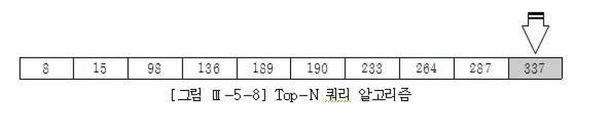

      # 고급 SQL 튜닝
- 장에서 설명한 것처럼 데이터베이스 Call을 반복적으로 일으키는 프로그램을 One SQL 로 통합헀을 때 얻는 성능개선 효과는 매우 극적임
- 본 절에서는 복잡한 처리 절차를 One-SQL로 구현하는 데 적용할 수 있는 몇가지 유용한 기법을 소개한다

## Case문 활용
- 레코드형으로 되어있는 데이터를 항목형태로 가공하려고 함
- 효율을 고려하지 않은 One-SQL은 누구나 작성할 수 있음
- One-SQL로 작성하는 자체가 중요한 것이 아니라 어떻게 I/O 효율을 달성할 지가 중요함
- 이는 동일 레코드를 반복 액세스하지 않고 얼마만큼 블록 액세스 양을 최소화할 수 있느냐에 달림
- I/O 효율을 고려한다면 SQL을 아내롸 같이 작성해야 함
```
INSERT INTO 월별요금납부실적 (고객번호, 납입월, 지로, 자동이체, 신용카드, 핸드폰, 인터넷) SELECT 고객번호, 납입월 , NVL(SUM(CASE WHEN 납입방법코드 =
'A' THEN 납입금액 END), 0) 지로, NVL(SUM(CASE WHEN 납입방법코드 ='B' THEN 납입금액 END), ) 자동이체 , NVL(SUM(CASE WHEN 납입방법코드 ='C' TH EN 납입금액 END), 0) 신용카드 , NVL(SUM (CASE WHEN 납입방법코드 ='D' THEN 납입금액 END), 0) 핸드폰, NVL(SUM (CASE WHEN 납입방법코드 = 'E' TJEM 납입금액 END), 0) 인터넷 FROM 월별납입방법별집계 WHERE 납입월 ='200903' GROUP BY 고객번호, 납입월;
```
- 참고로  SQL Server에선 2005버전부터 Pivot 구문을 지원하고 Oracle도 11G부터 지원하기 시작했으므로 앞으로 이것을 쓰면 됨
- 그렇지만 위와 같은 CASE문이나 DECODE 함수를 활용하는 기법은 IFELSE같은 분기 조건을 포함한 복잡한 처리 절차를 One-SQL로 구현하는 데 반드시 필요하고 ,다른 비슷한 업무에도 응용할 수 있으므로 반드시 숙지하기 바람

## 2. 데이터 복제 기법 활용
- SQL을 작성하다보면 데이터 복제 기법을 활용해야 할 떄가 많음
- 전통적으로 많이 쓰던 방식은 아래와 같은 복제용 테이블을 미리 만들어두고 이를 활용하는 것임
```
create table copy_t ( no number, no2 varchar2(2) ); insert into copy_t select rownum, Ipad(rownum, 2, '0') from big_table where rownum <= 31; alter table copy tadd constraint copy tok primary key(no); create unique index copy_t no2 idx on copy_t(no2);
```
- 이 테이블과 아래와 같이 조인절 없이 조인하면 카디션 곱이 바랫ㅇ해 데이터가 2개로 복제됨
- 3배로 복제하려면 no <=3 조건으로 바꿔주면 됨


```
select * from emp a, copy_t b where b.no <=2;
```

- Oracle 9i부터 dual 테이블을 사용하면 편함
- 아래와 같이 Dual 테이블에 start with 절이 없는 Connect by 구문을 사용하면 두 레코드를 가진 집합이 자동으로 만들어 짐
- 이런 데이터 복제 기법은 다양한 업무 처리에 응ㅇㅇ할 수 있음
- 상단에 있는 break 명령어는 카드 상ㅍ무 분류가 반복적으로 출력되지 않도록 하기 위한 것으로 Oracle SQL * Plus에서만 사용 가능함

## Union All을 활용한 M:M관계의 조인
- M:M관계의 조인을 해결하거나 Full Outer Join을 대체하는 용도로 Union All을 활용할 수 있음
- 부서별 판매계획과 채널별판매실적 테이블이 있음
- 이 두 테이블을 이용해 월별로 각 상품의 계획 대비 판매 실적을 집계하려고 함
- 상품과 연월을 기준으로 볼 때 두 테이블은 M:M관계이므로 그대로 조인하려면 카디션 곱이 발생함
- 아래와 같이 상품, 연월 기준으로 group by 를 먼저 수행하고 나면 두 집합은 1:1 관계가 되므로 Full Outer Join을 통해 원하는 결과집합을 얻을 수 있음
```
select nv(a. 상품, b. 상품) as 상품 , nv(a.계획연월, b.판매연월) as 연월 , nv(계획수량, 0) 계획수량 , nvI(판매수량, 0) 판매수량 from ( select 상품, 계획연월, sum


(계획수량) 계획수량 from 부서별판매계획 Where 계획연월 between '200901' and 200903' group by 상품, 계획연월) a full outer join ( select 상품, 판매연월, sum

(판매수량) 판매수량 from 채널별판매실적 where 판매연월 between '200901' and 200903' group by 상품, 판매연월) b on a.상품 = b.상품 and a. 계획연월 = b.판매
연 월
```
- 하지만 DBMS와 버전에 따라 Full Outer Joind을 아래와 같이 비효율적으로 처리하기도 함
- 한 테이블을 두 번씩 액세스 하는 것을 확인하기 바람
- Union All을 이용하면 M:M 관계의 조인이나 Full Outer Join을 쉽게 해결할 수 있음
- SQL Server에선 NVL 대신 isnull 함수를 사용하고, to_number 대신 cast 함수를 사용할 것

## 4. 페이징 처리
- 1장에서 데이터 베이스 Call과 네트워크 부하를 설명하면서 페이징 처리 활용의 중요성을 강조함
- 조회할 데이터가 일정량 이상이고 수행 빈도가 높다면 반드시 페이징 처리를 해야 한다는 것이 결론
- 그러면 어떻게 페이징 처리를 구현하는 것이 효과적인지 살펴본다
- 페이징처리는 출력 방식에 대한 사용자 요건과 애플리케이션 아키텍쳐, 그리고 인덱스구성 등에 따라 다양한 방법이 존재하므로 여기서 소개한 기본 패턴을 바탕으로 각 개발 환경에 맞게 응용하길 바람

### 일반적인 페이징 처리용 SQL
- 아래는 관심 종목에 대해 사용자가 입력한 거래 일시 이후 거래 데이터를 페이징 처리 방식으로 조회하는 SQL
```
SELECT * FROM ( SELECT ROWNUM NO, 거래일시, 체결건수 , 체결수량, 거래대금, COUNT(*) OVER () CNT.
.... O FROM ( SELECT 거래일시, 체결건수, 체결수량, 거래대금 FROM 시간별종목거래 WHERE 종목코드 = isu_cd - 사용자가 입력한 종목코드 AND 거래일시 >=:trd_ime - 사용자가 입력한 거래일자 또는 거래일시 ORDER BY 거래일시
WHERE ROWNUM <= page*:pg
size+1
.. (3 ) WHERE NO BETWEEN (page-1) *pgsize+1 AND :pgsize*:page
```
- :pgsize 변수에는 사용자가 다음 버튼을 누를 때마다 Fetch해 올 데이터 건수를 입력하고 :page 변수에는 그 때 출력하고자 하는 페이지 번호를 입력하면 됨
  - 다음 페이지에 읽을 데이터가 더 있는지 확인하는 용도
  - 결과집합에서 CNT 값을 읽었을 때 :pgsize*:page 보다 크면 '다음' 페이지에 출력할 데이터가 더 있음을 알 수 있음
  - 전체 건수를 세지 않고도 다음 버튼이 활성화 할지 판단할 수 있어 유용함
  - 이 기능이 필요치 않을 때는 3번 라인에서 +1을 제거하면 됨
- [종목코드 + 거래일시] 순으로 정렬된 인덱스가 있을 때는 자동으로 Sort 오퍼레이션이 생략됨
  - NOSORT를 위해 활용 가능한 인덱스가 없으면 결과집합 전체를 읽는 비효율은 어쩔 수 없지만 TOP-N 쿼리 알고리즘은 잠시 후 2절 5항에서 설명함
- :pgsize = 10이고 :page = 3일 때, 거래일시 순으로 31건만 읽음
- :pgsize = 10이고 :page = 3일 떄, 안쪽 인라인 뷰에서 읽은 31건 중 21~30번째 데이터 즉 3페이지만 리턴함
- 성능과 I/O 효율을 위해서도 [종목코드 + 거래일시] 순으로 구성된 인덱스가 필요하며, 이 인덱스의 도움을 받을 수만 있다면 정렬 작업을 수행하지 않아도 되므로 전체 결과집합이 아무리 크더라도 첫 페이지 만큼은 가장 최적의 수행 속도를 보임
- 따라서 사용자가 주로 앞쪽 일부 데이터만 조회할 때 아주 효과적인 구현방식
- 실제 대부분 업무에서 앞쪽 일부만 조회하므로 표준적인 페이징 처리 구현 패턴으로 가장 적당하다고 하겠다

### 뒤쪽 페이지까지 자주 조회할 때
- 만약 사용자가 '다음' 버튼을 계속 클릭해서 뒤쪽으로 많이 이동하는 업무라면 위 쿼리는 비효율적임
- 인덱스 도움을 받아 NOSORT 방식으로 처리하더라도 앞에서 읽었던 레코드들을 계속 반복적으로 액세스 해야하기 때문
- 인덱스마저 없다면 전체 조회 대상 집합을 매번 반복적으로 액세스 하게 됨
- 뒤쪽의 어떤 페이지로 이동하더라도 빠르게 조회되도록 구현해야 한다면? 앞쪽 레코드를 스캔하지 않고 해당 페이지 레코드로 바로 찾아가도록 구현
- 아래는 첫 번째 페이지를 출력하고 나서 '다음' 버튼을 누를 때의 구현 예시

```
SELECT 거래일시, 체결건수, 체결수량, 거래대금 FROM ( SELECT 거래일시, 체결건수, 체결수량, 거래대금 FROM 시간별종목거래 A WHERE :페이지이동 ='NEXT' AND 종목코드= isu_cd AND 거래일시 >= trd_time ORDER BY 거래일시 ) WHERE ROWNUM <= 1
```
- 첫 화면에서는 :trd_time 변수에 사용자가 입력한 거래 일자 또는 거래 일시를 바인딩 함
- 사용자가 다음 버튼을 눌렀을 때는 이전 페이지에서 출력한 마지막 거래 일시를 입력함
- ORDER BY 절이 사용됐음에도 실행계획에 소트 연산이 전혀 발생하지 않음을 확인하길 바람
- COUNT(STOPKEY)는 종목코드 + 거래일시 순으로 정렬된 인덱스를 스캔하다가 11번째 레코드에서 멈추게 됨을 의미함
- 사용자가 이전 버튼을 클릭했을 때는 아래 SQL을 사용하며, :trd_time 변수에는 이전 페이지에서 출력한 첫 번째 거래 일시를 바인딩하면 됨
```
SELECT 거래일시, 체결건수, 체결수량, 거래대금 FROM ( SELECT 거래일시, 체결건수, 체결수량, 거래대금 FROM 시간별종목거래 A WHERE :페이지이동 ='PREV AND 종목코드 = isu_cd AND 거래일시 <=trd_time ORDER BY 거래일시 DESC) WHERE ROWNUM <= 11 ORDER BY 거래일시
```
- 여기서는 SORT가 나타났지만 COUNT 바깥 쪽에 위치했으므로 조건절에 의해 선택된 11건에 대해서만 소트 연산을 수행함
- 인덱스를 거꾸로 읽었지만 화면에 오름차순으로 출력되게 하려고 ORDER BY 를 한번 더 사용한 것
- 옵티마이저 힌트를 사용하면 SQL을 더 간단하게 구사할 수 있지만, 인덱스 구성이 변경될 때 결과가 틀려질 위험성이 ㅣㅆ음
- 될 수 있으면 힌트를 이용하지 않고도 같은 방식으로 처리되도록 SQL을 조정하는 것이 바람직함
- SQL Server에선 TOP N 구문을 이용해 아래와 같이 작성하면 됨

### Union ALL 활용
- 방금 설명한 방식은 사용자가 어떤 버튼을 눌렀는지에 따라 별도의 SQL을 호출하는 방식임
- Union All을 활용하면 아래와 같이 하나의 SQL로 처리하는 것도 가능함
```
SELECT 거래일시, 체결건수, 체결수량, 거래대금 FROM ( SELECT 거래일시, 체결건수, 체결수량, 거래대금 FROM 시간별종목거래 WHERE :페이지이동='NEXT'-
- 첫 페이지 출력 시에도 'NEXT' 입력 AND 종목코드 =:isu_cd AND 거래일시 >=:trd_time ORDER BY 거래일시 ) WHERE ROWNUM <= 11 UNION ALL SELECT 거래 일시, 체결건수, 체결수량, 거래대금 FROM ( SELECT 거래일시, 체결건수, 체결수량, 거래대금 FROM 시간별종목거래 WHERE :페이지이동 = 'PREV' AND 종목코드 =:isu_cd AND 거래일시 <=:trd_time ORDER BY 거래일시 DESC ) WHERE ROWNUM = 11 ORDER BY 거래일시
```

## 윈도우 함수 활용
- 초기 RDBMS에서는 행간 연산을 할 수 없다는 제약 떄문에 복잡한 업무를 집합적으로 처리하는 데 한계가 많았음
- 이 떄문에 앞서 소개한 데이터 복제 기법을 이용해 SQL을 복잡하고 길게 작성해야 했고, 이마저도 어려울 땐 절차적 방식으로 프로그래밍 하곤 했음
- 물론 지금도 행 간 연산을 지원하지 않지만 윈도우 함수가 도입되면서 복잡한 SQL을 어느정도 단순화 할 수 있게 됨
- Oracle에 의해 처음 소개된 윈도우 함수(Oracle에서는 '분석함수 라고 함')가 지금은 ANSI 표준으로 채택되 대부분 DBMS에서 지원하고 있음
- 분석함수에 대해서는 2과목에서 이미 설명하였으므로 여기서는 이를 활용한 사례를 간단히 살펴보기로 함

```
select 일련번호, 측정값 . (select max(상태코드) from 장비측정 where 일련번호 <=0.일련번호 and 상태코드 is not null) 상태 코드 from 장비측정 o order by 일련번호
```
- 위 쿼리가 빠르게 수행되려면 최소한 일련번호에 인덱스가 있어야 하고 [일련번호 + 상태코드]로 구성된 인덱스가 있으면 가장 최적임
- 좀 더 빠르게 수행되도록 아래와 같이 작성하는 것도 고려해 볼 수 있음

```
select 일련번호, 측정값 ,(select/*+ index_desc(장비측정 장비측정_idx) */ 상태코드 from 장비측정 where 일련번호 <= 0.일련번호 and 상태코드 is not null and r ownum <=1) 상태코드 fom 장비측정 0 order by 일려버호
```
- 부분범위처리 방식으로 앞쪽 일부만 보다가 멈춘다면 위 쿼리가 가장 최적임
- 만약 전체 결과를 다 읽어야 한다면 어떻게 쿼리하는 것이 최적일까? 여러가지 방법을 생각해 볼 수 있지만 아래와 같이 윈도우 함수를 이용하면 가장 쉬움

```
select 일련번호, 측정값 , lastvalue(상태코드 ignore nulls) over(order by 일련번호 rows between unbounded preceding and current row) 상태코드 from 장비측 정 order by 일련번호
```

## With 구문 활용
- With 구문을 Oracle은 9I버전부터 SQL Server는 2005부터 지원하기 시작함
- With 절을 처리하는 DBMS 내부 실행방식에는 아래 2가지가 있음
  - Materialize 방식
    - 내부적으로 임시 테이블을 생성함으로써 반복 재사용
  - Inline 방식
    - 물리적으로 임시 테이블을 생성하지 않으며 참조된 횟수만큼 런타임 방복 수행
    - SQL문에서 반복적으로 참조되는 집합을 미리 선언함으로 코딩을 단순화하는 용도
- Oracle은 위 2가지 방식을 모두 지원하지만 SQL Server는 인라인 방식으로만 실행함
- Oracle의 경우 실행 방식을 상황에 따라 옵티망저가 결정하며, 필요하다면 사용자가 ㅎㄴ트로써 지정할 수 있음
- Meterialize 방식의 With절을 통해 생성된 임시 데이터는 영구적인 오브젝트가 아니어서 with절을 선언한다면 SQL 문이 실행되는 동안만 유지됨
- With 절을 2개 이상 선언할 수 있으며 With절 내에서 다른 With 절을 참조할 수도 있음
- 배치 프로그램에서 특정 데이터 집합을 반복적으로 사용하거나, 전체 처리 흐름을 단순화 시킬 목적으로 임시 테이블을 자주 활용하곤 하는데, Materialize 방식의 With 절을 이용하면 명시적으로 오브젝트를 생성하지 않고도 같은 처리를 할 수 있음
- 아래 With절을 이용해 대용량 데이터를 빠르게 처리한 튜닝 사례
- 고객 테이블에는 2천만건 이상, 카드 테이블에는 1억
- 고객 테이블은 2천만건이 넘고 카드 테이블은 1억건이 넘지만 위험고객여부 Y조건을 만족하는 위험고객카드는 그리 큰 집합이 아님
- 만약 Meterialize 방식의 With절을 이용할 수 없다면 아래쪽 메인 쿼리에서 위험 고객카드 집합을 얻기 위해 매번 고객과 카드 테이블을 반복해서 읽어야 하고 그것이 성능상 문제가 된다면 임시 테이블을 물리적으로 미리 생성해 두는 수밖에 없음

## 소트와 성능

### 메모리 소트와 디스크 소트
- SQL 수행 도중 소트 오퍼레이션이 필요할 때마다 DBMS는 정해진 메모리 공간에 소트 영역을 할당하고 정렬을 수행함
- Oracle은 소트 영역을 PGA영역에 할당하고 SQL Server는 버퍼 캐시에 할당한다고 1장에서 설명한다
- 컴퓨터에서 이루어지는 모든 작업이 그렇듯 소트 오퍼레이션도 메모리 공간이 부족할 때 디스크 공간을 사용함
- Oracle에선 Temp Tablespace를 이용하고 SQL Server에선 tempdb를 이용함
- 가급적 소트 영역 내에서 데이터 정렬 작업을 완료하는 것이 최적이지만 대량의데이터를 정렬할 땐 디스크 소트가 불가피함
- 특히 전체 대상 집합을 디스크에 기록했다가 다시 읽는 작업ㅇ르 여러 번 반복하는 경우 SQL 수행 성능은 극도로 나빠짐

#### 메모리 소트와 디스크 소트
- 메모리소트
  - 정렬 작업을 할당받은 소트 영역 내에서 완료하는 것을 말하며 Interal Sort 또는 Optimal Sort 라고도 함
- 디스크 소트
  - 할당받은 소트 영역 내에서 정렬을 완료하지 못해 디스크 공간 까지 사용하는 경우를 말하며 Extenal Sort라고 말함
  - 디스크에 임시 저장했다가 다시 읽는 작업을 반복한 횟수에 따라 디스크 소트를 다음 두가지로 구분함
  - Onepass Sort : 정렬 대상 집합을 디스크에 한 번만 기록
  - Multipass SOrt : 정렬 대상 집합을 디스크에 여러번 기록

### 소트를 발생시키는 오퍼레이션
- 소트 튜닝 방안을 본격적으로 설명하기에 앞서 어떨 때 소트가 발생하는지부터 살펴봄
- Oracle 실행계획에 나타나는 오퍼레이션 형태를 기준으로 설명하며 같은 오퍼레이션이 SQL Server 실행계획에선 어떻게 표시하는지도 함꼐 제시한다

#### Sort Aggregate
- 전체 로우를 대상으로 집계를 수행할 때 나타나며, 아래와 같이집계를 수행할 때 나타나며, 아래와 같이 Oracle 실행계획에 Sort라는 표현이 사용됐지만 실제 소트가 발생하징 않음
- SQL Serer 실행계획엔 Stream Aggregate라고 표시됨

#### Sort Order by
- 정렬된 결과집합을 얻고자 할 때 나타남

```
select *
from emp
order by sal desc
```

#### Sort Group by
- Sorting 알고리즘을 사용해 그룹별 짖ㅂ계를 수행할 때 나타냄
```
select deptno, job, sum(sal), max(sal), min(sal)
from emp
group by deptno, job
```
- Oracle은 Hashing 알고리즘으로 그룹별 집계를 수행하기도 하는데 그 때는 실행계획에 아래와 같이 표시됨

#### Sort Unique
- 선택된 결과집합에서 중복 레코드를 제거하고자 할 때 나타남
- Union 연산자나 아래와 같이 Distinct 연산자를 사용할 때가 대표적임
```
select distinct deptno
from emp
order by deptno
```

#### Sort Join
- Sort Merge JOin을 수행할 때 나타남
```
select /*+ order use_merge(e)*/
from emp e,dept d
where d.deptno = e.deptno
```
```
select *
from emp e, dept d
where d.deptno = e.deptno
option (force order, merge join)
```

#### Window SOrt
- 윈도우 함수를 수행할 때 나타남

```
select empno, ename, job, mgr, sal, row_number() over(order by hiredate)
from emp
```

### 소트 튜닝 요약
- 소트 오퍼레이션은 메모리 집약적일 뿐 아니라 CPU 집약적이기도 하며, 데이터량이 많을 때는 디스크 I/O까지 발생시키므로 쿼리 성능을 크게 떨어뜨림
- 특히 부분범위 처리를 할 수 없게 만들어 OLTP 환경에서 성능을 떨어뜨리는 주 요인이 되곤 함
- 될 수 있으면 소트가 발생하지 않도록 SQL을 작성해야 하고, 소트가 불가피하다면 메모리 내에서 수행을 완료할 수 있도록 해야 함
  - 데이터 모델 측면에서의 검토
  - 소트가 발생하지 않도록 SQL 작성
  - 인덱스를 이용한 소트 연산 대체
  - 소트 영역을 적게 사용하도록 SQL 작성
  - 소트 영역 크기 조정

## 데이터 모델 측면에서의 검토
- 자주 사용되는 데이터 액세스 패턴을 고려하지 않은 채 물리 설계를 진행하거나 M:M 관계의 테이블을 해소하지 않아 핵심 프로그램이 항상 소트 오퍼레이션을 수반하고 그로 인해 시스템 성능이 좋지 못한 경우를 흔히 접할 수 있음
- PK 외에 관리할 속성이 아예 없거나 소수일 경우 테이블 개수를 줄인다는 이유로 자식 테이블에 통합시키는 경우를 종종 볼 수 있음
- 정보 누락이 없고 가입일시는 최초 입력후 변경되지 않은 속성이므로 정합성에도 문제가 안 생기겠지만 이 회사는고객별 가입 상품 레벨의 데이터 조회가 매우 빈번하게 발생함
- 그때마다 아래처럼 고객별상품라인 테이블을 Group by해야 한다면 성능이 좋을 리 없음
```
select 과금. 고객id, 과금. 상품id, 과금. 과금액, 가입상품. 가입일시
from 과금,
(select 고객id, 상품id, min(가입일시) 가입일시
from 고객별상품라인
group by 고객id, 상품id) 가입상품
where 과금.고= 가입상품.상품id
and 과금.과금연월(+) = :yyyymm
```
- 만약 잘 정규화된 데이터 모델을 사용했다면 쿼리도 아래처럼 간단해지고 시스템 전반의 성능 향상에도 도움이 됨

```
select 과금. 고객 id, 과금 상품id, 과금. 과금액, 가입상품.가입일시
from 과금, 가입상품
where 과금. 고객id(+) = 가입상품.고객id
and 과금. 상품id(+) = 가입상품. 상품id
and 과금.과금연월(+) = :yyyymm
```
- 데이터 모델 때문에 소트 부하를 일으키는 사례는 무궁무진함
- Group by, union, distinct 같은 연산자가 심하게 많이 사용되는 패턴을 보인다면 대개 데이터 모데링 잘 정규화 되지 않았음을 암시함
- 데이터 모델 이상으로 발생한 데이터 중복을 제거하려다 보니 소트 오퍼레이션을 수행하는 것

## 소트가 발생하지 않도록 SQL 작성

### Union을 Union All으로 대체
- 데이터 모델 측면에선 이상이 없는데 불필요한 소트가 발생하도록 SQL을 작성하는 경우가 있음
- 예를 들어 아래처럼 Union을 사용하면 옵티마이저는 상단과 하단의 두 집합 간 중복을 제거하려고 sort unique 연산을 수행함
- 반면 union all은 중복을 허용하며 두 집합을 단순히 결합하므로 소트 연산이 불필요함

```
select empno, job, mgr from emp where deptno = 10
union
select empno, job, mgr from emp where deptno = 20;
```
- 위 쿼리에선 PK 칼럼인 empno를 select-list에 포함하므로 두 집합 간에는 중복 가능성이 전혀 없음
- union을 사용하는 union all을 사용하든 결과집합이 같으므로 Union all을 사용하는 것이 마땅함
- 참고로 select-list에 empno가 없다면 10번과 20번 부서에 job, mgr이 같은 사원이 있을 수 있으므로 함부로 union all로 바꿔선 안됨

### Distinct를 Exists 서브 쿼리로 대체
- 중복 레코드를 제거하려고 distinct를 사용하는 경우도 대표적
- 대부분 exists서브쿼리로 대체함으로써 소트 연산을 제거할 수 있음
- 예를 들어, 아래는 특정 지역에서 특정월 이전에 과금이 발생했던 연월을 조회하는 쿼리

```
select distinct 과금연월
from 과금
where 과금연월<=:yyyymm
and 지역 like :reg || '%'
```

- 입력한 과금연월 이전에 발생한 과금 데이털르 모두 스캔하는 동안 1586208개 블록을 읽었고, 무려 1000만건에 가까운 레코드에서 중복값을 제거하고 고작 35거늘 출력했음
- 매우 비효율적인 방식으로 수행되었고, 쿼리 소요시간은 1분 38초
- 각 월별로 과금이 발생한 적이 있는지 여부만 확인하면 되므로 쿼리를 아래 처럼 바꿀 수 있음

```
select 연월
from 연월 테이블 a
where 연월 <= :yyyymm
and exists(
  select 'x'
  from 과금
  where 과금연월 = a.연월
  and 지역 like : reg || '%'
)
```
- 연월 테이블을 먼저 드라이빙해 과금 테이블을 exists 서브쿼리로 필터링하는 방식임
- exists서브쿼리의 가장 큰 특징은 메인 쿼리로부터 건건이 입력받은 값에 대한 조건을 만족하는 첫번째 레코드를 만나는 순간, true를 반환하고 서브쿼리 수행을 마친다는 점
- 따라서 과금 테이블에 과금연월+지역 순으로 인덱스를 구성해 주기만 하면 가장 최적으로 수행될 수 있음
- 그 결과 소트가 발생하지 않았으며 82개 블록만 읽고 0.01초만에 작업이 끝남

### 불필요한 Count 연산 제거
- 아래는 데이터 존재 여부만 학인하면 되는데 불필요하게 전체 건수를 Count하는 경우임

```
declare
Lent number;
begin
select count(*) into _cnt
trom member
where memb_cls = '1'
and birth_yyyy <= '1950';
if I_cnt > 0 then
dbms_output.put_line('exists');
else
doms_output.put line(not exists');
end if; end;
```
- 위 쿼리는 26112개 블록 I/O가 발생하면서 17.56초나 소요됨
- 총 26112개 중 디스크 I/O가 4742개나 되는 것이 성능을 저하시킨 주 요인임
- 쿼리를 아래와 같이 바꾸고 나면 블록 I/O가 단 3개 뿐이므로 디스크 I/O발생 여부와 상관없이 항상 빠른 성능을 보여줌

```
declare
Lent number;
begin
select 1 into cnt from member
where memb_cls = '1'
and birth_yyyy <= '1950' and rownum <= 1;
doms_output.put line('exists');
exception
when no_data_found then
dbms_output.put_line('not exists');
end;
```
- SQL Server에선 rownum대신 Top N구문을 사용하면 되고 아래와 같이 exists절을 사용하는 방법도 있음

```
declare @cnt int
select @cnt = count(*)
where exists
select 'x' from member
where memb_cls = '1'
and birth_yyyy <= '1950
)
if @cnt > 0 print 'exists' else
print 'not exists'
```

## 인덱스를 이용한 소트 연산 대체
- 인덱스는 항상 키 칼럼 순으로 정렬된 상태를 유지하므로 이를 이용해 소트 오퍼레이션을 생략할 수 있음

### Sort Order by 대체
- 아래 쿼리를 수행할 때 [region + custid]순으로 구성된 인덱스를 사용한다면 sort order by 연산을 대체할 수 있음
```
select custid, name, resno, status, tel1 from customer
where region = 'A'
order by custid
```
- order by 절을 사용 함에도 불구하고 실행계획에 sort order by 오퍼레이션이 나타나지 않음
- 이 방식으로 수행되면 region = 'A' 조건을 만족하는 전체 로우를 읽지 않고도 정렬된 결과집합을 얻을 수 있어 OLTP 환경에서 극적인 성능 개선 효과를 가져다 줌
- 물론 소트해야 할 대상 레코드가 무수히 많고 그 중 일부만 읽고 멈출 수 있을때만 유용함
- 만약 인덱스를 스캔하면서 결과집합을 끝까지 Fetch 한다면 오히려 I/O 및 리소스 사용 측면에서 손해임
- 대상 레코드가 소량일 때는 소트가 발생하더라도 부하가 크지 않아 개선 효과도 미미함

### Sort Group by 대체
- 방금 본 customer 테이블 예시에서 region 선두 컬럼인 결합 인덱스나 단일 칼럼 인덱스를 사용하면 아래 쿼리에 필요한 sort group by 연산을 대체할 수 있음
- 실행계획에 있어 sort group by nosort 라고 표시되는 부분을 확인하기 바람
```
select region, avg(age), count(*)
from customer group by region
```

### 인덱스를 활용한 Min, Max 구하기
- 인덱스가 항상 정렬 상태를 유지한다는 특징을 이용하면 대상 레코드 전체를 읽지 않고도 min max 값을 빠르게 추출할 수 있음
- 예를 들어 주문 테이블에서 일자별 주문 번호를 관리한다고 치자, 그러면 PK 인덱스를 주문일자 + 주문번호 순으로 구성해 주는 것ㅁ나으로 아주 빠르게 마지막 주문번호를 찾을 수 있음

```
select nvl(max(주문번호), 0) + 1
from 주문
where 주문일자 = :주문일자
```

- 주의할 점은 아래와 같이 max 함수 내에서 인덱스 칼럼을 가공하면 인덱스를 사용하지 못하게 될 수 있다는 사실임
- 조건절에서 인덱스 칼럼을 가공하면 인덱스의 정상적인 사용이 불가능한 것과 마찬가지임

```
select nvl(max(주문번호 + 1), 1)
from 주문
where 주문일자 =: 주문일자
```
- 사실 max 함수 내에서 인덱스 칼럼에 상수 값을 더할 때는 결과가 틀려질 가능성이 없음
- 그럼에도 Oracle옵티마이저는 인덱스 사용을 거부하지만 SQL Server는 인덱스를 정상적으로 사용함

## 소트 영역을 적게 사용하도록 SQL 작성
- 소트 연산이 불가피 하다면 메모리 내에서 처리되게 하려고 노력해야 함
- 소트 영역 크기를 늘리는 방법도 있지만 그 전에 소트 영역을 적게 사용할 방법부터 찾는 것이 순서임

### 소트 완료 후 데이터 가공
- 특정 기간에 발생한 주문 상품 목록을 파일로 내리고자 함
- 아래 두 SQL 중 어느 쪽이 소트 영역을 더 적게 사용하나?
```
select Ipad(상품번호, 30) || Ipad(상품명, 30) || Ipad(고객ID, 10) || lpad(고객명, 20)|| to_char(주문일시, 'yyyymmdd hh24:mi:ss')
from 수문상품
where 수문일시 between start and :end order by 상품번호

select Ipad(상품번호, 30) || Ipad(상품명, 30) || Ipad(고객ID, 10)
1| lpad(상품명, 20) || to_char(주문일시, 'yyyymndd hh24:mi:ss')
from (
select 상품번호, 상품명, 고객ID, 고객명, 수문일시
from 주문상품
where 주문일시 between :start and :end order by 상품번호 )
```
- 1번 SQL은 레코드당 105 바이트(헤더 정보는 제외하고 데이터 값만)로 가공된 결과치를 소트 영역에 담음
- 반면 2번 SQL은 가고되지 않은 상태로 정렬을 완료하고 나서 최종 출력할 때 가공하므로 1번 SQL에 비해 소트 영역을 훨씬 적게 사용함
- 실제 테스트해 보면 소트 영역 사용량에 큰 차이가 나는 것을 관찰할 수 있음

### Top-N 쿼리
- Top-N쿼리 형태로 작성하면 소트 연산(=값 비교) 횟수와 소트 영역 사용량을 최소화할 수 있음
- 우선 Top-N 쿼리 작성법부터 살펴본다.
- Top-N 쿼리 형태로 작성하면 소트 연산(=값 비교) 횟수와 소트 영역 사용량을 최소화할 수 있다. 우선 TOp-N 쿼리 작성법부터 살펴보자.
- SQL Server나 Sybase는 Top-N 쿼리를 아래와 같이 손쉽게 작성할 수 있다.
```

select top 10 거래일시, 체결건수, 체결수량, 거래대금
from 시간별종목거래
where 종목코드 ='KR123456'
and 거래일시>='20080304'
```
- IBM DB2에서도 아래와 같이 쉽게 작성할 수 있다.
```
select 거래일시, 체결건수, 체결수량, 거래대금
from 시간별종목거래
where 종목코드 ='KR123456'
and 거래일시 >='20080304'
order by 거래일시
fetch first 10 rows only
```
- Oracle에서는 아래 처럼 인라인 뷰로 한번 감싸야 하는 불편함이 있다.
```
select * from (
select 거래일시, 체결건수, 체결수량, 거래대금
from 시간별종목거래
where 종목코드 ='KR1234561
and 거래일시 >='20080304'
order by 거래일시 )
where row num = 10
```
- 위 쿼리를 수행하는 시점에 [종목코드 + 거래일시] 순으로 구성된 인덱스가 존재한다면 옵티마이저는 그 인덱스를 이용함ㅇ로 order by 연산을 대체할 수 있음
- 아래 실행계획에서 SORT ORDER BY 오퍼레이션이 나타나지 않은 것을 확인하기 바람
- rownum 조건을 사용해 N건에서 멈추도록 하므로 조건절에 부합하는 레코드가 아모리 작아도 매우 빠른 수행 속도를 낼 수 있음
- 실행계획에 표시된 COUNT가 그것을 의미함

#### TOP-N 쿼리의 소트 부하 경감 원리
- [종목코드 + 거래일시]순으로 구성된 인덱스가 없을 때는 어떤가?
- 종목코드만을 선두로 갖는 다른 인덱스를 사용하거나 Full Table Scan 방식으로 처리할 텐데, 이 때는 정렬 작업이 불가피함
- 하지만 Top-N 쿼리 알고리즘이 작동해 소트 영역을 최소한으로 사용하는 효과를 얻게 됨
- 예를 들어 Top 10(rownum<=10)이면 우선 10개 레코드를 담을 배열을 할당하고 처음 읽은 10개 레코드를 정렬된 상태로 담음(위에서 예시한 쿼리는 거래일시 순으로 정렬하고 있찌만, 설명을 단순화 하려고 숫자로 표현함)



- 이후 읽는 레코드에 대해서는 맨 우측에 있는 값과 비교해서 그보다 작은 값이 나타날 때만 배열 내에서 다시 정렬을 시도함
- 물론 맨 우측에 있던 값으 ㄴ버림
- 이 방식으로 처리하면 전체 레코드를 정렬하지 않고도 오름차순으로 최소값은 갖는 10개 레코드를 정확히 찾아낼 수 있음
- 이것이 Top-N쿼리가 소트 연산 횟수와 소트 영역 사용량을 줄여주는 원리임

#### Top-N 쿼리 알고리즘이 작동하지 못하는 경우
- 1절에서 앞쪽 일부 페이지만 주로 조회할 때의 가장 표준적인 페이징 처리 구현 방식은 아래와 같다고 설명함
- 한 페이지에 10개씩 출력한다고 가정하고, 10페이지를 출력하는 에시임
- (설명의 편의를 위해 바인드 변수 대신 상수를 사용함)

```
select *
from (select rownum no, 거래일시, 체결건수, 체결수량, 거래대금 
from (select 거래일시, 체결건수, 체결수량, 거래대금
from 시간별송목거래
where 종목코드 = 'KR123456'
and 거래일시 >='20080304'
order by 거래일시
)
where rownum < = 100
)
where no between 91 and 100
```
- [종목코드 + 거래일시] 순으로 구성된 인덱스가 있으면 최적이겠지만, 없더라도 TOP-N 쿼리 알고리즘이 작동해 소트 부하만큼은 최소화 할 수 있다고 설명함
- 쿼리를 아래와 같이 작성하면 Where절 하나를 줄이고도 같은 결과집합을 얻을 수 있어 더 효과적인 것처럼 보임
- 하지만 그 순간부터 Top-N 쿼리 알고리즘은 작동하지 않음
```
select *
from (select rownum no, 거래일시, 체결건수, 체결수량, 거래대금 from (select 거래일시, 체결건수, 체결수량, 거래대금
from 시간별종목거래
where 종목코드 ='KR123456'
and 거래일시 >='20080304'
order by 거래일시
)
)
where no between 91 and 100
```

#### 윈도우 함수에서의 Top-N 쿼리
- 윈도우 함수를 이용해 마지막 이력 레코드를 찾는경우를 본다
- 아래는 max() 함수를 사용하는 SQL
```
select 고객ID, 변경순번, 전화번호, 주소, 자녀수, 직업, 고객등급
from (select 고객ID, 변경순번
, max(변경순번) over (partition by 고객ID) 마지막변경 순번
, 전화번호, 주소, 자녀수, 직업, 고객등급
from 고객변경이력)
where 변경순번= 마지막변경순번
```
- 윈도우 함수를 사용할 때도 max() 함수보다 아래와 같이 rank()나 row_number() 함수를 사용하는 것이 유리한데, 이것 역시 Top-N 쿼리 알고리즘이 작동하기 때문

```
select 고객 ID, 변경순번, 전화번호, 주소, 자녀수, 직업, 고객등급
from (select 고객ID, 변경순번
, rank() over (partition by 고객ID order by 변경 순번) mnum
, 전화번호, 주소, 자녀수, 직업, 고객등급
from 고객변경이력)
where rnum = 1
```

## 소트 영역 크기 조정
- SQL Server에서 소트 영역을 수동으로 조정하는 방법을 제공하지 않으므로 여기서는 Oracle중심으로 설명하기로 함
- 소트가 불가피하다면, 메모리 내에서 작업을 완료할 수 있어야 최적임
- 이를 위해 관리자가 시스템 레벨에서 또는 사용자가 세션 레벨에서 직접 소트 영역 크기를 조정하는 작업이 필요할 수 있음
- Oracle 8i까지는 데이터 정렬을 위해 사용하는 메모리 공간을 sort_area_size 파라미터를 통해 조정했었다
- 기본 값은 관리자가 지정하고, 프로그램의 작업 내용에 따라 세션 레벨에서 아래와 같이 값을 조정하는 식임
```
alter session set sort_area_size = 1048576;
```
- 9i 부터 자동 PGA 메모리 관리 기능이 도입되었기 떄문에 사용자가 일일이 그 크기를 조정하지 않아도 됨
- DB 관리자기 pga_aggregate_target 파라미터를 통해 인스턴스 전체적으로 이용 가능한 PGA메모리 총량을 지정하면 Oracle이 시스템 부하정도에 따라 자동으로 각 세션에 메모리를 할당해줌
- 자동 PGA 메모리 관리 기능을 활성화하려면 workarea_size_policy 를 auto로 설정하면 되는데, 9i부터 기본적으로 auto로 설정돼 있으며 sort_area_size 파라미터는 무시됨
- 기본적으로 자동 PGA 메모리 관리 방식이 활성화되지만 시스템 또는 세션 레벨에서 '수동 PGA메모리 관리' 방식으로 전환할 수 있음
- 특히 트랜잭션이 거의 없는 야간에 대량의 배치 Job을 수행할 때는 수동 방식으로 변경하고 직접 크기를 조정하는 것이 효과적일 수 있음
- 왜냐하면 자동 PGA메모리 관리 방식 하에서는 프로세스당 사용할 수 있는 최대 크기가 제한되기 때문임
- 즉 소트 영역을 사용중인 다른 프로세스가 없더라도 특정 프로세스가 모든 공간을 다 쓸 수 없는 것
- 결국 수 GB의 여유 메모리를 두고도 이를 충분히 활용하지 못해 작업 시간이 오래 걸릴 수 있음
- 그럴 때 아래와 같이 workarea_size_policy 파라미터를 세션 레벨에서 manual로 변경하고, 필요한 만큼 소트 영역 크기를 늘림으로 성능을 향상시키고 궁극적으로 전체 작업 시간을 크게 단축시킬 수 있음

```
alter session set workarea_size_policy = manual;
alter session set sort_area+size =  10485760;
```

## 인덱스 유지 비용
- 테이블 데이터를 변경하려면 인덱스에도 변경이 발생함
- 변경할 인덱스 레코드를 찾아가는 비용에 Redo Undo를 생성하는 비용까지 더해지므로 인덱스 개수가 많을수록 DML 성능이 나빠지는 것이 당연함
- Update를 수행할 때 테이블 레코드를 직접 변경했지만 인덱스 레코드는 Delete & Insert 방식으로 처리됨
- 인덱스는 항상 정렬된 상태를 유지해야 하기 때문이며, 인덱스 유지를 위한 Undo 레코드도 2개씩 기록됨
- 따라서 변경 칼럼과 관련된 인덱스 개수에 따라 Update 성능이 좌우됨
- Insert나 delete문일 때는 인덱스 모두에 (Oracle 에서는 인덱스 칼럼이 모두 NUll인 경우는 제외)변경을 가해야 하므로 총 인덱스 개수에 따라 성능이 크게 달라짐
- 이처럼 인덱스 개수가 DML 성능에 큰 영향을 미치므로 대량의 데이터를 입력/수정/삭제할 때는 인덱스를 모두 Drop하거나 Unusable상태로 변경한 다음에 작업하는 것이 빠를 수 있음
- 인덱스를 재생성하는 시간까지 포함하더라도 그냥 작업할 때보다 더 빠를 수 있기 떄문임


## Insert 튜닝

### Oracle Insert 튜닝
- Insert 속도를 향상시키는 방법에 대해 Oracle부터 살펴본다
```
Direct Path Insert
```
- IOT(index organized table)는 정해진 키 수능로 정렬하면서 값을 입력하는 반면, 일반적인 힙 구조 테이블은 순서 없이 Freelist로부터 할당받은 블록에 무작위 값을 입력함
- Freelist는 HWM(High-Water mark) 아래쪽에 위치한 블록 중 어느정도(테이플에 저장한 pctfree와 pctused 파라미터에 의해 결정됨)
- 빈 공간을 가진 블록리스트를 관리하는 자료구조임
- Freelist에서 할당받은 블록을 버퍼 캐시에서 찾아보고, 없으면 데이터 파일에서 읽어 캐시에 적재한 후에 데이터를 삽입함
- 일반적인 트랜잭션을 처리할 때는 빈 공간부터 찾아 채워나가는 위 방식이 효율적임
- 하지만 대량의 데이터를 Bulk로 입력할 때는 매우 비효율적임
- 빈 블록