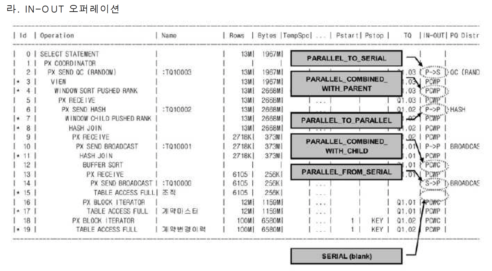

      # 고급 SQL 튜닝
- 장에서 설명한 것처럼 데이터베이스 Call을 반복적으로 일으키는 프로그램을 One SQL 로 통합헀을 때 얻는 성능개선 효과는 매우 극적임
- 본 절에서는 복잡한 처리 절차를 One-SQL로 구현하는 데 적용할 수 있는 몇가지 유용한 기법을 소개한다

## Case문 활용
- 레코드형으로 되어있는 데이터를 항목형태로 가공하려고 함
- 효율을 고려하지 않은 One-SQL은 누구나 작성할 수 있음
- One-SQL로 작성하는 자체가 중요한 것이 아니라 어떻게 I/O 효율을 달성할 지가 중요함
- 이는 동일 레코드를 반복 액세스하지 않고 얼마만큼 블록 액세스 양을 최소화할 수 있느냐에 달림
- I/O 효율을 고려한다면 SQL을 아내롸 같이 작성해야 함
```
INSERT INTO 월별요금납부실적 (고객번호, 납입월, 지로, 자동이체, 신용카드, 핸드폰, 인터넷) SELECT 고객번호, 납입월 , NVL(SUM(CASE WHEN 납입방법코드 =
'A' THEN 납입금액 END), 0) 지로, NVL(SUM(CASE WHEN 납입방법코드 ='B' THEN 납입금액 END), ) 자동이체 , NVL(SUM(CASE WHEN 납입방법코드 ='C' TH EN 납입금액 END), 0) 신용카드 , NVL(SUM (CASE WHEN 납입방법코드 ='D' THEN 납입금액 END), 0) 핸드폰, NVL(SUM (CASE WHEN 납입방법코드 = 'E' TJEM 납입금액 END), 0) 인터넷 FROM 월별납입방법별집계 WHERE 납입월 ='200903' GROUP BY 고객번호, 납입월;
```
- 참고로  SQL Server에선 2005버전부터 Pivot 구문을 지원하고 Oracle도 11G부터 지원하기 시작했으므로 앞으로 이것을 쓰면 됨
- 그렇지만 위와 같은 CASE문이나 DECODE 함수를 활용하는 기법은 IFELSE같은 분기 조건을 포함한 복잡한 처리 절차를 One-SQL로 구현하는 데 반드시 필요하고 ,다른 비슷한 업무에도 응용할 수 있으므로 반드시 숙지하기 바람

## 2. 데이터 복제 기법 활용
- SQL을 작성하다보면 데이터 복제 기법을 활용해야 할 떄가 많음
- 전통적으로 많이 쓰던 방식은 아래와 같은 복제용 테이블을 미리 만들어두고 이를 활용하는 것임
```
create table copy_t ( no number, no2 varchar2(2) ); insert into copy_t select rownum, Ipad(rownum, 2, '0') from big_table where rownum <= 31; alter table copy tadd constraint copy tok primary key(no); create unique index copy_t no2 idx on copy_t(no2);
```
- 이 테이블과 아래와 같이 조인절 없이 조인하면 카디션 곱이 바랫ㅇ해 데이터가 2개로 복제됨
- 3배로 복제하려면 no <=3 조건으로 바꿔주면 됨


```
select * from emp a, copy_t b where b.no <=2;
```

- Oracle 9i부터 dual 테이블을 사용하면 편함
- 아래와 같이 Dual 테이블에 start with 절이 없는 Connect by 구문을 사용하면 두 레코드를 가진 집합이 자동으로 만들어 짐
- 이런 데이터 복제 기법은 다양한 업무 처리에 응ㅇㅇ할 수 있음
- 상단에 있는 break 명령어는 카드 상ㅍ무 분류가 반복적으로 출력되지 않도록 하기 위한 것으로 Oracle SQL * Plus에서만 사용 가능함

## Union All을 활용한 M:M관계의 조인
- M:M관계의 조인을 해결하거나 Full Outer Join을 대체하는 용도로 Union All을 활용할 수 있음
- 부서별 판매계획과 채널별판매실적 테이블이 있음
- 이 두 테이블을 이용해 월별로 각 상품의 계획 대비 판매 실적을 집계하려고 함
- 상품과 연월을 기준으로 볼 때 두 테이블은 M:M관계이므로 그대로 조인하려면 카디션 곱이 발생함
- 아래와 같이 상품, 연월 기준으로 group by 를 먼저 수행하고 나면 두 집합은 1:1 관계가 되므로 Full Outer Join을 통해 원하는 결과집합을 얻을 수 있음
```
select nv(a. 상품, b. 상품) as 상품 , nv(a.계획연월, b.판매연월) as 연월 , nv(계획수량, 0) 계획수량 , nvI(판매수량, 0) 판매수량 from ( select 상품, 계획연월, sum


(계획수량) 계획수량 from 부서별판매계획 Where 계획연월 between '200901' and 200903' group by 상품, 계획연월) a full outer join ( select 상품, 판매연월, sum

(판매수량) 판매수량 from 채널별판매실적 where 판매연월 between '200901' and 200903' group by 상품, 판매연월) b on a.상품 = b.상품 and a. 계획연월 = b.판매
연 월
```
- 하지만 DBMS와 버전에 따라 Full Outer Joind을 아래와 같이 비효율적으로 처리하기도 함
- 한 테이블을 두 번씩 액세스 하는 것을 확인하기 바람
- Union All을 이용하면 M:M 관계의 조인이나 Full Outer Join을 쉽게 해결할 수 있음
- SQL Server에선 NVL 대신 isnull 함수를 사용하고, to_number 대신 cast 함수를 사용할 것

## 4. 페이징 처리
- 1장에서 데이터 베이스 Call과 네트워크 부하를 설명하면서 페이징 처리 활용의 중요성을 강조함
- 조회할 데이터가 일정량 이상이고 수행 빈도가 높다면 반드시 페이징 처리를 해야 한다는 것이 결론
- 그러면 어떻게 페이징 처리를 구현하는 것이 효과적인지 살펴본다
- 페이징처리는 출력 방식에 대한 사용자 요건과 애플리케이션 아키텍쳐, 그리고 인덱스구성 등에 따라 다양한 방법이 존재하므로 여기서 소개한 기본 패턴을 바탕으로 각 개발 환경에 맞게 응용하길 바람

### 일반적인 페이징 처리용 SQL
- 아래는 관심 종목에 대해 사용자가 입력한 거래 일시 이후 거래 데이터를 페이징 처리 방식으로 조회하는 SQL
```
SELECT * FROM ( SELECT ROWNUM NO, 거래일시, 체결건수 , 체결수량, 거래대금, COUNT(*) OVER () CNT.
.... O FROM ( SELECT 거래일시, 체결건수, 체결수량, 거래대금 FROM 시간별종목거래 WHERE 종목코드 = isu_cd - 사용자가 입력한 종목코드 AND 거래일시 >=:trd_ime - 사용자가 입력한 거래일자 또는 거래일시 ORDER BY 거래일시
WHERE ROWNUM <= page*:pg
size+1
.. (3 ) WHERE NO BETWEEN (page-1) *pgsize+1 AND :pgsize*:page
```
- :pgsize 변수에는 사용자가 다음 버튼을 누를 때마다 Fetch해 올 데이터 건수를 입력하고 :page 변수에는 그 때 출력하고자 하는 페이지 번호를 입력하면 됨
  - 다음 페이지에 읽을 데이터가 더 있는지 확인하는 용도
  - 결과집합에서 CNT 값을 읽었을 때 :pgsize*:page 보다 크면 '다음' 페이지에 출력할 데이터가 더 있음을 알 수 있음
  - 전체 건수를 세지 않고도 다음 버튼이 활성화 할지 판단할 수 있어 유용함
  - 이 기능이 필요치 않을 때는 3번 라인에서 +1을 제거하면 됨
- [종목코드 + 거래일시] 순으로 정렬된 인덱스가 있을 때는 자동으로 Sort 오퍼레이션이 생략됨
  - NOSORT를 위해 활용 가능한 인덱스가 없으면 결과집합 전체를 읽는 비효율은 어쩔 수 없지만 TOP-N 쿼리 알고리즘은 잠시 후 2절 5항에서 설명함
- :pgsize = 10이고 :page = 3일 때, 거래일시 순으로 31건만 읽음
- :pgsize = 10이고 :page = 3일 떄, 안쪽 인라인 뷰에서 읽은 31건 중 21~30번째 데이터 즉 3페이지만 리턴함
- 성능과 I/O 효율을 위해서도 [종목코드 + 거래일시] 순으로 구성된 인덱스가 필요하며, 이 인덱스의 도움을 받을 수만 있다면 정렬 작업을 수행하지 않아도 되므로 전체 결과집합이 아무리 크더라도 첫 페이지 만큼은 가장 최적의 수행 속도를 보임
- 따라서 사용자가 주로 앞쪽 일부 데이터만 조회할 때 아주 효과적인 구현방식
- 실제 대부분 업무에서 앞쪽 일부만 조회하므로 표준적인 페이징 처리 구현 패턴으로 가장 적당하다고 하겠다

### 뒤쪽 페이지까지 자주 조회할 때
- 만약 사용자가 '다음' 버튼을 계속 클릭해서 뒤쪽으로 많이 이동하는 업무라면 위 쿼리는 비효율적임
- 인덱스 도움을 받아 NOSORT 방식으로 처리하더라도 앞에서 읽었던 레코드들을 계속 반복적으로 액세스 해야하기 때문
- 인덱스마저 없다면 전체 조회 대상 집합을 매번 반복적으로 액세스 하게 됨
- 뒤쪽의 어떤 페이지로 이동하더라도 빠르게 조회되도록 구현해야 한다면? 앞쪽 레코드를 스캔하지 않고 해당 페이지 레코드로 바로 찾아가도록 구현
- 아래는 첫 번째 페이지를 출력하고 나서 '다음' 버튼을 누를 때의 구현 예시

```
SELECT 거래일시, 체결건수, 체결수량, 거래대금 FROM ( SELECT 거래일시, 체결건수, 체결수량, 거래대금 FROM 시간별종목거래 A WHERE :페이지이동 ='NEXT' AND 종목코드= isu_cd AND 거래일시 >= trd_time ORDER BY 거래일시 ) WHERE ROWNUM <= 1
```
- 첫 화면에서는 :trd_time 변수에 사용자가 입력한 거래 일자 또는 거래 일시를 바인딩 함
- 사용자가 다음 버튼을 눌렀을 때는 이전 페이지에서 출력한 마지막 거래 일시를 입력함
- ORDER BY 절이 사용됐음에도 실행계획에 소트 연산이 전혀 발생하지 않음을 확인하길 바람
- COUNT(STOPKEY)는 종목코드 + 거래일시 순으로 정렬된 인덱스를 스캔하다가 11번째 레코드에서 멈추게 됨을 의미함
- 사용자가 이전 버튼을 클릭했을 때는 아래 SQL을 사용하며, :trd_time 변수에는 이전 페이지에서 출력한 첫 번째 거래 일시를 바인딩하면 됨
```
SELECT 거래일시, 체결건수, 체결수량, 거래대금 FROM ( SELECT 거래일시, 체결건수, 체결수량, 거래대금 FROM 시간별종목거래 A WHERE :페이지이동 ='PREV AND 종목코드 = isu_cd AND 거래일시 <=trd_time ORDER BY 거래일시 DESC) WHERE ROWNUM <= 11 ORDER BY 거래일시
```
- 여기서는 SORT가 나타났지만 COUNT 바깥 쪽에 위치했으므로 조건절에 의해 선택된 11건에 대해서만 소트 연산을 수행함
- 인덱스를 거꾸로 읽었지만 화면에 오름차순으로 출력되게 하려고 ORDER BY 를 한번 더 사용한 것
- 옵티마이저 힌트를 사용하면 SQL을 더 간단하게 구사할 수 있지만, 인덱스 구성이 변경될 때 결과가 틀려질 위험성이 ㅣㅆ음
- 될 수 있으면 힌트를 이용하지 않고도 같은 방식으로 처리되도록 SQL을 조정하는 것이 바람직함
- SQL Server에선 TOP N 구문을 이용해 아래와 같이 작성하면 됨

### Union ALL 활용
- 방금 설명한 방식은 사용자가 어떤 버튼을 눌렀는지에 따라 별도의 SQL을 호출하는 방식임
- Union All을 활용하면 아래와 같이 하나의 SQL로 처리하는 것도 가능함
```
SELECT 거래일시, 체결건수, 체결수량, 거래대금 FROM ( SELECT 거래일시, 체결건수, 체결수량, 거래대금 FROM 시간별종목거래 WHERE :페이지이동='NEXT'-
- 첫 페이지 출력 시에도 'NEXT' 입력 AND 종목코드 =:isu_cd AND 거래일시 >=:trd_time ORDER BY 거래일시 ) WHERE ROWNUM <= 11 UNION ALL SELECT 거래 일시, 체결건수, 체결수량, 거래대금 FROM ( SELECT 거래일시, 체결건수, 체결수량, 거래대금 FROM 시간별종목거래 WHERE :페이지이동 = 'PREV' AND 종목코드 =:isu_cd AND 거래일시 <=:trd_time ORDER BY 거래일시 DESC ) WHERE ROWNUM = 11 ORDER BY 거래일시
```

## 윈도우 함수 활용
- 초기 RDBMS에서는 행간 연산을 할 수 없다는 제약 떄문에 복잡한 업무를 집합적으로 처리하는 데 한계가 많았음
- 이 떄문에 앞서 소개한 데이터 복제 기법을 이용해 SQL을 복잡하고 길게 작성해야 했고, 이마저도 어려울 땐 절차적 방식으로 프로그래밍 하곤 했음
- 물론 지금도 행 간 연산을 지원하지 않지만 윈도우 함수가 도입되면서 복잡한 SQL을 어느정도 단순화 할 수 있게 됨
- Oracle에 의해 처음 소개된 윈도우 함수(Oracle에서는 '분석함수 라고 함')가 지금은 ANSI 표준으로 채택되 대부분 DBMS에서 지원하고 있음
- 분석함수에 대해서는 2과목에서 이미 설명하였으므로 여기서는 이를 활용한 사례를 간단히 살펴보기로 함

```
select 일련번호, 측정값 . (select max(상태코드) from 장비측정 where 일련번호 <=0.일련번호 and 상태코드 is not null) 상태 코드 from 장비측정 o order by 일련번호
```
- 위 쿼리가 빠르게 수행되려면 최소한 일련번호에 인덱스가 있어야 하고 [일련번호 + 상태코드]로 구성된 인덱스가 있으면 가장 최적임
- 좀 더 빠르게 수행되도록 아래와 같이 작성하는 것도 고려해 볼 수 있음

```
select 일련번호, 측정값 ,(select/*+ index_desc(장비측정 장비측정_idx) */ 상태코드 from 장비측정 where 일련번호 <= 0.일련번호 and 상태코드 is not null and r ownum <=1) 상태코드 fom 장비측정 0 order by 일려버호
```
- 부분범위처리 방식으로 앞쪽 일부만 보다가 멈춘다면 위 쿼리가 가장 최적임
- 만약 전체 결과를 다 읽어야 한다면 어떻게 쿼리하는 것이 최적일까? 여러가지 방법을 생각해 볼 수 있지만 아래와 같이 윈도우 함수를 이용하면 가장 쉬움

```
select 일련번호, 측정값 , lastvalue(상태코드 ignore nulls) over(order by 일련번호 rows between unbounded preceding and current row) 상태코드 from 장비측 정 order by 일련번호
```

## With 구문 활용
- With 구문을 Oracle은 9I버전부터 SQL Server는 2005부터 지원하기 시작함
- With 절을 처리하는 DBMS 내부 실행방식에는 아래 2가지가 있음
  - Materialize 방식
    - 내부적으로 임시 테이블을 생성함으로써 반복 재사용
  - Inline 방식
    - 물리적으로 임시 테이블을 생성하지 않으며 참조된 횟수만큼 런타임 방복 수행
    - SQL문에서 반복적으로 참조되는 집합을 미리 선언함으로 코딩을 단순화하는 용도
- Oracle은 위 2가지 방식을 모두 지원하지만 SQL Server는 인라인 방식으로만 실행함
- Oracle의 경우 실행 방식을 상황에 따라 옵티망저가 결정하며, 필요하다면 사용자가 ㅎㄴ트로써 지정할 수 있음
- Meterialize 방식의 With절을 통해 생성된 임시 데이터는 영구적인 오브젝트가 아니어서 with절을 선언한다면 SQL 문이 실행되는 동안만 유지됨
- With 절을 2개 이상 선언할 수 있으며 With절 내에서 다른 With 절을 참조할 수도 있음
- 배치 프로그램에서 특정 데이터 집합을 반복적으로 사용하거나, 전체 처리 흐름을 단순화 시킬 목적으로 임시 테이블을 자주 활용하곤 하는데, Materialize 방식의 With 절을 이용하면 명시적으로 오브젝트를 생성하지 않고도 같은 처리를 할 수 있음
- 아래 With절을 이용해 대용량 데이터를 빠르게 처리한 튜닝 사례
- 고객 테이블에는 2천만건 이상, 카드 테이블에는 1억
- 고객 테이블은 2천만건이 넘고 카드 테이블은 1억건이 넘지만 위험고객여부 Y조건을 만족하는 위험고객카드는 그리 큰 집합이 아님
- 만약 Meterialize 방식의 With절을 이용할 수 없다면 아래쪽 메인 쿼리에서 위험 고객카드 집합을 얻기 위해 매번 고객과 카드 테이블을 반복해서 읽어야 하고 그것이 성능상 문제가 된다면 임시 테이블을 물리적으로 미리 생성해 두는 수밖에 없음

## 소트와 성능

### 메모리 소트와 디스크 소트
- SQL 수행 도중 소트 오퍼레이션이 필요할 때마다 DBMS는 정해진 메모리 공간에 소트 영역을 할당하고 정렬을 수행함
- Oracle은 소트 영역을 PGA영역에 할당하고 SQL Server는 버퍼 캐시에 할당한다고 1장에서 설명한다
- 컴퓨터에서 이루어지는 모든 작업이 그렇듯 소트 오퍼레이션도 메모리 공간이 부족할 때 디스크 공간을 사용함
- Oracle에선 Temp Tablespace를 이용하고 SQL Server에선 tempdb를 이용함
- 가급적 소트 영역 내에서 데이터 정렬 작업을 완료하는 것이 최적이지만 대량의데이터를 정렬할 땐 디스크 소트가 불가피함
- 특히 전체 대상 집합을 디스크에 기록했다가 다시 읽는 작업ㅇ르 여러 번 반복하는 경우 SQL 수행 성능은 극도로 나빠짐

#### 메모리 소트와 디스크 소트
- 메모리소트
  - 정렬 작업을 할당받은 소트 영역 내에서 완료하는 것을 말하며 Interal Sort 또는 Optimal Sort 라고도 함
- 디스크 소트
  - 할당받은 소트 영역 내에서 정렬을 완료하지 못해 디스크 공간 까지 사용하는 경우를 말하며 Extenal Sort라고 말함
  - 디스크에 임시 저장했다가 다시 읽는 작업을 반복한 횟수에 따라 디스크 소트를 다음 두가지로 구분함
  - Onepass Sort : 정렬 대상 집합을 디스크에 한 번만 기록
  - Multipass SOrt : 정렬 대상 집합을 디스크에 여러번 기록

### 소트를 발생시키는 오퍼레이션
- 소트 튜닝 방안을 본격적으로 설명하기에 앞서 어떨 때 소트가 발생하는지부터 살펴봄
- Oracle 실행계획에 나타나는 오퍼레이션 형태를 기준으로 설명하며 같은 오퍼레이션이 SQL Server 실행계획에선 어떻게 표시하는지도 함꼐 제시한다

#### Sort Aggregate
- 전체 로우를 대상으로 집계를 수행할 때 나타나며, 아래와 같이집계를 수행할 때 나타나며, 아래와 같이 Oracle 실행계획에 Sort라는 표현이 사용됐지만 실제 소트가 발생하징 않음
- SQL Serer 실행계획엔 Stream Aggregate라고 표시됨

#### Sort Order by
- 정렬된 결과집합을 얻고자 할 때 나타남

```
select *
from emp
order by sal desc
```

#### Sort Group by
- Sorting 알고리즘을 사용해 그룹별 짖ㅂ계를 수행할 때 나타냄
```
select deptno, job, sum(sal), max(sal), min(sal)
from emp
group by deptno, job
```
- Oracle은 Hashing 알고리즘으로 그룹별 집계를 수행하기도 하는데 그 때는 실행계획에 아래와 같이 표시됨

#### Sort Unique
- 선택된 결과집합에서 중복 레코드를 제거하고자 할 때 나타남
- Union 연산자나 아래와 같이 Distinct 연산자를 사용할 때가 대표적임
```
select distinct deptno
from emp
order by deptno
```

#### Sort Join
- Sort Merge JOin을 수행할 때 나타남
```
select /*+ order use_merge(e)*/
from emp e,dept d
where d.deptno = e.deptno
```
```
select *
from emp e, dept d
where d.deptno = e.deptno
option (force order, merge join)
```

#### Window SOrt
- 윈도우 함수를 수행할 때 나타남

```
select empno, ename, job, mgr, sal, row_number() over(order by hiredate)
from emp
```

### 소트 튜닝 요약
- 소트 오퍼레이션은 메모리 집약적일 뿐 아니라 CPU 집약적이기도 하며, 데이터량이 많을 때는 디스크 I/O까지 발생시키므로 쿼리 성능을 크게 떨어뜨림
- 특히 부분범위 처리를 할 수 없게 만들어 OLTP 환경에서 성능을 떨어뜨리는 주 요인이 되곤 함
- 될 수 있으면 소트가 발생하지 않도록 SQL을 작성해야 하고, 소트가 불가피하다면 메모리 내에서 수행을 완료할 수 있도록 해야 함
  - 데이터 모델 측면에서의 검토
  - 소트가 발생하지 않도록 SQL 작성
  - 인덱스를 이용한 소트 연산 대체
  - 소트 영역을 적게 사용하도록 SQL 작성
  - 소트 영역 크기 조정

## 데이터 모델 측면에서의 검토
- 자주 사용되는 데이터 액세스 패턴을 고려하지 않은 채 물리 설계를 진행하거나 M:M 관계의 테이블을 해소하지 않아 핵심 프로그램이 항상 소트 오퍼레이션을 수반하고 그로 인해 시스템 성능이 좋지 못한 경우를 흔히 접할 수 있음
- PK 외에 관리할 속성이 아예 없거나 소수일 경우 테이블 개수를 줄인다는 이유로 자식 테이블에 통합시키는 경우를 종종 볼 수 있음
- 정보 누락이 없고 가입일시는 최초 입력후 변경되지 않은 속성이므로 정합성에도 문제가 안 생기겠지만 이 회사는고객별 가입 상품 레벨의 데이터 조회가 매우 빈번하게 발생함
- 그때마다 아래처럼 고객별상품라인 테이블을 Group by해야 한다면 성능이 좋을 리 없음
```
select 과금. 고객id, 과금. 상품id, 과금. 과금액, 가입상품. 가입일시
from 과금,
(select 고객id, 상품id, min(가입일시) 가입일시
from 고객별상품라인
group by 고객id, 상품id) 가입상품
where 과금.고= 가입상품.상품id
and 과금.과금연월(+) = :yyyymm
```
- 만약 잘 정규화된 데이터 모델을 사용했다면 쿼리도 아래처럼 간단해지고 시스템 전반의 성능 향상에도 도움이 됨

```
select 과금. 고객 id, 과금 상품id, 과금. 과금액, 가입상품.가입일시
from 과금, 가입상품
where 과금. 고객id(+) = 가입상품.고객id
and 과금. 상품id(+) = 가입상품. 상품id
and 과금.과금연월(+) = :yyyymm
```
- 데이터 모델 때문에 소트 부하를 일으키는 사례는 무궁무진함
- Group by, union, distinct 같은 연산자가 심하게 많이 사용되는 패턴을 보인다면 대개 데이터 모데링 잘 정규화 되지 않았음을 암시함
- 데이터 모델 이상으로 발생한 데이터 중복을 제거하려다 보니 소트 오퍼레이션을 수행하는 것

## 소트가 발생하지 않도록 SQL 작성

### Union을 Union All으로 대체
- 데이터 모델 측면에선 이상이 없는데 불필요한 소트가 발생하도록 SQL을 작성하는 경우가 있음
- 예를 들어 아래처럼 Union을 사용하면 옵티마이저는 상단과 하단의 두 집합 간 중복을 제거하려고 sort unique 연산을 수행함
- 반면 union all은 중복을 허용하며 두 집합을 단순히 결합하므로 소트 연산이 불필요함

```
select empno, job, mgr from emp where deptno = 10
union
select empno, job, mgr from emp where deptno = 20;
```
- 위 쿼리에선 PK 칼럼인 empno를 select-list에 포함하므로 두 집합 간에는 중복 가능성이 전혀 없음
- union을 사용하는 union all을 사용하든 결과집합이 같으므로 Union all을 사용하는 것이 마땅함
- 참고로 select-list에 empno가 없다면 10번과 20번 부서에 job, mgr이 같은 사원이 있을 수 있으므로 함부로 union all로 바꿔선 안됨

### Distinct를 Exists 서브 쿼리로 대체
- 중복 레코드를 제거하려고 distinct를 사용하는 경우도 대표적
- 대부분 exists서브쿼리로 대체함으로써 소트 연산을 제거할 수 있음
- 예를 들어, 아래는 특정 지역에서 특정월 이전에 과금이 발생했던 연월을 조회하는 쿼리

```
select distinct 과금연월
from 과금
where 과금연월<=:yyyymm
and 지역 like :reg || '%'
```

- 입력한 과금연월 이전에 발생한 과금 데이털르 모두 스캔하는 동안 1586208개 블록을 읽었고, 무려 1000만건에 가까운 레코드에서 중복값을 제거하고 고작 35거늘 출력했음
- 매우 비효율적인 방식으로 수행되었고, 쿼리 소요시간은 1분 38초
- 각 월별로 과금이 발생한 적이 있는지 여부만 확인하면 되므로 쿼리를 아래 처럼 바꿀 수 있음

```
select 연월
from 연월 테이블 a
where 연월 <= :yyyymm
and exists(
  select 'x'
  from 과금
  where 과금연월 = a.연월
  and 지역 like : reg || '%'
)
```
- 연월 테이블을 먼저 드라이빙해 과금 테이블을 exists 서브쿼리로 필터링하는 방식임
- exists서브쿼리의 가장 큰 특징은 메인 쿼리로부터 건건이 입력받은 값에 대한 조건을 만족하는 첫번째 레코드를 만나는 순간, true를 반환하고 서브쿼리 수행을 마친다는 점
- 따라서 과금 테이블에 과금연월+지역 순으로 인덱스를 구성해 주기만 하면 가장 최적으로 수행될 수 있음
- 그 결과 소트가 발생하지 않았으며 82개 블록만 읽고 0.01초만에 작업이 끝남

### 불필요한 Count 연산 제거
- 아래는 데이터 존재 여부만 학인하면 되는데 불필요하게 전체 건수를 Count하는 경우임

```
declare
Lent number;
begin
select count(*) into _cnt
trom member
where memb_cls = '1'
and birth_yyyy <= '1950';
if I_cnt > 0 then
dbms_output.put_line('exists');
else
doms_output.put line(not exists');
end if; end;
```
- 위 쿼리는 26112개 블록 I/O가 발생하면서 17.56초나 소요됨
- 총 26112개 중 디스크 I/O가 4742개나 되는 것이 성능을 저하시킨 주 요인임
- 쿼리를 아래와 같이 바꾸고 나면 블록 I/O가 단 3개 뿐이므로 디스크 I/O발생 여부와 상관없이 항상 빠른 성능을 보여줌

```
declare
Lent number;
begin
select 1 into cnt from member
where memb_cls = '1'
and birth_yyyy <= '1950' and rownum <= 1;
doms_output.put line('exists');
exception
when no_data_found then
dbms_output.put_line('not exists');
end;
```
- SQL Server에선 rownum대신 Top N구문을 사용하면 되고 아래와 같이 exists절을 사용하는 방법도 있음

```
declare @cnt int
select @cnt = count(*)
where exists
select 'x' from member
where memb_cls = '1'
and birth_yyyy <= '1950
)
if @cnt > 0 print 'exists' else
print 'not exists'
```

## 인덱스를 이용한 소트 연산 대체
- 인덱스는 항상 키 칼럼 순으로 정렬된 상태를 유지하므로 이를 이용해 소트 오퍼레이션을 생략할 수 있음

### Sort Order by 대체
- 아래 쿼리를 수행할 때 [region + custid]순으로 구성된 인덱스를 사용한다면 sort order by 연산을 대체할 수 있음
```
select custid, name, resno, status, tel1 from customer
where region = 'A'
order by custid
```
- order by 절을 사용 함에도 불구하고 실행계획에 sort order by 오퍼레이션이 나타나지 않음
- 이 방식으로 수행되면 region = 'A' 조건을 만족하는 전체 로우를 읽지 않고도 정렬된 결과집합을 얻을 수 있어 OLTP 환경에서 극적인 성능 개선 효과를 가져다 줌
- 물론 소트해야 할 대상 레코드가 무수히 많고 그 중 일부만 읽고 멈출 수 있을때만 유용함
- 만약 인덱스를 스캔하면서 결과집합을 끝까지 Fetch 한다면 오히려 I/O 및 리소스 사용 측면에서 손해임
- 대상 레코드가 소량일 때는 소트가 발생하더라도 부하가 크지 않아 개선 효과도 미미함

### Sort Group by 대체
- 방금 본 customer 테이블 예시에서 region 선두 컬럼인 결합 인덱스나 단일 칼럼 인덱스를 사용하면 아래 쿼리에 필요한 sort group by 연산을 대체할 수 있음
- 실행계획에 있어 sort group by nosort 라고 표시되는 부분을 확인하기 바람
```
select region, avg(age), count(*)
from customer group by region
```

### 인덱스를 활용한 Min, Max 구하기
- 인덱스가 항상 정렬 상태를 유지한다는 특징을 이용하면 대상 레코드 전체를 읽지 않고도 min max 값을 빠르게 추출할 수 있음
- 예를 들어 주문 테이블에서 일자별 주문 번호를 관리한다고 치자, 그러면 PK 인덱스를 주문일자 + 주문번호 순으로 구성해 주는 것ㅁ나으로 아주 빠르게 마지막 주문번호를 찾을 수 있음

```
select nvl(max(주문번호), 0) + 1
from 주문
where 주문일자 = :주문일자
```

- 주의할 점은 아래와 같이 max 함수 내에서 인덱스 칼럼을 가공하면 인덱스를 사용하지 못하게 될 수 있다는 사실임
- 조건절에서 인덱스 칼럼을 가공하면 인덱스의 정상적인 사용이 불가능한 것과 마찬가지임

```
select nvl(max(주문번호 + 1), 1)
from 주문
where 주문일자 =: 주문일자
```
- 사실 max 함수 내에서 인덱스 칼럼에 상수 값을 더할 때는 결과가 틀려질 가능성이 없음
- 그럼에도 Oracle옵티마이저는 인덱스 사용을 거부하지만 SQL Server는 인덱스를 정상적으로 사용함

## 소트 영역을 적게 사용하도록 SQL 작성
- 소트 연산이 불가피 하다면 메모리 내에서 처리되게 하려고 노력해야 함
- 소트 영역 크기를 늘리는 방법도 있지만 그 전에 소트 영역을 적게 사용할 방법부터 찾는 것이 순서임

### 소트 완료 후 데이터 가공
- 특정 기간에 발생한 주문 상품 목록을 파일로 내리고자 함
- 아래 두 SQL 중 어느 쪽이 소트 영역을 더 적게 사용하나?
```
select Ipad(상품번호, 30) || Ipad(상품명, 30) || Ipad(고객ID, 10) || lpad(고객명, 20)|| to_char(주문일시, 'yyyymmdd hh24:mi:ss')
from 수문상품
where 수문일시 between start and :end order by 상품번호

select Ipad(상품번호, 30) || Ipad(상품명, 30) || Ipad(고객ID, 10)
1| lpad(상품명, 20) || to_char(주문일시, 'yyyymndd hh24:mi:ss')
from (
select 상품번호, 상품명, 고객ID, 고객명, 수문일시
from 주문상품
where 주문일시 between :start and :end order by 상품번호 )
```
- 1번 SQL은 레코드당 105 바이트(헤더 정보는 제외하고 데이터 값만)로 가공된 결과치를 소트 영역에 담음
- 반면 2번 SQL은 가고되지 않은 상태로 정렬을 완료하고 나서 최종 출력할 때 가공하므로 1번 SQL에 비해 소트 영역을 훨씬 적게 사용함
- 실제 테스트해 보면 소트 영역 사용량에 큰 차이가 나는 것을 관찰할 수 있음

### Top-N 쿼리
- Top-N쿼리 형태로 작성하면 소트 연산(=값 비교) 횟수와 소트 영역 사용량을 최소화할 수 있음
- 우선 Top-N 쿼리 작성법부터 살펴본다.
- Top-N 쿼리 형태로 작성하면 소트 연산(=값 비교) 횟수와 소트 영역 사용량을 최소화할 수 있다. 우선 TOp-N 쿼리 작성법부터 살펴보자.
- SQL Server나 Sybase는 Top-N 쿼리를 아래와 같이 손쉽게 작성할 수 있다.
```

select top 10 거래일시, 체결건수, 체결수량, 거래대금
from 시간별종목거래
where 종목코드 ='KR123456'
and 거래일시>='20080304'
```
- IBM DB2에서도 아래와 같이 쉽게 작성할 수 있다.
```
select 거래일시, 체결건수, 체결수량, 거래대금
from 시간별종목거래
where 종목코드 ='KR123456'
and 거래일시 >='20080304'
order by 거래일시
fetch first 10 rows only
```
- Oracle에서는 아래 처럼 인라인 뷰로 한번 감싸야 하는 불편함이 있다.
```
select * from (
select 거래일시, 체결건수, 체결수량, 거래대금
from 시간별종목거래
where 종목코드 ='KR1234561
and 거래일시 >='20080304'
order by 거래일시 )
where row num = 10
```
- 위 쿼리를 수행하는 시점에 [종목코드 + 거래일시] 순으로 구성된 인덱스가 존재한다면 옵티마이저는 그 인덱스를 이용함ㅇ로 order by 연산을 대체할 수 있음
- 아래 실행계획에서 SORT ORDER BY 오퍼레이션이 나타나지 않은 것을 확인하기 바람
- rownum 조건을 사용해 N건에서 멈추도록 하므로 조건절에 부합하는 레코드가 아모리 작아도 매우 빠른 수행 속도를 낼 수 있음
- 실행계획에 표시된 COUNT가 그것을 의미함

#### TOP-N 쿼리의 소트 부하 경감 원리
- [종목코드 + 거래일시]순으로 구성된 인덱스가 없을 때는 어떤가?
- 종목코드만을 선두로 갖는 다른 인덱스를 사용하거나 Full Table Scan 방식으로 처리할 텐데, 이 때는 정렬 작업이 불가피함
- 하지만 Top-N 쿼리 알고리즘이 작동해 소트 영역을 최소한으로 사용하는 효과를 얻게 됨
- 예를 들어 Top 10(rownum<=10)이면 우선 10개 레코드를 담을 배열을 할당하고 처음 읽은 10개 레코드를 정렬된 상태로 담음(위에서 예시한 쿼리는 거래일시 순으로 정렬하고 있찌만, 설명을 단순화 하려고 숫자로 표현함)


- 이후 읽는 레코드에 대해서는 맨 우측에 있는 값과 비교해서 그보다 작은 값이 나타날 때만 배열 내에서 다시 정렬을 시도함
- 물론 맨 우측에 있던 값으 ㄴ버림
- 이 방식으로 처리하면 전체 레코드를 정렬하지 않고도 오름차순으로 최소값은 갖는 10개 레코드를 정확히 찾아낼 수 있음
- 이것이 Top-N쿼리가 소트 연산 횟수와 소트 영역 사용량을 줄여주는 원리임

#### Top-N 쿼리 알고리즘이 작동하지 못하는 경우
- 1절에서 앞쪽 일부 페이지만 주로 조회할 때의 가장 표준적인 페이징 처리 구현 방식은 아래와 같다고 설명함
- 한 페이지에 10개씩 출력한다고 가정하고, 10페이지를 출력하는 에시임
- (설명의 편의를 위해 바인드 변수 대신 상수를 사용함)

```
select *
from (select rownum no, 거래일시, 체결건수, 체결수량, 거래대금 
from (select 거래일시, 체결건수, 체결수량, 거래대금
from 시간별송목거래
where 종목코드 = 'KR123456'
and 거래일시 >='20080304'
order by 거래일시
)
where rownum < = 100
)
where no between 91 and 100
```
- [종목코드 + 거래일시] 순으로 구성된 인덱스가 있으면 최적이겠지만, 없더라도 TOP-N 쿼리 알고리즘이 작동해 소트 부하만큼은 최소화 할 수 있다고 설명함
- 쿼리를 아래와 같이 작성하면 Where절 하나를 줄이고도 같은 결과집합을 얻을 수 있어 더 효과적인 것처럼 보임
- 하지만 그 순간부터 Top-N 쿼리 알고리즘은 작동하지 않음
```
select *
from (select rownum no, 거래일시, 체결건수, 체결수량, 거래대금 from (select 거래일시, 체결건수, 체결수량, 거래대금
from 시간별종목거래
where 종목코드 ='KR123456'
and 거래일시 >='20080304'
order by 거래일시
)
)
where no between 91 and 100
```

#### 윈도우 함수에서의 Top-N 쿼리
- 윈도우 함수를 이용해 마지막 이력 레코드를 찾는경우를 본다
- 아래는 max() 함수를 사용하는 SQL
```
select 고객ID, 변경순번, 전화번호, 주소, 자녀수, 직업, 고객등급
from (select 고객ID, 변경순번
, max(변경순번) over (partition by 고객ID) 마지막변경 순번
, 전화번호, 주소, 자녀수, 직업, 고객등급
from 고객변경이력)
where 변경순번= 마지막변경순번
```
- 윈도우 함수를 사용할 때도 max() 함수보다 아래와 같이 rank()나 row_number() 함수를 사용하는 것이 유리한데, 이것 역시 Top-N 쿼리 알고리즘이 작동하기 때문

```
select 고객 ID, 변경순번, 전화번호, 주소, 자녀수, 직업, 고객등급
from (select 고객ID, 변경순번
, rank() over (partition by 고객ID order by 변경 순번) mnum
, 전화번호, 주소, 자녀수, 직업, 고객등급
from 고객변경이력)
where rnum = 1
```

## 소트 영역 크기 조정
- SQL Server에서 소트 영역을 수동으로 조정하는 방법을 제공하지 않으므로 여기서는 Oracle중심으로 설명하기로 함
- 소트가 불가피하다면, 메모리 내에서 작업을 완료할 수 있어야 최적임
- 이를 위해 관리자가 시스템 레벨에서 또는 사용자가 세션 레벨에서 직접 소트 영역 크기를 조정하는 작업이 필요할 수 있음
- Oracle 8i까지는 데이터 정렬을 위해 사용하는 메모리 공간을 sort_area_size 파라미터를 통해 조정했었다
- 기본 값은 관리자가 지정하고, 프로그램의 작업 내용에 따라 세션 레벨에서 아래와 같이 값을 조정하는 식임
```
alter session set sort_area_size = 1048576;
```
- 9i 부터 자동 PGA 메모리 관리 기능이 도입되었기 떄문에 사용자가 일일이 그 크기를 조정하지 않아도 됨
- DB 관리자기 pga_aggregate_target 파라미터를 통해 인스턴스 전체적으로 이용 가능한 PGA메모리 총량을 지정하면 Oracle이 시스템 부하정도에 따라 자동으로 각 세션에 메모리를 할당해줌
- 자동 PGA 메모리 관리 기능을 활성화하려면 workarea_size_policy 를 auto로 설정하면 되는데, 9i부터 기본적으로 auto로 설정돼 있으며 sort_area_size 파라미터는 무시됨
- 기본적으로 자동 PGA 메모리 관리 방식이 활성화되지만 시스템 또는 세션 레벨에서 '수동 PGA메모리 관리' 방식으로 전환할 수 있음
- 특히 트랜잭션이 거의 없는 야간에 대량의 배치 Job을 수행할 때는 수동 방식으로 변경하고 직접 크기를 조정하는 것이 효과적일 수 있음
- 왜냐하면 자동 PGA메모리 관리 방식 하에서는 프로세스당 사용할 수 있는 최대 크기가 제한되기 때문임
- 즉 소트 영역을 사용중인 다른 프로세스가 없더라도 특정 프로세스가 모든 공간을 다 쓸 수 없는 것
- 결국 수 GB의 여유 메모리를 두고도 이를 충분히 활용하지 못해 작업 시간이 오래 걸릴 수 있음
- 그럴 때 아래와 같이 workarea_size_policy 파라미터를 세션 레벨에서 manual로 변경하고, 필요한 만큼 소트 영역 크기를 늘림으로 성능을 향상시키고 궁극적으로 전체 작업 시간을 크게 단축시킬 수 있음

```
alter session set workarea_size_policy = manual;
alter session set sort_area+size =  10485760;
```

## 인덱스 유지 비용
- 테이블 데이터를 변경하려면 인덱스에도 변경이 발생함
- 변경할 인덱스 레코드를 찾아가는 비용에 Redo Undo를 생성하는 비용까지 더해지므로 인덱스 개수가 많을수록 DML 성능이 나빠지는 것이 당연함
- Update를 수행할 때 테이블 레코드를 직접 변경했지만 인덱스 레코드는 Delete & Insert 방식으로 처리됨
- 인덱스는 항상 정렬된 상태를 유지해야 하기 때문이며, 인덱스 유지를 위한 Undo 레코드도 2개씩 기록됨
- 따라서 변경 칼럼과 관련된 인덱스 개수에 따라 Update 성능이 좌우됨
- Insert나 delete문일 때는 인덱스 모두에 (Oracle 에서는 인덱스 칼럼이 모두 NUll인 경우는 제외)변경을 가해야 하므로 총 인덱스 개수에 따라 성능이 크게 달라짐
- 이처럼 인덱스 개수가 DML 성능에 큰 영향을 미치므로 대량의 데이터를 입력/수정/삭제할 때는 인덱스를 모두 Drop하거나 Unusable상태로 변경한 다음에 작업하는 것이 빠를 수 있음
- 인덱스를 재생성하는 시간까지 포함하더라도 그냥 작업할 때보다 더 빠를 수 있기 떄문임


## Insert 튜닝

### Oracle Insert 튜닝
- Insert 속도를 향상시키는 방법에 대해 Oracle부터 살펴본다
```
Direct Path Insert
```
- IOT(index organized table)는 정해진 키 수능로 정렬하면서 값을 입력하는 반면, 일반적인 힙 구조 테이블은 순서 없이 Freelist로부터 할당받은 블록에 무작위 값을 입력함
- Freelist는 HWM(High-Water mark) 아래쪽에 위치한 블록 중 어느정도(테이플에 저장한 pctfree와 pctused 파라미터에 의해 결정됨)
- 빈 공간을 가진 블록리스트를 관리하는 자료구조임
- Freelist에서 할당받은 블록을 버퍼 캐시에서 찾아보고, 없으면 데이터 파일에서 읽어 캐시에 적재한 후에 데이터를 삽입함
- 일반적인 트랜잭션을 처리할 때는 빈 공간부터 찾아 채워나가는 위 방식이 효율적임
- 하지만 대량의 데이터를 Bulk로 입력할 때는 매우 비효율적임
- 빈 블록은 얼마 지나지 않아 모두 채워지고 이후부터는 순차적으로 뒤쪽에만 데이터를 쌓게 될텐데도 건건이 Freelist를 조회하면서 입력하기 때문임
- Freelist를 거치치 않고 HWM바깥 영역에 그것도 버퍼 캐시를 거치지 않고 데이터 파일에 곧바로 입력하는 Direct Path Insert 방식을 사용하면 대용량 Insert 속도를 크게 향상시킬 수 있음
- 이 방식을 사용할 때 Undo 데이터를 쌓지 않는 점도 속도 향상의 주 요인이 됨
- 사용자가 커밋할 때만 HWM을 상향 조정하면 되기 때문에 Undo 데이터가 불필요함
- 아래는 Oracle에서 Direct Path Insert 방식으로 데이터를 입력하는 방법임
```
insert select 문장에 /*+append */ 힌트 사용
병렬 모드로 insert
direct 옵션을 지정하고 SQL*Loader (sqldr)로 데이터를 로드
CTAS(create table ...as select) 문장을 수행

nologging 모드 Insert
```
- Oracle에서 아래와 같이 테이블 속성을 nologging으로 바꿔주면 Redo로그까지 최소화(데이터 딕셔너리 변경사항만 로깅)되므로 더 빠르게 Insert 할 수 있음
- 이 기능은 Direct Path Insert 일 때만 작동하며 일반 Insert문 로깅하지 않도록 하는 방법은 없음
```
alter table NOLOGGING;
```
- 주의할 것은 Direct Path Insert 방식으로 데이터를 입력하면 Exclusive 모드 테이블 Lock이 걸린다는 사실임
- 즉 작업이 수행되는 동안 다른 트랜잭션은 해당 테이블에 DML을 수행하지 못하게 됨
- 따라서 트랜잭션이 빈번한 주간에 이 옵션을 사용하는 것은 절대 금물임
- nologging 상태에서 입력한 데이터는 장애가 발생했을 때 복구가 불가능하다는 사실도 반드시 기억하기 바람
- 이 옵션을 사용해 데이터를 Insert 한 후에는 곧바로 백업을 실시해야 함
- 또는 언제든 재생 가능한 데이터를 Insert 할 때만 사용해야 함
- 예를 들면  배치 프로그램에서 중간 단계의 임시 테이블을 만들 때가 대표적임
- DW 시스템에 읽기 전용 데이터를 적재할 때도 유용함
- DW성 데이터는 OLTP로부터 언젣ㄴ 재현해낼 수 있기 때문임
- 물론 가용성 요건과 운영 방식이 시스템마다 다르므로 상황에 맞게 적용하길 바람

### SQL Server Insert 튜닝

#### 최소로깅
- SQL Server 에서 최소 로깅 기능을 사용하려면 우선 해당 데이터베이스의 복구 모델(Recovery model)이 Bulk -logging 또는 Simple로 설정돼 있어야 함

```
alter database SQLPRO set recovery SIMPLE
```

- 첫 번쨰로 아래와 같이 파일 데이터를 읽어 DB로 로딩하는 Bulk Insert 구문을 사용할 떄 With 옵션에 Tablelock 힌트를 추가하면 최소 로깅 모드로 작동함
```
BULK INSERT Adventure Works Sales SalesOrderDetail FROM 'C: Worders Wineitem.txt' WITH ( DATAFILETYPE = 'CHAR', FIELDTERMINATOR =' 1', ROWTERMI
NATOR =' (Wn', TABLOCK)
```
- 두번째로 Oracle CTAS와 같은 문장이 select into인데 복구 모델이 Bulk-logged또는 Simple로 설정된 상태에서 이 문장을 사용하면 최소 로깅 모드로 작동함

```
select * into targer from source;
```

- 세번째로 SQL Server 2008버전부터 최소 로깅 가능을 일반 Insert문에서 활용할 수 있게 되었음
- 힙(Heap) 테이블에 Insert 할 땐 아래와 같이 간단히 TABLOCK 힌트를 사용하면 됨
- 이때 X테이블 Lock 떄문에 여러 트랜잭션이 동시에 Insert할 수 없게 된다는 사실을 기억하기 바람

```
insert into t_heap with(TABLOCK) select * from t_source
```
- B*Tree 구조 테이블(클러스터링 인덱스)에 Insert 할 때도 최소 로깅이 가능한데, 가장 기본적인 전제 조건은 소스 데이터를 목표 테이블 정렬(클러스터형 인덱스 정렬 테이블 복구 모델(Recovery Model)은 Bulk-logged)은 Bulk-logged 또는 Simple로 설정돼 있어야 함
- 최소 로을 위해 필요한 다른 조건은 다음과 같음
  - 비어있는 B*Tree 구조에서 TABLOCK 힌트 사용
  - 비어있는 B*Tree 구조에서 TF-610활성화
  - 비어있지 않은 B*Tree 구조에서 TF-610을 활성화하고 새로운 키 범위만 입력
- 위 조건에서 보듯 B*tree 구조 테이블에 최소 로깅 모드로 Insert 할 때는 TABLOCK힌트가 반드시 필요하지 않음
- 따라서 입력하는 소스 데이터의 값 범위가 중복되지 않는다면 동시 Insert도 가능함
- 아래는 B*Tree 구조 테이블에 최소 로깅 모드로 Insert하는 예시임
- 목표 테이블 정렬 순서와 같게 하려고 order by 절을 사용한 것을 확인하기 바람

```
use SQLPRO go alter database SQLPRO set recovery SIMPLE DBCC TRACE ON(610); Insert into l_idx select * from t_source order by col1
-> t_idx 테이블의 클러스터형 인덱스 키 순 정렬
```

## Update 튜닝

### Truncate & Insert 방식 활용
- 아래는 1999년 12월 31일 이전 주문 데이터의 상태 코드를 모두 변경하는 Update문임
```
update 주문 set 상태코드 = '9999' where 주문일시 < to_date('20000101','yyyymmdd')
```

- 대량의 데이터를 위와 같이 일반 Update문으로 갱신하면 상당히 오랜 시간이 소요될 수 있음
- 다음과 같은 이유 때문이며 Delete문 일때도 마찬가지임
  - 테이블 데이터를 갱신하는 본연의 작업
  - 인덱스 데이터까지 갱신
  - 버퍼 캐시에 없는 블록을 디스크에서 읽어 버퍼 캐시에 적재한 후에 갱신
  - 내부적ㅇ로 Redo와 Undo 정보 생성
  - 블록에 빈 공간이 없으면 새 블록 할당(-> Row Migration 발생)
- 따라서 대량의 데이터를 갱신할 때는 Update문을 이용하기 보다 아래와 같이 처리하는 것이 더 빠를 수 있음
- 인덱스가 하나도 없는 상태에서 테스트해봐도 대략 20%수준에서 손익 분기점이 결졍되는 것을 알 수 있고, 만약 인덱스까지 여러개 있다면 손익분기점은 더 낮아짐
- Oracle의 경우 위 CTAS 문장에서 nologging 옵션을 모두 지우는 Delete문임
```
delete from 주문 where 주문일시 < to_date('20000101', 'yyyymmdd')
```
- 대량의 데이터를 Delete 할 때도 아래와 같이 처리하는 것이 빠를 수 있음

### 조인을 내포한 Update 튜닝
- 조인을 내포한 Update 문을 수행할 때는 Update자체의 성능보다 조인 과정에서 발생하는 비효율 때문에 성능이 느려지는 경우가 더 많음
- 그 원인과 튜닝 방안에 대해 살펴본다

#### 전통적인 방식의 update문
- 다른 테이블과 조인을 통해 Update문을 수행할 때 아래와 같이 일반적인 Update문을 사용하면 비효율이 발생함
- Update를 위해 참조하는 테이블을 2번 액세스해야 하기 때문임
```
update 고객 set (최종거래일시, 최근거래금액)=(select max(거래일시), sum(거래금액) from 거래 where 고객번호 = 고객. 고객번호 and 거래일시 >= trunc(add_m onths(sysdate,-1)) ) where exisis ( select'x' from 거래 where 고객번호 = 고객.고객번호 and 거래일시 >= trunc(add_months(sysdate,-1) ) );
```
- 위 update를 위해서는 기본적으로 거래 테이블에 [고객번호 + 거래일시] 인덱스가 있어야 함
- 인덱스가 그렇게 구성돼 있어도 고객 수가 많고 고객별 거래 데이터가 많다면 위 쿼리는 결코 빠르게 수행될 수 없는데, Random 액세슷 방식으로 조인을 수행하기 때문임
- 그럴 때는 서브쿼리에 unnest와 함께 hash_sj 힌트를 사용해 해시 세미 조인방식으로 유도하는 것이 효과적임
- 해시 세미 조인 방식으로 수행하면 Random 액세스는 상당히 줄일 수 있지만, 거래 테이블을 2번 액세스하는 비효율은 여전히 남음
- 이 문제를 해결하기 위한 확장 Update문장이 DBMS마다 조금씩 다른 형태로 제공되는데, 지금부터 살펴본다

#### SQL Server 확장 Udpate문 활용
- SQL Server에서는 아래와 같은 확장 Update문을 활용함으로 방금 설명한 비효율을 쉽게 제거할 수 있음

```
Update/*+ bypass_uivc */ (Select C.최종거래일시, C.최근거래금액, t.거래일시, t.거래금액 from (Select 고객번호, max(거래일시) 거래일시, sum(거래금액) 거래금 액 from 거래 Where 거래일시 >= trunc(add_months(sysdate,-1)) group by 고객번호) t, 고객 C where C.고객번호 = t.고객번호) Set 최종거래일시 = 거래일시 , 초 근거래금액 = 거래금액
```

#### Oracle 수정 가능 조인 뷰
- Oracle에서는 아래와 같이 수정 가능 조인 뷰(Update Join View)를 활용할 수 있음

```
update/*+ bypass_ujvc */ (Select C.최종거래일시, C.최근거래금액, t.거래일시, t.거래금액 from (select 고객번호, max(거래일시) 거래일시, sum(거래금액) 거래금 액 from 거래 Where 거래일시 >= trunc(add_months(sysdate,-1)) group by 고객번호) t, 고객 C where C.고객번호 = t.고객번호) Set 최종거래일시 = 거래일시 , 최 근거래금액 = 거래금액
```
- 위 update 문에 사용된 bypass_ujvc 힌트에 대해서는 설명이 필요하다
- 조인 뷰는 from 절에 두 개 이상 테이블을 가진 뷰를 말하며, 조인 뷰를 통해 원본 테이블에 입력, 수정 삭제가 가능함
- 여기에 한가지 제약사항이 있는데 키-보존 테이블에만 입력, 수정, 삭제가 허용된다는 사실임
- 키-보존 테이블이란, 조인된 결과집합을 통해서도 중복 없이 Unique하게 식별이 가능한 테이블을 말함
- 이를 위해선 Unique한 집합과 조인되어야 하는데, 옵티마이저는 조인되는 테이블에 Unique 인덱스가 있는지를보고 Unique 집합 여부를 판단함
- 결국 Unique 인덱스 가 없는 테이블과 조인된 테이블에는 입력, 수정, 삭제가 허용되지 않음
- 방금 본 Update문이 제대로 수행되려면 고객 테이블이 키-보존 테이블이어야 함
- 그런데 거래 데이터를 집계한 인라인 뷰에 Unique 인덱스가 존재할 수 없으므로 Oracle은 고객 테이블을 키-보존 테이블로 인정하지 않음
- 고객번호로 group by한 집합의 고객번호에 중복 값이 있을 수 없다는 사실을 옵테미아저도 충분히 인지할 수 있는데도 말임
- 집합적으로 Unique 성이 보장됨에도 불구, Unique 인덱스를 찾을 수 없다는 이유로 옵티마이저가 필요 이상의 제약을 가한 셈
- 다행히 이를 피해갈 수 잇는 bypass_ujvc 힌트가 제공됨
- 참고로 이 힌트는 Bypass Updatable Join View Check를 축약해 만든 것
- 이 힌트는 Update를 위해 참조하는 집합에 중복 레코드가 없음이 100% 보장될 때만 사용할 것을 당부함
- 10g부터는 바로 이어서 설명할 Merge into 구문을 사용하는 것이 바람직함

#### Oracle Merge 문 활용
- Merge into 문을 이용하고 나면 하나의 SQL 안에서 insert update delete 작업을 한번에 처리할 수 있음
- 이 기능은 Oracle 9i 부터 제공되기 시작했고, delete 작업까지 처리할 수 있게 된 것은 10g부터임
- SQL Server도 2008 버전 부터 이 문장을 지원하기 시작함
- merge into는 기간계 시스템으로부터 읽어온 신규 및 변경 분 데이터를 DW 시스템에 반영하고자 할 때 사용하면 효과적임
- 아래는 merge 문을 이용해 insert update를 동시에 처리하는 예시임


```
merge into 고객 t using 고객변경분 s on (t. 고객번호=S.고객번호) when matched then update set t.고객번호 = S.고객번호, t. 고객명 = S.고객명, t.이메일 = S. 이메 일, when not matched then insert (고객번호, 고객명, 이메일, 전화번호, 거주지역, 주소, 등록일시) values (s.고객번호, s.고객명, S.이메일, s.전화번호, s.거주지역,
s.주소, s.등록일시);
```

- Oracle 10g부터는 아래와 같이 update와 insert를 선택적으로 처리할 수 있음

```
merge into 고객 t using 고객변경분 S on (t. 고객번호 = S. 고객번호) when matched then update set t.고객번호= S. 고객번호, t. 고객명=S.고객명, t.이메일 = S.이메 일, ; merge into 고객 t using 고객변경분 s on (t. 고객번호 = S. 고객번호) when not matched then insert (고객번호, 고객명, 이메일, 전화번호, 거주지역, 주소, 등록 일시) values (S. 고객번호, S. 고객명, S. 이메일, S.전화번호, S.거주지역, s.주소, S.등록일시);
```

- 이 확장 기능을 통해 Updatable Join View 기능을 대체할 수 있게 됨
- 앞에서 bypass_ujvc 힌트를 사용했단 update 문장을 예로 들면 아래와 같이 merge 문으로 처리를 할 수 있게 됨

```
merge into 고객 c using (select 고객번호, max(거래일시) 거래일시, sum(거래금액) 거래금액 from 거래 where 거래일시 >= trunc(add_months(sysdate,-1)) group by 고객번호) ton (c. 고객번호 = t.고객번호) when matched then update set c. 최종거래일시 = t.거래일시, C.최근거래금액 = t.거래금액
```

## 파티션 개요
- 파티셔닝은 테이블 또는 인덱스 데이터를 파티션 단위로 나누어 저장하는 것을 말함
- 테이블을 파티셔닝하면 파티션 키에 따라 물리적으로는 별도의 세그먼트에 데이터를 저장하며, 인덱스도 마찬가지임
- 파티셔닝이 필요한 이유를 관리적 측면과 성능적 측면으로 나눔
  - 관리적 측면 : 파티션 단위 백업, 추가, 삭제, 변경
  - 성능적 측면 : 파티션 단위 조회 및 DML 수행, 경합 및 부하 분산
- 파티셔닝은 우선 관리자 측면에서 많은 이점을 제공함
- 보관 주기가 지난 데이터를 별도로 장치에 백업하고 지우는 일은 데이터 베이스 간리자들의 일상적인 작업
- 만약 파티션 없이 대용량 테이블에 이런 작업을 수행하려면 시간도 오래 걸리고 비효율적임
- 대용량 테이블에 인덱스를 새로 생성하거나 재생성할 때도 파티션 기능을 이용하면 효과적임
- 성능적 측면의 효용성도 매우 높음
- 데이터를 빠르게 검색할 목저긍로 데이터베이스마다 다양한 저장 구조와 검색 기법들이 개발되고 있지만, 인덱스를 이용하는 방법과 테이블 전체를 스캔하는 두 가지 방법에서 크게 벗어나지는 못하고 있음
- 인덱스를 이용한 Random 액세스 방식은 일정량을 넘는 순간 Full Table Scan보다 오히려 성능이 나쁨
- 그렇다고 초 대용량 테이블을 Full Scan 하는 것은 매우 비효율 적임
- 이런 경우 테이블을 파티션 단위로 나누어 관리하면 Full Table Scan이라하더라도 일부 세그먼트만 읽고 작업을 마칠 수 있음
- 테이블이나 인덱스를 파티셔닝하면 DBMS는 내부적으로 2개 이상(생성 초기에 하나일 수는 있으나 계속 하나를 유지한다면 파티셔닝은 불필요)의 저장영역을 생성하고, 그것들이 논리적으로 하나의 오브젝트임을 메타정보로 관리함
- 파티션되지 않은 일반 테이블일때는 테이블과 저장영역(Oracle의 세그먼트)이 1:1관계지만 파티션 테이블일때는 1:M관게임
- 인덱스를 파티셔닝할 때도 마찬가지

## 파티션 유형
- Oracle이 지원하는 파티션 유형은 다음과 같음

### Range 파티셔닝
- 파티션 키 값의 범위로 분할
- 파티셔닝의 가장 일반적인 형태이며, 주로 날짜 컬럼을 기준으로 함에 판매 데이터를 월별로 분할

### Hash 파티셔닝
- 파티션 키 값에 해시 함수를 적용하고, 거기서 반환된 값으로 파티션 매핑
- 데이터가 모든 파티션에 고르게 분산되도록 DBMS가 관리 -> 각 로우의 저장 위치 예측 불가
- 파티션 키의 데이터 분포가 고른 칼럼이어야 효과적 고객번호, 주문일련번호 등
- 병렬처리 시 성능효과 극대화
- DML 경합 분산에 효과적

### List 파티셔닝
- 불연속적인 값의 목록을 각 파티션에 지정
- 순서와 상관없이 사용자가 미리 정한 그룹핑 기준에 따라 데이터를 분할 저장에 판매 데이터를 지역별로 분할

### Composite 파티셔닝
- Range 나 List 파티션 내에 또 다른 서브 파티션(Range, Hash, List)구성에) Range + List 또는 Lis Hash 등
- Range 나 List 파티션이 갖는 이점 + 각 서브 파티션 구성의 이점

### 그림 Oracle 버전별 파티션 지원 유형


- SQL Server는 2005버전부터 파티셔닝을 지원했고, 현재 2008 버전까지는 Range 단일 파티션만 지원하고 있음
- Oracle에서 Range 파티셔닝하는 방법을 간단히 예시하면 다음과 같음

```
create table 주문 (주문번호 number, 주문일자 varchar2(8), 고객 id varchar2(5), ) 
parition by range(주문일자) 
(partition p2009_g1 values less than ('20090401),
 partition p2009_q2 values less than ('20090701'),
 partition p2009_q3 values less than ('20091001'), 
 partition p2009_44 values less than ('20100101'), 
 partition p2010_91 values less than ('20100401'), 
 partition p9999_mx values less than ( MAXVALUE ) → 주문일자 > '20100401') ;
```

- Range Hash로 파티셔닝하는 방법

```
Create tbe numb, varchar2(8), 1 7id varchar2(5), ) 
partition by range(주문일자) 
subpartition by hash(고객id) 
subpartitions 8 ( parti tion p2009_q1 values less than ('20090401'), 
partition p2009_a2 values less than ('20090701'), 
partition p2009_q3 values less than ('20091001') , 
partition p2009_94 values less than ('20100101') , 
partition p2010_q1 values less than ('20100401'), 
partition p9999_mx values less than ( MAXVALUE ) 
) ;
```

- SQL Server의 파티션 생성절차는 Oracle처럼 간단하지 않음
- 오브젝트 생성은 DBA 영역이므로 굳이 복잡한 생성 절차까지 여기서 설명하진 않지만, 대강의 절차만 보이면 다음과 같음
- 좀 더 자세한 설명은 온라인 메뉴얼을 참고하기 바람
  - 파일 그룹을 생성함
  - 파일을 파일 그룹에 추가함(선택)
  - 파티션 함수를 생성함 -> 분할 방법과 경계 값을 지정
  - 파티션 구성표를 생성 -> 파티션 함수에서 정의한 각 파티션 위치를 저장
  - 파티션 테이블을 생성함
  - 파티션 하

## 파티션 Pruning
- 파티션 Pruningdms 옵션여 불필요한 파티션을 액세스 대상에서 제외하는 기능을 말함
- 이를 통해 액세스 조건과 관련된 파티션에서만 작업을 수행할 수 있게 됨
- 파티션 테이블에 조회나 DML을 수행할 때 극적인 성능 개선을 가져다 주는 핵심원리가 바로 Pruning에 있음
- 기본 파티션 Pruning에는 정적 Pruning과 동적 Pruning이 있고, DBMS별로 서브쿼리 Pruning, 조인필터 Pruning같은 고급 Pruning 기법을 사용함
- 여기서는 기본 파티션 Pruning에 대해서만 살펴보기로 한다

### 정적 파티션 Pruning
- 액세스할 파티션을 컴파일 시점에 미리 결정하며 파티션 키 칼럼을 상수 조건으로 조회하는 경우에 작동함
```
select *
from sales_range
where sales_date >= '20060301'
and sales_date <= '20060401'
```


### 동적 파티션 Pruning
- 액세스할 파티션을 실행 시점에 결정하며, 파티션 키 칼럼을 바인드 변수로 조회하는 경우가 대표적
- NL JOin 할 때도 Inner 테이블이 조인칼럼 기준으로 파티션이 돼 있으면 동적 Pruning이 작동함
- 파티션 Pruning은 SQL에 사용한 조건절과 파티션 구성을 분석해 DBMS가 지능적으로 수행하는 매커니즘이므로 사용자가 굳이 신경쓰지 않아도 됨
- 다만 파티션 키 칼럼에 대한 가공이 발생하지 않도록 주의해야 함
- 사용자가 명시적으로 파티션 키 칼럼을 가공했을 때 물론, 데이터 타입이 묵시적으로 변환될 때도 정상적인 Pruning이 불가능해지기 때문
- 인덱스 칼럼을 조건절에서 가공하면 해당 인덱스를 사용할 수 없게 되는 것과 같은 이치임

## 인덱스 파티셔닝
- 지금까지 테이블 파티션 위주로만 설명했는데, 테이블 파티션과 인덱스 파티션은 구분할 줄 알아야 함
- 인덱스 파티션은 테이블 파티션과 맞물려 다양한 구성이 존재함

### Local 파티션 인덱스 vs Global 파티션 인덱스
- Local 파티션 인덱스
  - 테이블 파티션과 1:1로 대응이 되도롣 파티셔닝한 인덱스
  - 인덱스 파티션 키를 사용자가 따로 지정하지 않으며, 테이블과 1:1 관계를 유지하도록 DBMS가 자동으로 관리해 줌
  - SQL Server 에선 정렬된 파티션 인덱스라 부름
- Global 파티션 인덱스
  - 테이블 파티션과 독립적인 구성을 갖도록 파티셔닝한 인덱스 SQL Server에선 정렬되지 않은 파티션 인덱스라고 부름

### Prefixed 파티션 인덱스 vs NonPrefixed 파티션 인덱스
- 인덱스 파티션 키 칼럼이 인덱스 구성상 왼쪽 선두 컬럼에 위치하는지에 따른 구분임
  - Prefixed
    - 파티션 인덱스를 생성할 때 파티션 키 칼럼을 인덱스 키 칼럼 왼쪽 선두에 두는 것을 말함
  - Nonprefixed
    - 파티션 인덱스를 생성할 때 파티션 키 칼럼을 인덱스 키 칼럼 왼쪽 선두에 두지 않는 것을 말함
    - 파티션 키가 인덱스 칼럼에 아예 속하지 않을 떄도 여기에 속함
- Local Global, Prefixed와 Nonprefixed를 조합하면 아래 4가지 조합이 나옴 

||prefixed|nonprefixed|
|--|--|--|
|local|1|2|
|global|3|4|

- 비 파티션까지 포함해 인덱스를 총 5가지 유형으로 구분할 수 있음
  - Local Prefixed : 파티션 인덱스
  - Local NonPrefixed : 파티션 인덱스
  - Global Prefixed : 파티션 인덱스
  - Global NonPrefixed : 파티션 인덱스
  - 비파티션 인덱스

### 인덱스 파티셔닝 가이드
- 인덱스 파티션은 파티션 테이블과 마찬가지로 성능, 관리 편의성, 가용성, 확장성 등을 제공함
- 테이블에 종속적인 Local 파티션, 테이블과 독립적인 Global 파티션 모두 가능하지만, 관리적인 측면에서는 Local 인덱스가 훨씬 유용함
- 테이블 파티션에 대한 Drop, Exchange. Split등의 작업 시 Global 인덱스는 Unusable 상태가 되기 때문임
- 인덱스를 다시 사용할 수 있게 하려면 인덱스를 Rebuild하거나 재생성해 주어야 함
- 성능 측면에서는 아래와 같이 다양한 적용 기준을 고려해야 함

#### 비파티션
- 파티션 파티션 키 칼럼이 조건절에 누락되면 여러 인데스 파티션을 액세스해야 하므로 비효율적. 특히, OLTP 환경에서 성능에 미치는 영향이 크므로 비파티셔닝 전략이 유용할 수 있음
- NL Join에서 파티션 키에 대한 넓은 범위검색 조건을 가지고 Inner 테이블 액세스 용도로 인텍스 파티션이 사용된다면 비효율적 * 비파티션 인덱스 사용을 고려
- 파티션 인테스를 이용하면 sort order by 대체 효과 상실. 소트 연산을 대체함으로써 부분범위 처리를 활용하고자 할 땐 비파티셔닝 전략이 유용
- 테이블 파티션 이동, 삭제 등의 작업 시 unusable 되므로 적용 시 주의

#### Global Prefixed
- 인덱스 경합 분산에 효과적
- 여러 Local 인덱스 파티션을 액세스하는 것이 비효율적일 때 대안으로 활용 가능
- 테이블 파티션 이동, 삭제 등의 작업 시 unusable 되므로 적용 시 주의

#### Local Prefixed
- 관리적 측면에서 유용
  - 테이블 파티션에 대한 추가, 삭제 등의 작업이 빈번할 때
- 이력성 데이터를 주로 관리하는 DB 환경에 효과적
- 파티션 키 칼럼이 ' 조건으로 사용될 때 유용
- 파티셔닝 칼럼에 대한 검색 조건이 없으면 인덱스 선두 칼럼이 조건에 누락된 것이므로 정상적인 사용이 불가(Index Full Scan으로는 선택 가능)
- 파티션 키 칼림(=인데스 선두 칼럼)이 Lile, Between, 부등호 같은 범위검색 조건일 때 불리

#### Local Non-Prefixed
- 관리적 측면에서 유용
  - 테이블 파티션에 대한 추가, 삭제 등의 작업이 빈번할 때
- 이력성 데이터를 주로 관리하는 DB 환경에 효과적
- 파티션 키 칼럼이 조건절에 사용될 때 유용
- 파티셔닝 칼럼에 대한 검색 조건이 없으면 인덱스 파티션 전체를 액세스하는 비효율이 발생할 수 있으므로 주의
- 파티션 키 칼럼이 범위검색 조건으로 자주 사용된다면 Local Prefised 보다 Local NonPrefixed가 유리. 그렇더라도 좁은 범위검색이어야 함

## 배치 프로그램 튜닝 개요

### 배치 프로그램이란?
- 일반적으로 배치 프로그램이라 하면 일련의 작업들을 하나의 작업 단위로 묶어 연속적으로 일괄 처리하는 것을 말함
- 온라인 프로그램에서도 여러 작업을 묶어 처리하는 경우가 있으므로 이와 구분하려면 한 가지 특성을 더 추가해야 하는데, 사용자와 상호작영 여부
- 배치프로그램의 특징을 요약하면 다음과 같음
  - 사용자와 상호작용 없이 대량의 데이터를 처리하는 일련의 작업을 묶어 정기적으로 반복 수행하거나 정해진 규칙에 따라 자동으로 수행
- 배치 프로그램이 자동으로 수행되는 주기는 월 단위, 주간위, 일단위가 보통이지만 요즘은 주기가 점점 짧아져 종종 실시간이 요구되기도 함
- 이른바 On-Demand 배치로 사용자가 요청한 시점에 바로 작업을 시작함
- 보통 비동기 방식으로 수행되며 처리가 완료됐다는 신호를 받은 사용자가 결과를 확인하는 식임
- 이와 같은 특징을 고려해 배치 프로그램을 다음과 같이 고려할 수 있음
  - 정기 배치 
    - 정해진 시점에 실행
  - 이벤트성 배치
    - 사전에 정의해 둔 조건이 충족되면 자동으로 실행
  - On-Demand
    - 사용자의 명시적인 요구가 있을 때마다 실행
- 기업마다 업무 요건이 워낙 복잡 다양하므로 이 외에도 여러가지 형태가 존재할 수 있으며 정기 배치 형태가 가장 일반적임

### 배치 환경의 변화
- 통신사를 예를 들어 고객에게 이용요금을 청구하려면 월 배치 작업을 통해 청구 대상 및 할인 대상 가입회선을 추추랗고 월 사용 요금을 집계함
- 그 다음 요금 항목별로 정해진 요율 및 계산 규칙에 따라 요금 계산, 할인 적용, 일괄 요금 조정 등 복잡한 처리 결과를 거쳐 최종적인 청구 금액을 산출함
- 그런데 월 말이 되기 전에 자신의 예상 청구 금액을 확인하고 싶은 고객이 있을 수 있음
- 또는 서비스를 해지하고자 할 때 다음 달 초까지 기다리지 않고 즉시 이용요금을 정산하고 싶은 고객이 있을 수 있고, 실제로 그런 실시간 과금 및 정산서비스를 제공하는 업체들이 있음
- 이 외에도 근실시간 거래까지 포함한 영업 분석 데이터를 요구하는 경영자들이 늘면서 아래와 같이 배치 프로그램 수행 환경이 변하고 있음
- 과거
  - 일 또는 월 배치 작업 위주 - 야간에 생성된 데이터를 주간 업무 시간에 활용 - 온라인과 배치 프로그램의 구분이 비교적 명확
- 현재
  - 시간 배치 작업의 비중이증가 - 분 배치 작업이 일부 존재 - On_demand 배치를 제한적이나마 허용
- 실시간에 가까운 정보 서비스를 제공하기 위해 온라인 시스템에서 곧바로 대용량 데이터를 가공하는 예도 있지만, 대개는 DW 시스템에 근실시간으로 전송해준 데이터를 가공해서 서비스하는 형태
- 배치 작업을 위한 전용 서버를 두기도 하며, RAC 환경에선 여러 인스턴스 중 하나를 배치 전용 인스턴스로 저장하기도 함


### 성능 개선 목표 설정
- On-Demand 배치의 등장으로 온라인 프로그램과의경계가 모호해져 사실 온라인과 배치로 양분하느 것 자체가 무의미하게 느껴질 수 있음
- 하지만 배치 프로그램에서의 성능 목표와 튜닝 기법은 온라인 프로그램에서의 그것과 달라야 함
- 온라인 프로그램은 경우에 따라 전체 처리속도 최적화나 최초 응답속도 최적화를 목표로 선택하지만, 배치 프로그램은 항상 전체 처리속도 최적화를 목표로 설정해야 함
- 개별 프로그램 차원에서도 그렇지만, 야간에 수행되는 전체 배치 프로그램에 대한 목표도 마찬 가지임
- 개별 서비스 또는 프로그램을 가장 빠른 속도로 최적화하더라도 전체 배치 프로그램 수행시간을 단축시키지 못하면 무의미함
- 튜닝 대상을 선정할 떄도 이런 기준을 갖고 선별해야 함
- 자원 사용 측면도 중요한 고려 사항임
- 자원에 대한 경합이 극심한 상황에선 프로그램들이 정상적으로 진행하기 어렵기 때문임
- 그런 측면에서 보면, 병렬도(DOP, degree of parallelism)를 32로 지정해서 5분이 소요되는 프로그램을 병렬 처리 없이 10분이 소요되도록 하는 것이 오히려 나을 수 있음
- 시스템 자원을 독점적으로 사용하도록 설졍된 프로그램을 찾아 병렬도를 제한하고, 동시에 수행되는 프로그램 개수도 적절히 유지해야 함
- 실제 개발 프로젝트에 가 보면 시스템 자원에 대한 사용 권한을 적절히 배분하지 않고 각 서브 개발 파트에서 개발한 배치 프로그램을 12시 정각에 동시에 수행하는 경우를 종종 볼 수 있음 
- 그럴 때 배치 윈도우를 적절히 조절하는 것만으로 배치 프로그램 수십개를 튜닝하 ㄴ것과 같은 효과를 내기도 함
- 원리는 간단함
- 같은 시간대에 수 많은 프로그램이 집중적으로 수행되면 자원과 Lock에 대한 경합이 발생하기 때문임
- 그러면 프로세스가 실제 일한 시간보다 대기하는 시간이 더 많아지므로 총 수행시간이 늘어나는 것
- 상용 툴을 이용하면 좋겠지만 오피스 문서를 이용해서 충분ㄹ히 배치 원도우를 관리할 수 있음

### 배치 프로그램 구현 패턴과 튜닝 방안
- 개발자 스타일과 애플리케이션 아키텍쳐에 따라 배치 프로그램의 구현방식이 천차만별이지만, 크게 2가지 스타일로 요약할 수 있음
  - 절차형으로 작성된 프로그램
    - 애플리케이션 커서를 열고 루프 내에서 또 다른 SQL이나 서브 프로시저를 호출하면서 같은 처리를 반복하는 형태
  - One SQL 위주 프로그램
    - One SQL로 구성하거나 집합적으로 정의된 여러 SQL을 단계적으로 실행
- 성능 측면에선 One SQL 위주의 프로그램이 월등함
- 절차적으로 작성된 프로그램은 다음과 같은 비효율 때문에 느릴 수밖에 없고, 개별 SQL을 최적화 하더라도 그것을 담고 있는 프로그램 전체를 최적화하는데 한계를 보임
  - 반복적인 DATABASE CAll
  - Random I/O위주
  - 동일 데이터를 중복 액세스
- 하지만 절차적으로 작성된 프로그램을 One SQL 위주의 프로그램으로 구현하기가 쉽지만은 않음
- 개발자의 기술력이 부족한 이유도 있지만, 업무의 복잡성 때문에 불가능한 경우도 많음
- 무엇보다 , 섣불리 One SQL로 통합 하다가 결과를 틀려지는 위험성을 간과하기어려움
- 할 수 있다면 One SQL 위주의 방안을 찾으려고 대안을 요약하면 아래와 같음
  
#### 절차형으로 작성된 프로그
- 병목을 일으키는 SOL을 찾아 I/O 튜닝 : 인데스를 재구성하고 액세스 경로 최적화
- 프로그램 Parallel 활용 : 메인 SQL이 읽는 데이터 범위를 달리하여 프로그 램을 동시에 여러 개 수행
- Array Processing 활용(1장에서 설명함)
- One SQL 위주 프로그램으로 다시 구현

#### 절차형으로 작성된 프로그렘
- 병목을 일으키는 오퍼레이션을 찾아 I/O 튜닝
  - Index Sean 보다 Full Table Sean 방식으로 처리
  - NL Join 보다 Hash Join 방식으로 처리
- 임시 테이블 활용
- 파티션 활용
- 병렬처리 활용

## 병렬 처리 활용
- 병렬 처리란 SQL문이 수행해야 할 작업 범위를 여러개의 작은 단위로 나누어 여러 프로헤스가 동시에 처리하는 것을 말함
- 당연한 얘기지만 여러 프로세스가 동시에 작업하므로 대용량 데이터를 처리할 때 수행 속도를 극적으로 단축시킬 수 있음
- Oracle에서 병렬 처리를 활용하는 방법은 아래와 같음

```
select/*+ full(o) parallel(0, 4)*/ count(*) 주문건수, sum(주문수량) 주문수량, sum(주문금액) 주문금액 from 주문 o where 주문일시 between '20100101' and '201 01231';
```
- parallel 힌트를 사용할 때 반드시 Full 힌트도 함꼐 사용하는 습관도 필요함
- 옵티마이저에 의해 인덱스 스캔이 선택되면 Parellel 힌트가 무시되기 때문임
- 아래와 같이 parallel_index 힌트를 사용할 때 반드시 Index 또는 Index_ffs 힌트를 함께 사용하는 습관도 필요함
- 옵티마이저에 의해 Full Table Scan이 선택되면 parallel_index 힌트가 무시되기 때문임

```
select/*+ index_fis(o, 주문_idx) parallelLindex(0, 주문_idx, 4) */ Count(*) 주문건수 from 주문 o where 주문일시
I between '20100101' and '20101231'
```
- SQL Server에선 옵티마이저 힌트를 아래와 같이 지정한다.
```
select count(*) 주문건수 from 주문 where 주문일시 between 20100101' and 20101231' option MAXDOP 4
```
- 지금부터 병렬 옵션을 사용했을 때 내부적으로 어떻게 작업을 병렬로 진행한는지 Oracle 아키텍쳐 중심으로 설명하고, parallel 힌트와 함께 사용할 수 있는 pq_distribute 힌트 활용법까지 소개하고자 함

### Query Coordinator와 병렬 서버 프로세스
- Query Coordinator(이하 QC)는 병렬 SQL 문을 발행한 세션을 말하며, 병렬 서버 프로세스는 실제 직업을 수행하는 개별 세션들을 말한다
- QC의 역할은 다음과 같음
  - 병렬 SQL이 시작되면 QC 사용자가 지정한 병렬도(DOP, degree of parallelism)와 오퍼레이션 종류에 따라 하나 또는 두 개의 병렬 서버 집합(Server Set)을 할당한다
  - 우선 서버 서버 풀 (Parallel Execution Server Pool)로부터 필요한 만큼 서버 프로세스를 확보하고, 부족분은 새로 생성함
  - QC는 각 병렬 서버에게 작업을 할당함
  - 작업을 지시하고 일이 잘 진행되는지 관리감독하는 작업반장 역할임
  - 병렬로 처리하도록 사용자에게 지시하지 않은 테이블은 QC가 직접 처리함
  - 예를 들어 아래 실행계획에서 dept테이블을 직렬로 읽어 병렬 서버에 전송하는 8-9번 오퍼레이션은 QC이 몫임
  - QC는 각 병렬 서버로부터 산출물을 통합하는 작업을 수행한다
  - 예를 들어 집계함수(sum, count, avg, min, max 등)가 사용된 아래와 같은 병렬 쿼리를 수행할 때, 각 병렬 서버가 자신의 처리 범위 내에서 집계(4번 단계)한 값을 QC에게 전송(3번 단계)하면 QC가 최종 집계 작업을 수행함
  - QC는 쿼리의 최종 결과 집합을 사용자에게 전송하며, DML일떄는 갱신건수를 집계에서 전송해줌
  - 쿼리 결과를 전송하는 단계에서 수행되는 스칼라 서브쿼리도 QC가 수행함

```
select / *t ordered use_hash(d) full(d) full(e) noparallel(d) parallel(e 4) */ count(*), min(sal), ma(sal), avg(sal), sum(sal) from dept d, emp e where d. loc =
'CHICAGO' and e deptno = d.deptno
```

- 병렬처리에서 실제 QC역할을 담당하는 프로세스는 SQL 문을 발행한 사용자 세션 자신임

### Intre-Operation Parallelism과 Inter-Operation Parallelism
```
select /*+full(고객) parallel(고객 4)*/ *
from 고객
order by 고객명
```


- 서로 배타적인 범위를 독립적으로 동시에 처리하는 것을 'Infra-Operation Parallelism'이라고 함
- 첫번쨰 서버 집합에 속한 4개의 프로세스가 범위를 나눠 고객 데이터를 읽는 작업과, 두번째 서버 집합 고객 데이터를 정렬하는 작업이 모두 여기에 속함
- 같은 서버 집합끼리는 서로 데이터를 반대편 서버 집합에 분배하거나 정렬된 결과를 QC에게 전송하는 작업을 병렬로 동시에 진행하는 것을 Inter-Operation Parallelism이라고 하며, 이 때는 항상 프로세스간 통신이 발생함

### 테이블 큐
- Intra-Operation Parallelism은 한 병렬 서버 집합에 속한 여러 프로세스가 처리 범위를 달리하면서 병렬로 작업을 진행하는 것이므로 집합 내에서는 절대 프로세스 간 통신이 발생하지 않음
- 반면, Inter-Operation Parallelism은 프로세스 간 통신이 발생하고 메시지 또는 데이터를 전송하기 위한 채널이 필요함
- 쿼리 서버 집합 간(P->P) 또는 QC와 쿼리 서버 집합 간 (P->S, S->P)데이터 전송을 위해 연결된 파이프라인을 테이블 큐라고 함
- 그리고 각 테이블 큐에 부여된 TQ10000, TQ10001, TQ10002와 같은 이름을 테이블 큐 식별자 라고 

```
select / *t ordered use_hash(e) full(d) noparallel(d) full(e) parallel(e 2) pa_distribute(e broadcast none) */ * from dept d, emp e where d.deptno = e.deptno or
der by e ename
```


- 쿼리 서버 집합 간 Inter-Operation Parallelism이 발생할 때는 사용자가 지정한 병렬도의 배수(4개)만큼 서버 프로세스가 필요한 것을 알 수 있음
- 또한 테이블 큐에는 병렬도의 제곱만큼 파이프 라인이 필요하다는 사실도 알 수 있음
  
```
생산자 / 소비자 모델
```
- 테이블 큐에는 항상 생산자와 소비자가 존재함
- 처음 dept테이블을 읽어 분배하는 :TQ10000에서는 QC가 생산자고 서버 집합 1이 소비자임
- 이어지는 두번쨰 테이블 큐 :TQ10001애서는 서버 집합 1이 생산자가 되고 서버 집합 2가 소비자가 됨
- 마지막으로 정렬된 최종 결과집합을 전송하는 :TQ10002에서는 서버 집합 2가 생산자가 되고 QC가 소비자가 됨
- Select 문장에서의 최종 소비자는 항상 QC일 것임
- Inter-Operation Parallelism이 나타날 때, 소비자 서버 집합은 from 절에 테이블 큐를 참조하는 서브을 가지고 작업을 수행함

#### 병렬 실행계획에서 생산자와 소비자
- 아래는 앞서 본 쿼리에 대한 실행계획임 Oracle 10g이후부터는 이처럼 생산자에 PX SEND 소비자에 PX RECEIVE 가 표시되므로 테이블 큐를 통한 데이터 분배 과정을 좀 더 쉽게 확인할 수 있게 됨


- 각 오퍼레이션이 어떤 서버 집합에 속한 병렬 프로세스에 의해 수행되는지는 'TQ'칼럼에 보이는 서버 집합 식별자를 통해 확인할 수 있음
- QC가 dept 테이블을 읽어 첫번쨰 서버 집ㅎ바에게 전송함
- 이어서 첫 번째 서버 집합은 emp를 테이블을 병렬로 읽으면서 앞서 QC에게서 받아 둔 dept 테이블과 조인함
- 조인에 성공한 레코드는 바로바로 두번째 서버 집합에게 전송함
- 마지막으로 두 번째 서버 집합은 전송받은 레코드를 정렬하고 나서 QC에게 전송함
- 생산자로부터 소비자로 데이터 재분배가 일어날 때마다 Name 칼럼에 테이블 큐가 표시됨




- S-> P, P->S, P->P는 프로세스 간 통신이 발생함
- PCWP와 PCWC는 프로세스 간 통신이 발생하지 않으며 각 병렬 서버가 독립적으로 여러 스텝을 처리할 때 나타남
- 하위 스텝의 출력 값이 상위스템의 입력값으로 사용됨
- P -> P P -> S PCWP, PCWC는 병렬 오퍼레이션인 반면 S-> P는 직렬 오퍼레이션임

### 데이터 재분배
- 병렬 서버 프로세스 간에 데이터를 재분배하는 방식에도 일반적으로 아래 5가지가 사용됨

#### Range
- order by 또는 sort group by를 병렬로 처리할 때 사용됨
- 정렬 작업을 맡은 두 번째 서버 집합의 프로세스마다 처리 범위를 지정하고 나서 데이터를 읽는 첫 번쨰 서버 집합이 두 번쨰 서버 집합의 정해진 프로세스에게 정렬 키 값에 따라 분배하는 방식임
- QC는 각 서버 프로세스에게 작업 범위를 할당하고 정렬 작업에는 직접 참여하지는 않으며, 정렬이 완료되고 나면 순서대로 결과를 받아서 사용자에게 전송하는 역할만 함

#### HASH
- 조인이나 hash group by를 병렬로 처리할 떄 사용됨
- 조인 키나 group by 키 값을 해시 함수에 적용하고 리턴한 값에 따라 데이터를 분배하는 방식이며 P->P 뿐만 아니라 S -> P 방식으로 이루어질 수도 있음

#### BROADCAST
- QC또는 첫 번째 서버 집합에 속한 프로세스들이 각각 읽은 데이터를 두 번쨰 서버 집합에 속한 모든 병렬 프로세스에게 전송하는 방식임
- 병렬 조인에서 크기가 매우 작은 테이블이 있을 떄 사용되며 P->P 뿐만 아니라 S->P 방식으로도 이루어짐

#### KEY
- 특정 칼럼을 기준으로 테이블 또는 인덱스를 파티셔닝할 때 사용하는 분배 방식임

#### ROUND-ROBIN
- 파티션 키, 정렬 키, 해시 함수 등에 의존하지 않고 반대편 병렬 서버에 무작위로 데이털르 분배할 때 사용됨

### pq_distibute 힌트 사용

#### pq_distribute 힌트의 용도
- 조인되는 양쪽 테이블의 파티션 구성 데이터 크기 등에 따라 병렬 조인을 수행하는 옵티마이저의 선택이 달라질 수 있음
- 대개 옵티마이저의 선택이 최적이라고 할 수 있지만 가끔 그렇지 못한 경우가 있음
- 그럴 때 pg_distribute 힌트를 사용함으로 옵티마이저의 선택을 무시하고 사용자가 직접 조인을 위한 데이터 분배 방식을 결정할 수 있음
  - 옵티마이저가 파티션된 테이블을 적절히 활용하지 못하고 동적 재분할을 시도할 때
  - 기존 파티션 키를 무시하고 다른 키 값으로 동적 재분할하고 싶을 때
  - 통계 정보가 부정확하거나 통계 정보를 제공하기 어려운 상황(-> 옵티마이저가 잘못된 판단을 하기 쉬운 상황)에서 실행계획을 고정시키고자 할 때
  - 기타 여러가지 이유로 데이터 분배 방식을 변경하고자 할 떄
- 병렬 방시긍로 조인을 수행하기 위해서는 프로세스들이 서로 독립적으로 작업할 수 있도록 사전 작업 준비작업이 필요함
- 먼저 데이터를 적절히 배분하는 작업이 선행되어야 하는 것
- 병렬 쿼리는 '분할 & 정복(Divide & Conquer) 원리'에 기초함
- 그 중에서도 병렬 조인을 위해서는 분배 조인 원리가 작동함을 이해하는 것이 매우 중요함
- pq_distribute힌트는 조인에 앞서 데이털르 분배 과정에만 관여하는 힌트임을 반드시 기억할 필요가 있음
- 예를 들어 아래 실행계획을 보면 테이블은 양쪽 모두 Hash 방식으로 분배했지만 조인은 소트 머지 조인 방식으로 수행함
- 즉 데이터를 재분배하기 위해 해시 함수를 사용하는 것일 뿐 조인 방식과는 무관함

```
select / *+ ordered use_merge(e) parallel(d 4) parallel(e 4) pa_distribute(e hash hash) */ * from dept d, emp e where e deptno = d.deptno 
```

#### pg_distribute 사용법
- pg_distrubute 힌트의 사용법은 다음과 같음
```
/*+ PQ_DISTRUBUTE(table(inner 테이블명, 또는 alias), outer_distribution(outer 테이블의 distributionin)
, inner_distribution(inner 테이블의 distributionin 방식))*/
```
- pg_distribute 힌트로 지정할 수 있는 데이터 분배 방식과 특징
```
pg_distribute(inner, none, none)
```
- Full-Partition Wise Join으로 유도할 때 사용함
- 당연히 양쪽 테이블 모두 조인 칼럼에 대해 같은 기준으로 파티셔닝 돼 있을 때만 작동함

#### Partition Wise Join
- partition wise join은 조인에 참여하는 두 테이블을 조인 칼럼에 대해 같은 기준으로 파티셔닝하고서 각 파티션 짝 끼리 독립적으로 조인을 수행하는 것을 말함
- 파티션 짝을 구성하고 나면 병렬 프로세스끼리 서로 데이터를 주고 받으며 통신할 필요가 전혀 없으므로 병렬 조인 성능을 크게 향상시킬 수 있음
- 양쪽 테이블이 사전에 미리 파티셔닝 돼 있어 곧바로 Partition Wise Join하는 경우를 Full Partition Wise Join이라고 함
- 한쪽만 파티셔닝 돼 있어 나머지 한쪽을 실행시점에 동적으로 파티셔닝하고서 Partition Wise JOin하는 경우를 Partial Partition Wise Join이라고 함

#### pg_distribute(inner, partition, none)
- partial-Partition Wise Join 으로 유도할 때 사용하며, outer 테이블을 inner 테이블 파티션 기준에 따라 파티셔닝하라는 뜻
- 당연히 inner 테이블이 조인 키 칼럼에 대해 파티셔닝 돼 있을 때만 작동함

#### pg_distribute(inner, none, partition)
- Partial-Partition Wise Join으로 유도할 때 사용하며, inner 테이블을 outer 테이블 파티션 기준에 따라 파티셔닝하라는 뜻
- 당연히 outer 테이블이 조인 키 칼럼에 대해 파티셔닝 돼 있을 때만 작동함

#### pg_distribute(inner, hash, hash)
- 조인 키 칼럼을 해시 함수에 적용하고 거기서 반환된 값을 기준으로 양쪽 테이블을 동적으로 파티셔닝하라는 뜻임
- 조인되는 테이블을 둘다 파티셔닝해서 파티션 짝을 구성하고서 Partition Wise Join을 수행함

#### pg_distribute(inner, broadcast, none)
- outer 테이블을 Broadcast하라는 뜻

#### pg_distribute(inner, none, broadcast)
- inner 테이블을 Broadcast하라는 뜻

#### pg_distribute 힌트를 이용한 튜닝 사례
- 통계 정보가 없거나 잘못된 상태에서 병렬을 Broadcast 하는 경우가 종종 생김
- 임시 테이블을 많이 사용하는 야간 배치나 데이터 이행 프로그램에서 그런 문제가 자주 나타나는데, 아래는 데이터 이행 도중 실제 문제가 발생했던 사례임

```
INSERT /*+ APPEND + INTO M709 (..) 2 SELECT /*+ PARALLEL(A,32) PARALLEL(B,32) PARALLEL(C,32) PARALLEL(D,32) */....... 3 FROM
상품기본이력임시 a, 상품 b, 코드상세 C, 상품상세 d 4 WHERE a.상품번호= b.상품번호 5 AND ..
```
- 1시간 40분간 수행되던 SQL이 임시 세그먼트를 확장할 수 없다는 오류 메시지를 던지면서 멈춰 버렸고, 분석해 보니 상품기본이력임시 테이블에 통계 정보가
없던 것이 원인이었다. 
- 실제 천만 건에 이르는 큰 테이블이었는데, 통계 정보가 없어 옵티마이저가 5,248건의 작은 테이블로 판단한 것을 볼 수 있다. 
- 이 큰 테이블을 32개 병렬 서버에게 Broadcast하는 동안 과도한 프로세스 간 통신이 발생했고, 결국 Temp 테이블 스페이스를 모두 소진하고서 멈췄다. 
- padis tibute 힌트를 이용해 데이터 분배 방식을 조정하고 나서 다시 수행해 본 결과, 아래와 같이 2분 29초 만에 작업을 완료하였다.

#### 병렬 처리 시 주의사항
- 병렬 쿼리를 과도하게 사용하면 시슽메을 마비시킬 수도 있음
- 적절한 사용 기준이 필요하다는 얘기인데, 그럼 언제 병렬 처리 기법을 사용한 것이 바람직할까?
  - 동시 사용자 수가 적은 애플리케이션 환경(야간 배치 프로그램, DW, OLAP 등)에서 직렬로 처리할 때보다 성능 개선 효과가 확실할 때
    - (이 기준에 따르면 작은 테이블은 병렬 처리 대상에서 제외됨)
  - OLTP성 시스템 환경이더라도 작업을 빨리 완료함으로 직렬로 처리할 때보다 오히려 전체적인 시스템 리소스 사용률을 감소시킬 수 있을 때( -> 수행빈도가 높지 않음을 전제로)
- 야간 배치 프로그램에는 병렬 처리를 자주 사용하는데, 야간 배치 프로그램은 전체 목표 시간을 달성하는 것을 목표로 해야지 개별 프로그램의 수행 속도를 단축하려고 필요 이상의 병렬도를 지정해선 안됨
- 업무적으로 10분 이내 수행이 목표인 프로그램을 5분으로 단축하려고 병렬 처리 기법을 남용하지 말란 뜻
- 야간이더라도 여러 팀에서 작성한 배치 프로그램이 동시에 수행되는 상황에서 특정 소수 배치 작업이 과도한 병렬 처리를 시도한다면 CPU, 메모리, 디스크 등 자원에 대한 경합 때문에 오히려 전체 배치 수행 시간이 늘어날 수 있음을 기억한다
- 물론 시스템 리소스를 최대한 사용해야 할 때도 있는데, 데이터 이행(Migration)이 대표적임
- 이때는 모든 애플리케이션을 중지시키고 이행 프로그램이 시스템을 독립적으로 사용하기 때문에 가능한 모든 리소스를 활용해 이행 시간을 최대한 단축하는 것을 목표로 삼는 것이 당연함
- 수행 시 Exclusive 모드 테이블 lock이 걸리므로 트랜잭션이 활발한 주간에 절대 사용해선 안된다는 사실도 기억한다.