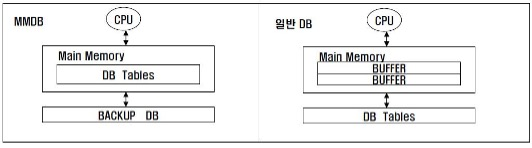
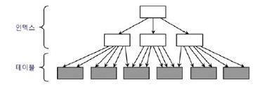
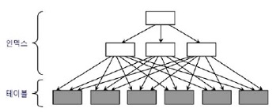

## 3. 인덱스 튜닝
### 3.1 테이블 액세스 최소화 
#### 3.1.1 인덱스 ROWID
- 인덱스를 스캔하는 이유 ? 
  - 검색 조건을 만족하는 데이터를 인덱스에서 빨리 찾고, 테이블 레코드를 찾아가기 위한 주소값.                           	즉, ROWID를 얻기 위함.
- ROWID = 오브젝트 번호 + 데이터파일 번호 + 블록 번호 + 블록 내의 행 번호
- 물리적 요소로 구성돼 있어 물리적 주소라고 설명한다면 틀리다고 말할 순 없지만 논리적 주소에 	더 가깝다고 할 수 있음.
- ROWID는 디스크 상에서 테이블 레코드를 찾아가기 위한 위치 정보를 가짐.
- 포인터 X, 테이블 레코드와 물리적으로 직접 연결된 구조 X

#### 3.1.2 MMDB (메인 메모리 DB)
- MMDB란 데이터베이스 전체를 메모리에 로드해 놓고 메모리를 통해서만 I/O를 수행하는 DB
- MMDB (Main Memory DB) vs 일반 DB (디스크 기반)


- 튜닝이 잘 된 OLTP성 데이터베이스 시스템은 버퍼캐시 히트율이 99%이다. 즉, 디스크를 경유하지 않고 대부분 데이터를 메모리(버퍼)에서 읽는다. 하지만, MMDB만큼 빠르지 않다.
  - MMDB의 인덱스는 메모리상의 주소정보(포인터)를 갖고, 일반 DB의 인덱스는 디스크상의 주소정보를 갖기 때문에 테이블 액세스하는 비용의 차이가 난다. 일반 DB는 테이블 블록이 수시로 변경되고 다른 공간에 캐싱되기 때문에 인덱스에서는 디스크 주소 정보를 이용해 버퍼 블록을 찾는다.

#### 3.1.3 I/O 메커니즘
- 인덱스를 이용하여 테이블 블록을 찾는 과정
  1. 인덱스 스캔 후 리프 블록에서 읽은 ROWID를 분해해서 DBA정보 찾기
  2. 읽고자 하는 DBA(Data Block Address; 디스크 상의 블록 위치 정보)를 해시 함수에 입력해서 해시체인을 찾기
  3. 해시 체인을 통해 버퍼 헤더를 찾기
  4. 버퍼 헤더를 통해 버퍼 블록을 찾기
- 데이터 블록을 읽을 때 디스크로 가기 전에 버퍼캐시부터 찾는다. 버퍼캐시에 없을 경우 디스크에서 버퍼	캐시에 적재한 후에 블록을 읽는다.


### 3.2 인덱스 클러스터링 팩터
#### 3.2.1 클러스터링 팩터(Clustering Factor; CF)란 ?
  - 특정 컬럼을 기준으로 같은 값을 갖는 데이터가 서로 모여있는 정도.
- CF가 좋은 컬럼에 생성한 인덱스는 검색 효율이 매우 좋음
- 테이블 액세스량에 비해 블록 I/O가 적게 발생함.

    <br>

- [그림 2-1] 처럼 CF가 좋은 경우 다음에 읽을 테이블 블록과 직전에 읽은 테이블 블록의 주소가 같으면 	바로 테이블 블록을 읽으므로 블록 I/O 과정 생략
    <br><br>
   

- [그림 2-2] 처럼 CF가 안 좋은 경우 테이블을 액세스하는 횟수만큼 블록 I/O 발생

### 3.3 인덱스 손익분기점
#### 3.3.1 정의
- Index Range Scan에 의한 테이블 액세스가 Table Full Scan 보다 느려지는 지점

#### 3.3.2 인덱스 이용한 테이블 액세스가 Table Full Scan보다 느려지는 요인
	
||Table Full Scan|인덱스 이용한 테이블 액세스|
|--|--|--|
|테이블 액세스 방식|시퀀셜 액세스|랜덤 액세스|
|입출력 방식|Multi Block I/O|Single Block I/O|

- 이런 요인에 의해 인덱스 손익분기점은 보통 5~20%의 낮은 수준에서 결정됨.
- CF에 따라 손익분기점은 크게 달라진다. CF가 나쁘면 5% 미만에서 결정되고 CF가 아주 좋을 때 손익분기점이 90% 수준까지 올라가기도 함.
- 인덱스를 이용한 테이블 액세스가 항상 좋다는 것도 아니고, Table Full Scan이 항상 나쁜 것도 아니다!

#### 3.3.3 온라인 프로그램 튜닝 vs 배치 프로그램 튜닝
- 온라인 프로그램은 소량데이터를 읽고 갱신하므로 인덱스를 효과적으로 활용하는 것이 중요
  - 인덱스를 이용하는 NL조인 방식 사용
- 배치 프로그램은 대량데이터를 읽고 갱신하므로 전체범위 처리 기준으로 튜닝하는 것이 중요
  - Full Scan과 해시 조인이 유리


### 3.4 인덱스 컬럼 추가
### 3.4.1 인덱스 컬럼 추가
- 테이블 액세스 최소화를 위해 가장 일반적으로 사용하는 튜닝 기법
- 실제 운영 환경에서는 인덱스 구성을 변경하기 쉽지 않음.
- 인덱스를 새로 만들면 인덱스 관리 비용 증가, DML부하에 따른 트랜잭션 성능 저하가 발생할 수 있음.
  - 기존 인덱스에 컬럼을 추가함으로써 테이블 랜덤 액세스 횟수를 줄여줌.

### 3.5 인덱스만 읽고 처리
#### 3.5.1 Covered 인덱스
- 테이블 액세스 단계 필터 조건에 의해 버려지는 레코드가 많을 때
  - 인덱스에 컬럼을 추가하여 효율성↑
- 반대로 필터 조건에 의해 버려지는 레코드가 거의 없다면 비효율은 없음.
  - 비효율은 없더라도 결과 데이터가 많다면 그만큼 테이블 랜덤 액세스가 많이 발생하므로 성능이 느릴 수 밖에 없음. 이 경우 쿼리에 사용된 컬럼을 모두 인덱스에 추가해서 테이블 액세스가 아예 발생하지 않도록 함. (Covered 쿼리, Covered 인덱스)
#### 3.5.2 Include 인덱스
- Oracle엔 X, SQL Server 2005 버전에 추가됨.
- 인덱스 키 외에 미리 지정한 컬럼을 리프 블록에 함께 저장하는 기능
```
 create index emp_x01 on emp (deptno) include (sal)
```
```
 create index emp_x01 on emp (deptno, sal)
```
- exp_x01 인덱스는 sal 컬럼을 리프 블록에만 저장
  - 수직적 탐색에는 deptno만 사용하고, 수평적 탐색에는 sal 컬럼을 필터 조건으로 사용 가능
- exp_x02 인덱스는 deptno와 sal 컬럼 모두 루트와 브랜치 블록에 저장
  - 둘 다 수직적 탐색에 사용 가능
- Include 인덱스는 순전히 테이블 랜덤 액세스를 줄이는 용도로 개발

### 3.6 인덱스 구조 테이블
#### 3.6.1 인덱스 구조 테이블(Index-Organized Table; IOT)란 ?
- 테이블 랜덤 액세스가 아예 발생하지 않도록 테이블을 인덱스 구조로 생성
- 일반 인덱스는 테이블을 찾아가기 위한 ROWID를 갖는 구조, IOT는 그 자리에 테이블 데이터를 가짐.
- 즉, 테이블 블록에 있어야 할 데이터를 인덱스 리프 블록에 모두 저장
- 테이블을 인덱스 구조로 만드는 구문
```
create table index_ort_t (a number, b varchar(10),
constraint index_org_t_pk primary key (a) organization index)
```
- 일반 테이블은 힙 구조 테이블( 대개 생략하지만 organization 옵션 명시할 수도 있음)
```
create table heap_ort_t (a number, b varchar(10),
constraint heap_org_t_pk primary key(a) organization heap)
```
- IOT는 인덱스 구조 테이블이므로 정렬 상태를 유지하며 데이터 입력
  - 인위적으로 CF(클러스터링 팩터)를 좋게 만드는 방법 중 하나
- 시퀀셜 방식으로 데이터 액세스 (BETWEEN이나 부등호 조건으로 넓은 범위 읽을 때 유리)

### 3.7 클러스터 테이블
### 3.7.1 인덱스 클러스터 테이블
- 클러스터 키 값이 같은 레코드를 한 블록에 모아서 저장하는 구조
- 한 블록에 모두 담을 수 없을 때는 새로운 블록을 할당해서 클러스터 체인으로 연결
- 다중 테이블 클러스터
  - 여러 테이블 레코드를 같은 블록에 저장
- 인덱스 클러스터 테이블 생성하는 방법
  1. 클러스터 생성
    ```
    create cluster c_dept# (deptno number(2)) index
    ```
  3. 클러스터 인덱스 정의
    ```
    create index c_dept$_idx on cluster c_dept#
    ```
  4. 클러스터 테이블 생성
    ```
    create table dept (
        deptno number(2) not null,
        dname varchar2(14) not null,
        loc varchar2(13))
    cluster c_dept#(deptno);
    ```
### 3.7.2 해시 클러스터 테이블
- 인덱스를 사용하지 않고 해시 알고리즘을 사용해 클러스터를 찾아가는 구조
- 해시 클러스터 테이블 생성하는 방법
  1. 클러스터 생성
    ```
    create cluster c_dept#( deptno number(2) ) hashkeys 4;
    ```
  2. 클러스터 테이블 생성
    ```
    create table dept (
        deptno number(2) not null,
        dname varchar2(14) not null,
        loc varchar2(13) )
    cluster c_dept#(deptno);
    ```
## 3.2 부분범위 처리 활용
- 목적 
  - 테이블 랜덤 액세스로 인한 인덱스 손익분기점의 한계를 극복하기 위한 것 
  - 빠른 응답속도

- 부분범위 처리 
  - DBMS가 클라이언트에게 데이터를 전송할 때 일정량씩 나누어 전송. 
  - 전송 후 데이터가 남아있어도 클라이언트가 추가 Fetch Call 할 때까지 대기 
  - DBMS가 먼저 읽는 데이터부터 Array Size(일정량)을 전송하고 멈춘다. 
  - 데이터 전송 후 서버 프로세스는 CPU를 OS에 반환하고 대기 큐에서 잠을 잔다. 
    - 연속 전송이 아닌 사용자의 Fetch Call이 있을 때마다 일정량씩 나누어 전송하는 것
- ArraySize가 10인 자바 프로그램의 데이터 읽기 메커니즘
  1. 처음에 데이터 10건을 캐시에 저장
  2. rs.next()시 캐시에서 데이터를 읽는다. 
  3. 캐시 데이터 소진시 rs.next() 호출 시 Fetch Call을 발생하여 데이터 10건 전송받는다. 
  4. 2-3번 반복

- 정렬 조건이 있을 때 부분범위 처리 – order by
  - 모든 데이터를 읽어 정렬 후에 데이터 전송 = 전체범위처리 
  - created 컬럼이 선두인 인덱스가 있는 경우 항상 정렬된 상태이므로 결과집합 바로 전송 가능 = 부분범위 처리 
  - Array Size는 클라이언트 프로그램에서 설정가능 . – [3-16그림] 162p 참고
  - 대량 데이터일 경우 Array Size를 조절(늘려)하여 Fetch Call 횟수 감소 
  - 부분처리 원리 활용하는 툴 – 오렌지, 토드
  - 부분범위 처리 구현 - 165p JAVA 코드   //보통은 개발 프레임워크에 미리 구현된 기능을 사용
- OLTP 부분범위 처리에 의한 성능개선 원리 
  - OLTP
    - 온라인 트랜잭션을 처리하는 시스템, 소량의 데이터를 읽고 갱신
  - 167p 인덱스 선두컬럼에 의해 sort 연산 생략
- 앞쪽 일부만 출력 후 멈춘다. 대부분의 툴이 이미 구현되어 있다. 
  - (배치 I/O 
    - 블록 건당 I/O call을 발생시키는 비효율을 줄이기 위한 기능. 테이블 블록 디스크 I/O Call을 미뤘다가 한꺼번에 처리한다. 
    - 실제 배치 I/O 작동 시 데이터 출력 순서가 인덱스 정렬 순서와 다를 수 있다. = sort 생략 불가 
    - order by 절이 없는 경우에는 정렬 순서를 보장할 필요가 없어서 sort 연산을 안함 )  


## 3.3 인덱스 스캔 효율화

### 3.3.1 인덱스 탐색
- 수직적 탐색 + 수평적 탐색
- 루트블록
  - 자신이 가리키는 주소(화살표)로 찾아간 블록에는 자신의 키 값보다 크거나 같은 값을 가진 레코드가 저장돼 있음(루트 블록 키 값 <= 리프 블록 데이터)
  - 점선 화살표(-->): 블록 내에서 시작점을 찾는 과정을 표시
  - 실선 화살표(->): 논리적인 스캔 시작점을 찾는 과정을 표시
- 수직적 탐색
  - 인덱스 스캔의 시작점을 찾는 과정
- 수평적 탐색
  - 인덱스 스캔의 종료 지점을 찾는 과정
- 조건절 1
  - 수직적 탐색을 통해 C1 = 'B'인 레코드를 찾고, C1='C'인 레코드를 만나는 순간 스캔을 멈춤.
- 조건절 2
  - 수직적 탐색을 통해 C1 = 'B'이고 C2 = 3인 첫번째 레코드를 찾고, C1 = 'B'인 레코드 중에서 C2 = 4 인 레코드를 만나는 순간 스캔을 멈춤
- 조건절 3
  - 수직적 탐색을 통해 C1 = 'B'이고 C2 >= 3인 첫번째 레코드를 찾고, C1 = 'C'인 레코드를 만날 때 까지 스캔하다가 멈춤. C2 >= 조건절은 스캔을 멈추는데 역할을 하지 못함
- 조건절 4
  - 수직적 탐색을 통해 C1='B'인 첫번째 레코드를 찾고, 스캔하다가 C2>3인 첫번째 레코드를 만나는 순간 스캔을 멈춤. C2<=3 조건절은 수직적 탐색 과정에 사용되지 않았고, 스캔을 멈추는 데 중요한 역할을 수행
- 조건절 5
  - C1과 C2 조건절 모두 스캔 시작과 끝 지점을 결정하는데 중요한 역할을 수행
- 조건절 6
  - C1 조건절은 스캔 시작과 끝 지점을 결정하는데 중요한 역할을 수행, C2의 경우 스캔량을 줄이는 데 거의 역할을 수행하지 못함, 인덱스 선행 컬럼 또는 선두 컬럼에서 범위 검색 조건이 사용 될 경우 후행 조건절은 인덱스 필터 조건으로

### 3.3.2 인덱스 스캔 효율성
- 인덱스 컬럼이 조건절에 없거나 '=' 조건이 아니면 스캔 과정에서 비효율일 발생 - p183
- 인덱스 스캔이 효율성 측정 
  - SQL트레이스 활용 - p184 SQL 트레이스 구문 예제
    - 읽어드린 ROW 개수 대비 CR이 적을 수록 그 효율성이 높음
- CR : Block Read Count
- 선두 컬럼 : 인덱스 구성상'맨 앞쪽'에 있는 컬럼을 지칭할 때 사용
- 선행 컬럼 : 어떤 컬럼보다 '상대적으로 앞쪽'에 놓인 컬럼을 지칭할 때 사용

### 3.3.3 엑세스 조건과 필터 조건
- 인덱스 엑세스 조건
  - 인덱스 스캔의 범위를 결정 - 스캔의 시작과 종료 지점
- 인덱스 필터 조건
  - 테이블로 액세스 할지를 결정
- 테이블 필터 조건
  - 쿼리 수행 다음 단계로 전달하거나 최종 결과집합에 포함할지를 결정
- 옵티마이저의 비용 계산 원리 – 7.1 상세 설명
  - 비용 = 인덱스 수직적 탐색 비용 + 인덱스 수평적 탐색 비용 + 테이블 랜덤 액세스 비용 = 인덱스 루트와 브랜치 레벨에서 읽는 블록 수 + 인덱스 리프 블록을 스캔하는 과정에 읽는 블록 수 + 테이블 액세스 과정에 읽는 블록 수

### 3.3.4 비교 연산자 종류와 컬럼 순서에 따른 군집성
- 테이블과 달리 인덱스에는 ‘같은 값(=)’을 갖는 레코드들이 서로 군집
- 조건절에서 인덱스 중에서 어느 하나를 누락하거나 ‘=’ 조건이 아닌 연산자(범위검색 연산자 = 부등호, BETWEEN, LIKE)로 조회하면 조건절을 만족하는 레코드가 서로 흩어진 상태(인덱스 필터 조건 적용 대상)가 됨(p186. [그림 3-31], p189. [표 3-1] 참조)

### 3.3.5 인덱스 컬럼이 등치(=)조건이 아닐 때 생기는 비효율
- 인덱스 스캔 효율성 극대화
  - 인덱스 컬럼을 조건절에 모두 등치(=) 조건으로 사용할 때 가장 좋음
  - 인덱스 리프 블록을 스캔하면서 읽은 레코드는 하나도 걸러지지(인덱스 필터 과정) 않고 모두 테이블 액세스로 이어짐: p192. [그림 3-32] 참조
  - 인덱스 구성 = 『아파트시세코드+평형+평형타입+인터넷매물』
- 인덱스 스캔 비효율이 발생하는 경우
  - 인덱스 선행 컬럼이 조건절에 없는 경우
  - 인덱스 선두 컬럼 또는 인덱스 선행 컬럼의 조건절에서 범위검색(부등호, BETWEEN, LIKE) 조건 사용
    - p193. [그림 3-33] 참조: 인덱스 구성 = 『인터넷매물+아파트시세코드+평형+평형타입』

### 3.3.6 BETWEEN을 IN-List로 전환
- IN-List 개수만큼 UNION ALL 브랜치가 생성되고 각 브랜치마다 모든 컬럼을 ‘=’(등치) 조건으로 검색하여 범위검색의 비효율성 개선
- 실행계획에서 INLIST ITERATOR 오퍼레이션 수행: p194 SQL 구문, p195. [그림 3-34], 실행계획 참조: 인덱스 구성 = 『인터넷매물+아파트시세코드+평형+평형타입』
- IN-List 개수만큼 인덱스 스캔 수행: P196. dbms_xplan.display_cursor 함수를 이용한 Row Source별 수행 통계 자료, p197. [그림 3-35] 참조

- BETWEEN 조건을 IN-List로 전환할 때 주의 사항
  - IN-List 개수가 많지 않아야 됨, IN-List 개수가 많을 경우 BETWEEN 조건에서 리프 블록을 많이 스캔하는 비효율보다 IN-List 개수만큼 브랜치 블록을 반복 탐색하는(수직적 탐색) 비효율이 더 클 수 있음: p198. [그림 3-36] 참조
  - 인덱스 스캔 과정에서 선택되는 레코드들이 서로 멀리 떨어져 있을 때만 유용: p199. [그림 3-37] 참조

### 3.3.7 Index Skip Scan 활용
- 선두 컬럼이 BETWEEN(범위검색 조건)이어서 나머지 검색 조건을 만족하는 데이터들이 서로 멀리 떨어져 있을 때 큰 효과를 얻을 수 있음. 
- 월별고객별판매집계 인덱스 구성, 조건절, 그리고 스캔 방식에 따른 성능 비교
- 예제로 제시된 월별고객별판매집계 테이블의 특정 인덱스 기준 데이터(판매구분 -A: 10%, B: 90%)가 가지고 있는 각각의 Distinct Value 점유율 차이로 인덱스 구성에 따른 군집성의 차이가 발생하고, 이로 인한 블록 I/O 처리 성능에 큰 영향을 미치게 됨. 따라서 각각의 케이스에 맞는 조건절과 스캔 방식을 적용할 필요가 있음.

### 3.3.8 IN 조건은 ‘=’인가
- IN 조건은 ‘=’이 아님 -> 인덱스 구성에 따라 성능의 차이 발생
- 스캔 대상 인덱스 리프 블록에 있는 데이터의 군집성에 따라 스캔 성능의 차이가 결정됨:
- 군집성이 떨어져 있을 경우 IN-List Iterator 방식으로 처리하는 것이 효과적이지만, 군집성이 좋을 경우 선두 컬럼을 인덱스 엑세스 조건으로 사용하고 IN 조건에서 사용되는 후행 컬럼을 인덱스 필터 조건으로 처리하는 것을 권장함.
- SQL 구문 : P203 참조

```
select *
from 고객별가입상품
where 고객번호 = :cust_no
and   상품ID in (‘NH00037’, ‘NH00041’, ‘NH00050’) 
```

- 인덱스 구성에 따른 인덱스 스캔 처리 방식 비교

|인덱스|상품ID + 고객번호|고객번호 + 상품ID|
|--|--|--|
|처리 방식|IN-List Iterator 방식(인덱스 엑세스 조건)|인덱스 필터 조건으로 처리|
|참고 자료|p204. [그림 3-39]|p204. [그림 3-40]|

#### NUM_INDEX_KEYS 힌트 활용
- IN-List Iterator를 액세스 조건 또는 필터 조건으로 유도
- NUM_INDEX_KEYS 힌트의 세 번째 인자: 해당 순번의 인덱스 컬럼까지만 인덱스 액세스 조건으로 사용
```
Ex> select /*+ num_index_keys(a 고객별가입상품_X 1)*/ * - p207 실행계획 참조
select /*+ num_index_keys(a 고객별가입상품_X 2)*/ * - p208 실행계획 참조

```

### 3.3.9 BETWEEN과 LIKE 스캔 범위 비교: BETWEEN < LIKE
- LIKE보다 BETWEEN이 스캔 검색 범위가 보다 좁아 인덱스 스캔 과정에서 효용성이 보다 뛰어남: p210. [그림 3-41], [그림 3-42] 참조

### 3.3.10 범위검색 조건을 남용할 때 생기는 비효율
- 인덱스 컬럼에 범위검색 조건을 남용하면 인덱스 스캔 비효율이 발생, 대량 테이블을 넒은 범위로 검색할 때는 그 영향이 매우 클 수 있음

### 3.3.11 다양한 옵션 조건 처리 방식의 장단점 비교
#### OR 조건 활용
- 인덱스 액세스 조건으로 사용 불가
- 인덱스 필터 조건으로도 사용 불가
- 테이블 필터 조건으로만 사용 가능
- 단, 인덱스 구성 컬럼 중 하나 이상이 Not Null 컬럼이면, 18c부터 인덱스 필터 조건으로 사용 가능
  - 이 방식의 유일한 장점은 옵션 조건 컬럼이 NULL 허용 컬럼이더라도 결과집합을 보장한다는 것, 되도록 사용 자제 요망

#### LIKE/BETWEEN 조건 활용
1. 인덱스 선두 컬럼에 사용하는 것은 금물
2. NULL 허용 컬럼에 사용하는 것은 금물 – null인 데이터가 결과 집합에서 누락됨 
3. 숫자형 컬럼에 사용하는 것은 금물(숫자형이면서 인덱스 액세스 조건으로 사용 가능한 컬럼) – 자동 형변환이 발생하여 인덱스 필터 조건으로 변경됨
4. 가변 길이 컬럼에 사용할 경우 특히, LIKE 구문에서 사용시 컬럼 값 길이가 고정적 이어야 함
   - 변별력이 좋은 필수 조건이 있는 상황에서만 유효: 필수 조건 컬럼을 인덱스 선두에 두고 액세스 조건으로 활용할 경우

#### UNION ALL 활용
- 옵션 조건 컬럼도 인덱스 액세스 조건으로 사용.
- SQL 코딩량이 길어진다는 단점을 가짐
#### :variable is null/:variable is not null 
- 특정 변수에 값을 입력 여부에 따라 실행 인덱스 선택 스캔 실행: p221. 실행계획 참조

#### NVL/DECODE 함수 활용
- UNION ALL 보다 단순하면서도 UNION ALL과 같은 성능을 냄
  - 옵션 조건 처리용 NVL/DECODE 함수를 여러 개 사용하면 그중 변별력이 가장 좋은 컬럼 기준으로 한 번만 OR Expansion이 발생

#### Dynamic SQL – p224. 참조
- iBatis SQL 매핑 프레임워크에서 옵션 조건을 `<isEmpty>` 구문으로 처리
- 인덱스를 잘 구성할 경우 `<isEmpty>` 구문에서 옵션 조건에 ‘=’ 연산자 사용할 경우, 변별력 있는 컬럼을 액세스 조건으로 사용 가능

### 3.3.12	함수호출부하 해소를 위한 인덱스 구성
### PL/SQL 함수의 성능적 특성
- PL/SQL 사용자 정의 함수가 느린 이유
  1. 가상머신(VM) 상에서 실행되는 인터프리터 언어
  2. 호출 시마다 컨텍스트 스위칭 발생
  3. 내장 SQL에 대한 Recursive Call 발생 – 함수 적용 대상 건수 만큼 발생
- Context Switch: CPU가 해당 프로세스를 실행하기 위한 해당 프로세스의 정보들로 PCB(Process Control Block)에 저장
- PCB의 저장정보
  - 프로세스 상태
    - 생성, 준비, 수행, 대기, 중지
  - 프로그램 카운터
    - 프로세스가 다음에 실행할 명령어 주소
  - 레지스터 
    - 누산기, 스택, 색인 레지스터
  - 프로세스 번호
- 참고로 Context Switching 때 해당 CPU는 아무런 일을 하지 못한다. 
- 따라서 컨텍스트 스위칭이 잦아지면 오히려 오버헤드가 발생해 효율(성능)이 떨어진다.
  - 출처: https://jeong-pro.tistory.com/93 [기본기를 쌓는 정아마추어 코딩블로그] 

#### 효과적인 인덱스 구성을 통한 함수 호출 최소화
- 인덱스 구성에 따른 PL/SQL 함수[ex->encryption( :phone_no )] 사용예제

- SQL
```select * from 회원
where 생년 = ‘1987’
and 암호화된_전화번호 = encryption( :phone_no )
```
- 인덱스
```	
  회원_X01	
	회원_X02	
	회원_X03	
```
- 인덱스 구성
```  
  생년	
  생년, 암호화된_전화번호	
  생년, 생월일, 암호화된_전화번호	
```
- 후행 조건 엑세스 여부
```
 O – 인덱스 액세스 조건
 X – 인덱스 필터 조건
 X – 인덱스 필터 조건
```

## 3.4 인덱스 설계

### 3.4.1 인덱스 설계가 어려운 이유?
#### 인덱스가 많으면 발생하는 문제
- DML 성능 저하(-> TPS저하)
  - 인덱스가 많으면 신규데이터를 입력할 때 각각의 인덱스에도 데이터 입력이 필요
  - 인덱스에 데이터 입력 시 정렬 상태를 유지해야 하므로 수직적 탐색 발생, 여유공간 부족 시 인덱스 분할 발생
 
- 데이터 삭제 시 레코드를 일일이 삭제해줘야 함
  - 데이터베이스 사이즈 증가(-> 디스크 공간 낭비)
  - 데이터베이스 관리 및 운영 비용 상승

### 3.4.2 인덱스 선택 시 가장 중요한 선택 기준(인덱스 스캔 효율성 판단 기준)
- 조건 절에 항상 사용하거나 자주 사용하는 컬럼을 선정해야 한다.
- '=' 조건으로 자주 조회하는 컬럼을 앞쪽에 둔다.

### 3.4.3 스캔 효율성 이외의 판단 기준
  1. 수행 빈도(판단 기준 내에서 가장 중요하다고 보면 됨) 
  2. 수행빈도가 높을수록 그 먄큼 최적의 인덱스를 구성해줘야 하므로
  3. NL조인 시 어느 쪽에서 자주 액세스 되는지도 중요한 판단 기준이 된다.(4.1절)
- 업무상 중요도
- 클러스터링 펙터(데이터가 모여있는 정도)
- 데이터 양
  - 데이터 양이 적다면(라고 판단이 된다면) 굳이 인덱스를 많이 만들 필요가 없다. Full scan으로도 충분히 빠르기 때문에
  - 테이블이 작으면 인덱스를 많이 만들어도 사실 저장공간이나 트랜잭션 부하 측면에서 그다지 문제 될 건 없음
  - 다만 초대용량일 때는 인덱스 설계 할 때 인덱스를 늘리거나 줄일 시 시스템에 미치는 영향력은 큼
  	- DML부하(= 기존 인덱스 개수. 초당 DML 발생량, 자주 갱신하는 컬럼 포함 여부 등)
  	- 저장 공간
  	- 인덱스 관리 비용 등
- NL조인
  - 선행테이블의 조건을 만족하는 행을 추출하여 후행 테이블을 읽으면서 조인을 수행하는 것
- 작업순서
  1. 선행테이블의 주어진 조건을 만족하는 행 추출 
  2. 선행 테이블의 조인 키를 가지고 후행테이블에서 조인 수행 
  3. 선행테이블의 조건을 만족하는 모든 행에 대해 1번 작업 반복 수행
  
### 3.4.4 공식을 초월한 전략적 설계
- 3.4.2 항에서 제시한 두 가지 공식만 알면 누구나 쉽게 설계가 가능하다(조건 절에 항상 사용하거나 자주 사용하는 컬럼에 인덱스를 선택, '=' 조건으로 자주 조회하는 컬럼을 앞쪽에 둠)
- 조건 절 패턴이 열 개 있을 때 인덱스를 하나씩 만들 수는 없다.
- SQL 튜닝 전문가라면 열 개 중 최적을 달성해야 할 핵심적인 액세스 경로 한두 개를 전략적으로 선택하여 최적 인덱스를 설계, 나머지 액세스 경로는 약간의 비효율이 있더라도 목표 성능을 만족하는 수준으로 인덱스를 구성해야 한다.
- 그 후 왜 그런 선택을 했는지, 전략적 판단 근거가 무엇인지 답을 할 수 있어야 함
- 단순한 공식에 따라 결정하기보단, 업무사항을 이해하고 나름의 판단 기준을 가지고 결정을 내리라는 것

#### 예) 가계약 테이블이 있다는 가정.
- 가계약 목록 조회 시 그림 3-47처럼 다양한 방식으로 조회
- 먼저 드롭 다운 리스트에서 그림 좌측에 있는 취급 부서, 취급 지점, 취급자, 입력자, 대리점설계사, 대리점 지사 중 하나를 선택
- 이때 조건 절 연산자는 '='
- 그리고 우측에 있는 네 개 일자/일시 중 하나를 선택
- 조건 절 연산자는 BETWEEN
- 선택한 두 항목에 대한 값을 입력 후 조회버튼 클릭

  - 좌측 항목에서 우측 항목까지 다 가능케 하려면 인덱스를 24개가 필요하다. 
  - 근데 24개를 다 만들기에는 가계약 테이블에는 INSERT가 많이 발생하기 때문에 부담이 있다.
  - 따라서 일자나 일시 조건을 선두에 놓고 자주 사용하는 필더조건을 모두 뒤쪽으로 추가해서 다음과 같은 셜계가 완료된다.

#### 설계 결과
- X01
  - 청약일자 + 취급부서 + 취급지점 + 취급자 + 입력자 + 대리점 설계사 + 대리점 지사
- X02
  - 보험개시일자 + 취급부서 + 취급지점 + 취급자 + 입력자 + 대리점 설계사 + 대리점 지사
- X03
  - 보험종료일자 + 취급부서 + 취급지점 + 취급자 + 입력자 + 대리점 설계사 + 대리점 지사
- X04
  - 데이터생성일시 + 취급부서 + 취급지점 + 취급자 + 입력자 + 대리점 설계사 + 대리점 지사

#### 핵심 포인트는
1. 일자 조회구간이 길지 않으면 인덱스 스캔 비효율에 영향을 미치지 않는다는 점
2. 인덱스 스캔 효율보다 테이블 액세스가 더 큰 부하요소라는 것

#### 위의 4개의 인덱스를 설계한 것은
- 가계약은 3일 이내의 데이터를 조회, 대개 전일자로 조회하기 때문에 인덱스 스캔량은 그리 많지는 않음
- 가끔 3일 초과한 기간으로 조회할 수 있고, 어쩌다 한달 치를 조회할 수도 있다.
- 그렇더라도 불필요한 테이블 엑세스는 전혀 발생하지 않도록 설계를 했으므로 사용자가 안내할 수 있는 수준의 성능이 나옴

>이때 조금 생각을 해보면 일자 조회이기 때문에 BETWEEN 조건절을 사용하는데 있어서 조금 찜찜하다. 그런데도 이 결정을 한 것은 가계약 테이블의 다양한 패턴으로 조회를 하지만, 그 중 많이 사용하는 것은 입력자'='와 테이블 생성 일시 BETWEEN조건이므로 다른 패턴에 비해 비효율이 있어 보여도 업무에는 크게 지장이 없게 설계를 한 것

```
  +X05 :입력자 + 데이터 생성 일시
```
- 24개의 인덱스가 나와야 하지만 업무 상황을 고려한 전략적 판단으로 5개로 줄였다. 
- 인덱스 개수를 최소화하면 사용 빈도가 높거나 중요한 엑세스 경로가 새로 도출이 되었을 때 최적의 인덱스를 추가할 여유도 생김

### 3.4.5 소트 연산을 생략하기 위한 컬럼 추가
- 인덱스는 항상 정렬 상태를 유지하므로 ORDER BY, GROUP BY를 위한 소트 연산을 생략할 수 있게 해줌.
- 조건 절에 사용하지 않는 컬럼 이더라도 소트 연산을 생략할 목적으로 인덱스 구성에 포함시킴으로써 성능 개선을 도모할 수 있음
- 아래 쿼리에 ORDER BY 절이 있음에도 불구하고 소트 연산이 발생하지 않도록 인덱스를 구성

```
SELECT 계약ID, 청약일자, 입력자ID, 계약상태코드, 보험시작일자, 보험종료일자
FROM 계약
WHERE 취급지점ID = :trt_brch_id
AND	  청약일자 between :sbcp_dt1 and :sbcp_dt2
AND   입력일자 >= trunc(sysdate - 3)
and   계약상태코드 in (:ctr_stat_cd1, :ctr_stat_cd2, :ctr_stat_cd3 )
order by 청약일자, 입력자ID
```

- 성능을 고려하지 않는다면 order by 절 순서대로 청약일자+입력자 id로 구성하면 됨
- '='조건절 컬럼은 order by 절에 없더라도 인덱스 구성에 포함 가능(위 SQL에서는 취급지점 ID가 “=”조건)
- 이를 포함하여 청약일자 + 취급지점ID + 입력자 ID 순으로 구성해도 소트 연산을 생략할 수 있다는 뜻(위치는 앞뒤 중간에 어디에 두어도 상관 없음)
- “=” 가 아닌 조건절 컬럼들은 반드시 ORDER BY 컬럼보다 뒤쪽에 두어야 소트 연산을 생략할 수 있다.

>일단 소트는 생략은 했는데 성능이 문제, 조건을 만족하는 데이터가 앞쪽에 있다면 결과집합이 빨리 출력되기 시작하겠지만 뒤에 있으면 당연히 느려지기 마련

>그 순간에 I/O는 계속 발생하고 있을 것인데, 결론적으로는 I/O를 최소화하면서 소트연산을 생략하려면 아래 공식처럼 인덱스를 구성하면 된다.

 
1. “=” 연산자로 사용한 조건 절 컬럼 선정
2. ORDER BY 절에 기술한 컬럼 추가
3. “=” 연산자가 아닌 조건 절 컬럼은 데이터 분포를 고려해 추가여부 결정

- 위 공식대로 구성하면 취급지점id + 청약일자 + 입력자 id순으로 구성한다.
- 입력일자와 계약상태코드는 뒤쪽에 붙여도 되고, 안 붙여도 된다.
- 이들 조건을 만족하는 데이터가 적으면, 인덱스에 추가하는게 좋다. 테이블 엑세스를 줄일 수 있기 때문
- 이들 조건을 만족하는 데이터가 많으면 굳이 인덱스에 추가하지 않아도 된다. 테이블에서 필터링 할 때와 큰 성능 차이가 없기 때문
- 단 몇 회라도 테이블 엑세스를 줄이면 조회 성능은 좋지만 반대 급부도 생각해야 한다.

#### IN 조건은 ”=”이 아니다.
- 간단하게 IN조건을 사용하였을 때 UNION ALL 이 자동으로 생성되는 쿼리가 생성이 되고 마지막에 항상 ORDER BY를 수행하게 된다.
- 인덱스를 거주지역+혈액형+연령으로 해 놨음에도 불구하고 최종적으로는 연령을 기준으로 소트가 진행되기 때문에 소트연산을 생략하고 싶다면 IN 조건절은 인덱스 엑세스 조건으로 사용하면 안된다는 것

|거주지역|혈액형|연령|
|--|--|--|
|서울|A|23
|서울|A|35
|서울|A|48
|서울|A|62
|서울|O|29
|서울|O|32
|서울|O|45
|서울|O|57


### 3.4.6 결합 인덱스 선택도
-	인덱스 생성 여부를 결정할 때 선택도*가 충분히 낮은지가 중요한 판단기준
-	인덱스 선택도는 인덱스 컬럼을 모두 =로 조회할 떄 평균적으로 선택되는 비율을 의미
-	선택도가 높은 인덱스는 생성해봐야 효용가치가 별로 없다.인덱스 엑세스가 자주 발생
-	인덱스를 생성할 때 반드시 선택도 카디널리티를 확인해야한다.

- 선택도
  - 전체 레코드 중에서 조건 절에 의해 선택되는 레코드 비율, 선택도에 총 레코드 수를 곱하여 카디널리티**를 구한다.
- 카디널리티
  - 데이터베이스테이블의 특정 열에 포함된 데이터 값의 고유성

```
SELECT count(*) as NDV, max(cnt) as MX_CARD, min(cnt) MN_CARD, avg(cnt). as AVG_CARD
FROM (
	SELECT 계약ID, 취급지점ID, count(*) as cnt
	FROM  계약 조직
	WHERE (계약 ID is not null or 취급지점ID is not null)
	GROUP BY 계약ID, 취급지점ID
)
```

#### 컬럼순서 결정시, 선택도 이슈
-	아래 쿼리에서 고객번호를 앞에 두는 것이 유리하다고 생각하겠지만,성별이나 고객번호 중 어떤 컬럼이 앞으로 오든 인덱스 스캔 효율에 전혀 차이가 없다.
-	둘 다 인덱스 엑세스 조건이므로 어떤 컬럼이 앞으로 오든 인덱스 스캔 범위는 똑같음
```
WHERE 성별= :GENDER
AND 고객번호 = :CUST_NO
```
-	인덱스 설계 시 해야 할 일은 항상 사용하는 컬럼을 앞쪽에 두고 그 중 =조건을 앞쪽에 위치시키는 것이다.
-	선택도가 낮은 컬럼을 굳이 앞으로 두려는 노력은 의미가 없거나 오히려 손해일 수도 있다.
-	고객 등급과 고객 번호 중 어떤 컬럼이 앞에 오건 인덱스 스캔 효율에는 영향이 없다.
-	거래유형과 상품번호 간에도 어떤 컬럼이 앞으로 오든 인덱스 스캔 효율에 영향을 주지 않는다.
-	즉 필수조건(고객등급,고객번호,거래일자)는 앞에 두는 가정에 그들간의 순서는 상관이 없다는 것.
-	Index skip scan이나 in-list활용,인덱스 압축 효율까지 고려한다면 방금 사례에선 고객 등급을 앞쪽에 두는 것이 유리하다.

#### 결론
- 인덱스 생성 여부를 결정할 때는 선택도도 중요하지만, 컬럼 간 순서를 결정할 때는 각 컬럼의 선택도보다 필수 조건 여부,연산자 형태가 더 중요한 판단 기준이라는 것.어느 컬럼을 앞에 두는지 결정 요소는 상황에 따라 판단할 일이다.

### 3.4.7 중복 인덱스 제거
- 예)아래 나와있는 세 인덱스는 중복이다. 
- X02 인덱스 선두 컬럼이 X01 인덱스 전체를 포함하고, X03 인덱스 선두 컬럼이 X01과 X02 인덱스 전체를 완전히 포함하기 때문.
- 이를 완전 중복이라 필자는 설명.이때 X01, X02는 남기고 X03만 살려도 사용이 가능
```
X01 :계약ID + 청약일자
X02 :계약ID + 청약일자 + 보험개시일자
X03 :계약ID + 청약일자 + 보험개시일자 + 보험종료일자
```
- 아래 네 개 인덱스는 중복이 아니다.선두는 같이만 두번째가 모두 다름
```
X01 :계약 ID + 청약일자
X02 :계약 ID + 보험개시일자
X03 :계약 ID + 보험종료일자
X04 :계약 ID + 데이터생성일시
```
- 이때 계약ID의 평균 카디널리티가 낮다면 사실상 중복이다. 
- 가령 계약ID 카디널리티가 5라 가정하면 계약ID를 ‘=’ 조건으로 조회하면 평균 다섯 건이 조회된다는 뜻이다.

- 즉 굳이 인덱스를 4개씩이나 만들 이유는 없다는 뜻. 
- 아래처럼 하나만 만들면 그만. 
- 이 떄를 완전중복과 대비하여 불완전 중복이라고 부른다고 함
```
X01 :계약ID + 청약일자 + 보험개시일자 + 보험종료일자 + 데이터 생성일시
```
### 3.4.8 인덱스 설계도 작성
-	인덱스 설계시 시스템 전체 효율을 따져야 한다고 앞에서 이야기를 했었다.
- 조화를 이룬 건축물을 짓기 위해 설계도가 필수인 것 처럼 인덱스 설계에도 전체를 조망할 수 있다는 설계도가 필요하다.
-	인덱스 설계도에 보면 변경 전,변경 후가 둘로 나눠져 있다.
-	개별 SQL이 아니라 전체를 보면서 전략을 수립하려면,일단 테이블 별로 실제 발생하는 엑세스 유형을 모두 조사하는 과정이 필요하다.중간에 엑세스 경로가 그것이다.
-	17번 엑세스 경로를 예로 들면 조건절에 사용한 비교 연산자가 물건종류,도시,구시군,읍면동, CO9 ◇, 입력일 “>=” 인 경우를 표시한 것이다.
-	그리고 그 아래쪽을 보면 현재 인덱스 구성에서는 6번 인덱스를 사용하지만,구성을 변경하고 나면 3번 인덱스를 사용하게 될 것임을 표시하고 있다.
-	설계도 상단에 파티션 구성을 기록하는 필드를 뒀다. 인덱스 설계 전에 파티션 설계를 먼저 진행하거나 최소한 병행해야 제대로 된 인덱스 전락을 수립할 수 있다.
